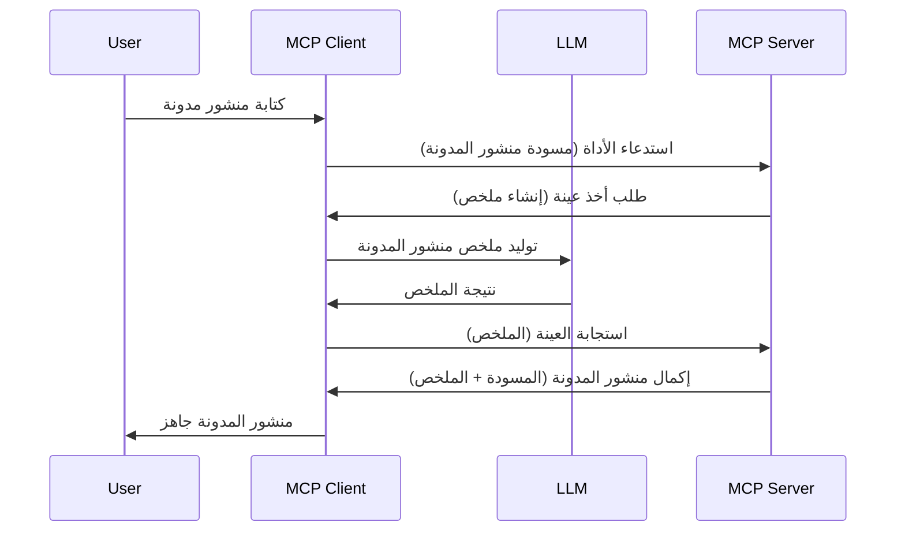

# أخذ عينات - تفويض الميزات إلى العميل

أحيانًا، تحتاج إلى تعاون بين عميل MCP وخادم MCP لتحقيق هدف مشترك. قد يكون لديك حالة يتطلب فيها الخادم مساعدة نموذج لغة كبيرة (LLM) الموجود على العميل. في هذه الحالة، يجب عليك استخدام أخذ العينات.

لنستعرض بعض حالات الاستخدام وكيفية بناء حل يتضمن أخذ العينات.

## نظرة عامة

في هذا الدرس، نركز على شرح متى وأين تستخدم أخذ العينات وكيفية تكوينه.

## أهداف التعلم

في هذا الفصل، سنقوم بـ:

- شرح ما هو أخذ العينات ومتى يستخدم.
- عرض كيفية تكوين أخذ العينات في MCP.
- تقديم أمثلة على أخذ العينات أثناء التنفيذ.

## ما هو أخذ العينات ولماذا نستخدمه؟

أخذ العينات هو ميزة متقدمة تعمل بالطريقة التالية:


### طلب أخذ العينات

حسنًا، الآن لدينا نظرة شاملة على سيناريو معقول، دعنا نتحدث عن طلب أخذ العينات الذي يرسله الخادم إلى العميل. إليك كيف يمكن أن يبدو هذا الطلب في صيغة JSON-RPC:

```json
{
  "jsonrpc": "2.0",
  "id": 1,
  "method": "sampling/createMessage",
  "params": {
    "messages": [
      {
        "role": "user",
        "content": {
          "type": "text",
          "text": "Create a blog post summary of the following blog post: <BLOG POST>"
        }
      }
    ],
    "modelPreferences": {
      "hints": [
        {
          "name": "claude-3-sonnet"
        }
      ],
      "intelligencePriority": 0.8,
      "speedPriority": 0.5
    },
    "systemPrompt": "You are a helpful assistant.",
    "maxTokens": 100
  }
}
```

هناك بعض الأمور التي تستحق الذكر هنا:

- الطلب، تحت content -> text، هو طلبنا الذي هو تعليمات لـ LLM لتلخيص محتوى منشور المدونة.

- **modelPreferences**. هذا الجزء هو مجرد تفضيل، توصية حول التكوين الذي يجب استخدامه مع LLM. يمكن للمستخدم اختيار اتباع هذه التوصيات أو تغييرها. في هذه الحالة، هناك توصيات حول النموذج الذي يجب استخدامه وأولوية السرعة والذكاء.
- **systemPrompt**، هذا هو طلب النظام العادي الذي يعطي LLM الخاص بك طابعًا شخصيًا ويحتوي على تعليمات توجيهية.
- **maxTokens**، هذه خاصية أخرى تُستخدم لتحديد عدد الرموز الموصى به لاستخدامها في هذه المهمة.

### استجابة أخذ العينات

هذه الاستجابة هي التي ينتهي بها العميل MCP إلى إرسالها إلى خادم MCP وهي النتيجة بعد استدعاء العميل لـ LLM، انتظار تلك الاستجابة ثم بناء هذه الرسالة. إليك كيف يمكن أن تبدو في JSON-RPC:

```json
{
  "jsonrpc": "2.0",
  "id": 1,
  "result": {
    "role": "assistant",
    "content": {
      "type": "text",
      "text": "Here's your abstract <ABSTRACT>"
    },
    "model": "gpt-5",
    "stopReason": "endTurn"
  }
}
```

لاحظ كيف أن الاستجابة هي ملخص لمنشور المدونة تمامًا كما طلبنا. كما لاحظ كيف أن النموذج المستخدم `model` ليس ما طلبناه بل "gpt-5" بدلاً من "claude-3-sonnet". هذا لتوضيح أن المستخدم يمكنه تغيير رأيه حول ما يستخدم وأن طلب أخذ العينات هو مجرد توصية.

حسنًا، الآن بعد أن فهمنا التدفق الرئيسي، والمهمة المفيدة لاستخدامه "إنشاء منشور مدونة + ملخص"، لنرَ ما الذي نحتاج لفعله لجعله يعمل.

### أنواع الرسائل

رسائل أخذ العينات ليست محصورة على النص فقط، بل يمكنك أيضًا إرسال الصور والصوت. إليك كيف يختلف JSON-RPC:

**نص**

```json
{
  "type": "text",
  "text": "The message content"
}
```

**محتوى الصورة**

```json
{
  "type": "image",
  "data": "base64-encoded-image-data",
  "mimeType": "image/jpeg"
}
```

**محتوى الصوت**

```json
{
  "type": "audio",
  "data": "base64-encoded-audio-data",
  "mimeType": "audio/wav"
}
```

> ملاحظة: لمزيد من المعلومات التفصيلية عن أخذ العينات، راجع [الوثائق الرسمية](https://modelcontextprotocol.io/specification/2025-06-18/client/sampling)

## كيفية تكوين أخذ العينات في العميل

> ملاحظة: إذا كنت تبني فقط خادمًا، فلا حاجة لأن تفعل الكثير هنا.

في العميل، تحتاج إلى تحديد الميزة التالية بهذه الطريقة:

```json
{
  "capabilities": {
    "sampling": {}
  }
}
```

سيتم التقاط هذا عند تهيئة العميل المختار مع الخادم.

## مثال على أخذ العينات أثناء التنفيذ - إنشاء منشور مدونة

دعونا نبرمج خادم أخذ عينات معًا، سنحتاج إلى القيام بما يلي:

1. إنشاء أداة على الخادم.
1. يجب أن تنشئ الأداة طلب أخذ عينات.
1. يجب أن تنتظر الأداة إجابة طلب أخذ العينات من العميل.
1. ثم يجب إنتاج نتيجة الأداة.

لنرَ الكود خطوة بخطوة:

### -1- إنشاء الأداة

**python**

```python
@mcp.tool()
async def create_blog(title: str, content: str, ctx: Context[ServerSession, None]) -> str:
    """Create a blog post and generate a summary"""

```

### -2- إنشاء طلب أخذ عينات

وسع أداتك بالكود التالي:

**python**

```python
post = BlogPost(
        id=len(posts) + 1,
        title=title,
        content=content,
        abstract=""
    )

prompt = f"Create an abstract of the following blog post: title: {title} and draft: {content} "

result = await ctx.session.create_message(
        messages=[
            SamplingMessage(
                role="user",
                content=TextContent(type="text", text=prompt),
            )
        ],
        max_tokens=100,
)

```

### -3- انتظر الاستجابة وأعدها

**python**

```python
post.abstract = result.content.text

posts.append(post)

# إرجاع المنتج الكامل
return json.dumps({
    "id": post.title,
    "abstract": post.abstract
})
```

### -4- الكود الكامل

**python**

```python
from starlette.applications import Starlette
from starlette.routing import Mount, Host

from mcp.server.fastmcp import Context, FastMCP

from mcp.server.session import ServerSession
from mcp.types import SamplingMessage, TextContent

import json


from uuid import uuid4
from typing import List
from pydantic import BaseModel


mcp = FastMCP("Blog post generator")

# التطبيق = FastAPI()

posts = []

class BlogPost(BaseModel):
    id: int
    title: str
    content: str
    abstract: str

posts: List[BlogPost] = []

@mcp.tool()
async def create_blog(title: str, content: str, ctx: Context[ServerSession, None]) -> str:
    """Create a blog post and generate a summary"""

    post = BlogPost(
        id=len(posts) + 1,
        title=title,
        content=content,
        abstract=""
    )

    prompt = f"Create an abstract of the following blog post: title: {title} and draft: {content} "

    result = await ctx.session.create_message(
        messages=[
            SamplingMessage(
                role="user",
                content=TextContent(type="text", text=prompt),
            )
        ],
        max_tokens=100,
    )

    post.abstract = result.content.text

    posts.append(post)

    # إعادة المشاركة الكاملة للمدونة
    return json.dumps({
        "id": post.title,
        "abstract": post.abstract
    })

if __name__ == "__main__":
    print("Starting server...")
    # mcp.run()
    mcp.run(transport="streamable-http")

# تشغيل التطبيق عبر: python server.py
```

### -5- اختبار ذلك في Visual Studio Code

لاختبار هذا في Visual Studio Code، قم بما يلي:

1. شغل الخادم في الطرفية
1. أضفه إلى *mcp.json* (وتأكد من تشغيله) مثلًا هكذا:

   ```json
   "servers": {
      "blog-server": {
        "type": "http",
        "url": "http://localhost:8000/mcp"
      }
   }
   ```

1. اكتب طلباً:

   ```text
   create a blog post named "Where Python comes from", the content is "Python is actually named after Monty Python Flying Circus"
   ```

1. اسمح بحدوث أخذ العينات. في المرة الأولى التي تختبر فيها هذا سيظهر لك حوار إضافي تحتاج إلى قبوله، ثم سترى الحوار العادي الذي يطلب منك تشغيل الأداة.

1. افحص النتائج. سترى النتائج معروضة بشكل جميل في دردشة GitHub Copilot كما يمكنك أيضًا فحص الاستجابة الخام على شكل JSON.

**مكافأة**. أدوات Visual Studio Code تدعم أخذ العينات بشكل ممتاز. يمكنك تكوين وصول أخذ العينات على الخادم المثبت لديك كما يلي:

1. انتقل إلى قسم الإضافات.
1. اختر أيقونة الترس للخادم المثبت في قسم "MCP SERVERS - INSTALLED".
1 اختر "Configure Model Access"، هنا يمكنك اختيار النماذج التي يسمح لـ GitHub Copilot باستخدامها عند إجراء أخذ العينات. يمكنك أيضًا مشاهدة جميع طلبات أخذ العينات التي حدثت مؤخرًا من خلال اختيار "Show Sampling requests".

## المهمة

في هذه المهمة، ستبني أخذ عينات مختلف قليلاً، وهو تكامل أخذ عينات يدعم إنشاء وصف منتج. إليك السيناريو الخاص بك:

**السيناريو**: يحتاج موظف المكتب الخلفي في متجر إلكتروني إلى مساعدة، يستغرق إنشاء أوصاف المنتجات وقتًا طويلاً جدًا. لذلك، عليك بناء حل يمكنك فيه استدعاء أداة "create_product" مع "title" و "keywords" كوسيطين، ويجب أن تنتج أداة وصفًا كاملاً يشمل حقل "description" يجب ملؤه بواسطة نموذج اللغة الكبير الخاص بالعميل.

نصيحة: استخدم ما تعلمته سابقًا حول كيفية بناء هذا الخادم وأداته باستخدام طلب أخذ عينات.

## الحل

[الحل](./solution/README.md)

## النقاط الرئيسية

أخذ العينات هي ميزة قوية تسمح للخادم بتفويض المهام إلى العميل عندما يحتاج إلى مساعدة نموذج اللغة الكبير.

## ماذا بعد

- [الفصل 4 - التنفيذ العملي](../../04-PracticalImplementation/README.md)

---

<!-- CO-OP TRANSLATOR DISCLAIMER START -->
**إخلاء المسؤولية**:  
تمت ترجمة هذا المستند باستخدام خدمة الترجمة الآلية [Co-op Translator](https://github.com/Azure/co-op-translator). بينما نسعى لتحقيق الدقة، يرجى العلم أن الترجمات الآلية قد تحتوي على أخطاء أو عدم دقة. يجب اعتبار المستند الأصلي بلغته الأصلية المصدر الرسمي والمعتمد. للمعلومات الحساسة أو الهامة، يُنصح بالاعتماد على الترجمة البشرية المهنية. نحن غير مسؤولين عن أي سوء فهم أو تفسير ناتج عن استخدام هذه الترجمة.
<!-- CO-OP TRANSLATOR DISCLAIMER END -->