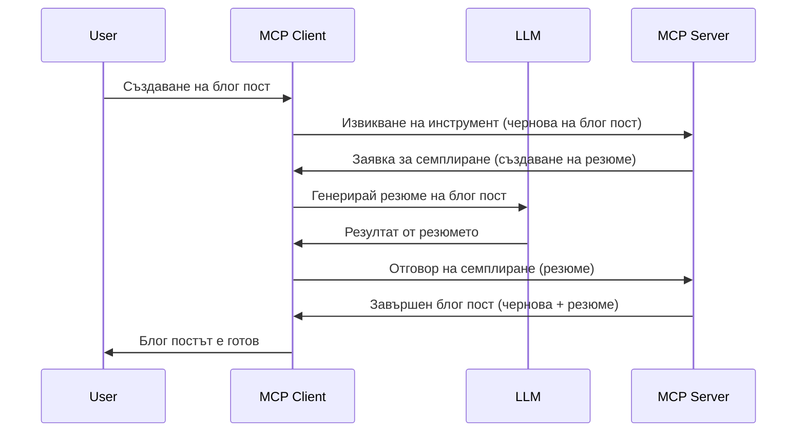

# Sampling - делегиране на функции към Клиента

Понякога е необходимо MCP Клиентът и MCP Сървърът да си сътрудничат за постигане на обща цел. Може да имате случай, в който Сървърът изисква помощта на LLM, който се намира на клиента. За тази ситуация изборът е sampling.

Нека разгледаме някои случаи на употреба и как да изградим решение, включващо sampling.

## Преглед

В този урок се фокусираме върху обяснението кога и къде да използваме Sampling и как да го конфигурираме.

## Учебни цели

В тази глава ще:

- Обясним какво е Sampling и кога да го използваме.
- Покажем как да конфигурираме Sampling в MCP.
- Предоставим примери за използване на Sampling.

## Какво е Sampling и защо да го използваме?

Sampling е усъвършенствана функция, която работи по следния начин:


### Sampling заявка

Добре, сега имаме обща представа за реалистичен сценарий, нека поговорим за sampling заявката, която сървърът изпраща обратно към клиента. Ето как може да изглежда такава заявка във формат JSON-RPC:

```json
{
  "jsonrpc": "2.0",
  "id": 1,
  "method": "sampling/createMessage",
  "params": {
    "messages": [
      {
        "role": "user",
        "content": {
          "type": "text",
          "text": "Create a blog post summary of the following blog post: <BLOG POST>"
        }
      }
    ],
    "modelPreferences": {
      "hints": [
        {
          "name": "claude-3-sonnet"
        }
      ],
      "intelligencePriority": 0.8,
      "speedPriority": 0.5
    },
    "systemPrompt": "You are a helpful assistant.",
    "maxTokens": 100
  }
}
```

Има няколко неща тук, които си заслужава да отбележим:

- Prompt, под content -> text, е нашата подканваща инструкция за LLM да обобщи съдържанието на блог пост.

- **modelPreferences**. Този раздел е точно това, предпочитание, препоръка за каква конфигурация да се използва с LLM. Потребителят може да избере дали да следва тези препоръки или да ги промени. В този случай има препоръки за модела за използване, както и приоритети за скорост и интелигентност.
- **systemPrompt**, това е нормалната ви системна подканваща инструкция, която дава на вашия LLM личност и съдържа указания.
- **maxTokens**, това е друго свойство, което указва колко токени се препоръчва да се използват за тази задача.

### Sampling отговор

Този отговор е това, което MCP Клиентът в крайна сметка изпраща обратно на MCP Сървъра и е резултат от извикването на LLM от клиента, изчакването на отговора и след това конструиране на това съобщение. Ето как може да изглежда във формат JSON-RPC:

```json
{
  "jsonrpc": "2.0",
  "id": 1,
  "result": {
    "role": "assistant",
    "content": {
      "type": "text",
      "text": "Here's your abstract <ABSTRACT>"
    },
    "model": "gpt-5",
    "stopReason": "endTurn"
  }
}
```

Обърнете внимание как отговорът е резюме на блог поста, точно както поискахме. Също така забележете, че използваният `model` не е този, който поискахме, а "gpt-5" вместо "claude-3-sonnet". Това илюстрира, че потребителят може да промени мнението си относно използвания модел и че вашата sampling заявка е препоръка.

Добре, след като разбираме основния процес и полезната задача "създаване на блог пост + резюме", нека видим какво трябва да направим, за да заработи.

### Видове съобщения

Sampling съобщенията не се ограничават само до текст, но може да изпращате и изображения и аудио. Ето как JSON-RPC изглежда различно:

**Текст**

```json
{
  "type": "text",
  "text": "The message content"
}
```

**Съдържание на изображение**

```json
{
  "type": "image",
  "data": "base64-encoded-image-data",
  "mimeType": "image/jpeg"
}
```

**Съдържание на аудио**

```json
{
  "type": "audio",
  "data": "base64-encoded-audio-data",
  "mimeType": "audio/wav"
}
```

> NOTE: за по-подробна информация за Sampling, разгледайте [официалната документация](https://modelcontextprotocol.io/specification/2025-06-18/client/sampling)

## Как да конфигурираме Sampling в Клиента

> Забележка: ако изграждате само сървър, не се налага да правите много тук.

В клиент трябва да посочите следната функция по следния начин:

```json
{
  "capabilities": {
    "sampling": {}
  }
}
```

Това ще бъде запомнено при инициализацията на избрания клиент със сървъра.

## Пример за Sampling в действие - Създаване на блог пост

Нека кодиране на sampling сървър заедно, ще трябва да направим следното:

1. Създаване на инструмент в Сървъра.
1. Този инструмент трябва да създава sampling заявка.
1. Инструментът трябва да изчака отговора на sampling заявката от клиента.
1. След това трябва да бъде произведен резултатът от инструмента.

Нека разгледаме кода стъпка по стъпка:

### -1- Създаване на инструмента

**python**

```python
@mcp.tool()
async def create_blog(title: str, content: str, ctx: Context[ServerSession, None]) -> str:
    """Create a blog post and generate a summary"""

```

### -2- Създаване на sampling заявка

Разширете вашия инструмент със следния код:

**python**

```python
post = BlogPost(
        id=len(posts) + 1,
        title=title,
        content=content,
        abstract=""
    )

prompt = f"Create an abstract of the following blog post: title: {title} and draft: {content} "

result = await ctx.session.create_message(
        messages=[
            SamplingMessage(
                role="user",
                content=TextContent(type="text", text=prompt),
            )
        ],
        max_tokens=100,
)

```

### -3- Изчакване на отговора и връщане на отговора

**python**

```python
post.abstract = result.content.text

posts.append(post)

# върнете пълния продукт
return json.dumps({
    "id": post.title,
    "abstract": post.abstract
})
```

### -4- Пълен код

**python**

```python
from starlette.applications import Starlette
from starlette.routing import Mount, Host

from mcp.server.fastmcp import Context, FastMCP

from mcp.server.session import ServerSession
from mcp.types import SamplingMessage, TextContent

import json


from uuid import uuid4
from typing import List
from pydantic import BaseModel


mcp = FastMCP("Blog post generator")

# app = FastAPI()

posts = []

class BlogPost(BaseModel):
    id: int
    title: str
    content: str
    abstract: str

posts: List[BlogPost] = []

@mcp.tool()
async def create_blog(title: str, content: str, ctx: Context[ServerSession, None]) -> str:
    """Create a blog post and generate a summary"""

    post = BlogPost(
        id=len(posts) + 1,
        title=title,
        content=content,
        abstract=""
    )

    prompt = f"Create an abstract of the following blog post: title: {title} and draft: {content} "

    result = await ctx.session.create_message(
        messages=[
            SamplingMessage(
                role="user",
                content=TextContent(type="text", text=prompt),
            )
        ],
        max_tokens=100,
    )

    post.abstract = result.content.text

    posts.append(post)

    # върнете пълната публикация в блога
    return json.dumps({
        "id": post.title,
        "abstract": post.abstract
    })

if __name__ == "__main__":
    print("Starting server...")
    # mcp.run()
    mcp.run(transport="streamable-http")

# стартирайте приложението с: python server.py
```

### -5- Тестване във Visual Studio Code

За да тествате това във Visual Studio Code, направете следното:

1. Стартирайте сървъра в терминала
1. Добавете го към *mcp.json* (и се уверете, че е стартиран), нещо такова:

   ```json
   "servers": {
      "blog-server": {
        "type": "http",
        "url": "http://localhost:8000/mcp"
      }
   }
   ```

1. Въведете prompt:

   ```text
   create a blog post named "Where Python comes from", the content is "Python is actually named after Monty Python Flying Circus"
   ```

1. Позволете sampling да се случи. Първият път, когато тествате това, ще се появи допълнителен диалог, който трябва да приемете, след което ще видите нормалния диалог, който ви пита да пуснете инструмент.

1. Разгледайте резултатите. Ще видите резултатите както добре представени във GitHub Copilot Chat, така и можете да разгледате суровия JSON отговор.

**Бонус**. Инструментите на Visual Studio Code имат добра поддръжка за sampling. Можете да конфигурирате достъпа до sampling на вашия инсталиран сървър, като го навигирате по следния начин:

1. Навигирайте до секцията за разширения.
1. Изберете иконата на зъбно колело за вашия инсталиран сървър в секцията "MCP SERVERS - INSTALLED".
1 Изберете "Configure Model Access", тук можете да изберете кои Модели GitHub Copilot има право да използва при извършване на sampling. Можете също да видите всички скорошни sampling заявки, като изберете "Show Sampling requests".

## Задача

В тази задача ще изградите леко различно Sampling, а именно интеграция за sampling, която поддържа генериране на продуктово описание. Ето вашият сценарий:

**Сценарий**: Служител в бекофиса на електронен магазин има нужда от помощ, отнема твърде много време да се създадат описания на продукти. Следователно трябва да изградите решение, при което да извиквате инструмент "create_product" с аргументи "title" и "keywords" и той да произведе пълен продукт, включително поле "description", което трябва да бъде попълнено от LLM на клиента.

СЪВЕТ: използвайте това, което научихте по-рано за това как да конструирате този сървър и неговия инструмент с помощта на sampling заявка.

## Решение

[Решение](./solution/README.md)

## Основни изводи

Sampling е мощна функция, която позволява на сървъра да делегира задачи на клиента, когато се нуждае от помощта на LLM.

## Какво следва

- [Глава 4 - Практическа имплементация](../../04-PracticalImplementation/README.md)

---

<!-- CO-OP TRANSLATOR DISCLAIMER START -->
**Отказ от отговорност**:  
Този документ е преведен с помощта на AI преводаческа услуга [Co-op Translator](https://github.com/Azure/co-op-translator). Въпреки че се стремим към точност, моля, имайте предвид, че автоматичните преводи могат да съдържат грешки или неточности. Оригиналният документ на неговия естествен език трябва да се смята за авторитетен източник. За критична информация се препоръчва професионален човешки превод. Ние не носим отговорност за никакви недоразумения или погрешни тълкувания, възникнали от използването на този превод.
<!-- CO-OP TRANSLATOR DISCLAIMER END -->