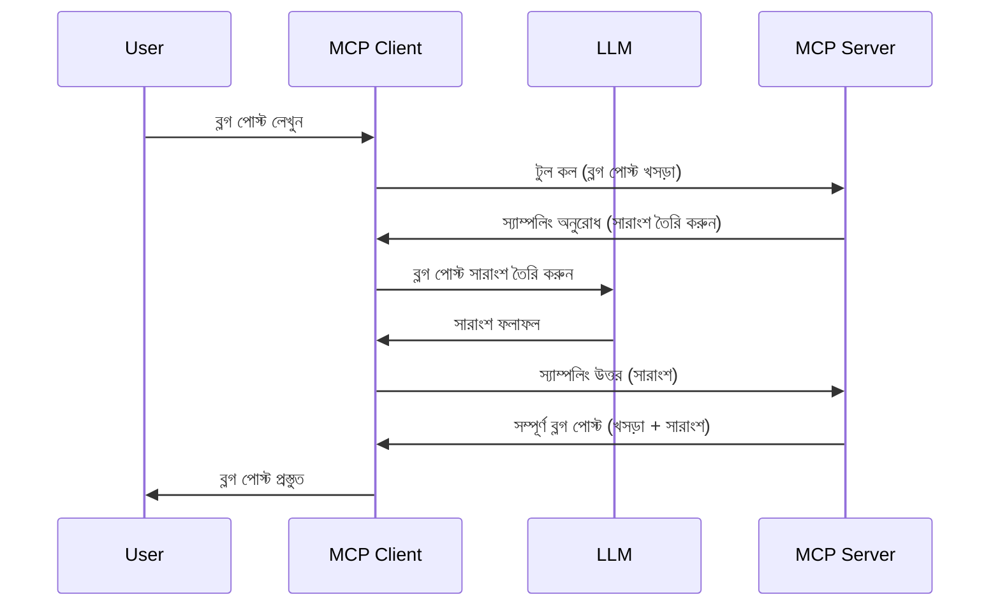

# নমুনা গ্রহণ - ক্লায়েন্টকে বৈশিষ্ট্যগুলি প্রতিনিধিত্ব করা

কখনও কখনও, আপনাকে MCP ক্লায়েন্ট এবং MCP সার্ভারকে একটি সাধারণ লক্ষ্য পূরণের জন্য সহযোগিতা করতে হবে। আপনার এমন একটি পরিস্থিতি থাকতে পারে যেখানে সার্ভারের জন্য ক্লায়েন্টে স্থাপিত একটি LLM-এর সাহায্য প্রয়োজন। এই পরিস্থিতির জন্য, নমুনা গ্রহণ (sampling) ব্যবহার করা উচিত।

আসুন কিছু ব্যবহারের কেস অন্বেষণ করি এবং নমুনা গ্রহণ জড়িত করে একটি সমাধান কিভাবে তৈরি করবেন তা জানি।

## ওভারভিউ

এই পাঠে, আমরা ফোকাস করব কখন এবং কোথায় নমুনা গ্রহণ ব্যবহার করতে হয় এবং এটিকে কিভাবে কনফিগার করতে হয় তা ব্যাখ্যা করার উপর।

## শেখার উদ্দেশ্যসমূহ

এই অধ্যায়ে আমরা:

- ব্যাখ্যা করব নমুনা গ্রহণ কী এবং কখন ব্যবহার করতে হয়।
- MCP-তে নমুনা গ্রহণ কনফিগার করার পদ্ধতি দেখাব।
- নমুনা গ্রহণের উদাহরণ প্রদান করব।

## নমুনা গ্রহণ কী এবং কেন এটি ব্যবহার করবেন?

নমুনা গ্রহণ একটি উন্নত বৈশিষ্ট্য যা নিম্নলিখিতভাবে কাজ করে:


### নমুনা গ্রহণ অনুরোধ

ঠিক আছে, এখন আমাদের কাছে একটি বিশ্বাসযোগ্য পরিস্থিতির উচ্চ স্তরের ধারণা রয়েছে, চলুন তখন সার্ভার থেকে ক্লায়েন্টে ফেরত পাঠানো নমুনা গ্রহণ অনুরোধ সম্পর্কে কথা বলা যাক। JSON-RPC ফরম্যাটে এটি দেখতে কেমন হতে পারে:

```json
{
  "jsonrpc": "2.0",
  "id": 1,
  "method": "sampling/createMessage",
  "params": {
    "messages": [
      {
        "role": "user",
        "content": {
          "type": "text",
          "text": "Create a blog post summary of the following blog post: <BLOG POST>"
        }
      }
    ],
    "modelPreferences": {
      "hints": [
        {
          "name": "claude-3-sonnet"
        }
      ],
      "intelligencePriority": 0.8,
      "speedPriority": 0.5
    },
    "systemPrompt": "You are a helpful assistant.",
    "maxTokens": 100
  }
}
```

এখানে কয়েকটি জিনিস worthy to call out:

- prompt, content -> text এর অধীনে, আমাদের প্রম্পট যা LLM কে ব্লগ পোস্ট সামগ্রী সংক্ষিপ্ত করার নির্দেশ।

- **modelPreferences**। এই অংশটি ঠিক সেইটাই, একটি পছন্দ, LLM-এর সাথে কোন কনফিগারেশন ব্যবহার করা উচিত তার একটি সুপারিশ। ব্যবহারকারী এই সুপারিশগুলি মানতে পারেন বা পরিবর্তন করতে পারেন। এই ক্ষেত্রে মডেল, গতি এবং বুদ্ধিমত্তার অগ্রাধিকার সম্পর্কে সুপারিশ রয়েছে।
- **systemPrompt**, এটি আপনার স্বাভাবিক সিস্টেম প্রম্পট যা আপনার LLM কে একটি ব্যক্তিত্ব দেয় এবং নির্দেশিকা নির্দেশ থাকে।
- **maxTokens**, এটি আরেকটি গুণ যা কতগুলো টোকেন এই কাজের জন্য সুপারিশ করা হয় তা জানাতে ব্যবহৃত হয়।

### নমুনা গ্রহণ প্রতিক্রিয়া

এই প্রতিক্রিয়াটিই MCP ক্লায়েন্ট শেষ পর্যন্ত MCP সার্ভারে ফেরত পাঠায় এবং এটি ক্লায়েন্টের LLM কল করার, প্রতিক্রিয়া পাওয়ার এবং তারপরে এই বার্তাটি গঠন করার ফলাফল। JSON-RPC এ এটি দেখতে এরকম হতে পারে:

```json
{
  "jsonrpc": "2.0",
  "id": 1,
  "result": {
    "role": "assistant",
    "content": {
      "type": "text",
      "text": "Here's your abstract <ABSTRACT>"
    },
    "model": "gpt-5",
    "stopReason": "endTurn"
  }
}
```

দ্রষ্টব্য কিভাবে প্রতিক্রিয়াটি ব্লগ পোস্টের অবলক্ষ যেভাবে আমরা চেয়েছিলাম ঠিক তেমনই। এছাড়াও লক্ষ্য করুন ব্যবহৃত `model`টি আমরা চেয়েছিলাম তার থেকে আলাদা, "claude-3-sonnet" এর পরিবর্তে "gpt-5"। এটি দেখানোর জন্য যে ব্যবহারকারী তাদের পছন্দ পরিবর্তন করতে পারে এবং আপনার নমুনা গ্রহণ অনুরোধ একটি সুপারিশ মাত্র।

ঠিক আছে, এখন আমরা প্রধান প্রবাহ বোঝে গেছি, এবং এটি প্রয়োগ করার জন্য একটি উপযোগী কাজ "ব্লগ পোস্ট তৈরি + সংক্ষিপ্তসার", চলুন দেখি এটিকে কাজ করানোর জন্য আমাদের কি করতে হবে।

### বার্তার ধরন

নমুনা গ্রহণ বার্তা শুধুমাত্র টেক্সট সীমাবদ্ধ নয়, আপনি ছবি এবং অডিওও পাঠাতে পারেন। JSON-RPC কিভাবে ভিন্ন দেখতে তা এখানে:

**টেক্সট**

```json
{
  "type": "text",
  "text": "The message content"
}
```

**ছবির বিষয়বস্তু**

```json
{
  "type": "image",
  "data": "base64-encoded-image-data",
  "mimeType": "image/jpeg"
}
```

**অডিও বিষয়বস্তু**

```json
{
  "type": "audio",
  "data": "base64-encoded-audio-data",
  "mimeType": "audio/wav"
}
```

> NOTE: আরো বিস্তারিত তথ্যের জন্য Sampling সম্পর্কে, দেখুন [official docs](https://modelcontextprotocol.io/specification/2025-06-18/client/sampling)

## ক্লায়েন্টে নমুনা গ্রহণ কনফিগার করা

> নোট: আপনি যদি শুধুমাত্র একটি সার্ভার তৈরি করে থাকেন, তাহলে এখানে আপনাকে বিশেষ কিছু করতে হবে না।

একটি ক্লায়েন্টে, আপনাকে নিম্নলিখিত বৈশিষ্ট্যটি এভাবে নির্দিষ্ট করতে হবে:

```json
{
  "capabilities": {
    "sampling": {}
  }
}
```

এরপর এটি আপনার নির্বাচিত ক্লায়েন্ট যখন সার্ভারের সাথে ইনিশিয়ালাইজ হয় তখন তুলে নেওয়া হবে।

## নমুনা গ্রহণের উদাহরণ - একটি ব্লগ পোস্ট তৈরি

চলুন একসাথে একটি নমুনা গ্রহণ সার্ভার কোড করি, আমাদের নিম্নলিখিত কাজগুলো করতে হবে:

1. সার্ভারে একটি টুল তৈরি করুন।
2. বল জাতীয় ওই টুলটি একটি নমুনা গ্রহণ অনুরোধ তৈরি করবে।
3. টুলটি ক্লায়েন্টের নমুনা গ্রহণ অনুরোধের প্রতিক্রিয়ার জন্য অপেক্ষা করবে।
4. তারপর টুলটির ফলাফল তৈরি হবে।

ধাপে ধাপে কোড দেখি:

### -1- টুল তৈরি করুন

**python**

```python
@mcp.tool()
async def create_blog(title: str, content: str, ctx: Context[ServerSession, None]) -> str:
    """Create a blog post and generate a summary"""

```

### -2- একটি নমুনা গ্রহণ অনুরোধ তৈরি করুন

আপনার টুলটি নিম্নলিখিত কোড দিয়ে সম্প্রসারিত করুন:

**python**

```python
post = BlogPost(
        id=len(posts) + 1,
        title=title,
        content=content,
        abstract=""
    )

prompt = f"Create an abstract of the following blog post: title: {title} and draft: {content} "

result = await ctx.session.create_message(
        messages=[
            SamplingMessage(
                role="user",
                content=TextContent(type="text", text=prompt),
            )
        ],
        max_tokens=100,
)

```

### -3- প্রতিক্রিয়া প্রত্যাশা করুন এবং প্রতিক্রিয়া ফেরত দিন

**python**

```python
post.abstract = result.content.text

posts.append(post)

# সম্পূর্ণ পণ্য ফেরত দিন
return json.dumps({
    "id": post.title,
    "abstract": post.abstract
})
```

### -4- সম্পূর্ণ কোড

**python**

```python
from starlette.applications import Starlette
from starlette.routing import Mount, Host

from mcp.server.fastmcp import Context, FastMCP

from mcp.server.session import ServerSession
from mcp.types import SamplingMessage, TextContent

import json


from uuid import uuid4
from typing import List
from pydantic import BaseModel


mcp = FastMCP("Blog post generator")

# app = FastAPI()

posts = []

class BlogPost(BaseModel):
    id: int
    title: str
    content: str
    abstract: str

posts: List[BlogPost] = []

@mcp.tool()
async def create_blog(title: str, content: str, ctx: Context[ServerSession, None]) -> str:
    """Create a blog post and generate a summary"""

    post = BlogPost(
        id=len(posts) + 1,
        title=title,
        content=content,
        abstract=""
    )

    prompt = f"Create an abstract of the following blog post: title: {title} and draft: {content} "

    result = await ctx.session.create_message(
        messages=[
            SamplingMessage(
                role="user",
                content=TextContent(type="text", text=prompt),
            )
        ],
        max_tokens=100,
    )

    post.abstract = result.content.text

    posts.append(post)

    # সম্পূর্ণ ব্লগ পোস্টটি ফেরত দিন
    return json.dumps({
        "id": post.title,
        "abstract": post.abstract
    })

if __name__ == "__main__":
    print("Starting server...")
    # mcp.run()
    mcp.run(transport="streamable-http")

# অ্যাপ চালানোর জন্য: python server.py
```

### -5- Visual Studio Code-এ এটি পরীক্ষা করা

Visual Studio Code-এ এটি পরীক্ষা করতে নিম্নলিখিত কাজটা করুন:

1. টার্মিনালে সার্ভার চালু করুন
2. এটিকে *mcp.json* এ যোগ করুন (এবং নিশ্চিত করুন এটি শুরু হয়েছে) উদাহরণস্বরূপ এরকম:

   ```json
   "servers": {
      "blog-server": {
        "type": "http",
        "url": "http://localhost:8000/mcp"
      }
   }
   ```

3. একটি প্রম্পট টাইপ করুন:

   ```text
   create a blog post named "Where Python comes from", the content is "Python is actually named after Monty Python Flying Circus"
   ```

4. নমুনা গ্রহণ চালু করুন। প্রথমবার আপনি এটি পরীক্ষা করলে একটি অতিরিক্ত ডায়ালগ প্রদর্শিত হবে যা আপনাকে স্বীকার করতে হবে, তারপর আপনি স্বাভাবিক ডায়ালগ দেখতে পাবেন যা আপনাকে টুল চালানোর অনুমতি দেবে।

5. ফলাফল পরীক্ষা করুন। আপনি ফলাফলগুলি GitHub Copilot Chat-এ সুন্দরভাবে প্রদর্শিত দেখতে পাবেন তবে আপনি কাঁচা JSON প্রতিক্রিয়াও পরীক্ষা করতে পারবেন।

**বোনাস**। Visual Studio Code সরঞ্জামগুলো নমুনা গ্রহণের জন্য দুর্দান্ত সমর্থন প্রদান করে। আপনি ইনস্টল করা সার্ভারে গিয়ে Sampling অ্যাক্সেস কনফিগার করতে পারেন এভাবে:

1. এক্সটেনশন বিভাগে যান।
2. "MCP SERVERS - INSTALLED" বিভাগে আপনার ইনস্টল করা সার্ভারের জন্য কগ আইকনে ক্লিক করুন।
3. "Configure Model Access" নির্বাচন করুন, এখানে আপনি নির্বাচন করতে পারবেন GitHub Copilot কোন মডেলগুলো Sampling করার সময় ব্যবহার করতে পারবে। এছাড়াও আপনি "Show Sampling requests" নির্বাচন করে সাম্প্রতিক সকল নমুনা গ্রহণ অনুরোধ দেখতে পারবেন।

## অ্যাসাইনমেন্ট

এই অ্যাসাইনমেন্টে, আপনি সামান্য ভিন্ন এক নমুনা গ্রহণ তৈরি করবেন, অর্থাৎ একটি নমুনা গ্রহণ ইন্টিগ্রেশন যা একটি পণ্যের বর্ণনা তৈরি করতে সমর্থন করে। এটি হলো আপনার পরিস্থিতি:

**সিনারিও**: একটি ই-কমার্সের ব্যাক অফিস কর্মী সাহায্য প্রয়োজন, পণ্যের বর্ণনা তৈরি করতে অনেক সময় লাগে। তাই, আপনি এমন একটি সমাধান তৈরি করবেন যেখানে একটি টুল "create_product" কল করা হবে "title" এবং "keywords" আর্গুমেন্ট সহ এবং এটি একটি সম্পূর্ণ পণ্য তৈরি করবে যার মধ্যে একটি "description" ক্ষেত্র থাকবে যা ক্লায়েন্টের LLM দ্বারা পূরণ করা হবে।

TIP: আগের শেখা অনুযায়ী এই সার্ভার এবং তার টুল তৈরির জন্য নমুনা গ্রহণ অনুরোধটি কীভাবে গঠন করা হয় তা ব্যবহার করুন।

## সমাধান

[Solution](./solution/README.md)

## গুরুত্বপূর্ণ শিক্ষা

নমুনা গ্রহণ একটি শক্তিশালী বৈশিষ্ট্য যা সার্ভারকে ক্লায়েন্টকে কাজ প্রেরণ করতে দেয় যখন তাকে একটি LLM-এর সাহায্যের প্রয়োজন হয়।

## পরবর্তীতে কি

- [Chapter 4 - Practical implementation](../../04-PracticalImplementation/README.md)

---

<!-- CO-OP TRANSLATOR DISCLAIMER START -->
**দায়িত্ব অস্বীকার**:
এই নথিটি AI অনুবাদ সেবা [Co-op Translator](https://github.com/Azure/co-op-translator) ব্যবহার করে অনূদিত হয়েছে। আমরা যথাসাধ্য সঠিকতার চেষ্টা করলেও, স্বয়ংক্রিয় অনুবাদে ভুল বা প্রাসঙ্গিকতা হতে পারে। মূল নথি তার নিজ ভাষায় প্রামাণিক উৎস হিসেবে বিবেচিত হওয়া উচিত। গুরুত্বপূর্ণ তথ্যের জন্য পেশাদার মানব অনুবাদ গ্রহণ করার পরামর্শ দেওয়া হয়। এই অনুবাদের ব্যবহারে কোনো ভুল ধারণা বা ভুল ব্যাখ্যার জন্য আমরা দায়বদ্ধ নই।
<!-- CO-OP TRANSLATOR DISCLAIMER END -->