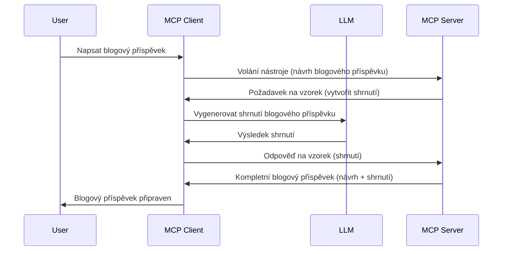

# Sampling - delegování funkcí na klienta

Někdy je potřeba, aby spolupracovali MCP klient a MCP server za účelem dosažení společného cíle. Může nastat situace, kdy server potřebuje pomoc LLM, které běží na klientovi. Pro tuto situaci je sampling to, co byste měli použít.

Pojďme prozkoumat některé případy použití a jak sestavit řešení zahrnující sampling.

## Přehled

V této lekci se zaměříme na vysvětlení, kdy a kde používat sampling a jak jej nakonfigurovat.

## Výukové cíle

V této kapitole si osvojíme:

- Vysvětlit, co je sampling a kdy jej použít.
- Ukázat, jak nakonfigurovat sampling v MCP.
- Poskytnout příklady samplingu v praxi.

## Co je sampling a proč ho používat?

Sampling je pokročilá funkce, která funguje následujícím způsobem:


### Sampling request

Dobře, nyní máme celkový přehled o věrohodném scénáři, pojďme si povědět o žádosti o sampling, kterou server posílá zpět klientovi. Takto může vypadat taková žádost v JSON-RPC formátu:

```json
{
  "jsonrpc": "2.0",
  "id": 1,
  "method": "sampling/createMessage",
  "params": {
    "messages": [
      {
        "role": "user",
        "content": {
          "type": "text",
          "text": "Create a blog post summary of the following blog post: <BLOG POST>"
        }
      }
    ],
    "modelPreferences": {
      "hints": [
        {
          "name": "claude-3-sonnet"
        }
      ],
      "intelligencePriority": 0.8,
      "speedPriority": 0.5
    },
    "systemPrompt": "You are a helpful assistant.",
    "maxTokens": 100
  }
}
```

Je zde několik věcí, které stojí za zmínku:

- Prompt, pod content -> text, je naše výzva, která slouží jako instrukce pro LLM, aby shrnul obsah blogového příspěvku.

- **modelPreferences**. Tato sekce je právě to, doporučení, preferenční nastavení konfigurace pro LLM. Uživateli je ponecháno, zda tuto doporučení přijme nebo je změní. V tomto případě jsou doporučení ohledně modelu k použití a priorita rychlosti a inteligence.
- **systemPrompt**, to je běžná systémová výzva, která dává vašemu LLM osobnost a obsahuje pokyny.
- **maxTokens**, to je další vlastnost používaná k určení, kolik tokenů je doporučeno použít pro tento úkol.

### Sampling response

Tato odpověď je to, co MCP klient nakonec odešle zpět MCP serveru a je výsledkem toho, že klient zavolá LLM, počká na odpověď a poté sestaví tuto zprávu. Takto může vypadat v JSON-RPC:

```json
{
  "jsonrpc": "2.0",
  "id": 1,
  "result": {
    "role": "assistant",
    "content": {
      "type": "text",
      "text": "Here's your abstract <ABSTRACT>"
    },
    "model": "gpt-5",
    "stopReason": "endTurn"
  }
}
```

Všimněte si, jak odpověď představuje abstrakt blogového příspěvku, přesně jak jsme chtěli. Také si všimněte, že použitý `model` není ten, o který jsme požádali, ale "gpt-5" místo "claude-3-sonnet". Toto ukazuje, že uživatel může změnit svůj názor na použitý model a že vaše sampling žádost je jen doporučení.

Dobře, teď když rozumíme hlavnímu toku a užitečnému úkolu pro jeho použití - „vytvoření blogového příspěvku + abstrakt“, pojďme se podívat, co musíme udělat, abychom to vůbec rozběhli.

### Typy zpráv

Samplingové zprávy nejsou omezeny pouze na text, ale můžete posílat i obrázky a audio. Takto se JSON-RPC liší:

**Text**

```json
{
  "type": "text",
  "text": "The message content"
}
```

**Obsah obrázku**

```json
{
  "type": "image",
  "data": "base64-encoded-image-data",
  "mimeType": "image/jpeg"
}
```

**Obsah audia**

```json
{
  "type": "audio",
  "data": "base64-encoded-audio-data",
  "mimeType": "audio/wav"
}
```

> NOTE: pro podrobnější informace o samplingu si prohlédněte [oficiální dokumentaci](https://modelcontextprotocol.io/specification/2025-06-18/client/sampling)

## Jak nakonfigurovat sampling na klientovi

> Poznámka: pokud pouze vytváříte server, zde nemusíte dělat téměř nic.

Na klientovi musíte specifikovat následující funkci takto:

```json
{
  "capabilities": {
    "sampling": {}
  }
}
```

Toto bude použito při inicializaci vašeho vybraného klienta se serverem.

## Příklad samplingu v praxi - Vytvoření blogového příspěvku

Pojďme společně napsat samplingový server, musíme udělat následující:

1. Vytvořit nástroj na serveru.
1. Tento nástroj by měl vytvořit samplingovou žádost.
1. Nástroj by měl čekat na odpověď od klienta na samplingovou žádost.
1. Poté by měl být výsledkem nástroje vytvořen výstup.

Podívejme se na kód krok po kroku:

### -1- Vytvoření nástroje

**python**

```python
@mcp.tool()
async def create_blog(title: str, content: str, ctx: Context[ServerSession, None]) -> str:
    """Create a blog post and generate a summary"""

```

### -2- Vytvoření samplingové žádosti

Rozšiřte svůj nástroj o tento kód:

**python**

```python
post = BlogPost(
        id=len(posts) + 1,
        title=title,
        content=content,
        abstract=""
    )

prompt = f"Create an abstract of the following blog post: title: {title} and draft: {content} "

result = await ctx.session.create_message(
        messages=[
            SamplingMessage(
                role="user",
                content=TextContent(type="text", text=prompt),
            )
        ],
        max_tokens=100,
)

```

### -3- Čekání na odpověď a vrácení odpovědi

**python**

```python
post.abstract = result.content.text

posts.append(post)

# vraťte kompletní produkt
return json.dumps({
    "id": post.title,
    "abstract": post.abstract
})
```

### -4- Kompletní kód

**python**

```python
from starlette.applications import Starlette
from starlette.routing import Mount, Host

from mcp.server.fastmcp import Context, FastMCP

from mcp.server.session import ServerSession
from mcp.types import SamplingMessage, TextContent

import json


from uuid import uuid4
from typing import List
from pydantic import BaseModel


mcp = FastMCP("Blog post generator")

# app = FastAPI()

posts = []

class BlogPost(BaseModel):
    id: int
    title: str
    content: str
    abstract: str

posts: List[BlogPost] = []

@mcp.tool()
async def create_blog(title: str, content: str, ctx: Context[ServerSession, None]) -> str:
    """Create a blog post and generate a summary"""

    post = BlogPost(
        id=len(posts) + 1,
        title=title,
        content=content,
        abstract=""
    )

    prompt = f"Create an abstract of the following blog post: title: {title} and draft: {content} "

    result = await ctx.session.create_message(
        messages=[
            SamplingMessage(
                role="user",
                content=TextContent(type="text", text=prompt),
            )
        ],
        max_tokens=100,
    )

    post.abstract = result.content.text

    posts.append(post)

    # vrátit kompletní blogový příspěvek
    return json.dumps({
        "id": post.title,
        "abstract": post.abstract
    })

if __name__ == "__main__":
    print("Starting server...")
    # mcp.run()
    mcp.run(transport="streamable-http")

# spusťte aplikaci příkazem: python server.py
```

### -5- Testování ve Visual Studio Code

Pro testování ve Visual Studio Code proveďte následující:

1. Spusťte server v terminálu.
1. Přidejte jej do *mcp.json* (a ujistěte se, že je spuštěný), například takto:

   ```json
   "servers": {
      "blog-server": {
        "type": "http",
        "url": "http://localhost:8000/mcp"
      }
   }
   ```

1. Zadejte prompt:

   ```text
   create a blog post named "Where Python comes from", the content is "Python is actually named after Monty Python Flying Circus"
   ```

1. Nechte sampling proběhnout. Při prvním testu se vám zobrazí další dialog, který musíte potvrdit a poté uvidíte běžný dialog s žádostí o spuštění nástroje.

1. Prohlédněte si výsledky. Výsledky uvidíte hezky vykreslené v GitHub Copilot Chat, ale můžete také zkontrolovat surovou JSON odpověď.

**Bonus**. Nástroje ve Visual Studio Code mají skvělou podporu samplingu. Sampling můžete nakonfigurovat pro nainstalovaný server takto:

1. Přejděte do sekce rozšíření.
1. Vyberte ikonu ozubeného kola pro váš nainstalovaný server v sekci "MCP SERVERS - INSTALLED".
1. Vyberte "Configure Model Access", kde můžete zvolit, jaké modely může GitHub Copilot používat pro sampling. Dále můžete zobrazit všechny nedávné samplingové žádosti výběrem "Show Sampling requests".

## Zadání

V tomto zadání vytvoříte trochu jiný Sampling, konkrétně samplingovou integraci, která podporuje generování popisu produktu. Toto je váš scénář:

**Scénář**: Zaměstnanec back office v e-commerce potřebuje pomoc, generování popisů produktů mu zabírá příliš času. Vaším úkolem je vytvořit řešení, kde zavoláte nástroj "create_product" s argumenty "title" a "keywords" a má vytvořit kompletní produkt včetně pole "description", které má být vyplněno LLM klienta.

TIP: použijte to, co jste se naučili dříve, jak sestavit server a jeho nástroj pomocí samplingové žádosti.

## Řešení

[Řešení](./solution/README.md)

## Klíčová zjištění

Sampling je silná funkce, která umožňuje serveru delegovat úkoly klientovi, když potřebuje pomoc LLM.

## Co bude dál

- [Kapitola 4 - Praktická implementace](../../04-PracticalImplementation/README.md)

---

<!-- CO-OP TRANSLATOR DISCLAIMER START -->
**Prohlášení o vyloučení odpovědnosti**:  
Tento dokument byl přeložen pomocí služby automatického překladu [Co-op Translator](https://github.com/Azure/co-op-translator). I když se snažíme o přesnost, mějte prosím na paměti, že automatické překlady mohou obsahovat chyby nebo nepřesnosti. Původní dokument v jeho mateřském jazyce by měl být považován za autoritativní zdroj. U kritických informací doporučujeme profesionální lidský překlad. Nejsme odpovědní za jakákoli nedorozumění nebo mylné interpretace způsobené použitím tohoto překladu.
<!-- CO-OP TRANSLATOR DISCLAIMER END -->