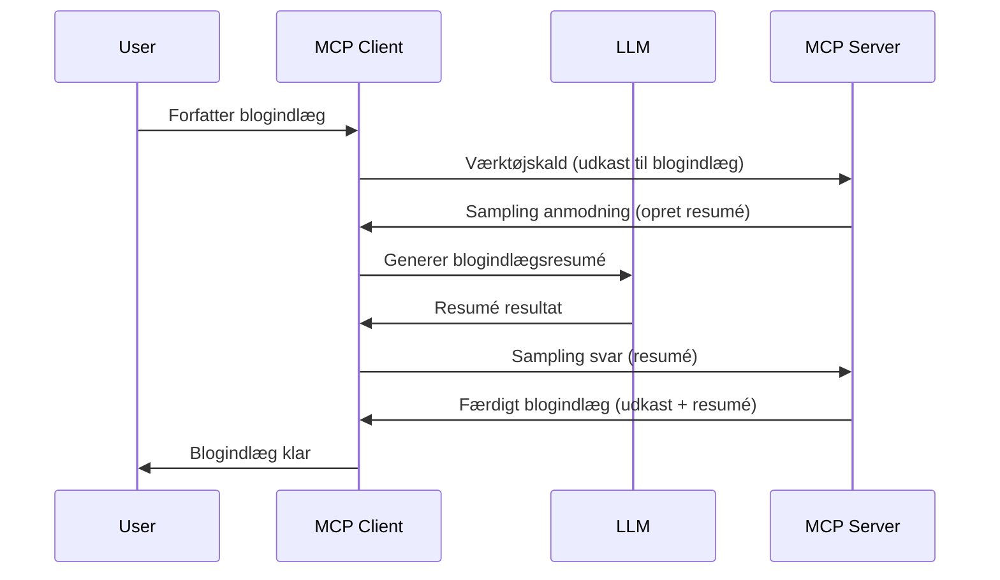

# Sampling - delegér funktioner til klienten

Nogle gange har du brug for, at MCP Client og MCP Server samarbejder for at opnå et fælles mål. Du kan have et tilfælde, hvor serveren har brug for hjælp fra en LLM, som ligger på klienten. Til denne situation er sampling det, du skal bruge.

Lad os undersøge nogle anvendelsestilfælde og hvordan man bygger en løsning, der involverer sampling.

## Oversigt

I denne lektion fokuserer vi på at forklare, hvornår og hvor man skal bruge Sampling, og hvordan man konfigurerer det.

## Læringsmål

I dette kapitel vil vi:

- Forklare hvad Sampling er og hvornår man bruger det.
- Vise hvordan man konfigurerer Sampling i MCP.
- Give eksempler på Sampling i praksis.

## Hvad er Sampling, og hvorfor bruge det?

Sampling er en avanceret funktion, der fungerer på følgende måde:


### Sampling-forespørgsel

Ok, nu hvor vi har et overordnet billede af et troværdigt scenarie, lad os tale om den sampling-forespørgsel, som serveren sender tilbage til klienten. Sådan kan en sådan forespørgsel se ud i JSON-RPC format:

```json
{
  "jsonrpc": "2.0",
  "id": 1,
  "method": "sampling/createMessage",
  "params": {
    "messages": [
      {
        "role": "user",
        "content": {
          "type": "text",
          "text": "Create a blog post summary of the following blog post: <BLOG POST>"
        }
      }
    ],
    "modelPreferences": {
      "hints": [
        {
          "name": "claude-3-sonnet"
        }
      ],
      "intelligencePriority": 0.8,
      "speedPriority": 0.5
    },
    "systemPrompt": "You are a helpful assistant.",
    "maxTokens": 100
  }
}
```

Der er et par ting her, som er værd at fremhæve:

- Prompt, under content -> text, er vores prompt, som er en instruktion til LLM om at opsummere indholdet af et blogindlæg.

- **modelPreferences**. Denne sektion er netop en præference, en anbefaling af hvilken konfiguration der skal bruges med LLM'en. Brugeren kan vælge, om de vil følge disse anbefalinger eller ændre dem. I dette tilfælde er der anbefalinger om model at bruge samt prioritet mellem hurtighed og intelligens.
- **systemPrompt**, dette er din normale system-prompt, der giver din LLM en personlighed og indeholder vejledende instruktioner.
- **maxTokens**, dette er en anden egenskab, der angiver, hvor mange tokens der anbefales at bruge til denne opgave.

### Sampling-svar

Dette svar er det, MCP Client ender med at sende tilbage til MCP Server, og det er resultatet af, at klienten kalder LLM, venter på svaret og derefter konstruerer denne besked. Sådan kan det se ud i JSON-RPC:

```json
{
  "jsonrpc": "2.0",
  "id": 1,
  "result": {
    "role": "assistant",
    "content": {
      "type": "text",
      "text": "Here's your abstract <ABSTRACT>"
    },
    "model": "gpt-5",
    "stopReason": "endTurn"
  }
}
```

Bemærk, hvordan svaret er et abstrakt af blogindlægget, som vi bad om. Bemærk også, hvordan den brugte `model` ikke er den, vi bad om, men "gpt-5" i stedet for "claude-3-sonnet". Dette illustrerer, at brugeren kan ændre mening om, hvad der skal bruges, og at din sampling-forespørgsel er en anbefaling.

Ok, nu hvor vi forstår hovedflowet og en nyttig opgave at bruge det til "blogindlægsskabning + abstrakt", lad os se hvad vi skal gøre for at få det til at fungere.

### Beskadetyper

Sampling-beskeder er ikke begrænset til kun tekst; du kan også sende billeder og lyd. Sådan ser JSON-RPC ud forskelligt ud:

**Tekst**

```json
{
  "type": "text",
  "text": "The message content"
}
```

**Billedindhold**

```json
{
  "type": "image",
  "data": "base64-encoded-image-data",
  "mimeType": "image/jpeg"
}
```

**Lydindhold**

```json
{
  "type": "audio",
  "data": "base64-encoded-audio-data",
  "mimeType": "audio/wav"
}
```

> NOTE: For mere detaljeret info om Sampling, se de [officielle docs](https://modelcontextprotocol.io/specification/2025-06-18/client/sampling)

## Hvordan konfigurerer man Sampling i klienten

> Bemærk: hvis du kun bygger en server, behøver du ikke gøre meget her.

I en klient skal du specificere følgende funktion således:

```json
{
  "capabilities": {
    "sampling": {}
  }
}
```

Dette vil så blive opfanget, når din valgte klient initialiserer med serveren.

## Eksempel på Sampling i praksis - Opret et blogindlæg

Lad os kode en sampling-server sammen, vi skal gøre følgende:

1. Opret et værktøj på serveren.
1. Dette værktøj skal oprette en sampling-forespørgsel.
1. Værktøjet skal vente på, at klientens sampling-forespørgsel bliver besvaret.
1. Derefter skal resultatet fra værktøjet produceres.

Lad os se på koden trin for trin:

### -1- Opret værktøjet

**python**

```python
@mcp.tool()
async def create_blog(title: str, content: str, ctx: Context[ServerSession, None]) -> str:
    """Create a blog post and generate a summary"""

```

### -2- Opret en sampling-forespørgsel

Udvid dit værktøj med følgende kode:

**python**

```python
post = BlogPost(
        id=len(posts) + 1,
        title=title,
        content=content,
        abstract=""
    )

prompt = f"Create an abstract of the following blog post: title: {title} and draft: {content} "

result = await ctx.session.create_message(
        messages=[
            SamplingMessage(
                role="user",
                content=TextContent(type="text", text=prompt),
            )
        ],
        max_tokens=100,
)

```

### -3- Vent på svaret og returner svaret

**python**

```python
post.abstract = result.content.text

posts.append(post)

# returner det komplette produkt
return json.dumps({
    "id": post.title,
    "abstract": post.abstract
})
```

### -4- Fuld kode

**python**

```python
from starlette.applications import Starlette
from starlette.routing import Mount, Host

from mcp.server.fastmcp import Context, FastMCP

from mcp.server.session import ServerSession
from mcp.types import SamplingMessage, TextContent

import json


from uuid import uuid4
from typing import List
from pydantic import BaseModel


mcp = FastMCP("Blog post generator")

# app = FastAPI()

posts = []

class BlogPost(BaseModel):
    id: int
    title: str
    content: str
    abstract: str

posts: List[BlogPost] = []

@mcp.tool()
async def create_blog(title: str, content: str, ctx: Context[ServerSession, None]) -> str:
    """Create a blog post and generate a summary"""

    post = BlogPost(
        id=len(posts) + 1,
        title=title,
        content=content,
        abstract=""
    )

    prompt = f"Create an abstract of the following blog post: title: {title} and draft: {content} "

    result = await ctx.session.create_message(
        messages=[
            SamplingMessage(
                role="user",
                content=TextContent(type="text", text=prompt),
            )
        ],
        max_tokens=100,
    )

    post.abstract = result.content.text

    posts.append(post)

    # returner det komplette blogindlæg
    return json.dumps({
        "id": post.title,
        "abstract": post.abstract
    })

if __name__ == "__main__":
    print("Starting server...")
    # mcp.run()
    mcp.run(transport="streamable-http")

# kør app med: python server.py
```

### -5- Test det i Visual Studio Code

For at teste dette i Visual Studio Code, gør følgende:

1. Start serveren i terminalen
1. Tilføj den til *mcp.json* (og sørg for, den er startet), for eksempel noget som dette:

   ```json
   "servers": {
      "blog-server": {
        "type": "http",
        "url": "http://localhost:8000/mcp"
      }
   }
   ```

1. Skriv en prompt:

   ```text
   create a blog post named "Where Python comes from", the content is "Python is actually named after Monty Python Flying Circus"
   ```

1. Tillad sampling at ske. Første gang du tester dette, vil du blive præsenteret for en ekstra dialog, som du skal acceptere, herefter vil du se den normale dialog, der beder dig om at køre et værktøj

1. Undersøg resultaterne. Du vil se resultaterne både flot gengivet i GitHub Copilot Chat, men du kan også inspicere det rå JSON-svar.

**Bonus**. Visual Studio Code-værktøjer har god understøttelse af sampling. Du kan konfigurere Sampling-adgang på din installerede server ved at navigere sådan her:

1. Naviger til extensions-sektionen.
1. Vælg tandhjulsikonet for din installerede server i sektionen "MCP SERVERS - INSTALLED".
1. Vælg "Configure Model Access", her kan du vælge hvilke modeller GitHub Copilot må bruge, når sampling udføres. Du kan også se alle sampling-forespørgsler, der er sket på det seneste, ved at vælge "Show Sampling requests".

## Opgave

I denne opgave skal du bygge en lidt anderledes Sampling, nemlig en sampling-integration, der understøtter generering af en produktbeskrivelse. Her er dit scenarie:

**Scenarie**: Backoffice-medarbejderen i en e-handel har brug for hjælp, det tager alt for lang tid at generere produktbeskrivelser. Derfor skal du bygge en løsning, hvor du kan kalde et værktøj "create_product" med "title" og "keywords" som argumenter, og det skal producere et komplet produkt inklusive et "description"-felt, der skal udfyldes af en klient-LLM.

TIP: brug det, du tidligere har lært om at konstruere denne server og dens værktøj ved hjælp af en sampling-forespørgsel.

## Løsning

[Løsning](./solution/README.md)

## Vigtige pointer

Sampling er en kraftfuld funktion, der tillader serveren at delegere opgaver til klienten, når den har brug for hjælp fra en LLM.

## Hvad er det næste

- [Kapitel 4 - Praktisk implementering](../../04-PracticalImplementation/README.md)

---

<!-- CO-OP TRANSLATOR DISCLAIMER START -->
**Ansvarsfraskrivelse**:
Dette dokument er blevet oversat ved hjælp af AI-oversættelsestjenesten [Co-op Translator](https://github.com/Azure/co-op-translator). Selvom vi bestræber os på nøjagtighed, bør du være opmærksom på, at automatiserede oversættelser kan indeholde fejl eller unøjagtigheder. Det originale dokument på dets modersmål bør betragtes som den autoritative kilde. For kritisk information anbefales professionel menneskelig oversættelse. Vi påtager os intet ansvar for misforståelser eller fejltolkninger, der opstår som følge af brugen af denne oversættelse.
<!-- CO-OP TRANSLATOR DISCLAIMER END -->