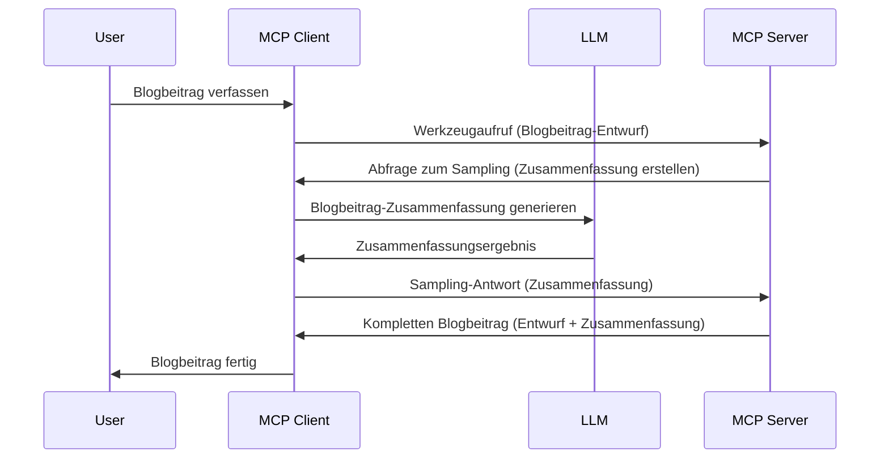

# Sampling – Funktionen an den Client delegieren

Manchmal müssen der MCP Client und der MCP Server zusammenarbeiten, um ein gemeinsames Ziel zu erreichen. Es kann vorkommen, dass der Server die Hilfe eines LLM benötigt, das beim Client läuft. Für diese Situation sollte Sampling verwendet werden.

Lassen Sie uns einige Anwendungsfälle und die Erstellung einer Lösung mit Sampling betrachten.

## Übersicht

In dieser Lektion konzentrieren wir uns darauf zu erklären, wann und wo Sampling eingesetzt wird und wie es konfiguriert wird.

## Lernziele

In diesem Kapitel werden wir:

- Erklären, was Sampling ist und wann man es einsetzt.
- Zeigen, wie man Sampling in MCP konfiguriert.
- Beispiele für die Anwendung von Sampling geben.

## Was ist Sampling und warum verwendet man es?

Sampling ist eine erweiterte Funktion, die auf folgende Weise funktioniert:


### Sampling-Anfrage

Ok, jetzt haben wir einen umfassenden Überblick über ein realistisches Szenario, sprechen wir über die Sampling-Anfrage, die der Server an den Client zurücksendet. So könnte eine solche Anfrage im JSON-RPC-Format aussehen:

```json
{
  "jsonrpc": "2.0",
  "id": 1,
  "method": "sampling/createMessage",
  "params": {
    "messages": [
      {
        "role": "user",
        "content": {
          "type": "text",
          "text": "Create a blog post summary of the following blog post: <BLOG POST>"
        }
      }
    ],
    "modelPreferences": {
      "hints": [
        {
          "name": "claude-3-sonnet"
        }
      ],
      "intelligencePriority": 0.8,
      "speedPriority": 0.5
    },
    "systemPrompt": "You are a helpful assistant.",
    "maxTokens": 100
  }
}
```

Hier sind einige wichtige Punkte:

- Prompt, unter content -> text, ist unsere Eingabeaufforderung, die eine Anweisung an das LLM enthält, den Inhalt eines Blogbeitrags zusammenzufassen.

- **modelPreferences**. Dieser Abschnitt ist genau das, eine Präferenz, eine Empfehlung, welche Konfiguration mit dem LLM verwendet werden soll. Der Benutzer kann entscheiden, ob er diesen Empfehlungen folgt oder sie ändert. In diesem Fall gibt es Empfehlungen zum zu verwendenden Modell sowie zur Priorität von Geschwindigkeit und Intelligenz.
- **systemPrompt**, das ist Ihr normaler System-Prompt, der Ihrem LLM eine Persönlichkeit verleiht und Anweisungen enthält.
- **maxTokens**, dies ist eine weitere Eigenschaft, die angibt, wie viele Tokens für diese Aufgabe empfohlen werden.

### Sampling-Antwort

Diese Antwort ist das, was der MCP Client letztlich an den MCP Server zurücksendet, das Ergebnis davon, dass der Client das LLM aufruft, auf diese Antwort wartet und dann diese Nachricht konstruiert. So könnte das im JSON-RPC aussehen:

```json
{
  "jsonrpc": "2.0",
  "id": 1,
  "result": {
    "role": "assistant",
    "content": {
      "type": "text",
      "text": "Here's your abstract <ABSTRACT>"
    },
    "model": "gpt-5",
    "stopReason": "endTurn"
  }
}
```

Beachten Sie, dass die Antwort eine Zusammenfassung des Blogbeitrags ist, genau wie wir es verlangt haben. Beachten Sie auch, dass das verwendete `model` nicht das ist, das wir angefordert haben, sondern "gpt-5" statt "claude-3-sonnet". Dies soll veranschaulichen, dass der Benutzer seine Entscheidung ändern kann und dass Ihre Sampling-Anfrage eine Empfehlung ist.

Ok, jetzt, wo wir den Hauptablauf und eine nützliche Aufgabe verstanden haben, für die es verwendet wird ("Blogbeitrag erstellen + Zusammenfassung"), sehen wir, was wir tun müssen, damit es funktioniert.

### Nachrichtentypen

Sampling-Nachrichten sind nicht nur auf Text beschränkt, sondern Sie können auch Bilder und Audio senden. So sieht das JSON-RPC jeweils anders aus:

**Text**

```json
{
  "type": "text",
  "text": "The message content"
}
```

**Bildinhalt**

```json
{
  "type": "image",
  "data": "base64-encoded-image-data",
  "mimeType": "image/jpeg"
}
```

**Audioinhalt**

```json
{
  "type": "audio",
  "data": "base64-encoded-audio-data",
  "mimeType": "audio/wav"
}
```

> HINWEIS: Für ausführlichere Informationen zu Sampling, siehe die [offiziellen Dokumente](https://modelcontextprotocol.io/specification/2025-06-18/client/sampling)

## Wie konfiguriert man Sampling im Client

> Hinweis: Wenn Sie nur einen Server bauen, müssen Sie hier nicht viel tun.

In einem Client müssen Sie die folgende Funktion wie folgt angeben:

```json
{
  "capabilities": {
    "sampling": {}
  }
}
```

Dies wird dann verwendet, wenn Ihr ausgewählter Client mit dem Server initialisiert wird.

## Beispiel für Sampling in Aktion – Einen Blogbeitrag erstellen

Lassen Sie uns gemeinsam einen Sampling-Server programmieren, dafür müssen wir Folgendes tun:

1. Ein Tool auf dem Server erstellen.
1. Das Tool soll eine Sampling-Anfrage erstellen.
1. Das Tool soll auf die Antwort der Sampling-Anfrage vom Client warten.
1. Dann soll das Ergebnis des Tools erzeugt werden.

Schauen wir uns den Code Schritt für Schritt an:

### -1- Das Tool erstellen

**python**

```python
@mcp.tool()
async def create_blog(title: str, content: str, ctx: Context[ServerSession, None]) -> str:
    """Create a blog post and generate a summary"""

```

### -2- Sampling-Anfrage erstellen

Erweitern Sie Ihr Tool mit folgendem Code:

**python**

```python
post = BlogPost(
        id=len(posts) + 1,
        title=title,
        content=content,
        abstract=""
    )

prompt = f"Create an abstract of the following blog post: title: {title} and draft: {content} "

result = await ctx.session.create_message(
        messages=[
            SamplingMessage(
                role="user",
                content=TextContent(type="text", text=prompt),
            )
        ],
        max_tokens=100,
)

```

### -3- Auf die Antwort warten und Antwort zurückgeben

**python**

```python
post.abstract = result.content.text

posts.append(post)

# gib das vollständige Produkt zurück
return json.dumps({
    "id": post.title,
    "abstract": post.abstract
})
```

### -4- Vollständiger Code

**python**

```python
from starlette.applications import Starlette
from starlette.routing import Mount, Host

from mcp.server.fastmcp import Context, FastMCP

from mcp.server.session import ServerSession
from mcp.types import SamplingMessage, TextContent

import json


from uuid import uuid4
from typing import List
from pydantic import BaseModel


mcp = FastMCP("Blog post generator")

# app = FastAPI()

posts = []

class BlogPost(BaseModel):
    id: int
    title: str
    content: str
    abstract: str

posts: List[BlogPost] = []

@mcp.tool()
async def create_blog(title: str, content: str, ctx: Context[ServerSession, None]) -> str:
    """Create a blog post and generate a summary"""

    post = BlogPost(
        id=len(posts) + 1,
        title=title,
        content=content,
        abstract=""
    )

    prompt = f"Create an abstract of the following blog post: title: {title} and draft: {content} "

    result = await ctx.session.create_message(
        messages=[
            SamplingMessage(
                role="user",
                content=TextContent(type="text", text=prompt),
            )
        ],
        max_tokens=100,
    )

    post.abstract = result.content.text

    posts.append(post)

    # gibt den vollständigen Blogbeitrag zurück
    return json.dumps({
        "id": post.title,
        "abstract": post.abstract
    })

if __name__ == "__main__":
    print("Starting server...")
    # mcp.run()
    mcp.run(transport="streamable-http")

# App starten mit: python server.py
```

### -5- Testen in Visual Studio Code

Um dies in Visual Studio Code zu testen, gehen Sie wie folgt vor:

1. Starten Sie den Server im Terminal
1. Fügen Sie ihn zu *mcp.json* hinzu (und stellen Sie sicher, dass er gestartet ist), z.B. so:

   ```json
   "servers": {
      "blog-server": {
        "type": "http",
        "url": "http://localhost:8000/mcp"
      }
   }
   ```

1. Geben Sie eine Eingabeaufforderung ein:

   ```text
   create a blog post named "Where Python comes from", the content is "Python is actually named after Monty Python Flying Circus"
   ```

1. Lassen Sie Sampling zu. Beim ersten Testen sehen Sie einen zusätzlichen Dialog, den Sie akzeptieren müssen, danach sehen Sie den normalen Dialog, der Sie auffordert, ein Tool auszuführen.

1. Prüfen Sie die Ergebnisse. Sie sehen die Ergebnisse sowohl schön gerendert im GitHub Copilot Chat, aber Sie können auch die rohe JSON-Antwort inspizieren.

**Bonus**. Die Visual Studio Code-Tools bieten großartige Unterstützung für Sampling. Sie können den Sampling-Zugriff auf Ihrem installierten Server folgendermaßen konfigurieren:

1. Navigieren Sie zum Erweiterungsbereich.
1. Wählen Sie das Zahnrad-Symbol für Ihren installierten Server im Abschnitt "MCP SERVERS – INSTALLED".
1. Wählen Sie "Configure Model Access", hier können Sie auswählen, welche Modelle GitHub Copilot bei der Durchführung von Sampling verwenden darf. Sie können auch alle kürzlich erfolgten Sampling-Anfragen einsehen, indem Sie "Show Sampling requests" auswählen.

## Aufgabe

In dieser Aufgabe bauen Sie eine etwas andere Sampling-Integration, nämlich eine Sampling-Integration, die das Erzeugen einer Produktbeschreibung unterstützt. Hier ist Ihr Szenario:

**Szenario**: Der Backoffice-Mitarbeiter bei einem E-Commerce benötigt Hilfe, da es viel zu viel Zeit kostet, Produktbeschreibungen zu erstellen. Daher bauen Sie eine Lösung, bei der Sie ein Tool "create_product" mit den Argumenten "title" und "keywords" aufrufen können, und es soll ein vollständiges Produkt erzeugt werden, das ein Feld "description" enthält, das von einem LLM beim Client befüllt wird.

TIPP: Verwenden Sie, was Sie zuvor gelernt haben, wie man diesen Server und sein Tool mit einer Sampling-Anfrage konstruiert.

## Lösung

[Lösung](./solution/README.md)

## Wichtigste Erkenntnisse

Sampling ist eine leistungsfähige Funktion, mit der der Server Aufgaben an den Client delegieren kann, wenn er die Hilfe eines LLM benötigt.

## Was kommt als Nächstes

- [Kapitel 4 – Praktische Umsetzung](../../04-PracticalImplementation/README.md)

---

<!-- CO-OP TRANSLATOR DISCLAIMER START -->
**Haftungsausschluss**:  
Dieses Dokument wurde mit dem KI-Übersetzungsdienst [Co-op Translator](https://github.com/Azure/co-op-translator) übersetzt. Obwohl wir uns um Genauigkeit bemühen, beachten Sie bitte, dass automatisierte Übersetzungen Fehler oder Ungenauigkeiten enthalten können. Das Originaldokument in seiner Ausgangssprache ist als maßgebliche Quelle zu betrachten. Für wichtige Informationen wird eine professionelle menschliche Übersetzung empfohlen. Wir übernehmen keine Haftung für Missverständnisse oder Fehlinterpretationen, die aus der Verwendung dieser Übersetzung entstehen.
<!-- CO-OP TRANSLATOR DISCLAIMER END -->