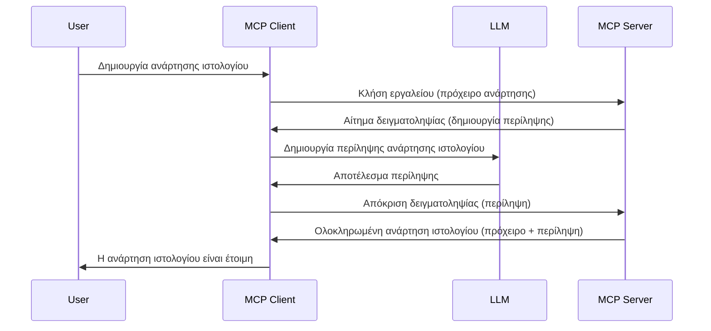

# Δειγματοληψία - εκχώρηση λειτουργιών στον Πελάτη

Κάποιες φορές, απαιτείται συνεργασία μεταξύ του MCP Client και του MCP Server για την επίτευξη ενός κοινού στόχου. Μπορεί να έχετε μια περίπτωση όπου ο Server χρειάζεται τη βοήθεια ενός LLM που βρίσκεται στον πελάτη. Σε αυτή την περίπτωση, η δειγματοληψία είναι αυτό που πρέπει να χρησιμοποιήσετε.

Ας εξερευνήσουμε μερικές περιπτώσεις χρήσης και πώς να δημιουργήσουμε μια λύση που να περιλαμβάνει δειγματοληψία.

## Επισκόπηση

Σε αυτό το μάθημα, εστιάζουμε στην εξήγηση του πότε και πού να χρησιμοποιείτε τη δειγματοληψία και πώς να την ρυθμίζετε.

## Στόχοι Μάθησης

Σε αυτό το κεφάλαιο, θα:

- Εξηγήσουμε τι είναι η δειγματοληψία και πότε να την χρησιμοποιούμε.
- Δείξουμε πώς να ρυθμίσουμε τη δειγματοληψία στο MCP.
- Παρέχουμε παραδείγματα δειγματοληψίας σε δράση.

## Τι είναι η Δειγματοληψία και γιατί να την χρησιμοποιήσετε;

Η δειγματοληψία είναι μια προχωρημένη λειτουργία που λειτουργεί ως εξής:


### Αίτημα δειγματοληψίας

Εντάξει, τώρα που έχουμε μια ευρεία επισκόπηση ενός αξιόπιστου σεναρίου, ας μιλήσουμε για το αίτημα δειγματοληψίας που στέλνει ο server στον πελάτη. Να πώς μπορεί να μοιάζει ένα τέτοιο αίτημα σε μορφή JSON-RPC:

```json
{
  "jsonrpc": "2.0",
  "id": 1,
  "method": "sampling/createMessage",
  "params": {
    "messages": [
      {
        "role": "user",
        "content": {
          "type": "text",
          "text": "Create a blog post summary of the following blog post: <BLOG POST>"
        }
      }
    ],
    "modelPreferences": {
      "hints": [
        {
          "name": "claude-3-sonnet"
        }
      ],
      "intelligencePriority": 0.8,
      "speedPriority": 0.5
    },
    "systemPrompt": "You are a helpful assistant.",
    "maxTokens": 100
  }
}
```

Υπάρχουν μερικά σημεία που αξίζουν να αναφέρουμε:

- Το Prompt, κάτω από το content -> text, είναι το prompt μας που αποτελεί μια οδηγία στο LLM να συνοψίσει το περιεχόμενο μιας ανάρτησης ιστολογίου.

- **modelPreferences**. Αυτό το τμήμα είναι ακριβώς αυτό, μια προτίμηση, μια σύσταση για το τι ρύθμιση να χρησιμοποιηθεί με το LLM. Ο χρήστης μπορεί να επιλέξει αν θα ακολουθήσει αυτές τις συστάσεις ή να τις αλλάξει. Σε αυτή την περίπτωση υπάρχουν συστάσεις για το μοντέλο που θα χρησιμοποιηθεί και την προτεραιότητα της ταχύτητας και της νοημοσύνης.
- **systemPrompt**, αυτό είναι το κανονικό σας prompt συστήματος που δίνει στο LLM σας μια προσωπικότητα και περιέχει οδηγίες καθοδήγησης.
- **maxTokens**, αυτή είναι μια ακόμη ιδιότητα που χρησιμοποιείται για να ορίσει τον αριθμό των tokens που προτείνεται να χρησιμοποιηθούν για αυτή την εργασία.

### Απάντηση δειγματοληψίας

Αυτή η απάντηση είναι αυτή που ο MCP Client στέλνει πίσω στον MCP Server και είναι το αποτέλεσμα του πελάτη που καλεί το LLM, περιμένει την απάντηση αυτή και στη συνέχεια κατασκευάζει αυτό το μήνυμα. Να πώς μπορεί να μοιάζει σε μορφή JSON-RPC:

```json
{
  "jsonrpc": "2.0",
  "id": 1,
  "result": {
    "role": "assistant",
    "content": {
      "type": "text",
      "text": "Here's your abstract <ABSTRACT>"
    },
    "model": "gpt-5",
    "stopReason": "endTurn"
  }
}
```

Σημειώστε πώς η απάντηση είναι μια περίληψη της ανάρτησης ιστολογίου όπως ζητήσαμε. Επίσης σημειώστε πώς το χρησιμοποιηθέν `model` δεν είναι αυτό που ζητήσαμε αλλά "gpt-5" αντί για "claude-3-sonnet". Αυτό δείχνει ότι ο χρήστης μπορεί να αλλάξει γνώμη για το ποιο να χρησιμοποιήσει και πως το αίτημα δειγματοληψίας σας είναι μια σύσταση.

Εντάξει, τώρα που κατανοούμε τη βασική ροή, και μια χρήσιμη εργασία για να το χρησιμοποιήσουμε, "δημιουργία ανάρτησης ιστολογίου + περίληψη", ας δούμε τι πρέπει να κάνουμε για να το κάνουμε να δουλέψει.

### Τύποι μηνυμάτων

Τα μηνύματα δειγματοληψίας δεν περιορίζονται μόνο σε κείμενο αλλά μπορείτε επίσης να στείλετε εικόνες και ήχο. Να πώς φαίνεται διαφορετικό το JSON-RPC:

**Κείμενο**

```json
{
  "type": "text",
  "text": "The message content"
}
```

**Περιεχόμενο εικόνας**

```json
{
  "type": "image",
  "data": "base64-encoded-image-data",
  "mimeType": "image/jpeg"
}
```

**Περιεχόμενο ήχου**

```json
{
  "type": "audio",
  "data": "base64-encoded-audio-data",
  "mimeType": "audio/wav"
}
```

> NOTE: για περισσότερες λεπτομέρειες σχετικά με τη δειγματοληψία, δείτε τα [επίσημα έγγραφα](https://modelcontextprotocol.io/specification/2025-06-18/client/sampling)

## Πώς να ρυθμίσετε τη δειγματοληψία στον Πελάτη

> Σημείωση: αν φτιάχνετε μόνο έναν server, δεν χρειάζεται να κάνετε πολλά εδώ.

Σε έναν πελάτη, πρέπει να ορίσετε την παρακάτω λειτουργία ως εξής:

```json
{
  "capabilities": {
    "sampling": {}
  }
}
```

Αυτό θα ληφθεί υπόψη όταν ο επιλεγμένος πελάτης σας αρχικοποιηθεί με τον server.

## Παράδειγμα Δειγματοληψίας σε Δράση - Δημιουργία Ανάρτησης Ιστολογίου

Ας κωδικοποιήσουμε μαζί έναν sampling server, θα χρειαστεί να κάνουμε τα εξής:

1. Δημιουργήστε ένα εργαλείο στον Server.
1. Το εργαλείο αυτό θα πρέπει να δημιουργήσει ένα αίτημα δειγματοληψίας.
1. Το εργαλείο θα πρέπει να περιμένει την απάντηση του αιτήματος δειγματοληψίας από τον πελάτη.
1. Στη συνέχεια θα πρέπει να παραχθεί το αποτέλεσμα του εργαλείου.

Ας δούμε τον κώδικα βήμα προς βήμα:

### -1- Δημιουργία του εργαλείου

**python**

```python
@mcp.tool()
async def create_blog(title: str, content: str, ctx: Context[ServerSession, None]) -> str:
    """Create a blog post and generate a summary"""

```

### -2- Δημιουργία αιτήματος δειγματοληψίας

Επεκτείνετε το εργαλείο σας με τον εξής κώδικα:

**python**

```python
post = BlogPost(
        id=len(posts) + 1,
        title=title,
        content=content,
        abstract=""
    )

prompt = f"Create an abstract of the following blog post: title: {title} and draft: {content} "

result = await ctx.session.create_message(
        messages=[
            SamplingMessage(
                role="user",
                content=TextContent(type="text", text=prompt),
            )
        ],
        max_tokens=100,
)

```

### -3- Περιμένετε την απάντηση και επιστρέψτε την απάντηση

**python**

```python
post.abstract = result.content.text

posts.append(post)

# επιστρέψτε το πλήρες προϊόν
return json.dumps({
    "id": post.title,
    "abstract": post.abstract
})
```

### -4- Πλήρης κώδικας

**python**

```python
from starlette.applications import Starlette
from starlette.routing import Mount, Host

from mcp.server.fastmcp import Context, FastMCP

from mcp.server.session import ServerSession
from mcp.types import SamplingMessage, TextContent

import json


from uuid import uuid4
from typing import List
from pydantic import BaseModel


mcp = FastMCP("Blog post generator")

# app = FastAPI()

posts = []

class BlogPost(BaseModel):
    id: int
    title: str
    content: str
    abstract: str

posts: List[BlogPost] = []

@mcp.tool()
async def create_blog(title: str, content: str, ctx: Context[ServerSession, None]) -> str:
    """Create a blog post and generate a summary"""

    post = BlogPost(
        id=len(posts) + 1,
        title=title,
        content=content,
        abstract=""
    )

    prompt = f"Create an abstract of the following blog post: title: {title} and draft: {content} "

    result = await ctx.session.create_message(
        messages=[
            SamplingMessage(
                role="user",
                content=TextContent(type="text", text=prompt),
            )
        ],
        max_tokens=100,
    )

    post.abstract = result.content.text

    posts.append(post)

    # επιστρέψτε την ολοκληρωμένη ανάρτηση ιστολογίου
    return json.dumps({
        "id": post.title,
        "abstract": post.abstract
    })

if __name__ == "__main__":
    print("Starting server...")
    # mcp.run()
    mcp.run(transport="streamable-http")

# εκτελέστε την εφαρμογή με: python server.py
```

### -5- Δοκιμή στο Visual Studio Code

Για να το δοκιμάσετε στο Visual Studio Code, κάντε τα εξής:

1. Ξεκινήστε τον server στο τερματικό
1. Προσθέστε τον στο *mcp.json* (και βεβαιωθείτε ότι έχει ξεκινήσει) π.χ κάτι σαν:

   ```json
   "servers": {
      "blog-server": {
        "type": "http",
        "url": "http://localhost:8000/mcp"
      }
   }
   ```

1. Πληκτρολογήστε ένα prompt:

   ```text
   create a blog post named "Where Python comes from", the content is "Python is actually named after Monty Python Flying Circus"
   ```

1. Επιτρέψτε να γίνει η δειγματοληψία. Την πρώτη φορά που το δοκιμάζετε θα σας εμφανιστεί ένας επιπλέον διάλογος που θα πρέπει να αποδεχτείτε, μετά θα δείτε τον κανονικό διάλογο που σας ζητά να εκτελέσετε ένα εργαλείο

1. Εξετάστε τα αποτελέσματα. Θα δείτε τα αποτελέσματα τόσο όμορφα αποδοσμένα στο GitHub Copilot Chat αλλά μπορείτε επίσης να εξετάσετε την ακατέργαστη JSON απάντηση.

**Επιπλέον**. Τα εργαλεία του Visual Studio Code διαθέτουν εξαιρετική υποστήριξη για τη δειγματοληψία. Μπορείτε να ρυθμίσετε την πρόσβαση στη δειγματοληψία στον εγκατεστημένο server σας πηγαίνοντας ως εξής:

1. Μεταβείτε στην ενότητα επεκτάσεων.
1. Επιλέξτε το εικονίδιο με το γρανάζι για τον εγκατεστημένο server σας στην ενότητα "MCP SERVERS - INSTALLED".
1. Επιλέξτε "Configure Model Access", εδώ μπορείτε να επιλέξετε ποια μοντέλα επιτρέπεται να χρησιμοποιεί το GitHub Copilot όταν εκτελεί δειγματοληψία. Μπορείτε επίσης να δείτε όλα τα πρόσφατα αιτήματα δειγματοληψίας επιλέγοντας "Show Sampling requests".

## Άσκηση

Σε αυτή την άσκηση, θα δημιουργήσετε μια ελαφρώς διαφορετική δειγματοληψία, δηλαδή μια ολοκλήρωση δειγματοληψίας που υποστηρίζει τη δημιουργία περιγραφής προϊόντος. Να το σενάριό σας:

**Σενάριο**: Ο εργαζόμενος στο back office ενός ηλεκτρονικού καταστήματος χρειάζεται βοήθεια, χρειάζεται πάρα πολύ χρόνο για να δημιουργήσει περιγραφές προϊόντων. Επομένως, πρέπει να δημιουργήσετε μια λύση όπου θα μπορείτε να καλείτε ένα εργαλείο "create_product" με "title" και "keywords" ως επιχειρήματα και θα πρέπει να παράγει ένα πλήρες προϊόν που θα περιλαμβάνει ένα πεδίο "description" το οποίο θα συμπληρώνεται από το LLM του πελάτη.

TIP: χρησιμοποιήστε όσα μάθατε νωρίτερα για το πώς να κατασκευάσετε αυτόν τον server και το εργαλείο του χρησιμοποιώντας ένα αίτημα δειγματοληψίας.

## Λύση

[Solution](./solution/README.md)

## Βασικά Συμπεράσματα

Η δειγματοληψία είναι μια ισχυρή λειτουργία που επιτρέπει στον server να εκχωρεί εργασίες στον πελάτη όταν χρειάζεται τη βοήθεια ενός LLM.

## Τι Ακολουθεί

- [Κεφάλαιο 4 - Πρακτική εφαρμογή](../../04-PracticalImplementation/README.md)

---

<!-- CO-OP TRANSLATOR DISCLAIMER START -->
**Αποποίηση Ευθύνης**:
Αυτό το έγγραφο έχει μεταφραστεί χρησιμοποιώντας την υπηρεσία αυτόματης μετάφρασης AI [Co-op Translator](https://github.com/Azure/co-op-translator). Ενώ επιδιώκουμε ακρίβεια, παρακαλούμε να γνωρίζετε ότι οι αυτόματες μεταφράσεις ενδέχεται να περιέχουν λάθη ή ανακρίβειες. Το πρωτότυπο έγγραφο στη μητρική του γλώσσα θα πρέπει να θεωρείται η αυθεντική πηγή. Για κρίσιμες πληροφορίες συνιστάται επαγγελματική ανθρώπινη μετάφραση. Δεν φέρουμε ευθύνη για τυχόν παρεξηγήσεις ή λανθασμένες ερμηνείες που προκύπτουν από τη χρήση αυτής της μετάφρασης.
<!-- CO-OP TRANSLATOR DISCLAIMER END -->