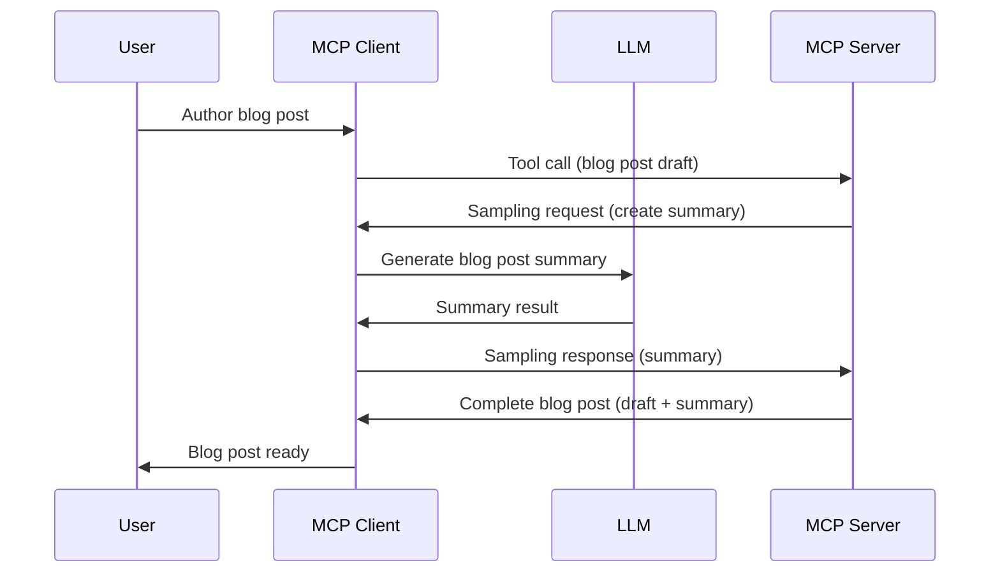

# Sampling - delegate features to the Client

Sometimes, you need the MCP Client and the MCP Server to collaborate to achieve a common goal. You might have a case where the Server requires the help of an LLM that sits on the client. For this situation, sampling is what you should use.

Let's explore some use cases and how to build a solution involving sampling.

## Overview

In this lesson, we focus on explaining when and where to use Sampling and how to configure it.

## Learning Objectives

In this chapter, we will:

- Explain what Sampling is and when to use it.
- Show how to configure Sampling in MCP.
- Provide examples of Sampling in action.

## What is Sampling and why use it?

Sampling is an advanced feature that works in the following way:


### Sampling request

Ok, now we have a mile high view of a credible scenario, let's talk about the sampling request the server sends back to the client. Here's what such a request can look like in JSON-RPC format:

```json
{
  "jsonrpc": "2.0",
  "id": 1,
  "method": "sampling/createMessage",
  "params": {
    "messages": [
      {
        "role": "user",
        "content": {
          "type": "text",
          "text": "Create a blog post summary of the following blog post: <BLOG POST>"
        }
      }
    ],
    "modelPreferences": {
      "hints": [
        {
          "name": "claude-3-sonnet"
        }
      ],
      "intelligencePriority": 0.8,
      "speedPriority": 0.5
    },
    "systemPrompt": "You are a helpful assistant.",
    "maxTokens": 100
  }
}
```

There's a few things here worth calling out:

- Prompt, under content -> text, is our prompt that is an instruction for the LLM to summarize blog post content.

- **modelPreferences**. This section is just that, a preference, a recommendation of what configuration to use with the LLM. The user can choose whether to go with these recommendations or change them. In this case there are recommendations on model to use and speed and intelligence priority.
- **systemPrompt**, this is your normal system prompt that gives your LLM a personality and contains guidance instructions.
- **maxTokens**, this is another property that's used to say how many tokens is recommended to use for this task.

### Sampling response

This response is what the MCP Client ends up sending back to the the MCP Server and is the result of the client calling the LLM, wait for that response and then construct this message. Here's what it can look like in JSON-RPC:

```json
{
  "jsonrpc": "2.0",
  "id": 1,
  "result": {
    "role": "assistant",
    "content": {
      "type": "text",
      "text": "Here's your abstract <ABSTRACT>"
    },
    "model": "gpt-5",
    "stopReason": "endTurn"
  }
}
```

Note how the response is an abstract of the blog post just like we asked for. Also note how the used `model` isn't what we asked for but "gpt-5" over "claude-3-sonnet". This is to illustrate that the user can change their mind on what to use and that your sampling request is a recommendation.

Ok, now that we understand the main flow, and useful task to use it for "blog post creation + abstract", let's see what we need to do to get it to work.

### Message types

Sampling messages aren't constrained to just text but you can also send, images and audio. Here's how the JSON-RPC looks different:

**Text**

```json
{
  "type": "text",
  "text": "The message content"
}
```

**Image content**

```json
{
  "type": "image",
  "data": "base64-encoded-image-data",
  "mimeType": "image/jpeg"
}
```

**Audio content**

```json
{
  "type": "audio",
  "data": "base64-encoded-audio-data",
  "mimeType": "audio/wav"
}
```

> NOTE: for more detailed info on Sampling, check out the [official docs](https://modelcontextprotocol.io/specification/2025-06-18/client/sampling)

## How to Configure Sampling in the Client

> Note: if you're only building a server, you don't need to do much here.

In a client, you need to specify the following feature like so:

```json
{
  "capabilities": {
    "sampling": {}
  }
}
```

This will then be picked up when your chosen client initializes with the server.

## Example of Sampling in Action - Create a Blog Post

Let's code a sampling server together, we will need to do the following:

1. Create a tool on the Server.
1. Said tool should create a sampling request
1. Tool should wait for the clients sampling request to be answered.
1. Then the tool result should be produced.

Let's see the code step by step:

### -1- Create the tool

**python**

```python
@mcp.tool()
async def create_blog(title: str, content: str, ctx: Context[ServerSession, None]) -> str:
    """Create a blog post and generate a summary"""

```

### -2- Create a sampling request

Extend your tool with the following code:

**python**

```python
post = BlogPost(
        id=len(posts) + 1,
        title=title,
        content=content,
        abstract=""
    )

prompt = f"Create an abstract of the following blog post: title: {title} and draft: {content} "

result = await ctx.session.create_message(
        messages=[
            SamplingMessage(
                role="user",
                content=TextContent(type="text", text=prompt),
            )
        ],
        max_tokens=100,
)

```

### -3- Wait for the response and return response

**python**

```python
post.abstract = result.content.text

posts.append(post)

# return the complete product
return json.dumps({
    "id": post.title,
    "abstract": post.abstract
})
```

### -4- Full code

**python**

```python
from starlette.applications import Starlette
from starlette.routing import Mount, Host

from mcp.server.fastmcp import Context, FastMCP

from mcp.server.session import ServerSession
from mcp.types import SamplingMessage, TextContent

import json


from uuid import uuid4
from typing import List
from pydantic import BaseModel


mcp = FastMCP("Blog post generator")

# app = FastAPI()

posts = []

class BlogPost(BaseModel):
    id: int
    title: str
    content: str
    abstract: str

posts: List[BlogPost] = []

@mcp.tool()
async def create_blog(title: str, content: str, ctx: Context[ServerSession, None]) -> str:
    """Create a blog post and generate a summary"""

    post = BlogPost(
        id=len(posts) + 1,
        title=title,
        content=content,
        abstract=""
    )

    prompt = f"Create an abstract of the following blog post: title: {title} and draft: {content} "

    result = await ctx.session.create_message(
        messages=[
            SamplingMessage(
                role="user",
                content=TextContent(type="text", text=prompt),
            )
        ],
        max_tokens=100,
    )

    post.abstract = result.content.text

    posts.append(post)

    # return the complete blog post
    return json.dumps({
        "id": post.title,
        "abstract": post.abstract
    })

if __name__ == "__main__":
    print("Starting server...")
    # mcp.run()
    mcp.run(transport="streamable-http")

# run app with: python server.py
```

### -5- Testing it in Visual Studio Code

To test this out in Visual Studio Code, do the following:

1. Start server in terminal
1. Add it to *mcp.json* (and ensure it's started) e.g something like so:

   ```json
   "servers": {
      "blog-server": {
        "type": "http",
        "url": "http://localhost:8000/mcp"
      }
   }
   ```

1. Type a prompt:

   ```text
   create a blog post named "Where Python comes from", the content is "Python is actually named after Monty Python Flying Circus"
   ```

1. Allow sampling to happen. First time you test this you will be presented with an additional dialog you will need to accept, then you will see the normal dialog for asking you to run a tool

1. Inspect results. You will see the results both nicely rendered in GitHub Copilot Chat but you can also inspect the raw JSON response.

**Bonus**. Visual Studio Code tooling has great support for sampling.  You can configure Sampling access on your installed server by navigating to it like so:

1. Navigate to extension section.
1. Select the cog icon for your installed server in the "MCP SERVERS - INSTALLED" section.
1 Select "Configure Model Access", here you can select which Models GitHub Copilot is allowed to use when performing sampling. You can also see all sampling requests that happened lately by selecting "Show Sampling requests".

## Assignment

In this assignment, you will build a slightly different Sampling namely a sampling integration that supports generating a product description. Here's your scenario:

**Scenario**: The back office worker at an e-commerce needs help, it takes way too much time to generate product descriptions. Therefore, you are to build a solution where you can call a tool "create_product" with "title" and "keywords" as argument and it should produce a complete product including a "description" field that should be populated by a client's LLM.

TIP: use what you learned earlier how to construct this server and its tool using a sampling request.

## Solution

[Solution](./solution/README.md)

## Key Takeaways

Sampling is a powerful feature that allows the server to delegate tasks to the client when it needs the help of an LLM.

## What's Next

- [Chapter 4 - Practical implementation](../../04-PracticalImplementation/README.md)

---

<!-- CO-OP TRANSLATOR DISCLAIMER START -->
**Disclaimer**:
This document has been translated using the AI translation service [Co-op Translator](https://github.com/Azure/co-op-translator). While we strive for accuracy, please be aware that automated translations may contain errors or inaccuracies. The original document in its native language should be considered the authoritative source. For critical information, professional human translation is recommended. We are not liable for any misunderstandings or misinterpretations arising from the use of this translation.
<!-- CO-OP TRANSLATOR DISCLAIMER END -->