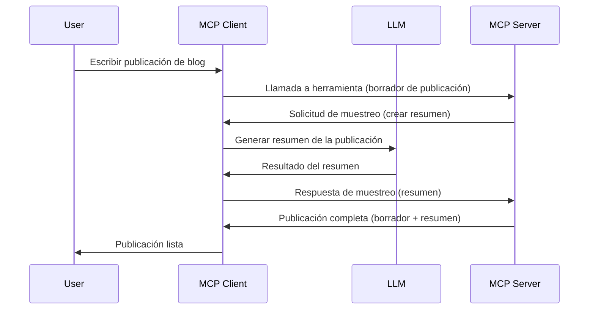

# Muestreo - delegar funciones al Cliente

A veces, necesitas que el Cliente MCP y el Servidor MCP colaboren para lograr un objetivo común. Puede que tengas un caso donde el Servidor requiera la ayuda de un LLM que se encuentra en el cliente. Para esta situación, el muestreo es lo que deberías usar.

Exploremos algunos casos de uso y cómo construir una solución que involucre muestreo.

## Visión general

En esta lección, nos enfocamos en explicar cuándo y dónde usar el Muestreo y cómo configurarlo.

## Objetivos de aprendizaje

En este capítulo, vamos a:

- Explicar qué es el Muestreo y cuándo usarlo.
- Mostrar cómo configurar el Muestreo en MCP.
- Proporcionar ejemplos del Muestreo en acción.

## ¿Qué es el Muestreo y por qué usarlo?

El Muestreo es una característica avanzada que funciona de la siguiente manera:


### Solicitud de muestreo

Ok, ahora que tenemos una vista panorámica de un escenario creíble, hablemos sobre la solicitud de muestreo que el servidor envía de vuelta al cliente. Así es como puede verse dicha solicitud en formato JSON-RPC:

```json
{
  "jsonrpc": "2.0",
  "id": 1,
  "method": "sampling/createMessage",
  "params": {
    "messages": [
      {
        "role": "user",
        "content": {
          "type": "text",
          "text": "Create a blog post summary of the following blog post: <BLOG POST>"
        }
      }
    ],
    "modelPreferences": {
      "hints": [
        {
          "name": "claude-3-sonnet"
        }
      ],
      "intelligencePriority": 0.8,
      "speedPriority": 0.5
    },
    "systemPrompt": "You are a helpful assistant.",
    "maxTokens": 100
  }
}
```

Hay algunas cosas aquí que vale la pena destacar:

- Prompt, bajo content -> text, es nuestro prompt que es una instrucción para que el LLM resuma el contenido de una publicación de blog.

- **modelPreferences**. Esta sección es exactamente eso, una preferencia, una recomendación sobre qué configuración usar con el LLM. El usuario puede elegir si seguir estas recomendaciones o cambiarlas. En este caso hay recomendaciones sobre qué modelo usar y prioridad entre velocidad e inteligencia.
- **systemPrompt**, este es tu prompt normal del sistema que le da personalidad al LLM y contiene instrucciones de orientación.
- **maxTokens**, esta es otra propiedad que se usa para indicar cuántos tokens se recomienda usar para esta tarea.

### Respuesta de muestreo

Esta respuesta es lo que el Cliente MCP termina enviando de vuelta al Servidor MCP y es el resultado de que el cliente llame al LLM, espere esa respuesta y luego construya este mensaje. Así es como puede verse en JSON-RPC:

```json
{
  "jsonrpc": "2.0",
  "id": 1,
  "result": {
    "role": "assistant",
    "content": {
      "type": "text",
      "text": "Here's your abstract <ABSTRACT>"
    },
    "model": "gpt-5",
    "stopReason": "endTurn"
  }
}
```

Observa cómo la respuesta es un resumen del blog tal como pedimos. También nota cómo el `model` usado no es el que pedimos sino "gpt-5" en lugar de "claude-3-sonnet". Esto es para ilustrar que el usuario puede cambiar de opinión sobre qué usar y que tu solicitud de muestreo es una recomendación.

Ok, ahora que entendemos el flujo principal y una tarea útil para usarlo "creación + resumen de publicación de blog", veamos qué necesitamos hacer para que funcione.

### Tipos de mensajes

Los mensajes de muestreo no están limitados solo al texto, también puedes enviar imágenes y audio. Así es como se ve diferente el JSON-RPC:

**Texto**

```json
{
  "type": "text",
  "text": "The message content"
}
```

**Contenido de imagen**

```json
{
  "type": "image",
  "data": "base64-encoded-image-data",
  "mimeType": "image/jpeg"
}
```

**Contenido de audio**

```json
{
  "type": "audio",
  "data": "base64-encoded-audio-data",
  "mimeType": "audio/wav"
}
```

> NOTA: para información más detallada sobre Muestreo, consulta la [documentación oficial](https://modelcontextprotocol.io/specification/2025-06-18/client/sampling)

## Cómo configurar el Muestreo en el Cliente

> Nota: si solo estás construyendo un servidor, no necesitas hacer mucho aquí.

En un cliente, necesitas especificar la siguiente función así:

```json
{
  "capabilities": {
    "sampling": {}
  }
}
```

Esto será tomado en cuenta cuando tu cliente elegido se inicialice con el servidor.

## Ejemplo de Muestreo en acción - Crear una publicación de blog

Vamos a programar un servidor de muestreo juntos, necesitaremos hacer lo siguiente:

1. Crear una herramienta en el Servidor.
1. Dicha herramienta debe crear una solicitud de muestreo.
1. La herramienta debe esperar a que la solicitud de muestreo del cliente sea respondida.
1. Luego se debe producir el resultado de la herramienta.

Veamos el código paso a paso:

### -1- Crear la herramienta

**python**

```python
@mcp.tool()
async def create_blog(title: str, content: str, ctx: Context[ServerSession, None]) -> str:
    """Create a blog post and generate a summary"""

```

### -2- Crear una solicitud de muestreo

Extiende tu herramienta con el siguiente código:

**python**

```python
post = BlogPost(
        id=len(posts) + 1,
        title=title,
        content=content,
        abstract=""
    )

prompt = f"Create an abstract of the following blog post: title: {title} and draft: {content} "

result = await ctx.session.create_message(
        messages=[
            SamplingMessage(
                role="user",
                content=TextContent(type="text", text=prompt),
            )
        ],
        max_tokens=100,
)

```

### -3- Esperar la respuesta y devolverla

**python**

```python
post.abstract = result.content.text

posts.append(post)

# devolver el producto completo
return json.dumps({
    "id": post.title,
    "abstract": post.abstract
})
```

### -4- Código completo

**python**

```python
from starlette.applications import Starlette
from starlette.routing import Mount, Host

from mcp.server.fastmcp import Context, FastMCP

from mcp.server.session import ServerSession
from mcp.types import SamplingMessage, TextContent

import json


from uuid import uuid4
from typing import List
from pydantic import BaseModel


mcp = FastMCP("Blog post generator")

# app = FastAPI()

posts = []

class BlogPost(BaseModel):
    id: int
    title: str
    content: str
    abstract: str

posts: List[BlogPost] = []

@mcp.tool()
async def create_blog(title: str, content: str, ctx: Context[ServerSession, None]) -> str:
    """Create a blog post and generate a summary"""

    post = BlogPost(
        id=len(posts) + 1,
        title=title,
        content=content,
        abstract=""
    )

    prompt = f"Create an abstract of the following blog post: title: {title} and draft: {content} "

    result = await ctx.session.create_message(
        messages=[
            SamplingMessage(
                role="user",
                content=TextContent(type="text", text=prompt),
            )
        ],
        max_tokens=100,
    )

    post.abstract = result.content.text

    posts.append(post)

    # devuelve la publicación completa del blog
    return json.dumps({
        "id": post.title,
        "abstract": post.abstract
    })

if __name__ == "__main__":
    print("Starting server...")
    # mcp.run()
    mcp.run(transport="streamable-http")

# ejecutar la aplicación con: python server.py
```

### -5- Probarlo en Visual Studio Code

Para probar esto en Visual Studio Code, haz lo siguiente:

1. Inicia el servidor en la terminal.
1. Agrégalo a *mcp.json* (y asegúrate que esté iniciado) algo así:

   ```json
   "servers": {
      "blog-server": {
        "type": "http",
        "url": "http://localhost:8000/mcp"
      }
   }
   ```

1. Escribe un prompt:

   ```text
   create a blog post named "Where Python comes from", the content is "Python is actually named after Monty Python Flying Circus"
   ```

1. Permite que el muestreo suceda. La primera vez que pruebes esto se te presentará un diálogo adicional que deberás aceptar, luego verás el diálogo normal para que ejecutes una herramienta.

1. Inspecciona los resultados. Verás los resultados bien renderizados en GitHub Copilot Chat pero también puedes inspeccionar la respuesta JSON cruda.

**Bonus**. Las herramientas en Visual Studio Code tienen gran soporte para muestreo. Puedes configurar el acceso al Muestreo en tu servidor instalado navegando de la siguiente manera:

1. Navega a la sección de extensiones.
1. Selecciona el icono de engranaje para tu servidor instalado en la sección "MCP SERVERS - INSTALLED".
1. Selecciona "Configure Model Access", aquí puedes seleccionar qué modelos puede usar GitHub Copilot cuando realiza muestreo. También puedes ver todas las solicitudes de muestreo recientes seleccionando "Show Sampling requests".

## Tarea

En esta tarea, vas a construir un Muestreo ligeramente diferente, es decir, una integración de muestreo que soporte generar una descripción de producto. Aquí está tu escenario:

**Escenario**: El trabajador de oficina en una tienda de comercio electrónico necesita ayuda, toma demasiado tiempo generar descripciones de productos. Por lo tanto, vas a construir una solución donde puedas llamar a una herramienta "create_product" con "title" y "keywords" como argumentos y debería producir un producto completo incluyendo un campo "description" que será llenado por un LLM del cliente.

CONSEJO: usa lo que aprendiste antes sobre cómo construir este servidor y su herramienta usando una solicitud de muestreo.

## Solución

[Solution](./solution/README.md)

## Puntos clave

El muestreo es una característica poderosa que permite al servidor delegar tareas al cliente cuando necesita la ayuda de un LLM.

## Qué sigue

- [Capítulo 4 - Implementación práctica](../../04-PracticalImplementation/README.md)

---

<!-- CO-OP TRANSLATOR DISCLAIMER START -->
**Aviso Legal**:
Este documento ha sido traducido utilizando el servicio de traducción automática [Co-op Translator](https://github.com/Azure/co-op-translator). Aunque nos esforzamos por lograr precisión, tenga en cuenta que las traducciones automáticas pueden contener errores o inexactitudes. El documento original en su idioma nativo debe considerarse la fuente autorizada. Para información crítica, se recomienda la traducción profesional realizada por un humano. No nos hacemos responsables de malentendidos o interpretaciones erróneas derivadas del uso de esta traducción.
<!-- CO-OP TRANSLATOR DISCLAIMER END -->