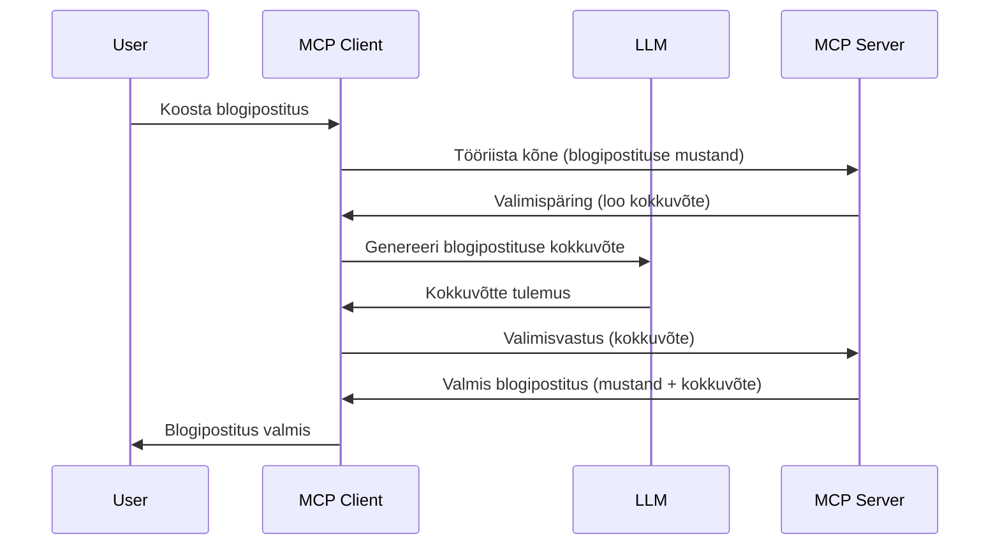

# Valimine - tunnuste delegeerimine kliendile

Mõnikord peab MCP klient ja MCP server koostööd tegema ühise eesmärgi saavutamiseks. Võib juhtuda, et server vajab abi kliendi poolel olevast LLM-ist. Selleks olukorraks tuleks kasutada valimist.

Vaatame mõningaid kasutusjuhte ja kuidas ehitada lahendus, mis hõlmab valimist.

## Ülevaade

Selles õppetükis keskendume nõustamisele, millal ja kus kasutada valimist ning kuidas seda seadistada.

## Õpieesmärgid

Selles peatükis:

- Selgitame, mis on valimine ja millal seda kasutada.
- Näitame, kuidas MCP-s valimist seadistada.
- Toome näiteid valimise kasutamisest.

## Mis on valimine ja miks seda kasutada?

Valimine on täiustatud funktsioon, mis töötab järgmiselt:


### Valimistaotlus

Okei, nüüd, kui meil on stsenaariumi üldvaade, räägime valimistaotlusest, mida server klienti saadab. Selline taotlus võib JSON-RPC formaadis välja näha järgmiselt:

```json
{
  "jsonrpc": "2.0",
  "id": 1,
  "method": "sampling/createMessage",
  "params": {
    "messages": [
      {
        "role": "user",
        "content": {
          "type": "text",
          "text": "Create a blog post summary of the following blog post: <BLOG POST>"
        }
      }
    ],
    "modelPreferences": {
      "hints": [
        {
          "name": "claude-3-sonnet"
        }
      ],
      "intelligencePriority": 0.8,
      "speedPriority": 0.5
    },
    "systemPrompt": "You are a helpful assistant.",
    "maxTokens": 100
  }
}
```

Siin on mitu olulist momenti:

- Tekst, content -> text all, on meie üleskutse — juhis LLM-ile blogipostituse sisu kokkuvõtmiseks.

- **modelPreferences**. See jaotis on lihtsalt soovitus, millist konfiguratsiooni LLM-iga kasutada. Kasutaja võib neid soovitusi järgida või muuta. Antud juhul on soovitused mudeli, kiiruse ja intelligentsuse prioriteedi kohta.
- **systemPrompt** on sinu tavapärane süsteemi juhis, mis annab LLM-ile iseloomu ja sisaldab juhiseid.
- **maxTokens** määrab, mitu võtmesõna soovitatakse sellele ülesandele kasutada.

### Valimisvastus

See vastus on see, mida MCP klient lõpuks MCP serverile tagastab ja mis on kliendi poolt LLM-ile tehtud päringu tulemus. Näeb JSON-RPC-s välja selline:

```json
{
  "jsonrpc": "2.0",
  "id": 1,
  "result": {
    "role": "assistant",
    "content": {
      "type": "text",
      "text": "Here's your abstract <ABSTRACT>"
    },
    "model": "gpt-5",
    "stopReason": "endTurn"
  }
}
```

Pane tähele, et vastus on blogipostituse kokkuvõte, just nagu soovisime. Samuti märka, et kasutatud mudel on "gpt-5", mitte meie soovitud "claude-3-sonnet". See näitab, et kasutaja võib oma meelt muuta, ja sinu valimistaotlus on soovitus.

Nüüd, kui mõistame põhivoogu ja kasulikku ülesannet "blogipostituse loomine + kokkuvõte", vaatame, mida peab selleks tegema.

### Sõnumi tüübid

Valimissõnumid ei piirdu ainult tekstiga, vaid võid saata ka pilte ja heli. JSON-RPC format erineb sellel juhul järgmiselt:

**Tekst**

```json
{
  "type": "text",
  "text": "The message content"
}
```

**Pildi sisu**

```json
{
  "type": "image",
  "data": "base64-encoded-image-data",
  "mimeType": "image/jpeg"
}
```

**Heli sisu**

```json
{
  "type": "audio",
  "data": "base64-encoded-audio-data",
  "mimeType": "audio/wav"
}
```

> MÄRKUS: valimise üksikasjalikumaks uurimiseks vaata [ametlikku dokumentatsiooni](https://modelcontextprotocol.io/specification/2025-06-18/client/sampling)

## Kuidas kliendis valimist seadistada

> Märkus: kui ehitad ainult serverit, siis siin palju teha ei ole.

Kliendis tuleb järgmiselt määrata järgmine funktsioon:

```json
{
  "capabilities": {
    "sampling": {}
  }
}
```

See aktiveeritakse, kui sinu valitud klient serveriga ühenduse loob.

## Näide valimise kasutamisest - blogipostituse loomine

Loome koos valimise serveri, peame tegema järgmist:

1. Loome serveris tööriista.
1. See tööriist loob valimistaotluse.
1. Tööriist ootab kliendi valimistaotluse vastust.
1. Seejärel toodetakse tööriista tulemus.

Vaatame koodis samm-sammult:

### -1- Tööriista loomine

**python**

```python
@mcp.tool()
async def create_blog(title: str, content: str, ctx: Context[ServerSession, None]) -> str:
    """Create a blog post and generate a summary"""

```

### -2- Valimistaotluse loomine

Lisa oma tööriistale järgmine kood:

**python**

```python
post = BlogPost(
        id=len(posts) + 1,
        title=title,
        content=content,
        abstract=""
    )

prompt = f"Create an abstract of the following blog post: title: {title} and draft: {content} "

result = await ctx.session.create_message(
        messages=[
            SamplingMessage(
                role="user",
                content=TextContent(type="text", text=prompt),
            )
        ],
        max_tokens=100,
)

```

### -3- Oota vastust ja tagasta see

**python**

```python
post.abstract = result.content.text

posts.append(post)

# tagastage täielik toode
return json.dumps({
    "id": post.title,
    "abstract": post.abstract
})
```

### -4- Täiskood

**python**

```python
from starlette.applications import Starlette
from starlette.routing import Mount, Host

from mcp.server.fastmcp import Context, FastMCP

from mcp.server.session import ServerSession
from mcp.types import SamplingMessage, TextContent

import json


from uuid import uuid4
from typing import List
from pydantic import BaseModel


mcp = FastMCP("Blog post generator")

# app = FastAPI()

posts = []

class BlogPost(BaseModel):
    id: int
    title: str
    content: str
    abstract: str

posts: List[BlogPost] = []

@mcp.tool()
async def create_blog(title: str, content: str, ctx: Context[ServerSession, None]) -> str:
    """Create a blog post and generate a summary"""

    post = BlogPost(
        id=len(posts) + 1,
        title=title,
        content=content,
        abstract=""
    )

    prompt = f"Create an abstract of the following blog post: title: {title} and draft: {content} "

    result = await ctx.session.create_message(
        messages=[
            SamplingMessage(
                role="user",
                content=TextContent(type="text", text=prompt),
            )
        ],
        max_tokens=100,
    )

    post.abstract = result.content.text

    posts.append(post)

    # tagasta kogu blogipostitus
    return json.dumps({
        "id": post.title,
        "abstract": post.abstract
    })

if __name__ == "__main__":
    print("Starting server...")
    # mcp.run()
    mcp.run(transport="streamable-http")

# käivita rakendus käsuga: python server.py
```

### -5- Testimine Visual Studio Codes

Testimiseks Visual Studio Codes tee järgmist:

1. Käivita server terminalis.
1. Lisa see *mcp.json* faili (kontrolli, et server oleks käivitatud), nt nii:

   ```json
   "servers": {
      "blog-server": {
        "type": "http",
        "url": "http://localhost:8000/mcp"
      }
   }
   ```

1. Sisesta päring:

   ```text
   create a blog post named "Where Python comes from", the content is "Python is actually named after Monty Python Flying Circus"
   ```

1. Luba valimise toimimine. Esmakordsel testimisel küsitakse sinult täiendavat dialoogi kinnitamist, seejärel kuvatakse tavapärane dialoog tööriista käivitamiseks.

1. Kontrolli tulemusi. Tulemused kuvatakse kenasti GitHub Copilot Chatis, aga võid ka sirvida käsitsi saadud JSON-vastust.

**Boonus**. Visual Studio Code tööriistad toetavad valimist hästi. Sa saad seadistada valimise ligipääsu oma installitud serverile järgmiselt:

1. Mine laienduste sektsiooni.
1. Vali hammasrattaikoon oma installitud serveri juures jaotisest "MCP SERVERS - INSTALLED".
1. Vali "Configure Model Access", kus saad valida, milliseid mudeleid GitHub Copilot võib valimisel kasutada. Samuti saad näha kõiki hiljutisi valimistaotlusi valiku "Show Sampling requests" alt.

## Ülesanne

Selles ülesandes ehitad veidi teistsuguse valimise — valimise integratsiooni, mis toetab tootekirjelduse genereerimist. Sinu stsenaarium:

**Stsenaarium**: E-kaubanduse administratiivtöötajal puudub piisavalt aega tootetekstide kirjutamiseks. Ehita lahendus, mis kutsutakse tööriistana "create_product" koos argumentidega "title" ja "keywords" ja mis genereerib toote täieliku kirjelduse, mille täidab kliendi LLM.

NIPP: kasuta varasemat teadmist, kuidas see server ja tööriist valimistaotluse põhjal üles ehitada.

## Lahendus

[Lahendus](./solution/README.md)

## Peamised mõtted

Valimine on võimas funktsioon, mis võimaldab serveril delegeerida ülesandeid kliendile, kui ta vajab LLM abi.

## Mis järgmiseks

- [Lõik 4 - Praktiline rakendus](../../04-PracticalImplementation/README.md)

---

<!-- CO-OP TRANSLATOR DISCLAIMER START -->
**Vastutusest loobumine**:
See dokument on tõlgitud AI tõlketeenuse [Co-op Translator](https://github.com/Azure/co-op-translator) abil. Kuigi püüame tagada täpsust, palun arvestage, et automaatsed tõlked võivad sisaldada vigu või ebatäpsusi. Originaaldokument selle emakeeles loetakse ametlikuks allikaks. Tähtsa teabe puhul soovitatakse kasutada professionaalset inimtõlget. Me ei vastuta selle tõlke kasutamisest tulenevate arusaamatuste ega väärinterpretatsioonide eest.
<!-- CO-OP TRANSLATOR DISCLAIMER END -->