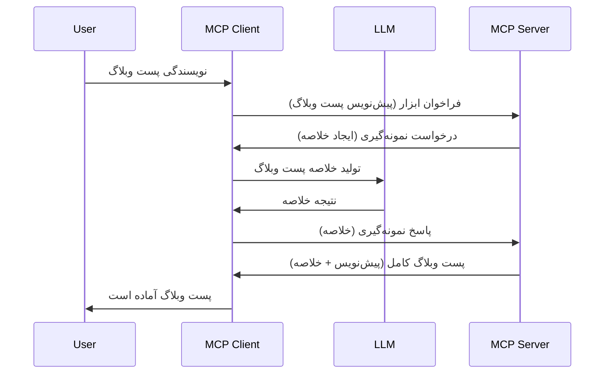

# نمونه‌گیری - واگذاری ویژگی‌ها به کلاینت

گاهی اوقات، شما نیاز دارید که کلاینت MCP و سرور MCP با هم همکاری کنند تا به یک هدف مشترک برسند. ممکن است شرایطی داشته باشید که سرور به کمک یک LLM که روی کلاینت قرار دارد نیاز داشته باشد. برای این موقعیت، نمونه‌گیری چیزی است که باید استفاده کنید.

بیایید چند مورد استفاده و چگونگی ساخت یک راه‌حل با نمونه‌گیری را بررسی کنیم.

## مرور کلی

در این درس، تمرکز ما بر توضیح زمان و مکان استفاده از نمونه‌گیری و چگونگی پیکربندی آن است.

## اهداف یادگیری

در این فصل، ما:

- توضیح می‌دهیم نمونه‌گیری چیست و چه زمانی باید از آن استفاده کرد.
- نحوه پیکربندی نمونه‌گیری در MCP را نشان می‌دهیم.
- مثال‌هایی از نمونه‌گیری در عمل ارائه می‌دهیم.

## نمونه‌گیری چیست و چرا از آن استفاده کنیم؟

نمونه‌گیری یک قابلیت پیشرفته است که به شیوه زیر کار می‌کند:


### درخواست نمونه‌گیری

خوب، اکنون یک دید کلی بلندبالا از یک سناریوی معتبر داریم، بیایید درباره درخواست نمونه‌گیری که سرور به کلاینت ارسال می‌کند صحبت کنیم. اینجا چیزی است که چنین درخواستی می‌تواند در قالب JSON-RPC شبیه باشد:

```json
{
  "jsonrpc": "2.0",
  "id": 1,
  "method": "sampling/createMessage",
  "params": {
    "messages": [
      {
        "role": "user",
        "content": {
          "type": "text",
          "text": "Create a blog post summary of the following blog post: <BLOG POST>"
        }
      }
    ],
    "modelPreferences": {
      "hints": [
        {
          "name": "claude-3-sonnet"
        }
      ],
      "intelligencePriority": 0.8,
      "speedPriority": 0.5
    },
    "systemPrompt": "You are a helpful assistant.",
    "maxTokens": 100
  }
}
```

اینجا چند نکته هست که ارزش اشاره دارد:

- Prompt، زیر content -> text، درخواست ما است که یک دستور برای LLM است تا محتوای پست وبلاگ را خلاصه کند.

- **modelPreferences**. این بخش فقط یک ترجیح است، توصیه‌ای برای چیستی پیکربندی که باید با LLM استفاده شود. کاربر می‌تواند انتخاب کند که این توصیه‌ها را قبول کند یا تغییرشان دهد. در این مورد توصیه‌هایی درباره مدل قابل استفاده و سرعت و اولویت هوشمندی وجود دارد.
- **systemPrompt**، این همان prompt سیستم معمولی شما است که شخصیت به LLM شما می‌دهد و شامل دستورالعمل‌های راهنمایی است.
- **maxTokens**، یک ویژگی دیگر است که می‌گوید چند توکن برای این کار پیشنهاد می‌شود استفاده شود.

### پاسخ نمونه‌گیری

این پاسخ همان چیزی است که کلاینت MCP در نهایت به سرور MCP ارسال می‌کند و نتیجه فراخوانی LLM توسط کلاینت، منتظر ماندن برای آن پاسخ و ساخت این پیام است. اینجا چیزی است که می‌تواند در JSON-RPC شبیه باشد:

```json
{
  "jsonrpc": "2.0",
  "id": 1,
  "result": {
    "role": "assistant",
    "content": {
      "type": "text",
      "text": "Here's your abstract <ABSTRACT>"
    },
    "model": "gpt-5",
    "stopReason": "endTurn"
  }
}
```

توجه کنید چگونه پاسخ همان خلاصه‌ای از پست وبلاگ است که درخواست کردیم. همچنین توجه کنید که مدل استفاده شده `model` همان چیزی نیست که ما خواسته بودیم بلکه "gpt-5" به جای "claude-3-sonnet" است. این برای نشان دادن این است که کاربر می‌تواند نظر خود را درباره اینکه از چه مدلی استفاده کند تغییر دهد و درخواست نمونه‌گیری شما صرفاً یک توصیه است.

خوب، اکنون که جریان اصلی را می‌فهمیم و کاربرد مفیدی برای آن "ایجاد پست وبلاگ + خلاصه" است، بیایید ببینیم برای اینکه این کار کند چه باید بکنیم.

### نوع پیام‌ها

پیام‌های نمونه‌گیری محدود به متن نیستند، بلکه همچنین می‌توانید تصاویر و صدا ارسال کنید. اینجا نحوه متفاوت بودن JSON-RPC را ببینید:

**متن**

```json
{
  "type": "text",
  "text": "The message content"
}
```

**محتوای تصویر**

```json
{
  "type": "image",
  "data": "base64-encoded-image-data",
  "mimeType": "image/jpeg"
}
```

**محتوای صوت**

```json
{
  "type": "audio",
  "data": "base64-encoded-audio-data",
  "mimeType": "audio/wav"
}
```

> NOTE: برای اطلاعات دقیق‌تر درباره نمونه‌گیری، مستندات [رسمی](https://modelcontextprotocol.io/specification/2025-06-18/client/sampling) را بررسی کنید.

## چگونه نمونه‌گیری را در کلاینت پیکربندی کنیم

> توجه: اگر فقط در حال ساخت یک سرور هستید، نیازی به انجام کار زیادی در اینجا نیست.

در یک کلاینت، باید ویژگی زیر را به این شکل مشخص کنید:

```json
{
  "capabilities": {
    "sampling": {}
  }
}
```

سپس این هنگام مقداردهی اولیه کلاینت انتخابی شما با سرور گرفته خواهد شد.

## نمونه نمونه‌گیری در عمل - ایجاد یک پست وبلاگ

بیایید با هم یک سرور نمونه‌گیری کدنویسی کنیم، ما باید موارد زیر را انجام دهیم:

1. ایجاد یک ابزار در سرور.
1. آن ابزار باید یک درخواست نمونه‌گیری ایجاد کند.
1. ابزار باید منتظر پاسخ درخواست نمونه‌گیری کلاینت بماند.
1. سپس نتیجه ابزار باید تولید شود.

بیایید کد را گام به گام ببینیم:

### -1- ایجاد ابزار

**python**

```python
@mcp.tool()
async def create_blog(title: str, content: str, ctx: Context[ServerSession, None]) -> str:
    """Create a blog post and generate a summary"""

```

### -2- ایجاد درخواست نمونه‌گیری

ابزار خود را با کد زیر گسترش دهید:

**python**

```python
post = BlogPost(
        id=len(posts) + 1,
        title=title,
        content=content,
        abstract=""
    )

prompt = f"Create an abstract of the following blog post: title: {title} and draft: {content} "

result = await ctx.session.create_message(
        messages=[
            SamplingMessage(
                role="user",
                content=TextContent(type="text", text=prompt),
            )
        ],
        max_tokens=100,
)

```

### -3- منتظر پاسخ بمانید و پاسخ را بازگردانید

**python**

```python
post.abstract = result.content.text

posts.append(post)

# بازگشت محصول کامل
return json.dumps({
    "id": post.title,
    "abstract": post.abstract
})
```

### -4- کد کامل

**python**

```python
from starlette.applications import Starlette
from starlette.routing import Mount, Host

from mcp.server.fastmcp import Context, FastMCP

from mcp.server.session import ServerSession
from mcp.types import SamplingMessage, TextContent

import json


from uuid import uuid4
from typing import List
from pydantic import BaseModel


mcp = FastMCP("Blog post generator")

# اپ = فست‌ای‌پی‌آی()

posts = []

class BlogPost(BaseModel):
    id: int
    title: str
    content: str
    abstract: str

posts: List[BlogPost] = []

@mcp.tool()
async def create_blog(title: str, content: str, ctx: Context[ServerSession, None]) -> str:
    """Create a blog post and generate a summary"""

    post = BlogPost(
        id=len(posts) + 1,
        title=title,
        content=content,
        abstract=""
    )

    prompt = f"Create an abstract of the following blog post: title: {title} and draft: {content} "

    result = await ctx.session.create_message(
        messages=[
            SamplingMessage(
                role="user",
                content=TextContent(type="text", text=prompt),
            )
        ],
        max_tokens=100,
    )

    post.abstract = result.content.text

    posts.append(post)

    # پست کامل وبلاگ را بازگردان
    return json.dumps({
        "id": post.title,
        "abstract": post.abstract
    })

if __name__ == "__main__":
    print("Starting server...")
    # mcp.اجرا()
    mcp.run(transport="streamable-http")

# برنامه را اجرا کن با: python server.py
```

### -5- آزمایش آن در Visual Studio Code

برای آزمایش این در Visual Studio Code، مراحل زیر را انجام دهید:

1. سرور را در ترمینال راه‌اندازی کنید
1. آن را در *mcp.json* اضافه کنید (و اطمینان حاصل کنید که شروع شده است) مثلاً چیزی شبیه به این:

   ```json
   "servers": {
      "blog-server": {
        "type": "http",
        "url": "http://localhost:8000/mcp"
      }
   }
   ```

1. یک prompt تایپ کنید:

   ```text
   create a blog post named "Where Python comes from", the content is "Python is actually named after Monty Python Flying Circus"
   ```

1. اجازه دهید نمونه‌گیری رخ دهد. اولین باری که این را آزمایش می‌کنید، یک پنجره گفتگو اضافی به شما نمایش داده می‌شود که باید آن را تایید کنید، سپس پنجره گفتگوی معمولی برای درخواست اجرای ابزار نمایش داده خواهد شد.

1. نتایج را بررسی کنید. شما نتایج را هم به صورت زیبا در GitHub Copilot Chat خواهید دید و همچنین می‌توانید پاسخ خام JSON را بررسی کنید.

**امتیاز بیشتر**. ابزار Visual Studio Code پشتیبانی عالی برای نمونه‌گیری دارد. شما می‌توانید دسترسی به نمونه‌گیری روی سرور نصب شده خود را با رفتن به این بخش به صورت زیر پیکربندی کنید:

1. به بخش افزونه‌ها بروید.
1. آیکون چرخ‌دنده سرور نصب شده خود را در بخش "MCP SERVERS - INSTALLED" انتخاب کنید.
1 "Configure Model Access" را انتخاب کنید، اینجا می‌توانید انتخاب کنید که GitHub Copilot اجازه دارد چه مدل‌هایی را هنگام انجام نمونه‌گیری استفاده کند. همچنین می‌توانید همه درخواست‌های نمونه‌گیری اخیر را با انتخاب "Show Sampling requests" ببینید.

## تمرین

در این تمرین، شما یک نمونه‌گیری کمی متفاوت خواهید ساخت، یعنی یک یکپارچه‌سازی نمونه‌گیری که پشتیبانی از تولید توضیحات محصول دارد. اینجا سناریوی شما است:

**سناریو**: کارمند بخش پشتیبانی در یک فروشگاه اینترنتی به کمک نیاز دارد، تولید توضیحات محصول زمان زیادی می‌برد. بنابراین، شما باید راه‌حلی بسازید که بتوانید یک ابزار "create_product" را با پارامترهای "title" و "keywords" فراخوانی کنید و باید یک محصول کامل شامل فیلد "description" تولید شود که این فیلد باید توسط LLM کلاینت پر شود.

نکته: از آنچه قبلاً آموختید چگونه این سرور و ابزار آن را با استفاده از یک درخواست نمونه‌گیری بسازید استفاده کنید.

## راه‌حل

[راه‌حل](./solution/README.md)

## نکات کلیدی

نمونه‌گیری یک قابلیت قدرتمند است که به سرور امکان می‌دهد وظایف را به کلاینت تفویض کند زمانی که به کمک یک LLM نیاز دارد.

## مرحله بعد

- [فصل ۴ - پیاده‌سازی عملی](../../04-PracticalImplementation/README.md)

---

<!-- CO-OP TRANSLATOR DISCLAIMER START -->
**توضیح مهم**:  
این سند با استفاده از سرویس ترجمه مبتنی بر هوش مصنوعی [Co-op Translator](https://github.com/Azure/co-op-translator) ترجمه شده است. در حالی که ما در تلاش برای دقت هستیم، لطفاً آگاه باشید که ترجمه‌های خودکار ممکن است حاوی اشتباهات یا نادرستی‌هایی باشند. سند اصلی به زبان مبدا باید به عنوان منبع معتبر در نظر گرفته شود. برای اطلاعات حیاتی، استفاده از ترجمه حرفه‌ای انسانی توصیه می‌شود. ما مسئول هیچ گونه سوءتفاهم یا برداشت نادرست ناشی از استفاده از این ترجمه نیستیم.
<!-- CO-OP TRANSLATOR DISCLAIMER END -->