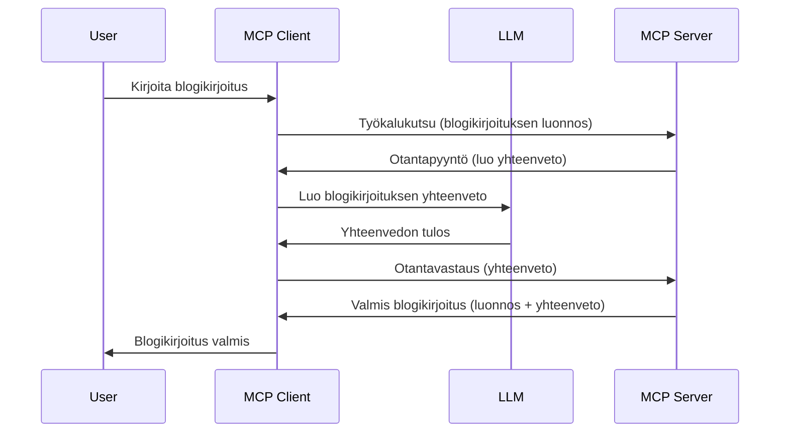

# Näyteottaminen - delegoi ominaisuudet asiakkaalle

Joskus MCP-asiakas ja MCP-palvelin tarvitsevat yhteistyötä yhteisen tavoitteen saavuttamiseksi. Saatat kohdata tilanteen, jossa palvelin tarvitsee apua asiakkaalla sijaitsevalta LLM:ltä. Tällöin näyteottaminen on käytettävä menetelmä.

Tutkitaan muutamia käyttötapauksia ja miten rakentaa ratkaisu, joka sisältää näyteottamisen.

## Yleiskatsaus

Tässä oppitunnissa keskitymme selittämään, milloin ja missä käyttää näyteottamista ja miten se konfiguroidaan.

## Oppimistavoitteet

Tässä luvussa:

- Selitämme, mitä näyteottaminen on ja milloin sitä käytetään.
- Näytämme, miten näyteottaminen konfiguroidaan MCP:ssä.
- Tarjoamme esimerkkejä näyteottamisesta käytännössä.

## Mitä näyteottaminen on ja miksi sitä käytetään?

Näyteottaminen on kehittynyt ominaisuus, joka toimii seuraavasti:


### Näyteottopyyntö

Hyvä, nyt kun meillä on korkean tason ymmärrys uskottavasta tilanteesta, puhutaan palvelimen lähettämästä näyteottopyynnöstä asiakkaalle. Tässä esimerkki tällaisesta pyynnöstä JSON-RPC-muodossa:

```json
{
  "jsonrpc": "2.0",
  "id": 1,
  "method": "sampling/createMessage",
  "params": {
    "messages": [
      {
        "role": "user",
        "content": {
          "type": "text",
          "text": "Create a blog post summary of the following blog post: <BLOG POST>"
        }
      }
    ],
    "modelPreferences": {
      "hints": [
        {
          "name": "claude-3-sonnet"
        }
      ],
      "intelligencePriority": 0.8,
      "speedPriority": 0.5
    },
    "systemPrompt": "You are a helpful assistant.",
    "maxTokens": 100
  }
}
```

On muutamia asioita, joita kannattaa nostaa esiin:

- Kehote, content -> text -kentässä, on kehote, joka on ohje LLM:lle tiivistää blogikirjoituksen sisältö.

- **modelPreferences**. Tämä osio on juuri sitä, suosimus tai suositus, millaista kokoonpanoa LLM:n kanssa kannattaa käyttää. Käyttäjä voi päättää, seuraako hän näitä suosituksia vai muuttaako niitä. Tässä tapauksessa on suosituksia mallin valinnasta sekä nopeuden ja älykkyyden priorisoinnista.
- **systemPrompt**, tämä on normaali järjestelmäkehote, joka antaa LLM:lle persoonallisuuden ja sisältää ohjeistuksia.
- **maxTokens**, tämä on toinen ominaisuus, joka määrittää suositellun token-määrän tälle tehtävälle.

### Näyteottovastaus

Tämä vastaus on se, minkä MCP-asiakas lopulta lähettää takaisin MCP-palvelimelle ja se on seuraus siitä, että asiakas kutsuu LLM:ää, odottaa vastausta ja rakentaa tämän viestin. Tässä esimerkki JSON-RPC-muodossa:

```json
{
  "jsonrpc": "2.0",
  "id": 1,
  "result": {
    "role": "assistant",
    "content": {
      "type": "text",
      "text": "Here's your abstract <ABSTRACT>"
    },
    "model": "gpt-5",
    "stopReason": "endTurn"
  }
}
```

Huomaa, miten vastaus on tiivistelmä blogikirjoituksesta aivan kuten pyysimme. Huomaa myös, että käytetty `model` ei ole se, mitä pyysimme vaan "gpt-5" "claude-3-sonnetin" sijaan. Tämä havainnollistaa, että käyttäjä voi muuttaa mielensä siitä, mitä käyttää, ja että näyteottopyyntösi on suositus.

Ok, nyt kun ymmärrämme pääprosessin ja hyödyllisen tehtävän käyttää sitä "blogikirjoituksen luominen + tiivistelmä", katsotaan mitä pitää tehdä, jotta se toimii.

### Viestityypit

Näyteottoviestit eivät rajoitu pelkkään tekstiin vaan voit myös lähettää kuvia ja ääntä. Tässä miten JSON-RPC eroaa:

**Teksti**

```json
{
  "type": "text",
  "text": "The message content"
}
```

**Kuvasisältö**

```json
{
  "type": "image",
  "data": "base64-encoded-image-data",
  "mimeType": "image/jpeg"
}
```

**Äänisisältö**

```json
{
  "type": "audio",
  "data": "base64-encoded-audio-data",
  "mimeType": "audio/wav"
}
```

> HUOM: tarkempaa tietoa näyteottamisesta löydät [virallisista dokumenteista](https://modelcontextprotocol.io/specification/2025-06-18/client/sampling)

## Näyteottamisen konfigurointi asiakkaalla

> Huom: jos rakennat vain palvelinta, sinun ei tarvitse tehdä juuri mitään tässä.

Asiakkaalla sinun tulee määritellä ominaisuus seuraavasti:

```json
{
  "capabilities": {
    "sampling": {}
  }
}
```

Tämä otetaan käyttöön, kun valittu asiakas käynnistyy palvelimen kanssa.

## Esimerkki näyteottamisesta käytännössä - Luo blogikirjoitus

Koodaamme yhdessä näyteottamisen palvelimen, meidän täytyy tehdä seuraavaa:

1. Luo työkalu palvelimelle.
2. Työkalun tulee luoda näyteottopyyntö.
3. Työkalun tulee odottaa asiakkaan näyteottopyynnön vastausta.
4. Tämän jälkeen tuotetaan työkalun tulos.

Katsotaan koodia vaihe vaiheelta:

### -1- Luo työkalu

**python**

```python
@mcp.tool()
async def create_blog(title: str, content: str, ctx: Context[ServerSession, None]) -> str:
    """Create a blog post and generate a summary"""

```

### -2- Luo näyteottopyyntö

Laajenna työkalua seuraavalla koodilla:

**python**

```python
post = BlogPost(
        id=len(posts) + 1,
        title=title,
        content=content,
        abstract=""
    )

prompt = f"Create an abstract of the following blog post: title: {title} and draft: {content} "

result = await ctx.session.create_message(
        messages=[
            SamplingMessage(
                role="user",
                content=TextContent(type="text", text=prompt),
            )
        ],
        max_tokens=100,
)

```

### -3- Odota vastausta ja palauta vastaus

**python**

```python
post.abstract = result.content.text

posts.append(post)

# palauta koko tuote
return json.dumps({
    "id": post.title,
    "abstract": post.abstract
})
```

### -4- Koko koodi

**python**

```python
from starlette.applications import Starlette
from starlette.routing import Mount, Host

from mcp.server.fastmcp import Context, FastMCP

from mcp.server.session import ServerSession
from mcp.types import SamplingMessage, TextContent

import json


from uuid import uuid4
from typing import List
from pydantic import BaseModel


mcp = FastMCP("Blog post generator")

# app = FastAPI()

posts = []

class BlogPost(BaseModel):
    id: int
    title: str
    content: str
    abstract: str

posts: List[BlogPost] = []

@mcp.tool()
async def create_blog(title: str, content: str, ctx: Context[ServerSession, None]) -> str:
    """Create a blog post and generate a summary"""

    post = BlogPost(
        id=len(posts) + 1,
        title=title,
        content=content,
        abstract=""
    )

    prompt = f"Create an abstract of the following blog post: title: {title} and draft: {content} "

    result = await ctx.session.create_message(
        messages=[
            SamplingMessage(
                role="user",
                content=TextContent(type="text", text=prompt),
            )
        ],
        max_tokens=100,
    )

    post.abstract = result.content.text

    posts.append(post)

    # palauta koko blogikirjoitus
    return json.dumps({
        "id": post.title,
        "abstract": post.abstract
    })

if __name__ == "__main__":
    print("Starting server...")
    # mcp.run()
    mcp.run(transport="streamable-http")

# käynnistä sovellus komennolla: python server.py
```

### -5- Testaa Visual Studio Codessa

Testataksesi tätä Visual Studio Codessa, toimi näin:

1. Käynnistä palvelin terminaalissa
2. Lisää se *mcp.json*-tiedostoon (ja varmista, että se on käynnissä) esimerkiksi näin:

   ```json
   "servers": {
      "blog-server": {
        "type": "http",
        "url": "http://localhost:8000/mcp"
      }
   }
   ```

3. Kirjoita kehote:

   ```text
   create a blog post named "Where Python comes from", the content is "Python is actually named after Monty Python Flying Circus"
   ```

4. Salli näyteottaminen tapahtua. Ensimmäisellä testikerralla sinulle avautuu lisävalinta, joka tulee hyväksyä, sitten näet normaalin työkalun käynnistämistä pyytävän valintaikkunan.

5. Tarkastele tuloksia. Näet tulokset siististi renderöityinä GitHub Copilot Chatissa, mutta voit myös tarkastella raakaa JSON-vastausta.

**Bonuksena**. Visual Studio Coden työkalut tukevat erinomaisti näyteottamista. Voit konfiguroida näyteottamisen pääsyn asennetulla palvelimellasi seuraavasti:

1. Siirry laajennusosioon.
2. Valitse asennetun palvelimen rataskuvake "MCP SERVERS - INSTALLED" -osiossa.
3. Valitse "Configure Model Access", täältä voit valita, mitä malleja GitHub Copilot saa käyttää näyteottamisen aikana. Voit myös nähdä kaikki viimeaikaiset näyteottopyynnöt valitsemalla "Show Sampling requests".

## Tehtävä

Tässä tehtävässä rakennat hieman erilaisen näyteottamisen, nimittäin näyteottamisen integraation, joka tukee tuotteen kuvauksen luomista. Tässä skenaario:

**Skenaario**: Verkkokaupan back office -työntekijä tarvitsee apua, tuotetekstien luominen vie liikaa aikaa. Sinun tehtäväsi on rakentaa ratkaisu, jossa voit kutsua työkalua "create_product" argumenteilla "title" ja "keywords", ja sen tulee tuottaa täydellinen tuote, joka sisältää "description" -kentän, jonka on täytettävä asiakkaan LLM.

VINKKI: käytä aiemmin opittua miten rakentaa tämä palvelin ja sen työkalu näyteottopyynnön avulla.

## Ratkaisu

[Ratkaisu](./solution/README.md)

## Keskeiset opit

Näyteottaminen on voimakas ominaisuus, joka sallii palvelimen delegoida tehtäviä asiakkaalle, kun se tarvitsee LLM:n apua.

## Mitä seuraavaksi

- [Luku 4 - Käytännön toteutus](../../04-PracticalImplementation/README.md)

---

<!-- CO-OP TRANSLATOR DISCLAIMER START -->
**Vastuuvapauslauseke**:
Tämä asiakirja on käännetty tekoälykäännöspalvelulla [Co-op Translator](https://github.com/Azure/co-op-translator). Pyrimme tarkkuuteen, mutta ole hyvä ja huomioi, että automaattiset käännökset saattavat sisältää virheitä tai epätarkkuuksia. Alkuperäinen asiakirja omalla kielellään tulee pitää auktoritatiivisena lähteenä. Tärkeiden tietojen osalta suositellaan ammattimaista ihmiskäännöstä. Emme ole vastuussa tämän käännöksen käytöstä aiheutuvista väärinkäsityksistä tai virhetulkinnoista.
<!-- CO-OP TRANSLATOR DISCLAIMER END -->