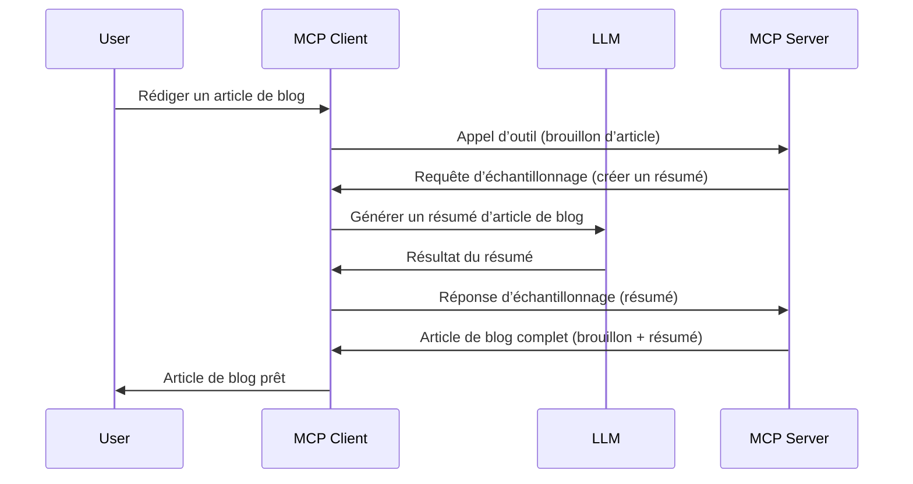

# Échantillonnage - déléguer des fonctionnalités au Client

Parfois, vous avez besoin que le Client MCP et le Serveur MCP collaborent pour atteindre un objectif commun. Il se peut que le Serveur requière l’aide d’un LLM qui se trouve sur le client. Pour cette situation, l’échantillonnage est ce que vous devez utiliser.

Explorons quelques cas d’utilisation et comment construire une solution impliquant l’échantillonnage.

## Vue d'ensemble

Dans cette leçon, nous nous concentrons sur l’explication de quand et où utiliser l’échantillonnage et comment le configurer.

## Objectifs d’apprentissage

Dans ce chapitre, nous allons :

- Expliquer ce qu’est l’échantillonnage et quand l’utiliser.
- Montrer comment configurer l’échantillonnage dans MCP.
- Fournir des exemples d’échantillonnage en action.

## Qu'est-ce que l’échantillonnage et pourquoi l’utiliser ?

L’échantillonnage est une fonctionnalité avancée qui fonctionne de la façon suivante :


### Requête d’échantillonnage

D’accord, maintenant que nous avons une vue d’ensemble crédible d’un scénario, parlons de la requête d’échantillonnage que le serveur renvoie au client. Voici à quoi cette requête peut ressembler au format JSON-RPC :

```json
{
  "jsonrpc": "2.0",
  "id": 1,
  "method": "sampling/createMessage",
  "params": {
    "messages": [
      {
        "role": "user",
        "content": {
          "type": "text",
          "text": "Create a blog post summary of the following blog post: <BLOG POST>"
        }
      }
    ],
    "modelPreferences": {
      "hints": [
        {
          "name": "claude-3-sonnet"
        }
      ],
      "intelligencePriority": 0.8,
      "speedPriority": 0.5
    },
    "systemPrompt": "You are a helpful assistant.",
    "maxTokens": 100
  }
}
```

Il y a quelques points à souligner ici :

- Prompt, sous content -> text, est notre invite qui est une instruction pour le LLM afin de résumer le contenu d’un article de blog.

- **modelPreferences**. Cette section est justement cela, une préférence, une recommandation sur la configuration à utiliser avec le LLM. L’utilisateur peut choisir de suivre ces recommandations ou de les modifier. Dans ce cas, il y a des recommandations sur le modèle à utiliser et la priorité vitesse et intelligence.
- **systemPrompt**, c’est votre invite système normale qui donne à votre LLM une personnalité et contient des instructions de guidage.
- **maxTokens**, c’est une autre propriété qui indique combien de tokens il est recommandé d’utiliser pour cette tâche.

### Réponse d’échantillonnage

Cette réponse est ce que le Client MCP finit par renvoyer au Serveur MCP et est le résultat de l’appel du client au LLM, attend cette réponse puis construit ce message. Voici à quoi cela peut ressembler au format JSON-RPC :

```json
{
  "jsonrpc": "2.0",
  "id": 1,
  "result": {
    "role": "assistant",
    "content": {
      "type": "text",
      "text": "Here's your abstract <ABSTRACT>"
    },
    "model": "gpt-5",
    "stopReason": "endTurn"
  }
}
```

Notez comment la réponse est un résumé de l’article de blog, exactement comme nous l’avons demandé. Notez aussi que le `model` utilisé n’est pas celui que nous avions demandé mais "gpt-5" au lieu de "claude-3-sonnet". Cela illustre que l’utilisateur peut changer d’avis sur ce qu’il souhaite utiliser et que votre requête d’échantillonnage est une recommandation.

D’accord, maintenant que nous comprenons le flux principal, et une tâche utile pour l’utiliser « création d’article de blog + résumé », voyons ce que nous devons faire pour que cela fonctionne.

### Types de messages

Les messages d’échantillonnage ne sont pas limités au texte mais vous pouvez aussi envoyer des images et de l’audio. Voici comment le JSON-RPC est différent :

**Texte**

```json
{
  "type": "text",
  "text": "The message content"
}
```

**Contenu image**

```json
{
  "type": "image",
  "data": "base64-encoded-image-data",
  "mimeType": "image/jpeg"
}
```

**Contenu audio**

```json
{
  "type": "audio",
  "data": "base64-encoded-audio-data",
  "mimeType": "audio/wav"
}
```

> NOTE : pour des informations plus détaillées sur l’échantillonnage, consultez la [documentation officielle](https://modelcontextprotocol.io/specification/2025-06-18/client/sampling)

## Comment configurer l’échantillonnage dans le Client

> Note : si vous ne construisez qu’un serveur, vous n’avez pas grand-chose à faire ici.

Dans un client, vous devez spécifier la fonctionnalité comme suit :

```json
{
  "capabilities": {
    "sampling": {}
  }
}
```

Cela sera alors pris en compte lors de l’initialisation de votre client choisi avec le serveur.

## Exemple d’échantillonnage en action - Créer un article de blog

Codons ensemble un serveur d’échantillonnage, nous devrons faire les choses suivantes :

1. Créer un outil sur le Serveur.
1. Cet outil doit créer une requête d’échantillonnage.
1. L’outil doit attendre la réponse à la requête d’échantillonnage du client.
1. Puis le résultat de l’outil doit être produit.

Voyons le code étape par étape :

### -1- Créer l’outil

**python**

```python
@mcp.tool()
async def create_blog(title: str, content: str, ctx: Context[ServerSession, None]) -> str:
    """Create a blog post and generate a summary"""

```

### -2- Créer une requête d’échantillonnage

Étendez votre outil avec le code suivant :

**python**

```python
post = BlogPost(
        id=len(posts) + 1,
        title=title,
        content=content,
        abstract=""
    )

prompt = f"Create an abstract of the following blog post: title: {title} and draft: {content} "

result = await ctx.session.create_message(
        messages=[
            SamplingMessage(
                role="user",
                content=TextContent(type="text", text=prompt),
            )
        ],
        max_tokens=100,
)

```

### -3- Attendre la réponse et retourner la réponse

**python**

```python
post.abstract = result.content.text

posts.append(post)

# renvoyer le produit complet
return json.dumps({
    "id": post.title,
    "abstract": post.abstract
})
```

### -4- Code complet

**python**

```python
from starlette.applications import Starlette
from starlette.routing import Mount, Host

from mcp.server.fastmcp import Context, FastMCP

from mcp.server.session import ServerSession
from mcp.types import SamplingMessage, TextContent

import json


from uuid import uuid4
from typing import List
from pydantic import BaseModel


mcp = FastMCP("Blog post generator")

# app = FastAPI()

posts = []

class BlogPost(BaseModel):
    id: int
    title: str
    content: str
    abstract: str

posts: List[BlogPost] = []

@mcp.tool()
async def create_blog(title: str, content: str, ctx: Context[ServerSession, None]) -> str:
    """Create a blog post and generate a summary"""

    post = BlogPost(
        id=len(posts) + 1,
        title=title,
        content=content,
        abstract=""
    )

    prompt = f"Create an abstract of the following blog post: title: {title} and draft: {content} "

    result = await ctx.session.create_message(
        messages=[
            SamplingMessage(
                role="user",
                content=TextContent(type="text", text=prompt),
            )
        ],
        max_tokens=100,
    )

    post.abstract = result.content.text

    posts.append(post)

    # retourner le billet de blog complet
    return json.dumps({
        "id": post.title,
        "abstract": post.abstract
    })

if __name__ == "__main__":
    print("Starting server...")
    # mcp.run()
    mcp.run(transport="streamable-http")

# exécuter l'application avec : python server.py
```

### -5- Le tester dans Visual Studio Code

Pour tester cela dans Visual Studio Code, faites comme suit :

1. Démarrez le serveur dans le terminal
1. Ajoutez-le dans *mcp.json* (et assurez-vous qu’il est démarré) par exemple comme ceci :

   ```json
   "servers": {
      "blog-server": {
        "type": "http",
        "url": "http://localhost:8000/mcp"
      }
   }
   ```

1. Tapez une invite :

   ```text
   create a blog post named "Where Python comes from", the content is "Python is actually named after Monty Python Flying Circus"
   ```

1. Laissez l’échantillonnage se faire. La première fois que vous testez cela, un dialogue supplémentaire apparaîtra que vous devrez accepter, puis vous verrez le dialogue normal pour vous demander d’exécuter un outil.

1. Inspectez les résultats. Vous verrez les résultats joliment rendus dans GitHub Copilot Chat mais vous pouvez aussi inspecter la réponse JSON brute.

**Bonus**. Les outils de Visual Studio Code ont un excellent support pour l’échantillonnage. Vous pouvez configurer l’accès à l’échantillonnage sur votre serveur installé en naviguant ainsi :

1. Naviguez vers la section des extensions.
1. Sélectionnez l’icône engrenage pour votre serveur installé dans la section "MCP SERVERS - INSTALLED".
1. Sélectionnez « Configurer l’accès au modèle », ici vous pouvez choisir quels modèles GitHub Copilot est autorisé à utiliser lors de l’échantillonnage. Vous pouvez aussi voir toutes les requêtes d’échantillonnage récentes en sélectionnant « Afficher les requêtes d’échantillonnage ».

## Exercice

Dans cet exercice, vous allez construire un échantillonnage légèrement différent, à savoir une intégration d’échantillonnage qui prend en charge la génération d’une description de produit. Voici votre scénario :

**Scénario** : L’employé du back office d’un e-commerce a besoin d’aide, cela prend trop de temps pour générer des descriptions de produits. Par conséquent, vous devez construire une solution où vous pouvez appeler un outil "create_product" avec "title" et "keywords" en arguments et il doit produire un produit complet incluant un champ "description" qui sera rempli par un LLM du client.

ASTUCE : utilisez ce que vous avez appris précédemment pour construire ce serveur et son outil en utilisant une requête d’échantillonnage.

## Solution

[Solution](./solution/README.md)

## Points clés à retenir

L’échantillonnage est une fonctionnalité puissante qui permet au serveur de déléguer des tâches au client lorsqu’il a besoin de l’aide d’un LLM.

## Quelle est la suite ?

- [Chapitre 4 - Mise en œuvre pratique](../../04-PracticalImplementation/README.md)

---

<!-- CO-OP TRANSLATOR DISCLAIMER START -->
**Avertissement** :
Ce document a été traduit à l’aide du service de traduction automatique [Co-op Translator](https://github.com/Azure/co-op-translator). Bien que nous nous efforcions d’assurer l’exactitude, veuillez noter que les traductions automatisées peuvent contenir des erreurs ou des inexactitudes. Le document original dans sa langue d’origine doit être considéré comme la source faisant autorité. Pour les informations critiques, une traduction professionnelle réalisée par un humain est recommandée. Nous ne sommes pas responsables des malentendus ou des mauvaises interprétations résultant de l’utilisation de cette traduction.
<!-- CO-OP TRANSLATOR DISCLAIMER END -->