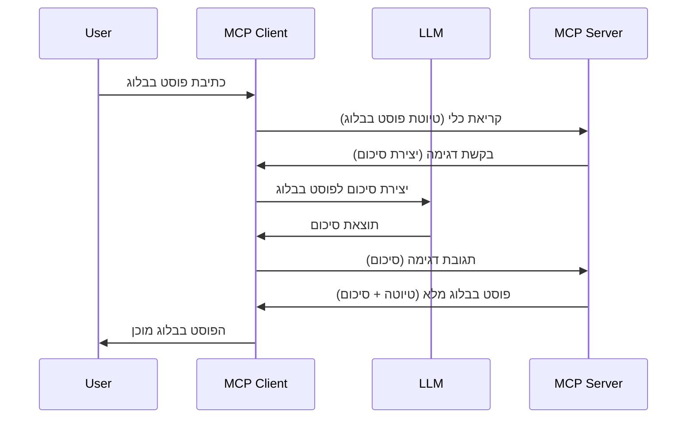

# דגימה - הסמכת תכונות ללקוח

לפעמים, יש צורך שהלקוח MCP והשרת MCP ישתפו פעולה כדי להשיג מטרה משותפת. ייתכן ויש לך מקרה שבו השרת זקוק לעזרת LLM שנמצא בצד הלקוח. למצב זה, דגימה היא מה שעליך להשתמש בו.

בואו נחקור כמה מקרים של שימוש ואיך לבנות פתרון שכולל דגימה.

## סקירה כללית

בפרק זה נתמקד בהסבר מתי והיכן להשתמש בדגימה ואיך להגדיר אותה.

## יעדי למידה

בפרק זה נעשה את הדברים הבאים:

- נסביר מהי דגימה ומתי להשתמש בה.
- נציג כיצד להגדיר דגימה ב-MCP.
- נספק דוגמאות לשימוש בדגימה בפועל.

## מהי דגימה ומדוע להשתמש בה?

דגימה היא תכונה מתקדמת שפועלת באופן הבא:


### בקשת דגימה

טוב, עכשיו שיש לנו תמונת מצב רחבה וסבירה, בוא נדבר על בקשת הדגימה שהשרת שולח חזרה ללקוח. זה יכול להיראות כך בפורמט JSON-RPC:

```json
{
  "jsonrpc": "2.0",
  "id": 1,
  "method": "sampling/createMessage",
  "params": {
    "messages": [
      {
        "role": "user",
        "content": {
          "type": "text",
          "text": "Create a blog post summary of the following blog post: <BLOG POST>"
        }
      }
    ],
    "modelPreferences": {
      "hints": [
        {
          "name": "claude-3-sonnet"
        }
      ],
      "intelligencePriority": 0.8,
      "speedPriority": 0.5
    },
    "systemPrompt": "You are a helpful assistant.",
    "maxTokens": 100
  }
}
```

יש כאן כמה דברים שכדאי לציין:

- Prompt, תחת content -> text, הוא הפקודה שלנו שהיא הנחיה ל-LLM לסכם את תוכן פוסט הבלוג.

- **modelPreferences**. החלק הזה הוא פשוט העדפה, המלצה על איזו תצורה להשתמש עם ה-LLM. המשתמש יכול לבחור אם ללכת לפי ההמלצות האלו או לשנות אותן. במקרה זה יש המלצות על הדגם לשימוש ועל מהירות וקדימות אינטיליגנציה.
- **systemPrompt**, זה הפיקוד המערכת הרגיל שלך שנותן ל-LLM שלך אישיות ומכיל הוראות הנחיה.
- **maxTokens**, זו מאפיין נוסף שמשמש לציון כמה טוקנים מומלץ להשתמש במשימה זו.

### תגובת דגימה

תגובה זו היא מה שהלקוח MCP שולח חזרה לשרת MCP והיא תוצאה של קריאת ה-LLM מהלקוח, המתנה לתגובה ואז בניית ההודעה הזו. כך זה יכול להיראות ב-JSON-RPC:

```json
{
  "jsonrpc": "2.0",
  "id": 1,
  "result": {
    "role": "assistant",
    "content": {
      "type": "text",
      "text": "Here's your abstract <ABSTRACT>"
    },
    "model": "gpt-5",
    "stopReason": "endTurn"
  }
}
```

שים לב שהתשובה היא תקציר של פוסט הבלוג כפי שביקשנו. שים לב גם שהמודל `model` ששימש אינו זה שביקשנו אלא "gpt-5" במקום "claude-3-sonnet". זה להמחיש שהמשתמש יכול לשנות דעתו לגבי מה שיש להשתמש בו ושהבקשת הדגימה שלך היא המלצה.

טוב, עכשיו כשאנחנו מבינים את הזרימה הראשית, ומשימה שימושית להשתמש בה עבור "יצירת פוסט בלוג + תקציר", בוא נראה מה צריך לעשות כדי להפעיל את זה.

### סוגי הודעות

הודעות דגימה אינן מוגבלות רק לטקסט אך אפשר גם לשלוח תמונות וקול. כך נראית ה-JSON-RPC שלהם:

**טקסט**

```json
{
  "type": "text",
  "text": "The message content"
}
```

**תוכן תמונה**

```json
{
  "type": "image",
  "data": "base64-encoded-image-data",
  "mimeType": "image/jpeg"
}
```

**תוכן שמע**

```json
{
  "type": "audio",
  "data": "base64-encoded-audio-data",
  "mimeType": "audio/wav"
}
```

> הערה: לפרטים נוספים על דגימה, עיין ב-[התיעוד הרשמי](https://modelcontextprotocol.io/specification/2025-06-18/client/sampling)

## כיצד להגדיר דגימה בלקוח

> הערה: אם אתה רק בונה שרת, אינך צריך לעשות הרבה כאן.

בלקוח, יש לציין את התכונה הבאה כך:

```json
{
  "capabilities": {
    "sampling": {}
  }
}
```

זה ייאסף כאשר הלקוח שבחרת מאותחל עם השרת.

## דוגמה לדגימה בפעולה - יצירת פוסט בלוג

בוא נכתוב יחד שרת דגימה, נצטרך לעשות את הדברים הבאים:

1. יצירת כלי על השרת.
1. כלי זה צריך ליצור בקשת דגימה.
1. הכלי צריך להמתין לתשובת הדגימה של הלקוחות.
1. אז התוצאה של הכלי צריכה להתקבל.

בוא נראה את הקוד שלב אחר שלב:

### -1- יצירת הכלי

**python**

```python
@mcp.tool()
async def create_blog(title: str, content: str, ctx: Context[ServerSession, None]) -> str:
    """Create a blog post and generate a summary"""

```

### -2- יצירת בקשת דגימה

הרחב את הכלי שלך באמצעות הקוד הבא:

**python**

```python
post = BlogPost(
        id=len(posts) + 1,
        title=title,
        content=content,
        abstract=""
    )

prompt = f"Create an abstract of the following blog post: title: {title} and draft: {content} "

result = await ctx.session.create_message(
        messages=[
            SamplingMessage(
                role="user",
                content=TextContent(type="text", text=prompt),
            )
        ],
        max_tokens=100,
)

```

### -3- המתן לתגובה וחזיר את התגובה

**python**

```python
post.abstract = result.content.text

posts.append(post)

# החזר את המוצר המלא
return json.dumps({
    "id": post.title,
    "abstract": post.abstract
})
```

### -4- הקוד המלא

**python**

```python
from starlette.applications import Starlette
from starlette.routing import Mount, Host

from mcp.server.fastmcp import Context, FastMCP

from mcp.server.session import ServerSession
from mcp.types import SamplingMessage, TextContent

import json


from uuid import uuid4
from typing import List
from pydantic import BaseModel


mcp = FastMCP("Blog post generator")

# אפליקציה = FastAPI()

posts = []

class BlogPost(BaseModel):
    id: int
    title: str
    content: str
    abstract: str

posts: List[BlogPost] = []

@mcp.tool()
async def create_blog(title: str, content: str, ctx: Context[ServerSession, None]) -> str:
    """Create a blog post and generate a summary"""

    post = BlogPost(
        id=len(posts) + 1,
        title=title,
        content=content,
        abstract=""
    )

    prompt = f"Create an abstract of the following blog post: title: {title} and draft: {content} "

    result = await ctx.session.create_message(
        messages=[
            SamplingMessage(
                role="user",
                content=TextContent(type="text", text=prompt),
            )
        ],
        max_tokens=100,
    )

    post.abstract = result.content.text

    posts.append(post)

    # החזר את הפוסט המלא בבלוג
    return json.dumps({
        "id": post.title,
        "abstract": post.abstract
    })

if __name__ == "__main__":
    print("Starting server...")
    # mcp.הרץ()
    mcp.run(transport="streamable-http")

# הפעל את האפליקציה עם: python server.py
```

### -5- בדיקה ב-Visual Studio Code

כדי לבדוק זאת ב-Visual Studio Code, בצע את הפעולות הבאות:

1. הפעל את השרת בטרמינל
1. הוסף אותו ל-*mcp.json* (וודא שהוא מופעל), למשל כך:

   ```json
   "servers": {
      "blog-server": {
        "type": "http",
        "url": "http://localhost:8000/mcp"
      }
   }
   ```

1. הקלד פקודה:

   ```text
   create a blog post named "Where Python comes from", the content is "Python is actually named after Monty Python Flying Circus"
   ```

1. אפשר לדגימה להתרחש. בפעם הראשונה שתבדוק זאת יוצג לך דיאלוג נוסף שעליך לאשר, ואז תראה את הדיאלוג הרגיל שמבקש להריץ כלי

1. בדוק את התוצאות. תראה את התוצאות מוצגות יפה ב-GitHub Copilot Chat אך גם תוכל לבדוק את תגובת ה-JSON הגולמית.

**בונוס**. לכלי Visual Studio Code תמיכה מצוינת בדגימה. תוכל להגדיר גישה לדגימה על השרת שהתקנת כך:

1. עבור לסעיף התוספים.
1. לחץ על איקון ההגדרות של השרת שהתקנת בקטגוריית "MCP SERVERS - INSTALLED".
1. בחר ב"הגדרת גישה לדגם", כאן תוכל לבחור אילו דגמים GitHub Copilot מורשה להשתמש בהם בעת ביצוע דגימה. בנוסף תוכל לראות את כל בקשות הדגימה שהתרחשו לאחרונה על ידי בחירה ב"הצג בקשות דגימה".

## משימה

במשימה זו תבנה דגימת אינטגרציה שונה במקצת התומכת ביצירת תיאור מוצר. הנה התרחיש שלך:

**תרחיש**: עובד במשרד האחורי של חנות מקוונת זקוק לעזרה, דורש זמן רב מדי ליצירת תיאורי מוצרים. לכן, עליך לבנות פתרון שבו ניתן לקרוא לכלי בשם "create_product" עם ארגומנטים "title" ו-"keywords" והוא יפיק מוצר שלם כולל שדה "description" שאמור להתמלא על ידי LLM של הלקוח.

טיפ: השתמש במה שלמדת קודם כיצד לבנות את השרת וכליו באמצעות בקשת דגימה.

## פתרון

[פתרון](./solution/README.md)

## נקודות מפתח

דגימה היא תכונה חזקה שמאפשרת לשרת להאציל מטלות ללקוח כשהוא זקוק לעזרת LLM.

## מה הלאה

- [פרק 4 - יישום מעשי](../../04-PracticalImplementation/README.md)

---

<!-- CO-OP TRANSLATOR DISCLAIMER START -->
**הודעת אי-אחריות**:
מסמך זה תורגם באמצעות שירות התרגום האוטומטי [Co-op Translator](https://github.com/Azure/co-op-translator). למרות שאנו שואפים לדיוק, יש לקחת בחשבון שתירגומים אוטומטיים עלולים להכיל שגיאות או אי-דיוקים. על המסמך המקורי בשפתו להיחשב כמקור המהימן. למידע קריטי מומלץ להשתמש בתרגום מקצועי של מתרגם אנושי. איננו נושאים באחריות לכל אי הבנה או פרשנות שגויה הנובעות מהשימוש בתרגום זה.
<!-- CO-OP TRANSLATOR DISCLAIMER END -->