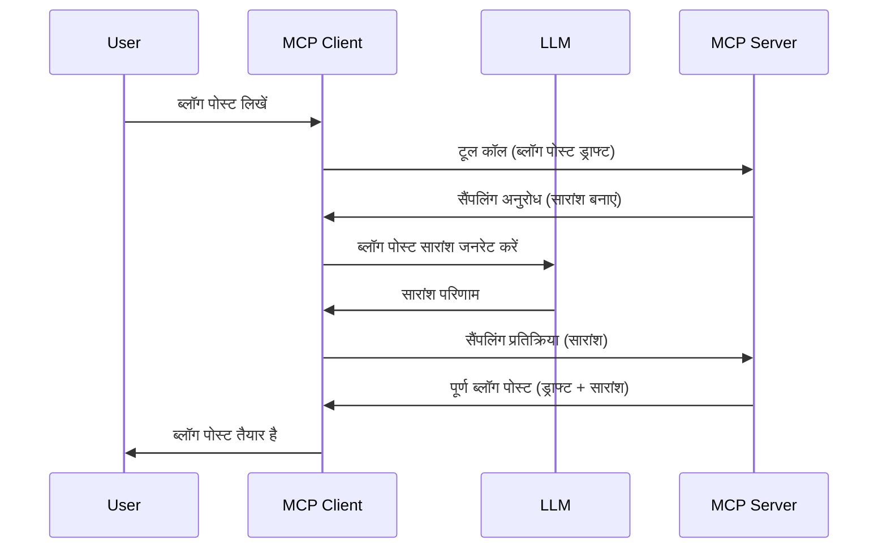

# सैंपलिंग - क्लाइंट को विशेषताएं सौंपना

कभी-कभी, आपको MCP क्लाइंट और MCP सर्वर को एक सामान्य उद्देश्य प्राप्त करने के लिए सहयोग करने की आवश्यकता होती है। आपके पास ऐसा मामला हो सकता है जहाँ सर्वर को उस LLM की सहायता चाहिए जो क्लाइंट पर बैठा हो। ऐसी स्थिति के लिए, सैंपलिंग का उपयोग करना चाहिए।

आइए कुछ उपयोग के मामलों का पता लगाएँ और सैंपलिंग शामिल करने वाले समाधान का निर्माण कैसे करें।

## अवलोकन

इस पाठ में, हम सैंपलिंग कब और कहाँ उपयोग करनी है यह समझाने पर ध्यान केंद्रित करेंगे और इसे कैसे कॉन्फ़िगर करें।

## सीखने के उद्देश्य

इस अध्याय में, हम:

- समझाएँगे कि सैंपलिंग क्या है और इसे कब उपयोग करें।
- MCP में सैंपलिंग को कैसे कॉन्फ़िगर करें दिखाएँगे।
- सैंपलिंग के क्रियान्वयन के उदाहरण प्रदान करेंगे।

## सैंपलिंग क्या है और इसे क्यों उपयोग करें?

सैंपलिंग एक उन्नत फीचर है जो निम्नलिखित तरीके से काम करता है:


### सैंपलिंग अनुरोध

ठीक है, अब हमारे पास एक विश्वसनीय परिदृश्य का ऊँचा दृष्टिकोण है, आइए उस सैंपलिंग अनुरोध की बात करें जिसे सर्वर क्लाइंट को वापस भेजता है। JSON-RPC प्रारूप में ऐसा अनुरोध इस प्रकार हो सकता है:

```json
{
  "jsonrpc": "2.0",
  "id": 1,
  "method": "sampling/createMessage",
  "params": {
    "messages": [
      {
        "role": "user",
        "content": {
          "type": "text",
          "text": "Create a blog post summary of the following blog post: <BLOG POST>"
        }
      }
    ],
    "modelPreferences": {
      "hints": [
        {
          "name": "claude-3-sonnet"
        }
      ],
      "intelligencePriority": 0.8,
      "speedPriority": 0.5
    },
    "systemPrompt": "You are a helpful assistant.",
    "maxTokens": 100
  }
}
```
  
यहाँ कुछ बातें ध्यान देने योग्य हैं:

- प्रॉम्प्ट, content -> text के अंतर्गत, हमारा प्रॉम्प्ट है जो LLM को ब्लॉग पोस्ट सामग्री का सारांश बनाने के लिए निर्देश है।

- **modelPreferences**। यह अनुभाग बस इतना है, एक प्राथमिकता, यह अनुशंसा करता है कि LLM के साथ कौन-कौन से कॉन्फ़िगरेशन का उपयोग किया जाए। उपयोगकर्ता यह चुन सकता है कि वे इन सिफारिशों का पालन करें या उन्हें बदलें। इस मामले में मॉडल के उपयोग, गति और बुद्धिमत्ता प्राथमिकता पर सिफारिशें हैं।  
- **systemPrompt**, यह आपका सामान्य सिस्टम प्रॉम्प्ट है जो आपके LLM को एक व्यक्तित्व प्रदान करता है और उसमें मार्गदर्शन निर्देश होते हैं।  
- **maxTokens**, यह एक और गुण है जिसका उपयोग यह बताने के लिए किया जाता है कि इस कार्य के लिए कितने टोकन उपयोग करने की सिफारिश की गई है।

### सैंपलिंग प्रतिक्रिया

यह प्रतिक्रिया वह है जो MCP क्लाइंट अंततः MCP सर्वर को वापस भेजता है, और यह क्लाइंट द्वारा LLM को कॉल करने, उसके जवाब का इंतजार करने, और फिर इस संदेश का निर्माण करने का परिणाम होता है। JSON-RPC में यह कुछ इस प्रकार दिख सकता है:

```json
{
  "jsonrpc": "2.0",
  "id": 1,
  "result": {
    "role": "assistant",
    "content": {
      "type": "text",
      "text": "Here's your abstract <ABSTRACT>"
    },
    "model": "gpt-5",
    "stopReason": "endTurn"
  }
}
```
  
ध्यान दें कि प्रतिक्रिया ब्लॉग पोस्ट का सार है जैसा हमने मांगा था। साथ ही ध्यान दें कि उपयोग किया गया `model` वह नहीं है जो हमने मांगा था, बल्कि "gpt-5" है "claude-3-sonnet" के बजाय। यह दिखाने के लिए है कि उपयोगकर्ता अपनी पसंद बदल सकता है और आपका सैंपलिंग अनुरोध सिर्फ एक सिफारिश है।

ठीक है, अब जबकि हम मुख्य प्रवाह और उपयोगी कार्य "ब्लॉग पोस्ट निर्माण + सारांश" से परिचित हैं, चलिए देखते हैं कि इसे काम में लाने के लिए हमें क्या करना होगा।

### संदेश प्रकार

सैंपलिंग संदेश केवल टेक्स्ट तक सीमित नहीं हैं बल्कि आप चित्र और ऑडियो भी भेज सकते हैं। JSON-RPC इस प्रकार अलग दिखता है:

**टेक्स्ट**

```json
{
  "type": "text",
  "text": "The message content"
}
```
  
**चित्र सामग्री**

```json
{
  "type": "image",
  "data": "base64-encoded-image-data",
  "mimeType": "image/jpeg"
}
```
  
**ऑडियो सामग्री**

```json
{
  "type": "audio",
  "data": "base64-encoded-audio-data",
  "mimeType": "audio/wav"
}
```
  
> NOTE: सैंपलिंग पर अधिक विस्तृत जानकारी के लिए, [आधिकारिक दस्तावेज़](https://modelcontextprotocol.io/specification/2025-06-18/client/sampling) देखें

## क्लाइंट में सैंपलिंग कैसे कॉन्फ़िगर करें

> नोट: यदि आप केवल सर्वर बना रहे हैं, तो यहाँ ज्यादा कुछ करने की ज़रूरत नहीं है।

क्लाइंट में, आपको निम्नलिखित फीचर को इस प्रकार निर्दिष्ट करना होगा:

```json
{
  "capabilities": {
    "sampling": {}
  }
}
```
  
यह तब आपके चुने हुए क्लाइंट द्वारा सर्वर के साथ प्रारंभ होने पर लिया जाएगा।

## सैंपलिंग का एक उदाहरण - ब्लॉग पोस्ट बनाना

आइए एक साथ सैंपलिंग सर्वर कोड करें, हमें निम्न करना होगा:

1. सर्वर पर एक टूल बनाएँ।  
1. यह टूल एक सैंपलिंग अनुरोध बनाए।  
1. टूल क्लाइंट के सैंपलिंग अनुरोध के उत्तर का इंतजार करे।  
1. फिर टूल का परिणाम उत्पन्न होना चाहिए।

आइए कोड का चरण दर चरण अवलोकन करें:

### -1- टूल बनाएँ

**python**

```python
@mcp.tool()
async def create_blog(title: str, content: str, ctx: Context[ServerSession, None]) -> str:
    """Create a blog post and generate a summary"""

```
  
### -2- सैंपलिंग अनुरोध बनाएँ

अपने टूल को निम्नलिखित कोड के साथ विस्तार करें:

**python**

```python
post = BlogPost(
        id=len(posts) + 1,
        title=title,
        content=content,
        abstract=""
    )

prompt = f"Create an abstract of the following blog post: title: {title} and draft: {content} "

result = await ctx.session.create_message(
        messages=[
            SamplingMessage(
                role="user",
                content=TextContent(type="text", text=prompt),
            )
        ],
        max_tokens=100,
)

```
  
### -3- जवाब का इंतजार करें और प्रतिक्रिया लौटाएँ

**python**

```python
post.abstract = result.content.text

posts.append(post)

# पूर्ण उत्पाद लौटाएं
return json.dumps({
    "id": post.title,
    "abstract": post.abstract
})
```
  
### -4- पूरा कोड

**python**

```python
from starlette.applications import Starlette
from starlette.routing import Mount, Host

from mcp.server.fastmcp import Context, FastMCP

from mcp.server.session import ServerSession
from mcp.types import SamplingMessage, TextContent

import json


from uuid import uuid4
from typing import List
from pydantic import BaseModel


mcp = FastMCP("Blog post generator")

# app = FastAPI()

posts = []

class BlogPost(BaseModel):
    id: int
    title: str
    content: str
    abstract: str

posts: List[BlogPost] = []

@mcp.tool()
async def create_blog(title: str, content: str, ctx: Context[ServerSession, None]) -> str:
    """Create a blog post and generate a summary"""

    post = BlogPost(
        id=len(posts) + 1,
        title=title,
        content=content,
        abstract=""
    )

    prompt = f"Create an abstract of the following blog post: title: {title} and draft: {content} "

    result = await ctx.session.create_message(
        messages=[
            SamplingMessage(
                role="user",
                content=TextContent(type="text", text=prompt),
            )
        ],
        max_tokens=100,
    )

    post.abstract = result.content.text

    posts.append(post)

    # पूरी ब्लॉग पोस्ट लौटाएं
    return json.dumps({
        "id": post.title,
        "abstract": post.abstract
    })

if __name__ == "__main__":
    print("Starting server...")
    # mcp.run()
    mcp.run(transport="streamable-http")

# एप्लिकेशन चलाने के लिए: python server.py
```
  
### -5- इसे Visual Studio Code में परीक्षण करें

Visual Studio Code में इसका परीक्षण करने के लिए निम्न करें:

1. टर्मिनल में सर्वर शुरू करें  
1. इसे *mcp.json* में जोड़ें (और सुनिश्चत करें कि यह शुरू है), कुछ इस प्रकार:

   ```json
   "servers": {
      "blog-server": {
        "type": "http",
        "url": "http://localhost:8000/mcp"
      }
   }
   ```
  
1. एक प्रॉम्प्ट टाइप करें:

   ```text
   create a blog post named "Where Python comes from", the content is "Python is actually named after Monty Python Flying Circus"
   ```
  
1. सैंपलिंग को होने दें। पहली बार परीक्षण करते समय आपको एक अतिरिक्त संवाद मिलेगा जिसे स्वीकार करना होगा, फिर आप उस सामान्य संवाद को देखेंगे जो आपसे टूल चलाने के लिए कहेगा।  

1. परिणामों का निरीक्षण करें। आप परिणाम GitHub Copilot Chat में अच्छे से प्रस्तुत होते देखेंगे, लेकिन आप कच्चे JSON प्रतिक्रिया का भी निरीक्षण कर सकते हैं।

**बोनस**। Visual Studio Code टूलिंग में सैंपलिंग के लिए बेहतरीन समर्थन है। आप अपने इंस्टॉल किए गए सर्वर पर सैंपलिंग एक्सेस को इस तरह कॉन्फ़िगर कर सकते हैं:

1. एक्सटेंशन सेक्शन पर जाएँ।  
1. "MCP SERVERS - INSTALLED" अनुभाग में अपने इंस्टॉल किए गए सर्वर के लिए गियर आइकन चुनें।  
1. "Configure Model Access" चुनें, यहाँ आप चुन सकते हैं कि जब GitHub Copilot सैंपलिंग कर रहा हो तब किन मॉडलों का उपयोग करने की अनुमति है। आप हाल ही में हुई सभी सैंपलिंग अनुरोध भी "Show Sampling requests" से देख सकते हैं।

## असाइनमेंट

इस असाइनमेंट में, आप थोड़ी अलग सैंपलिंग बनाएंगे, अर्थात् एक सैंपलिंग एकीकरण जो उत्पाद विवरण उत्पन्न करने का समर्थन करता है। यहाँ आपका परिदृश्य है:

**परिदृश्य**: एक ई-कॉमर्स के बैक ऑफिस कर्मचारी को मदद चाहिए, उत्पाद विवरण तैयार करने में बहुत अधिक समय लगता है। इसलिए, आपको एक ऐसा समाधान बनाना है जहाँ आप "create_product" नामक टूल को "title" और "keywords" तर्क के साथ कॉल कर सकते हैं और यह एक पूर्ण उत्पाद उत्पन्न करेगा जिसमें "description" फील्ड होगा जिसे क्लाइंट के LLM द्वारा भरा जाएगा।

TIP: जो आपने पहले सीखा है, उसका उपयोग करें कि इस सर्वर और इसके टूल को सैंपलिंग अनुरोध का उपयोग करके कैसे बनाना है।

## समाधान

[Solution](./solution/README.md)

## मुख्य बातें

सैंपलिंग एक शक्तिशाली फीचर है जो सर्वर को क्लाइंट को कार्य सौंपने की अनुमति देता है जब उसे LLM की मदद चाहिए।

## आगे क्या है

- [अध्याय 4 - व्यावहारिक कार्यान्वयन](../../04-PracticalImplementation/README.md)

---

<!-- CO-OP TRANSLATOR DISCLAIMER START -->
**अस्वीकरण**:  
इस दस्तावेज़ का अनुवाद AI अनुवाद सेवा [Co-op Translator](https://github.com/Azure/co-op-translator) का उपयोग करके किया गया है। जबकि हम सटीकता के लिए प्रयासरत हैं, कृपया ध्यान रखें कि स्वचालित अनुवादों में त्रुटियाँ या गलतियाँ हो सकती हैं। मूल भाषा में दस्तावेज़ को अधिकृत स्रोत माना जाना चाहिए। महत्वपूर्ण जानकारी के लिए, पेशेवर मानव अनुवाद की सलाह दी जाती है। इस अनुवाद के उपयोग से उत्पन्न किसी भी गलतफहमी या गलत व्याख्या के लिए हम उत्तरदायी नहीं हैं।
<!-- CO-OP TRANSLATOR DISCLAIMER END -->