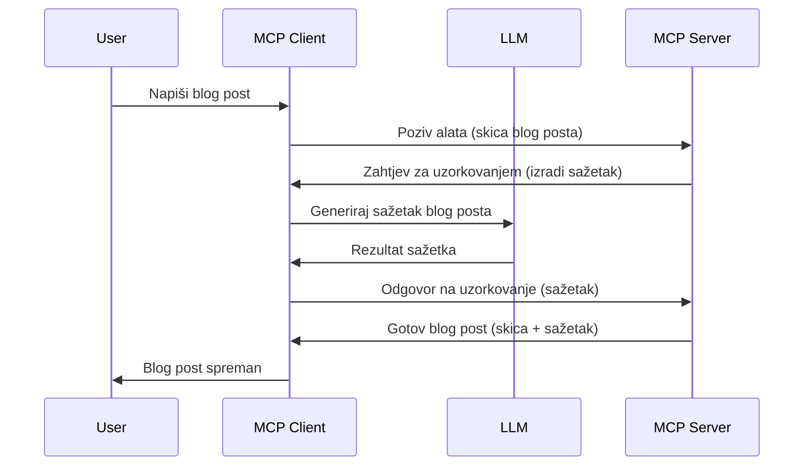

# Uzorkovanje - delegiranje značajki klijentu

Ponekad je potrebno da MCP klijent i MCP server surađuju kako bi postigli zajednički cilj. Možda imate situaciju u kojoj server treba pomoć LLM-a koji se nalazi na klijentu. Za tu situaciju, uzorkovanje je ono što biste trebali koristiti.

Istražimo neke primjere uporabe i kako izgraditi rješenje koje uključuje uzorkovanje.

## Pregled

U ovoj lekciji fokusiramo se na objašnjenje kada i gdje koristiti uzorkovanje i kako ga konfigurirati.

## Ciljevi učenja

U ovom poglavlju ćemo:

- Objasniti što je uzorkovanje i kada ga koristiti.
- Prikazati kako konfigurirati uzorkovanje u MCP-u.
- Pružiti primjere uzorkovanja u praksi.

## Što je uzorkovanje i zašto ga koristiti?

Uzorkovanje je napredna značajka koja radi na sljedeći način:


### Zahtjev za uzorkovanje

Ok, sada imamo pregled vjerodostojnog scenarija, razgovarajmo o zahtjevu za uzorkovanje koji server šalje natrag klijentu. Evo kako takav zahtjev može izgledati u JSON-RPC formatu:

```json
{
  "jsonrpc": "2.0",
  "id": 1,
  "method": "sampling/createMessage",
  "params": {
    "messages": [
      {
        "role": "user",
        "content": {
          "type": "text",
          "text": "Create a blog post summary of the following blog post: <BLOG POST>"
        }
      }
    ],
    "modelPreferences": {
      "hints": [
        {
          "name": "claude-3-sonnet"
        }
      ],
      "intelligencePriority": 0.8,
      "speedPriority": 0.5
    },
    "systemPrompt": "You are a helpful assistant.",
    "maxTokens": 100
  }
}
```

Ovdje ima nekoliko stvari koje vrijedi istaknuti:

- Prompt, pod content -> text, je naš prompt koji je uputa LLM-u da sažme sadržaj blog posta.

- **modelPreferences**. Ovaj odjeljak je upravo to, preferencija, preporuka o kojoj konfiguraciji koristiti s LLM-om. Korisnik može odlučiti hoće li se držati tih preporuka ili ih promijeniti. U ovom slučaju postoje preporuke o modelu, brzini i prioritetu inteligencije.
- **systemPrompt**, ovo je vaš uobičajeni sistemski prompt koji daje vašem LLM-u osobnost i sadrži smjernice za upute.
- **maxTokens**, ovo je još jedna svojina koja govori koliko tokena se preporučuje koristiti za ovaj zadatak.

### Odgovor na uzorkovanje

Ovaj odgovor je ono što MCP klijent na kraju šalje natrag MCP serveru i rezultat je poziva klijentskog LLM-a, čekanja tog odgovora i zatim konstruiranja ove poruke. Evo kako može izgledati u JSON-RPC-u:

```json
{
  "jsonrpc": "2.0",
  "id": 1,
  "result": {
    "role": "assistant",
    "content": {
      "type": "text",
      "text": "Here's your abstract <ABSTRACT>"
    },
    "model": "gpt-5",
    "stopReason": "endTurn"
  }
}
```

Primijetite kako je odgovor sažetak blog posta kao što smo tražili. Također primijetite kako korišteni `model` nije onaj koji smo tražili nego "gpt-5" umjesto "claude-3-sonnet". Ovo ilustrira da korisnik može promijeniti mišljenje o tome što želi koristiti i da je vaš zahtjev za uzorkovanje preporuka.

Ok, sada kada razumijemo glavni tijek i korisnu svrhu "kreiranje blog posta + sažetak", pogledajmo što trebamo napraviti da bismo to omogućili.

### Tipovi poruka

Poruke uzorkovanja nisu ograničene samo na tekst, već možete slati i slike i zvuk. Evo kako JSON-RPC izgleda drugačije:

**Tekst**

```json
{
  "type": "text",
  "text": "The message content"
}
```

**Sadržaj slike**

```json
{
  "type": "image",
  "data": "base64-encoded-image-data",
  "mimeType": "image/jpeg"
}
```

**Sadržaj zvuka**

```json
{
  "type": "audio",
  "data": "base64-encoded-audio-data",
  "mimeType": "audio/wav"
}
```

> NAPOMENA: za detaljnije informacije o uzorkovanju, pogledajte [službenu dokumentaciju](https://modelcontextprotocol.io/specification/2025-06-18/client/sampling)

## Kako konfigurirati uzorkovanje na klijentu

> Napomena: ako gradite samo server, ovdje ne trebate puno raditi.

Na klijentu morate specificirati sljedeću značajku ovako:

```json
{
  "capabilities": {
    "sampling": {}
  }
}
```

Ovo će se zatim prepoznati kada vaš odabrani klijent inicijalizira vezu sa serverom.

## Primjer uzorkovanja u praksi - Izrada blog posta

Napravimo zajedno sampling server, trebamo učiniti sljedeće:

1. Napraviti alat na serveru.
1. Taj alat treba kreirati zahtjev za uzorkovanje.
1. Alat treba čekati da klijent odgovori na zahtjev za uzorkovanje.
1. Zatim treba proizvesti rezultat alata.

Pogledajmo kod korak po korak:

### -1- Napravite alat

**python**

```python
@mcp.tool()
async def create_blog(title: str, content: str, ctx: Context[ServerSession, None]) -> str:
    """Create a blog post and generate a summary"""

```

### -2- Kreirajte zahtjev za uzorkovanje

Proširite svoj alat sljedećim kodom:

**python**

```python
post = BlogPost(
        id=len(posts) + 1,
        title=title,
        content=content,
        abstract=""
    )

prompt = f"Create an abstract of the following blog post: title: {title} and draft: {content} "

result = await ctx.session.create_message(
        messages=[
            SamplingMessage(
                role="user",
                content=TextContent(type="text", text=prompt),
            )
        ],
        max_tokens=100,
)

```

### -3- Pričekajte odgovor i vratite odgovor

**python**

```python
post.abstract = result.content.text

posts.append(post)

# vrati kompletan proizvod
return json.dumps({
    "id": post.title,
    "abstract": post.abstract
})
```

### -4- Cijeli kod

**python**

```python
from starlette.applications import Starlette
from starlette.routing import Mount, Host

from mcp.server.fastmcp import Context, FastMCP

from mcp.server.session import ServerSession
from mcp.types import SamplingMessage, TextContent

import json


from uuid import uuid4
from typing import List
from pydantic import BaseModel


mcp = FastMCP("Blog post generator")

# app = FastAPI()

posts = []

class BlogPost(BaseModel):
    id: int
    title: str
    content: str
    abstract: str

posts: List[BlogPost] = []

@mcp.tool()
async def create_blog(title: str, content: str, ctx: Context[ServerSession, None]) -> str:
    """Create a blog post and generate a summary"""

    post = BlogPost(
        id=len(posts) + 1,
        title=title,
        content=content,
        abstract=""
    )

    prompt = f"Create an abstract of the following blog post: title: {title} and draft: {content} "

    result = await ctx.session.create_message(
        messages=[
            SamplingMessage(
                role="user",
                content=TextContent(type="text", text=prompt),
            )
        ],
        max_tokens=100,
    )

    post.abstract = result.content.text

    posts.append(post)

    # vrati cijeli blog post
    return json.dumps({
        "id": post.title,
        "abstract": post.abstract
    })

if __name__ == "__main__":
    print("Starting server...")
    # mcp.run()
    mcp.run(transport="streamable-http")

# pokreni aplikaciju s: python server.py
```

### -5- Testiranje u Visual Studio Code

Da biste testirali ovo u Visual Studio Codeu, učinite sljedeće:

1. Pokrenite server u terminalu
1. Dodajte ga u *mcp.json* (i provjerite da je pokrenut) npr. ovako:

   ```json
   "servers": {
      "blog-server": {
        "type": "http",
        "url": "http://localhost:8000/mcp"
      }
   }
   ```

1. Unesite prompt:

   ```text
   create a blog post named "Where Python comes from", the content is "Python is actually named after Monty Python Flying Circus"
   ```

1. Dopustite da se dogodi uzorkovanje. Prvi put kada to testirate, prikazat će vam se dodatni dijalog koji morate prihvatiti, a zatim ćete vidjeti uobičajeni dijalog s pitanjem da pokrenete alat.

1. Pregledajte rezultate. Vidjet ćete rezultate lijepo prikazane u GitHub Copilot Chatu, ali također možete pregledati i sirovi JSON odgovor.

**Bonus**. Visual Studio Code alati imaju izvrsnu podršku za uzorkovanje. Možete konfigurirati pristup uzorkovanju na vašem instaliranom serveru navigacijom ovako:

1. Idite u dio za proširenja.
1. Odaberite ikonu zupčanika za vaš instalirani server u odjeljku "MCP SERVERS - INSTALLED".
1. Odaberite "Configure Model Access", ovdje možete odabrati koje modele GitHub Copilot smije koristiti prilikom uzorkovanja. Također možete vidjeti sve nedavne zahtjeve za uzorkovanje odabirom "Show Sampling requests".

## Zadatak

U ovom zadatku izgradit ćete malo drugačiju implementaciju uzorkovanja, a to je integracija uzorkovanja koja podržava generiranje opisa proizvoda. Evo vašeg scenarija:

**Scenarij**: Radnik u back officeu e-trgovine treba pomoć jer mu generiranje opisa proizvoda oduzima previše vremena. Stoga trebate napraviti rješenje u kojem pozivate alat "create_product" s argumentima "title" i "keywords" koji bi trebao proizvesti kompletan proizvod uključujući polje "description" koje će biti popunjeno LLM-om klijenta.

SAVJET: iskoristite ono što ste ranije naučili o konstrukciji servera i njegovog alata koristeći zahtjev za uzorkovanje.

## Rješenje

[Rješenje](./solution/README.md)

## Ključne spoznaje

Uzorkovanje je moćna značajka koja omogućuje serveru da delegira zadatke klijentu kada mu treba pomoć LLM-a.

## Što slijedi

- [Poglavlje 4 - Praktična implementacija](../../04-PracticalImplementation/README.md)

---

<!-- CO-OP TRANSLATOR DISCLAIMER START -->
**Odricanje od odgovornosti**:
Ovaj je dokument preveden korištenjem AI usluge za prevođenje [Co-op Translator](https://github.com/Azure/co-op-translator). Iako nastojimo osigurati točnost, imajte na umu da automatski prijevodi mogu sadržavati pogreške ili netočnosti. Izvorni dokument na izvornom jeziku treba smatrati službenim i autoritativnim izvorom. Za važne informacije preporučuje se profesionalni ljudski prijevod. Nismo odgovorni za bilo kakva nerazumijevanja ili pogrešna tumačenja koja proizlaze iz korištenja ovog prijevoda.
<!-- CO-OP TRANSLATOR DISCLAIMER END -->