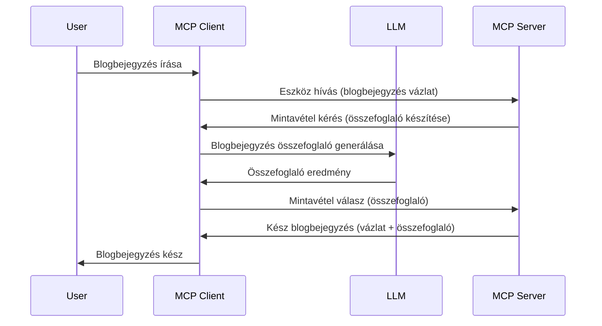

# Mintavételezés - funkciók átadása az Ügyfélnek

Néha szükség van arra, hogy az MCP Ügyfél és az MCP Szerver együttműködjön egy közös cél érdekében. Előfordulhat olyan eset, amikor a Szervernek segítségre van szüksége egy ügyfélen futó LLM-től. Ilyen helyzetben a mintavételezést kell használni.

Nézzünk meg néhány felhasználási esetet és azt, hogyan lehet megoldást építeni a mintavételezés bevonásával.

## Áttekintés

Ebben a leckében arra fókuszálunk, mikor és hol érdemes használni a Mintavételezést, valamint hogy hogyan konfiguráljuk.

## Tanulási célok

Ebben a fejezetben:

- Elmagyarázzuk, mi a Mintavételezés és mikor érdemes használni.
- Megmutatjuk, hogyan kell konfigurálni a Mintavételezést az MCP-ben.
- Példákat adunk a Mintavételezés alkalmazására.

## Mi a Mintavételezés és miért érdemes használni?

A Mintavételezés egy fejlett funkció, ami az alábbi módon működik:


### Mintavételezési kérés

Oké, most, hogy átfogó képet kaptunk egy reális helyzetről, beszéljünk a mintavételezési kérésről, amit a szerver küld vissza az ügyfélnek. Így nézhet ki egy ilyen kérés JSON-RPC formátumban:

```json
{
  "jsonrpc": "2.0",
  "id": 1,
  "method": "sampling/createMessage",
  "params": {
    "messages": [
      {
        "role": "user",
        "content": {
          "type": "text",
          "text": "Create a blog post summary of the following blog post: <BLOG POST>"
        }
      }
    ],
    "modelPreferences": {
      "hints": [
        {
          "name": "claude-3-sonnet"
        }
      ],
      "intelligencePriority": 0.8,
      "speedPriority": 0.5
    },
    "systemPrompt": "You are a helpful assistant.",
    "maxTokens": 100
  }
}
```

Van itt néhány dolog, amit érdemes kiemelni:

- A prompt, a content -> text alatt, az az utasítás az LLM-nek, hogy foglalja össze a blogbejegyzés tartalmát.

- **modelPreferences**. Ez a szakasz egy preferencia, ajánlás arra vonatkozóan, milyen konfigurációt használjon az LLM-mel. A felhasználó eldöntheti, hogy ezeket az ajánlásokat alkalmazza vagy megváltoztatja. Ebben az esetben vannak ajánlások a használni kívánt modellre, valamint a sebesség és intelligencia prioritására.
- **systemPrompt**, ez az alapértelmezett rendszerüzenet, amely személyiséget ad az LLM-nek és iránymutatásokat tartalmaz.
- **maxTokens**, ez egy másik tulajdonság, amely megadja, hogy hány token használata ajánlott az adott feladathoz.

### Mintavételezési válasz

Ez az a válasz, amit az MCP Ügyfél küld vissza az MCP Szervernek, és ami az ügyfél által az LLM hívásának eredménye, majd ebből állítja össze ezt az üzenetet. Így nézhet ki JSON-RPC formátumban:

```json
{
  "jsonrpc": "2.0",
  "id": 1,
  "result": {
    "role": "assistant",
    "content": {
      "type": "text",
      "text": "Here's your abstract <ABSTRACT>"
    },
    "model": "gpt-5",
    "stopReason": "endTurn"
  }
}
```

Vegyük észre, hogy a válasz egy blogbejegyzés összefoglalója, ahogy kértük. Továbbá figyeljük meg, hogy a használt `model` nem az, amit eredetileg kértünk, hanem "gpt-5" az eredetileg kért "claude-3-sonnet" helyett. Ez azt szemlélteti, hogy a felhasználó változtathat véleményt arról, melyiket használja, és hogy a mintavételezési kérés egy ajánlás.

Oké, most, hogy értjük a fő folyamatot, és hasznos feladatként az "blogbejegyzés készítés + összefoglaló" esetét, nézzük meg, mit kell tennünk, hogy működjön.

### Üzenettípusok

A mintavételezési üzenetek nem csak szövegesek lehetnek, hanem képeket és hangot is küldhetünk. Íme, hogyan néz ki a JSON-RPC eltérően:

**Szöveg**

```json
{
  "type": "text",
  "text": "The message content"
}
```

**Kép tartalom**

```json
{
  "type": "image",
  "data": "base64-encoded-image-data",
  "mimeType": "image/jpeg"
}
```

**Hang tartalom**

```json
{
  "type": "audio",
  "data": "base64-encoded-audio-data",
  "mimeType": "audio/wav"
}
```

> MEGJEGYZÉS: a Mintavételezéssel kapcsolatos részletesebb információkért nézd meg a [hivatalos dokumentációt](https://modelcontextprotocol.io/specification/2025-06-18/client/sampling)

## Hogyan konfiguráljuk a Mintavételezést az Ügyfélben

> Megjegyzés: ha csak szervert építesz, itt nem kell sokat tenned.

Az ügyfélben a következő funkciót kell megadni így:

```json
{
  "capabilities": {
    "sampling": {}
  }
}
```

Ezt követően, amikor a kiválasztott ügyfél inicializálódik a szerverrel, ezt fel fogja venni.

## Mintavételezés példa - Blogbejegyzés készítése

Kódoljunk együtt egy mintavételezési szervert, a következőket kell tennünk:

1. Hozz létre egy eszközt a szerveren.
1. Ez az eszköz küldjön mintavételezési kérést.
1. Az eszköz várja meg az ügyfél mintavételezési válaszát.
1. Ezután állítsa elő az eszköz eredményét.

Nézzük lépésről lépésre a kódot:

### -1- Az eszköz létrehozása

**python**

```python
@mcp.tool()
async def create_blog(title: str, content: str, ctx: Context[ServerSession, None]) -> str:
    """Create a blog post and generate a summary"""

```

### -2- Mintavételezési kérés létrehozása

Bővítsd az eszközödet a következő kóddal:

**python**

```python
post = BlogPost(
        id=len(posts) + 1,
        title=title,
        content=content,
        abstract=""
    )

prompt = f"Create an abstract of the following blog post: title: {title} and draft: {content} "

result = await ctx.session.create_message(
        messages=[
            SamplingMessage(
                role="user",
                content=TextContent(type="text", text=prompt),
            )
        ],
        max_tokens=100,
)

```

### -3- Várj a válaszra és add vissza

**python**

```python
post.abstract = result.content.text

posts.append(post)

# adja vissza a teljes terméket
return json.dumps({
    "id": post.title,
    "abstract": post.abstract
})
```

### -4- Teljes kód

**python**

```python
from starlette.applications import Starlette
from starlette.routing import Mount, Host

from mcp.server.fastmcp import Context, FastMCP

from mcp.server.session import ServerSession
from mcp.types import SamplingMessage, TextContent

import json


from uuid import uuid4
from typing import List
from pydantic import BaseModel


mcp = FastMCP("Blog post generator")

# app = FastAPI()

posts = []

class BlogPost(BaseModel):
    id: int
    title: str
    content: str
    abstract: str

posts: List[BlogPost] = []

@mcp.tool()
async def create_blog(title: str, content: str, ctx: Context[ServerSession, None]) -> str:
    """Create a blog post and generate a summary"""

    post = BlogPost(
        id=len(posts) + 1,
        title=title,
        content=content,
        abstract=""
    )

    prompt = f"Create an abstract of the following blog post: title: {title} and draft: {content} "

    result = await ctx.session.create_message(
        messages=[
            SamplingMessage(
                role="user",
                content=TextContent(type="text", text=prompt),
            )
        ],
        max_tokens=100,
    )

    post.abstract = result.content.text

    posts.append(post)

    # térj vissza a teljes blogbejegyzéssel
    return json.dumps({
        "id": post.title,
        "abstract": post.abstract
    })

if __name__ == "__main__":
    print("Starting server...")
    # mcp.run()
    mcp.run(transport="streamable-http")

# futtasd az appot ezzel: python server.py
```

### -5- Tesztelés Visual Studio Code-ban

A Visual Studio Code-ban való teszteléshez tedd a következőket:

1. Indítsd el a szervert a terminálban
1. Add hozzá a *mcp.json*-hoz (és győződj meg róla, hogy elindult), például így:

   ```json
   "servers": {
      "blog-server": {
        "type": "http",
        "url": "http://localhost:8000/mcp"
      }
   }
   ```

1. Írj be egy promptot:

   ```text
   create a blog post named "Where Python comes from", the content is "Python is actually named after Monty Python Flying Circus"
   ```

1. Hagyjuk, hogy megtörténjen a mintavételezés. Először, amikor teszteled, meg fog jelenni egy extra párbeszédpanel, amit el kell fogadnod, majd meg fog jelenni a szokásos párbeszédablak, amely megkérdezi, hogy futtass-e egy eszközt.

1. Ellenőrizd az eredményeket. A válaszokat szépen meg fogod látni a GitHub Copilot Chat felületén, de megnézheted a nyers JSON választ is.

**Bónusz**. A Visual Studio Code eszközkészlete remek támogatást nyújt a mintavételezéshez. A telepített szerveredhez a mintavételezési hozzáférést így állíthatod be:

1. Navigálj a bővítmények szekcióhoz.
1. Válaszd ki a fogaskerék ikont a telepített szervered neve mellett az "MCP SZERVEREK - TELEPÍTVE" részben.
1. Válaszd ki a "Model hozzáférés konfigurálása" opciót, itt kiválaszthatod, mely modelleket engedélyez a GitHub Copilot mintavételezéshez. Itt láthatod az összes nemrég történő mintavételezési kérelmet is a "Mintavételezési kérelmek megjelenítése" menüpontra kattintva.

## Feladat

Ebben a feladatban egy némileg eltérő mintavételező integrációt kell építened, amely egy termékleírás generálását támogatja. Íme az eseted:

**Helyzet**: Egy e-kereskedelmi háttéri dolgozónak segítségre van szüksége, mert túl sok idő egy-egy termékleírás generálása. Ezért építened kell egy megoldást, ahol a "create_product" nevű eszközt hívhatod meg "title" és "keywords" argumentumokkal, amely egy teljes terméket állít elő, beleértve egy "description" mezőt is, amit az ügyfél LLM-je tölt ki.

TIPP: használd, amit korábban tanultál arról, hogyan kell felépíteni ezt a szervert és az eszközt mintavételezési kérés használatával.

## Megoldás

[Megoldás](./solution/README.md)

## Fontos tanulságok

A mintavételezés egy erőteljes funkció, amely lehetővé teszi, hogy a szerver átadja a feladatokat az ügyfélnek, amikor LLM segítségére van szüksége.

## Mi következik

- [4. fejezet - Gyakorlati megvalósítás](../../04-PracticalImplementation/README.md)

---

<!-- CO-OP TRANSLATOR DISCLAIMER START -->
**Jogi nyilatkozat**:
Ez a dokumentum az AI fordító szolgáltatás, a [Co-op Translator](https://github.com/Azure/co-op-translator) segítségével készült. Bár a pontosságra törekszünk, kérjük, vegye figyelembe, hogy az automatikus fordítások hibákat vagy pontatlanságokat tartalmazhatnak. Az eredeti dokumentum a saját nyelvén tekintendő tekintélyes forrásnak. Kritikus információk esetén szakmai, emberi fordítást javaslunk. Nem vállalunk felelősséget a fordítás használatából eredő félreértésekért vagy hibás értelmezésekért.
<!-- CO-OP TRANSLATOR DISCLAIMER END -->