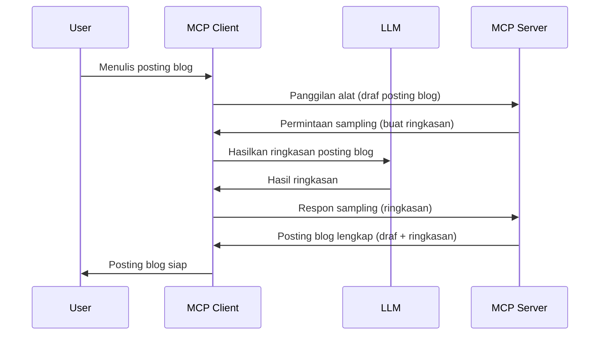

# Sampling - mendelegasikan fitur ke Klien

Terkadang, Anda membutuhkan Kerja sama antara MCP Client dan MCP Server untuk mencapai tujuan bersama. Anda mungkin memiliki kasus di mana Server memerlukan bantuan LLM yang berada pada klien. Untuk situasi ini, sampling adalah yang harus Anda gunakan.

Mari kita jelajahi beberapa kasus penggunaan dan cara membangun solusi yang melibatkan sampling.

## Ikhtisar

Dalam pelajaran ini, kita fokus menjelaskan kapan dan di mana menggunakan Sampling serta cara mengkonfigurasinya.

## Tujuan Pembelajaran

Dalam bab ini, kita akan:

- Menjelaskan apa itu Sampling dan kapan menggunakannya.
- Menunjukkan cara mengkonfigurasi Sampling di MCP.
- Memberikan contoh Sampling dalam praktik.

## Apa itu Sampling dan mengapa menggunakannya?

Sampling adalah fitur canggih yang bekerja dengan cara berikut:


### Permintaan Sampling

Ok, sekarang kita punya gambaran besar dari suatu skenario yang kredibel, mari kita bahas permintaan sampling yang dikirim server ke klien. Berikut contoh permintaan tersebut dalam format JSON-RPC:

```json
{
  "jsonrpc": "2.0",
  "id": 1,
  "method": "sampling/createMessage",
  "params": {
    "messages": [
      {
        "role": "user",
        "content": {
          "type": "text",
          "text": "Create a blog post summary of the following blog post: <BLOG POST>"
        }
      }
    ],
    "modelPreferences": {
      "hints": [
        {
          "name": "claude-3-sonnet"
        }
      ],
      "intelligencePriority": 0.8,
      "speedPriority": 0.5
    },
    "systemPrompt": "You are a helpful assistant.",
    "maxTokens": 100
  }
}
```

Ada beberapa hal yang patut disorot di sini:

- Prompt, di bawah content -> text, adalah prompt kita yang merupakan instruksi untuk LLM agar meringkas konten posting blog.

- **modelPreferences**. Bagian ini adalah preferensi, sebuah rekomendasi konfigurasi yang digunakan dengan LLM. Pengguna dapat memilih untuk mengikuti rekomendasi ini atau mengubahnya. Dalam kasus ini ada rekomendasi model yang digunakan serta prioritas kecepatan dan kecerdasan.
- **systemPrompt**, ini adalah prompt sistem normal yang memberikan kepribadian pada LLM Anda dan berisi petunjuk panduan.
- **maxTokens**, ini adalah properti lain yang digunakan untuk mengatakan berapa banyak token yang direkomendasikan untuk tugas ini.

### Respons Sampling

Respons ini adalah apa yang akhirnya dikirim MCP Client kembali ke MCP Server dan merupakan hasil dari klien memanggil LLM, menunggu respons tersebut dan kemudian membangun pesan ini. Berikut tampilannya dalam JSON-RPC:

```json
{
  "jsonrpc": "2.0",
  "id": 1,
  "result": {
    "role": "assistant",
    "content": {
      "type": "text",
      "text": "Here's your abstract <ABSTRACT>"
    },
    "model": "gpt-5",
    "stopReason": "endTurn"
  }
}
```

Perhatikan bagaimana respons adalah abstrak dari posting blog seperti yang kita minta. Juga perhatikan bagaimana `model` yang digunakan bukan yang kita minta tetapi "gpt-5" bukan "claude-3-sonnet". Ini untuk menggambarkan bahwa pengguna bisa mengubah pilihan apa yang akan digunakan dan permintaan sampling Anda adalah sebuah rekomendasi.

Ok, sekarang kita paham alur utama, dan tugas berguna untuk menggunakannya yaitu "pembuatan posting blog + abstrak", mari kita lihat apa yang perlu dilakukan agar itu bisa berjalan.

### Jenis Pesan

Pesan sampling tidak terbatas hanya pada teks tetapi Anda juga bisa mengirim gambar dan audio. Berikut bagaimana JSON-RPC-nya berbeda:

**Teks**

```json
{
  "type": "text",
  "text": "The message content"
}
```

**Konten gambar**

```json
{
  "type": "image",
  "data": "base64-encoded-image-data",
  "mimeType": "image/jpeg"
}
```

**Konten audio**

```json
{
  "type": "audio",
  "data": "base64-encoded-audio-data",
  "mimeType": "audio/wav"
}
```

> NOTE: untuk info lebih rinci tentang Sampling, kunjungi [dokumen resmi](https://modelcontextprotocol.io/specification/2025-06-18/client/sampling)

## Cara Mengkonfigurasi Sampling di Klien

> Catatan: jika Anda hanya membangun server, Anda tidak perlu banyak melakukan di sini.

Di klien, Anda perlu menentukan fitur berikut seperti ini:

```json
{
  "capabilities": {
    "sampling": {}
  }
}
```

Ini kemudian akan diambil ketika klien pilihan Anda melakukan inisialisasi dengan server.

## Contoh Sampling dalam Praktik - Membuat Posting Blog

Mari kita buat server sampling bersama, kita perlu melakukan hal berikut:

1. Buat sebuah alat di Server.
1. Alat tersebut harus membuat permintaan sampling.
1. Alat harus menunggu permintaan sampling klien dijawab.
1. Kemudian hasil alat tersebut harus diproduksi.

Mari lihat kodenya langkah demi langkah:

### -1- Buat alatnya

**python**

```python
@mcp.tool()
async def create_blog(title: str, content: str, ctx: Context[ServerSession, None]) -> str:
    """Create a blog post and generate a summary"""

```

### -2- Buat permintaan sampling

Perluas alat Anda dengan kode berikut:

**python**

```python
post = BlogPost(
        id=len(posts) + 1,
        title=title,
        content=content,
        abstract=""
    )

prompt = f"Create an abstract of the following blog post: title: {title} and draft: {content} "

result = await ctx.session.create_message(
        messages=[
            SamplingMessage(
                role="user",
                content=TextContent(type="text", text=prompt),
            )
        ],
        max_tokens=100,
)

```

### -3- Tunggu respons dan kembalikan respons

**python**

```python
post.abstract = result.content.text

posts.append(post)

# mengembalikan produk lengkap
return json.dumps({
    "id": post.title,
    "abstract": post.abstract
})
```

### -4- Kode lengkap

**python**

```python
from starlette.applications import Starlette
from starlette.routing import Mount, Host

from mcp.server.fastmcp import Context, FastMCP

from mcp.server.session import ServerSession
from mcp.types import SamplingMessage, TextContent

import json


from uuid import uuid4
from typing import List
from pydantic import BaseModel


mcp = FastMCP("Blog post generator")

# app = FastAPI()

posts = []

class BlogPost(BaseModel):
    id: int
    title: str
    content: str
    abstract: str

posts: List[BlogPost] = []

@mcp.tool()
async def create_blog(title: str, content: str, ctx: Context[ServerSession, None]) -> str:
    """Create a blog post and generate a summary"""

    post = BlogPost(
        id=len(posts) + 1,
        title=title,
        content=content,
        abstract=""
    )

    prompt = f"Create an abstract of the following blog post: title: {title} and draft: {content} "

    result = await ctx.session.create_message(
        messages=[
            SamplingMessage(
                role="user",
                content=TextContent(type="text", text=prompt),
            )
        ],
        max_tokens=100,
    )

    post.abstract = result.content.text

    posts.append(post)

    # mengembalikan posting blog lengkap
    return json.dumps({
        "id": post.title,
        "abstract": post.abstract
    })

if __name__ == "__main__":
    print("Starting server...")
    # mcp.run()
    mcp.run(transport="streamable-http")

# jalankan aplikasi dengan: python server.py
```

### -5- Uji di Visual Studio Code

Untuk menguji ini di Visual Studio Code, lakukan hal berikut:

1. Mulai server di terminal
1. Tambahkan ke *mcp.json* (dan pastikan sudah dijalankan) misalnya seperti ini:

   ```json
   "servers": {
      "blog-server": {
        "type": "http",
        "url": "http://localhost:8000/mcp"
      }
   }
   ```

1. Ketik prompt:

   ```text
   create a blog post named "Where Python comes from", the content is "Python is actually named after Monty Python Flying Circus"
   ```

1. Izinkan sampling terjadi. Pertama kali Anda menguji ini, Anda akan disajikan dialog tambahan yang harus Anda setujui, kemudian Anda akan melihat dialog normal untuk meminta Anda menjalankan alat.

1. Periksa hasil. Anda akan melihat hasil yang dirender dengan rapi di GitHub Copilot Chat tetapi Anda juga dapat memeriksa respons JSON mentah.

**Bonus**. Tooling Visual Studio Code memiliki dukungan hebat untuk sampling. Anda dapat mengkonfigurasi akses Sampling pada server yang diinstal dengan cara berikut:

1. Buka bagian ekstensi.
1. Pilih ikon roda gigi untuk server yang Anda instal di bagian "MCP SERVERS - INSTALLED".
1 Pilih "Configure Model Access", di sini Anda bisa memilih model mana yang diizinkan GitHub Copilot gunakan saat melakukan sampling. Anda juga bisa melihat semua permintaan sampling yang terjadi baru-baru ini dengan memilih "Show Sampling requests".

## Tugas

Dalam tugas ini, Anda akan membangun Sampling yang sedikit berbeda yaitu integrasi sampling yang mendukung pembuatan deskripsi produk. Berikut skenarionya:

**Skenario**: Pegawai back office di e-commerce memerlukan bantuan, menghabiskan banyak waktu untuk membuat deskripsi produk. Oleh karena itu, Anda akan membangun solusi di mana Anda dapat memanggil alat "create_product" dengan argumen "title" dan "keywords" dan alat tersebut harus menghasilkan produk lengkap termasuk bidang "description" yang harus diisi oleh LLM klien.

TIP: gunakan apa yang sudah Anda pelajari sebelumnya tentang cara membangun server dan alatnya menggunakan permintaan sampling.

## Solusi

[Solution](./solution/README.md)

## Poin Penting

Sampling adalah fitur kuat yang memungkinkan server mendelegasikan tugas ke klien saat membutuhkan bantuan LLM.

## Selanjutnya

- [Bab 4 - Implementasi praktis](../../04-PracticalImplementation/README.md)

---

<!-- CO-OP TRANSLATOR DISCLAIMER START -->
**Penafian**:  
Dokumen ini telah diterjemahkan menggunakan layanan terjemahan AI [Co-op Translator](https://github.com/Azure/co-op-translator). Meskipun kami berupaya mencapai akurasi, harap diketahui bahwa terjemahan otomatis mungkin mengandung kesalahan atau ketidakakuratan. Dokumen asli dalam bahasa aslinya harus dianggap sebagai sumber yang sah dan utama. Untuk informasi penting, disarankan menggunakan terjemahan profesional oleh penerjemah manusia. Kami tidak bertanggung jawab atas kesalahpahaman atau salah tafsir yang timbul dari penggunaan terjemahan ini.
<!-- CO-OP TRANSLATOR DISCLAIMER END -->