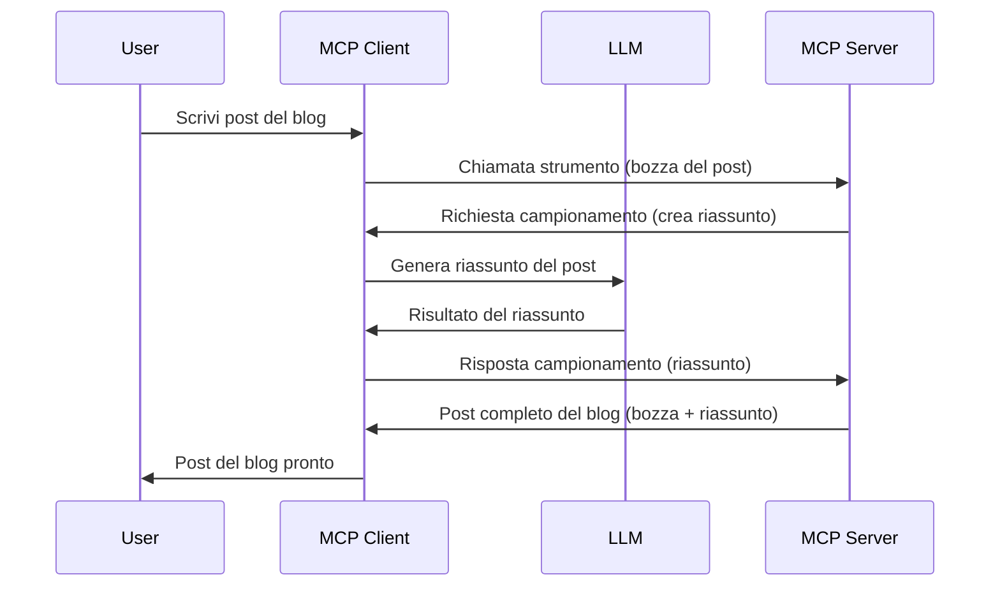

# Sampling - delegare funzionalità al Client

A volte, è necessario che il Client MCP e il Server MCP collaborino per raggiungere un obiettivo comune. Può capitare che il Server richieda l’aiuto di un LLM che risiede sul client. Per questa situazione, il sampling è ciò che dovresti utilizzare.

Esploriamo alcuni casi d’uso e come costruire una soluzione che coinvolga il sampling.

## Panoramica

In questa lezione ci concentriamo su quando e dove utilizzare il Sampling e su come configurarlo.

## Obiettivi di apprendimento

In questo capitolo, noi:

- Spiegheremo cos’è il Sampling e quando usarlo.
- Mostreremo come configurare il Sampling in MCP.
- Forniremo esempi di Sampling in azione.

## Cos’è il Sampling e perché usarlo?

Il Sampling è una funzionalità avanzata che funziona nel seguente modo:


### Richiesta di Sampling

Ok, ora che abbiamo una visione dall’alto di un scenario credibile, parliamo della richiesta di sampling che il server invia al client. Ecco come può apparire una richiesta di questo tipo in formato JSON-RPC:

```json
{
  "jsonrpc": "2.0",
  "id": 1,
  "method": "sampling/createMessage",
  "params": {
    "messages": [
      {
        "role": "user",
        "content": {
          "type": "text",
          "text": "Create a blog post summary of the following blog post: <BLOG POST>"
        }
      }
    ],
    "modelPreferences": {
      "hints": [
        {
          "name": "claude-3-sonnet"
        }
      ],
      "intelligencePriority": 0.8,
      "speedPriority": 0.5
    },
    "systemPrompt": "You are a helpful assistant.",
    "maxTokens": 100
  }
}
```

Ci sono alcune cose da evidenziare qui:

- Prompt, sotto content -> text, è il nostro prompt che è un’istruzione per l’LLM di riassumere il contenuto di un post sul blog.

- **modelPreferences**. Questa sezione è proprio questo, una preferenza, una raccomandazione di quale configurazione utilizzare con l’LLM. L’utente può scegliere se seguire queste raccomandazioni o modificarle. In questo caso ci sono raccomandazioni sul modello da utilizzare e priorità su velocità e intelligenza.
- **systemPrompt**, questo è il tuo prompt di sistema normale che conferisce personalità all’LLM e contiene istruzioni guida.
- **maxTokens**, è un’altra proprietà usata per indicare quanti token è consigliato utilizzare per questo task.

### Risposta di Sampling

Questa risposta è ciò che il Client MCP finisce per inviare al Server MCP ed è il risultato della chiamata dell’LLM da parte del client, l’attesa di quella risposta e la costruzione di questo messaggio. Ecco come può apparire in JSON-RPC:

```json
{
  "jsonrpc": "2.0",
  "id": 1,
  "result": {
    "role": "assistant",
    "content": {
      "type": "text",
      "text": "Here's your abstract <ABSTRACT>"
    },
    "model": "gpt-5",
    "stopReason": "endTurn"
  }
}
```

Nota come la risposta è un abstract del post sul blog proprio come abbiamo chiesto. Nota anche come il modello usato `model` non è quello che abbiamo richiesto ma "gpt-5" invece di "claude-3-sonnet". Questo per illustrare che l’utente può cambiare idea su cosa usare e che la tua richiesta di sampling è una raccomandazione.

Ok, ora che abbiamo capito il flusso principale e il compito utile per usarlo “creazione + abstract del post sul blog”, vediamo cosa dobbiamo fare per farlo funzionare.

### Tipi di messaggi

I messaggi di Sampling non sono limitati solo al testo ma puoi anche inviare immagini e audio. Ecco come cambia il JSON-RPC:

**Testo**

```json
{
  "type": "text",
  "text": "The message content"
}
```

**Contenuto immagine**

```json
{
  "type": "image",
  "data": "base64-encoded-image-data",
  "mimeType": "image/jpeg"
}
```

**Contenuto audio**

```json
{
  "type": "audio",
  "data": "base64-encoded-audio-data",
  "mimeType": "audio/wav"
}
```

> NOTE: per informazioni più dettagliate sul Sampling, consulta la [documentazione ufficiale](https://modelcontextprotocol.io/specification/2025-06-18/client/sampling)

## Come configurare il Sampling nel Client

> Nota: se stai costruendo solo un server, non devi fare molto qui.

In un client, devi specificare la seguente funzionalità così:

```json
{
  "capabilities": {
    "sampling": {}
  }
}
```

Questo sarà poi rilevato quando il client scelto si inizializza con il server.

## Esempio di Sampling in azione - Creare un post sul blog

Codifichiamo insieme un server di sampling, dobbiamo fare quanto segue:

1. Creare uno strumento sul Server.
1. Questo strumento dovrebbe creare una richiesta di sampling.
1. Lo strumento deve attendere che la richiesta di sampling del client venga soddisfatta.
1. Quindi deve produrre il risultato dello strumento.

Vediamo il codice passo per passo:

### -1- Creare lo strumento

**python**

```python
@mcp.tool()
async def create_blog(title: str, content: str, ctx: Context[ServerSession, None]) -> str:
    """Create a blog post and generate a summary"""

```

### -2- Creare una richiesta di sampling

Estendi il tuo strumento con il seguente codice:

**python**

```python
post = BlogPost(
        id=len(posts) + 1,
        title=title,
        content=content,
        abstract=""
    )

prompt = f"Create an abstract of the following blog post: title: {title} and draft: {content} "

result = await ctx.session.create_message(
        messages=[
            SamplingMessage(
                role="user",
                content=TextContent(type="text", text=prompt),
            )
        ],
        max_tokens=100,
)

```

### -3- Attendere la risposta e restituirla

**python**

```python
post.abstract = result.content.text

posts.append(post)

# restituisci il prodotto completo
return json.dumps({
    "id": post.title,
    "abstract": post.abstract
})
```

### -4- Codice completo

**python**

```python
from starlette.applications import Starlette
from starlette.routing import Mount, Host

from mcp.server.fastmcp import Context, FastMCP

from mcp.server.session import ServerSession
from mcp.types import SamplingMessage, TextContent

import json


from uuid import uuid4
from typing import List
from pydantic import BaseModel


mcp = FastMCP("Blog post generator")

# app = FastAPI()

posts = []

class BlogPost(BaseModel):
    id: int
    title: str
    content: str
    abstract: str

posts: List[BlogPost] = []

@mcp.tool()
async def create_blog(title: str, content: str, ctx: Context[ServerSession, None]) -> str:
    """Create a blog post and generate a summary"""

    post = BlogPost(
        id=len(posts) + 1,
        title=title,
        content=content,
        abstract=""
    )

    prompt = f"Create an abstract of the following blog post: title: {title} and draft: {content} "

    result = await ctx.session.create_message(
        messages=[
            SamplingMessage(
                role="user",
                content=TextContent(type="text", text=prompt),
            )
        ],
        max_tokens=100,
    )

    post.abstract = result.content.text

    posts.append(post)

    # restituisci il post completo del blog
    return json.dumps({
        "id": post.title,
        "abstract": post.abstract
    })

if __name__ == "__main__":
    print("Starting server...")
    # mcp.run()
    mcp.run(transport="streamable-http")

# esegui l'app con: python server.py
```

### -5- Testarlo in Visual Studio Code

Per testare questo in Visual Studio Code, fai così:

1. Avvia il server nel terminale
1. Aggiungilo a *mcp.json* (e assicurati che sia avviato) qualcosa di simile a:

   ```json
   "servers": {
      "blog-server": {
        "type": "http",
        "url": "http://localhost:8000/mcp"
      }
   }
   ```

1. Digita un prompt:

   ```text
   create a blog post named "Where Python comes from", the content is "Python is actually named after Monty Python Flying Circus"
   ```

1. Consenti che il sampling avvenga. La prima volta che testi questo ti verrà presentata una finestra di dialogo aggiuntiva che dovrai accettare, poi vedrai la finestra di dialogo normale che ti chiede di eseguire uno strumento

1. Controlla i risultati. Vedrai i risultati sia ben visualizzati in GitHub Copilot Chat ma puoi anche ispezionare la risposta JSON grezza.

**Bonus**. Lo strumento di Visual Studio Code ha un ottimo supporto per il sampling. Puoi configurare l'accesso al Sampling sul tuo server installato navigando così:

1. Vai alla sezione estensioni.
1. Seleziona l’icona dell’ingranaggio per il server installato nella sezione "MCP SERVERS - INSTALLED".
1 Seleziona "Configure Model Access", qui puoi scegliere quali Modelli GitHub Copilot può usare durante il sampling. Puoi anche vedere tutte le richieste di sampling avvenute di recente selezionando "Show Sampling requests".

## Compito

In questo compito, costruirai un Sampling leggermente diverso, ovvero un’integrazione di sampling che supporta la generazione di una descrizione prodotto. Ecco il tuo scenario:

**Scenario**: L’impiegato del back office in un e-commerce ha bisogno di aiuto, richiede troppo tempo generare descrizioni prodotto. Pertanto, devi costruire una soluzione in cui puoi chiamare uno strumento "create_product" con "title" e "keywords" come argomento e dovrebbe produrre un prodotto completo incluso un campo "description" che dev’essere popolato dall’LLM del client.

TIP: usa quello che hai imparato prima su come costruire questo server e lo strumento utilizzando una richiesta di sampling.

## Soluzione

[Solution](./solution/README.md)

## Punti chiave

Il Sampling è una funzionalità potente che consente al server di delegare attività al client quando ha bisogno dell’aiuto di un LLM.

## Cosa c’è dopo

- [Capitolo 4 - Implementazione pratica](../../04-PracticalImplementation/README.md)

---

<!-- CO-OP TRANSLATOR DISCLAIMER START -->
**Dichiarazione di non responsabilità**:  
Questo documento è stato tradotto utilizzando il servizio di traduzione AI [Co-op Translator](https://github.com/Azure/co-op-translator). Pur impegnandoci per garantire l’accuratezza, si prega di notare che le traduzioni automatiche possono contenere errori o imprecisioni. Il documento originale nella sua lingua originale deve essere considerato la fonte autorevole. Per informazioni critiche, si raccomanda una traduzione professionale eseguita da un essere umano. Non ci assumiamo alcuna responsabilità per eventuali incomprensioni o interpretazioni errate derivanti dall’uso di questa traduzione.
<!-- CO-OP TRANSLATOR DISCLAIMER END -->