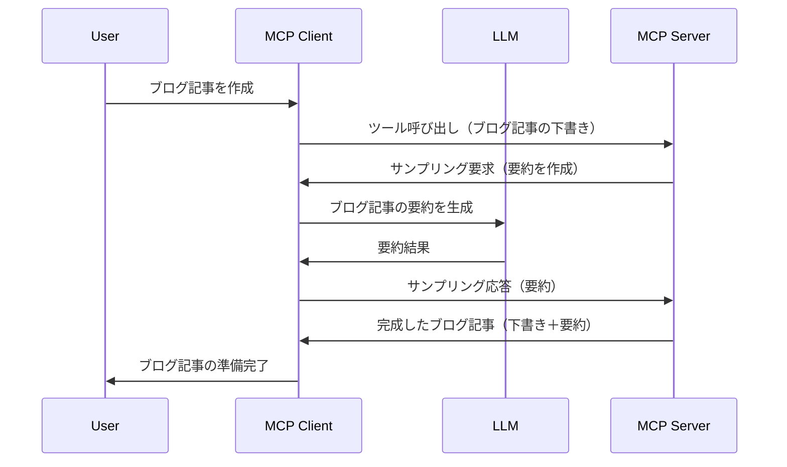

# サンプリング - クライアントへ機能を委任する

時には、MCPクライアントとMCPサーバーが協力して共通の目標を達成する必要があります。サーバーがクライアント上のLLMの助けを必要とする場合があります。このような状況では、サンプリングを使用すべきです。

サンプリングのユースケースと、それを含むソリューションの構築方法を見ていきましょう。

## 概要

このレッスンでは、サンプリングをいつどこで使うか、そしてその設定方法に焦点を当てます。

## 学習目標

この章では以下を行います：

- サンプリングとは何か、いつ使用するのかを説明する。
- MCPでのサンプリングの設定方法を示す。
- サンプリングの実例を提供する。

## サンプリングとは何か、なぜ使うのか？

サンプリングは以下の方法で動作する高度な機能です：


### サンプリングリクエスト

さて、信頼できるシナリオの大まかな概要ができましたので、サーバーがクライアントに返すサンプリングリクエストについて話しましょう。JSON-RPC形式のリクエスト例は次のようになります：

```json
{
  "jsonrpc": "2.0",
  "id": 1,
  "method": "sampling/createMessage",
  "params": {
    "messages": [
      {
        "role": "user",
        "content": {
          "type": "text",
          "text": "Create a blog post summary of the following blog post: <BLOG POST>"
        }
      }
    ],
    "modelPreferences": {
      "hints": [
        {
          "name": "claude-3-sonnet"
        }
      ],
      "intelligencePriority": 0.8,
      "speedPriority": 0.5
    },
    "systemPrompt": "You are a helpful assistant.",
    "maxTokens": 100
  }
}
```

ここでいくつか注目すべき点があります：

- content -> text の下のPromptは、LLMにブログ投稿内容を要約する指示を与えるプロンプトです。

- **modelPreferences**。このセクションは、LLMで使用すべき構成への推奨、つまり好みの設定です。ユーザーはこれらの推奨に従うか変更するかを選べます。この場合、使用モデル、速度および知能優先度に関する推奨が含まれています。
- **systemPrompt**、これは通常のシステムプロンプトで、LLMに個性を与え、ガイダンス指示を含みます。
- **maxTokens**、このプロパティはこのタスクに推奨されるトークン数を示します。

### サンプリングレスポンス

このレスポンスはMCPクライアントがLLMを呼び出し、その応答を受け取った後にMCPサーバーに返すメッセージの結果です。JSON-RPC形式は次のようになります：

```json
{
  "jsonrpc": "2.0",
  "id": 1,
  "result": {
    "role": "assistant",
    "content": {
      "type": "text",
      "text": "Here's your abstract <ABSTRACT>"
    },
    "model": "gpt-5",
    "stopReason": "endTurn"
  }
}
```

レスポンスが要求した通りブログ投稿の要約であることに注目してください。また、使用された `model` が要求したものではなく、「claude-3-sonnet」ではなく「gpt-5」になっている点にも注目しましょう。これはユーザーが使いたいモデルを変更できること、つまりあなたのサンプリングリクエストはあくまで推奨であることを示しています。

ではメインの流れと「ブログ投稿作成 + 要約」という有用なタスクがわかったところで、これを動かすために何が必要か見てみましょう。

### メッセージタイプ

サンプリングメッセージはテキストだけに限定されず、画像や音声も送れます。JSON-RPCの見た目の違いは以下の通りです：

**テキスト**

```json
{
  "type": "text",
  "text": "The message content"
}
```

**画像コンテンツ**

```json
{
  "type": "image",
  "data": "base64-encoded-image-data",
  "mimeType": "image/jpeg"
}
```

**オーディオコンテンツ**

```json
{
  "type": "audio",
  "data": "base64-encoded-audio-data",
  "mimeType": "audio/wav"
}
```

> NOTE: サンプリングに関するより詳しい情報は[公式ドキュメント](https://modelcontextprotocol.io/specification/2025-06-18/client/sampling)をご参照ください。

## クライアントにおけるサンプリングの設定方法

> 注意：サーバーのみを構築する場合はここで多くのことをする必要はありません。

クライアントでは、以下のように機能を指定する必要があります：

```json
{
  "capabilities": {
    "sampling": {}
  }
}
```

これにより、選択したクライアントがサーバーと初期化される時にこの設定が反映されます。

## サンプリング実例 - ブログ投稿を作成する

一緒にサンプリングサーバーをコード化しましょう。以下の手順が必要です：

1. サーバー上にツールを作成する。
2. そのツールはサンプリングリクエストを作成する。
3. クライアントのサンプリングリクエストに対する応答を待つ。
4. その後、ツール結果が生成される。

コードをステップごとに見ていきましょう：

### -1- ツールを作成する

**python**

```python
@mcp.tool()
async def create_blog(title: str, content: str, ctx: Context[ServerSession, None]) -> str:
    """Create a blog post and generate a summary"""

```

### -2- サンプリングリクエストを作成する

ツールを次のコードで拡張します：

**python**

```python
post = BlogPost(
        id=len(posts) + 1,
        title=title,
        content=content,
        abstract=""
    )

prompt = f"Create an abstract of the following blog post: title: {title} and draft: {content} "

result = await ctx.session.create_message(
        messages=[
            SamplingMessage(
                role="user",
                content=TextContent(type="text", text=prompt),
            )
        ],
        max_tokens=100,
)

```

### -3- 応答を待って応答を返す

**python**

```python
post.abstract = result.content.text

posts.append(post)

# 完成した製品を返します
return json.dumps({
    "id": post.title,
    "abstract": post.abstract
})
```

### -4- 完成したコード

**python**

```python
from starlette.applications import Starlette
from starlette.routing import Mount, Host

from mcp.server.fastmcp import Context, FastMCP

from mcp.server.session import ServerSession
from mcp.types import SamplingMessage, TextContent

import json


from uuid import uuid4
from typing import List
from pydantic import BaseModel


mcp = FastMCP("Blog post generator")

# app = FastAPI()

posts = []

class BlogPost(BaseModel):
    id: int
    title: str
    content: str
    abstract: str

posts: List[BlogPost] = []

@mcp.tool()
async def create_blog(title: str, content: str, ctx: Context[ServerSession, None]) -> str:
    """Create a blog post and generate a summary"""

    post = BlogPost(
        id=len(posts) + 1,
        title=title,
        content=content,
        abstract=""
    )

    prompt = f"Create an abstract of the following blog post: title: {title} and draft: {content} "

    result = await ctx.session.create_message(
        messages=[
            SamplingMessage(
                role="user",
                content=TextContent(type="text", text=prompt),
            )
        ],
        max_tokens=100,
    )

    post.abstract = result.content.text

    posts.append(post)

    # 完全なブログ投稿を返します
    return json.dumps({
        "id": post.title,
        "abstract": post.abstract
    })

if __name__ == "__main__":
    print("Starting server...")
    # mcp.run()
    mcp.run(transport="streamable-http")

# 次のコマンドでアプリを実行します: python server.py
```

### -5- Visual Studio Codeでテストする

Visual Studio Codeでテストするには、以下を行います：

1. ターミナルでサーバーを起動する
2. *mcp.json* に追加し（起動していることを確認）、例えば以下のように：

   ```json
   "servers": {
      "blog-server": {
        "type": "http",
        "url": "http://localhost:8000/mcp"
      }
   }
   ```

3. プロンプトを入力する：

   ```text
   create a blog post named "Where Python comes from", the content is "Python is actually named after Monty Python Flying Circus"
   ```

4. サンプリング処理を許可する。初回は追加のダイアログが表示され承認が必要です。その後通常のツール実行許可のダイアログが表示されます。

5. 結果を検査する。GitHub Copilot Chatで綺麗に表示された結果を見ることができ、また生のJSONレスポンスも検査可能です。

**ボーナス**。Visual Studio Codeのツール群はサンプリングに素晴らしいサポートを持っています。インストール済みサーバーのサンプリングアクセスは以下で設定可能です：

1. 拡張機能セクションへ移動。
2. 「MCP SERVERS - INSTALLED」セクションでインストール済みサーバーの歯車アイコンを選択。
3. 「モデルアクセスを設定」を選び、ここでGitHub Copilotがサンプリング時に使用できるモデルを選択可能です。また「サンプリングリクエストを表示」を選択すると最近発生したサンプリングリクエストを確認できます。

## 演習課題

今回の課題では少し異なるサンプリング構成を作成します。商品説明生成をサポートするサンプリング統合です。シナリオは以下の通りです：

**シナリオ**：ECのバックオフィス担当者が商品説明の作成に非常に時間がかかるため助けが必要です。そこで、"create_product"というツールをタイトルとキーワードを引数に呼び出し、クライアントのLLMで生成された「description」フィールドを含む完全な商品情報を生成するソリューションを構築してください。

TIP：前に学んだサーバーとそのツールをサンプリングリクエストで構築する方法を活用しましょう。

## 解答例

[Solution](./solution/README.md)

## 重要なポイント

サンプリングはサーバーがLLMの助けを必要とする場合に、タスクをクライアントに委任できる強力な機能です。

## 次に進む

- [第4章 - 実践的な実装](../../04-PracticalImplementation/README.md)

---

<!-- CO-OP TRANSLATOR DISCLAIMER START -->
**免責事項**：
本書類はAI翻訳サービス「Co-op Translator」（https://github.com/Azure/co-op-translator）を使用して翻訳されています。正確性を期しておりますが、自動翻訳には誤りや不正確な部分が含まれる可能性があることをご承知ください。原文の言語による文書が正式な情報源とみなされます。重要な情報については、専門の人間による翻訳を推奨します。本翻訳の使用により生じたいかなる誤解や解釈の相違についても、一切責任を負いかねます。
<!-- CO-OP TRANSLATOR DISCLAIMER END -->