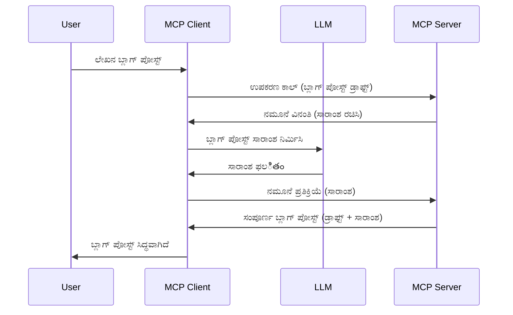

# ಸಂಪ್ರೇಕ್ಷಣ - ಗ್ರಾಹಕರಿಗೆ ವೈಶಿಷ್ಟ್ಯಗಳನ್ನು делಿಗೇಟ್ ಮಾಡುವುದು

ಕೆಲವೊಮ್ಮೆ, ನೀವು ಸಹಜ ಗುರಿಯನ್ನು ಸಾಧಿಸಲು MCP ಗ್ರಾಹಕ ಮತ್ತು MCP ಸರ್ವರ್ ಅನ್ನು ಸಹಕರಿಸುವ ಅಗತ್ಯವಿರಬಹುದು. ನೀವು ಹೊಂದಿಸಬಹುದಾದ ಸನ್ನಿವೇಶದಲ್ಲಿ, ಸರ್ವರ್ ಗ್ರಾಹಕರ ಬಳಿ ಇರುವ LLM ರ ಸಹಾಯವನ್ನು ಬೇಕಾದಾಗಿರಬಹುದು. ಈ ಪರಿಸ್ಥಿತಿಗೆ, ಸಂಪ್ರೇಕ್ಷಣವನ್ನು ಬಳಸಬೇಕು.

ನಾವು ಕೆಲವು ಬಳಕೆ ಪ್ರಕರಣಗಳನ್ನು ಮತ್ತು ಸಂಪ್ರೇಕ್ಷಣವನ್ನು ಒಳಗೊಂಡ ಪರಿಹಾರವನ್ನು ಹೇಗೆ ನಿರ್ಮಿಸುವುದನ್ನು ಅನ್ವೇಷಿಸೋಣ.

## ಅವಲೋಕನ

ಈ ಪಾಠದಲ್ಲಿ, ನಾವು ಸಂಪ್ರೇಕ್ಷಣವನ್ನು ಬೇಕಾದಾಗ ಮತ್ತು ಎಲ್ಲಿ ಬಳಸಬೇಕು ಮತ್ತು ಅದನ್ನು ಹೇಗೆ ಸಂರಚಿಸುವುದನ್ನು ವಿವರಿಸೋಣ.

## ಕಲಿಕೆಯ ಗುರಿಗಳು

ಈ ಅಧ್ಯಾಯದಲ್ಲಿ, ನಾವು:

- ಸಂಪ್ರೇಕ್ಷಣ ಎಂದರೇನು ಮತ್ತು ಅದನ್ನು ಬಳಸಬೇಕಾದ ಸಂದರ್ಭಗಳನ್ನು ವಿವರಿಸೋಣ.
- MCP ನಲ್ಲಿ ಸಂಪ್ರೇಕ್ಷಿಸಿದ ನವೀನತೆಯನ್ನು ಹೇಗೆ ಸಂರಚಿಸುವುದನ್ನು ತೋರಿಸೋಣ.
- ಸಂಪ್ರೇಕ್ಷಣವನ್ನು ಪ್ರಾಯೋಗಿಕವಾಗಿ ಹೇಗೆ ಬಳಸಬಹುದು ಎಂಬ ಉದಾಹರಣೆಗಳನ್ನು ನೀಡೋಣ.

## ಸಂಪ್ರೇಕ್ಷಣ ಎಂದರೇನು ಮತ್ತು ಅದನ್ನು ಯಾಕೆ ಬಳಸಬೇಕು?

ಸಂಪ್ರೇಕ್ಷಣವು ಕೆಳಗಿನ ರೀತಿಯಲ್ಲಿ ಕೆಲಸ ಮಾಡುವ ಏಕದೇವanced ವೈಶಿಷ್ಟ್ಯ.


### ಸಂಪ್ರೇಕ್ಷಣ ವಿನಂತಿ

ಸರಿ, ಈಗ ನಮ್ಮ ಬಳಿ ವಿಶ್ವಾಸಾರ್ಹ ಸಂದರ್ಭದ ಮೇಲೆ ಮೇಲುಮಟ್ಟದ ದೃಷ್ಟಿ ಇದೆ, ಗ್ರಾಹಕರಿಗೆ ಸರ್ವರ್ ಕಳುಹಿಸುವ ಸಂಪ್ರೇಕ್ಷಣ ವಿನಂತಿ ಬಗ್ಗೆ ಮಾತಾಡೋಣ. JSON-RPC ಸ್ವರೂಪದಲ್ಲಿ ಈ ರೀತಿಯಾಗಿ ಕಂಡುಬರುತ್ತದೆ:

```json
{
  "jsonrpc": "2.0",
  "id": 1,
  "method": "sampling/createMessage",
  "params": {
    "messages": [
      {
        "role": "user",
        "content": {
          "type": "text",
          "text": "Create a blog post summary of the following blog post: <BLOG POST>"
        }
      }
    ],
    "modelPreferences": {
      "hints": [
        {
          "name": "claude-3-sonnet"
        }
      ],
      "intelligencePriority": 0.8,
      "speedPriority": 0.5
    },
    "systemPrompt": "You are a helpful assistant.",
    "maxTokens": 100
  }
}
```

ಇಲ್ಲಿ ಕೆಲವು ಮುಖ್ಯ ಅಂಶಗಳು:

- Prompt, content -> text ಅಡಿಯಲ್ಲಿ, ನಮ್ಮ ಪ್ರಾಂಪ್ಟ್ ಆಗಿದ್ದು LLM ಗೆ ಬ್ಲೋಗ್ ಪೋಸ್ಟ್ ವಿಷಯವನ್ನು ಸಂಕ್ಷಿಪ್ತಗೊಳಿಸುವ ಸೂಚನೆ.

- **modelPreferences**: ಇದು ಕೇವಲ ಆದ್ಯತೆ, LLM ಜೊತೆಗೆ ಯಾವ ಸಂರಚನೆಯನ್ನು ಬಳಸಬೇಕು ಎಂಬ ಶಿಫಾರಸು. ಬಳಕೆದಾರರು ಈ ಶಿಫಾರಸುಗಳನ್ನು ಪಾಲಿಸಬಹುದು ಅಥವಾ ಬದಲಾಯಿಸಬಹುದು. ಈ ಸಂದರ್ಭದಲ್ಲಿ ಶಿಫಾರಸು ಮಾಡಲಾದ ಮಾದರಿ, ವೇಗ ಮತ್ತು ಬುದ್ಧಿಮತ್ತೆ ಆದ್ಯತೆಯ ಬಗ್ಗೆ ಸೂಚನೆಗಳಿವೆ.
- **systemPrompt**: ನಿಮ್ಮ ಸಾಮಾನ್ಯ ಸಿಸ್ಟಂ ಪ್ರಾಂಪ್ಟ್ ಆಗಿದ್ದು, ನಿಮ್ಮ LLM ಗೆ ವ್ಯಕ್ತಿತ್ವ ನೀಡುತ್ತದೆ ಮತ್ತು ಮಾರ್ಗದರ್ಶನ ಸೂಚನೆಗಳನ್ನು ಒಳಗೊಂಡಿದೆ.
- **maxTokens**: ಈ ಗುಣಲಕ್ಷಣವು ಈ ಕೆಲಸಕ್ಕೆ ಎಷ್ಟು ಟೋಕನ್ಗಳನ್ನು ಬಳಸಬೇಕೆಂದು ಸೂಚಿಸುತ್ತದೆ.

### ಸಂಪ್ರೇಕ್ಷಣ ಪ್ರತಿಕ್ರಿಯೆ

ಈ ಪ್ರತಿಕ್ರಿಯೆಯನ್ನು MCP ಗ್ರಾಹಕ ಸರ್ವರ್‌ಗೆ ಹಿಂತಿರುಗಿಸುತ್ತದೆ. ಇದು ಗ್ರಾಹಕ LLM ಗೆ ಕರೆ ಮಾಡಿ, ಪ್ರತಿಕ್ರಿಯೆ ಬಂದ ಮೇಲೆ ಈ ಸಂದೇಶವನ್ನು ರಚಿಸುವ ಫಲಿತಾಂಶ. JSON-RPC ಸ್ವರೂಪದಲ್ಲಿ ಈ ಮಾದರಿಯಲ್ಲಿ ಕಾಣಬಹುದು:

```json
{
  "jsonrpc": "2.0",
  "id": 1,
  "result": {
    "role": "assistant",
    "content": {
      "type": "text",
      "text": "Here's your abstract <ABSTRACT>"
    },
    "model": "gpt-5",
    "stopReason": "endTurn"
  }
}
```

ನೋಡು, ಪ್ರತಿಕ್ರಿಯೆ ಬ್ಲಾಗ್ ಪೋಸ್ಟ್ ಸಂಕ್ಷೇಪವಾಗಿದ್ದು, ನಾವು ಕೇಳಿದಂತೆ ಇದೆ. ಮತ್ತು ಬಳಕೆ ಮಾಡಲಾದ `model` ನಾವು ಕೇಳಿದದರಿಂದ ಭಿನ್ನವಾಗಿದೆ, "claude-3-sonnet" ಬದಲು "gpt-5" ಬಳಕೆ ಮಾಡಲಾಗಿದೆ. ಇದರಿಂದ ಬಳಕೆದಾರರು ತಮ್ಮ ಆಯ್ಕೆಯನ್ನು ಬದಲಾಯಿಸಬಹುದು ಮತ್ತು ನಿಮ್ಮ ಸಂಪ್ರೇಕ್ಷಣ ವಿನಂತಿ ಶಿಫಾರಸು ಎಂಬುದನ್ನು ಪ್ರದರ್ಶಿಸುತ್ತದೆ.

ನಾವು ಮುಖ್ಯ ಪ್ರಕ್ರಿಯೆಯನ್ನು ಈಗ ಅರಿತುಕೊಂಡಿದ್ದೇವೆ. "ಬ್ಲಾಗ್ ಪೋಸ್ಟ್ ರಚನೆ + ಸಂಕ್ಷೇಪ" ಕೆಲಸಕ್ಕೆ ಆ ಕಾರ್ಯವನ್ನು ಉಪಯೋಗಿಸುವುದರೊಳಗಿನ ವಿವರ ಏನಿದೆ ನೋಡೋಣ.

### ಸಂದೇಶ ಪ್ರಕಾರಗಳು

ಸಂಪ್ರೇಕ್ಷಣ ಸಂದೇಶಗಳು ಕೇವಲ ಪಠ್ಯದೊಂದಿಗೆ ನಿಂತಿರುವುದಿಲ್ಲ, ಚಿತ್ರಗಳು ಮತ್ತು ಧ್ವನಿಯೂ ಕಳುಹಿಸಬಹುದು. JSON-RPC ಹೇಗೆ ಭಿನ್ನವಾಗುತ್ತದೆ ಏನೋ ಇದು:

**ಪಠ್ಯ**

```json
{
  "type": "text",
  "text": "The message content"
}
```

**ಚಿತ್ರ ವಿಷಯ**

```json
{
  "type": "image",
  "data": "base64-encoded-image-data",
  "mimeType": "image/jpeg"
}
```

**ಧ್ವನಿ ವಿಷಯ**

```json
{
  "type": "audio",
  "data": "base64-encoded-audio-data",
  "mimeType": "audio/wav"
}
```

> NOTE: ಸಂಪ್ರೇಕ್ಷಣದ ವಿವರವಾದ ಮಾಹಿತಿಗಾಗಿ, [ಅಧಿಕೃತ ಡಾಕ್ಯುಮೆಂಟೇಶನ್](https://modelcontextprotocol.io/specification/2025-06-18/client/sampling) ಅನ್ನು ನೋಡಿ

## ಗ್ರಾಹಕದಲ್ಲಿ ಸಂಪ್ರೇಕ್ಷಣವನ್ನು ಹೇಗೆ ಸಂರಚಿಸುವುದು

> ಗಮನಿಸಿ: ನೀವು ಸರ್ವರ್ ಮಾತ್ರ ನಿರ್ಮಿಸಿದರೆ, ಇದರಲ್ಲಿ ಹೆಚ್ಚು ಮಾಡುವುದೇ ಇಲ್ಲ.

ಗ್ರಾಹಕದಲ್ಲಿ, ನೀವು ಈ ಕೆಳಗಿನ ವೈಶಿಷ್ಟ್ಯವನ್ನು ಈ ರೀತಿ ಗೌರವಿಸಬೇಕು:

```json
{
  "capabilities": {
    "sampling": {}
  }
}
```

ನೀವು ಆಯ್ಕೆಮಾಡಿದ ಗ್ರಾಹಕ ಸರ್ವರ್‌ಗಾಗಿ ಪ್ರಾರಂಭಿಸಿದಾಗ ಈ ಆಯ್ಕೆಯನ್ನು ಗ್ರಹಿಸಲಾಗುತ್ತದೆ.

## ಸಂಪ್ರೇಕ್ಷಣದ ಪ್ರಾಯೋಗಿಕ ಉದಾಹರಣೆ - ಬ್ಲಾಗ್ ಪೋಸ್ಟ್ ರಚನೆ

ನಾವು ಸಂಪ್ರೇಕ್ಷಣ ಸರ್ವರ್ ಕೋಡ್ ಮಾಡೋಣ. ನಾವು ಈ ಕೆಳಗಿನ ಕ್ರಮ ಅನುಸರಿಸೋಣ:

1. ಸರ್ವರ್ ಮೇಲೆ ಒಂದು ಉಪಕರಣ ರಚಿಸಿ.
1. ಆ ಉಪಕರಣವು ಸಂಪ್ರೇಕ್ಷಣ ವಿನಂತಿಯನ್ನು ರಚಿಸಬೇಕು.
1. ಉಪಕರಣವು ಗ್ರಾಹಕರ ಸಂಪ್ರೇಕ್ಷಣ ವಿನಂತಿಗೆ ಉತ್ತರಿಸಲು ಕಾಯಬೇಕು.
1. ನಂತರ ಉಪಕರಣದ ಫಲಿತಾಂಶವನ್ನು ರಚಿಸಬೇಕು.

ಹಂತ ಹಂತವಾಗಿ ಕೋಡ್ ನೋಡೋಣ:

### -1- ಉಪಕರಣ ರಚಿಸಿ

**python**

```python
@mcp.tool()
async def create_blog(title: str, content: str, ctx: Context[ServerSession, None]) -> str:
    """Create a blog post and generate a summary"""

```

### -2- ಸಂಪ್ರೇಕ್ಷಣ ವಿನಂತಿಯನ್ನು ರಚಿಸಿ

ನಿಮ್ಮ ಉಪಕರಣವನ್ನು ಈ ಕೆಳಗಿನ ಕೋಡ್ ಸಹಿತ ವಿಸ್ತರಿಸಿ:

**python**

```python
post = BlogPost(
        id=len(posts) + 1,
        title=title,
        content=content,
        abstract=""
    )

prompt = f"Create an abstract of the following blog post: title: {title} and draft: {content} "

result = await ctx.session.create_message(
        messages=[
            SamplingMessage(
                role="user",
                content=TextContent(type="text", text=prompt),
            )
        ],
        max_tokens=100,
)

```

### -3- ಉತ್ತರಕ್ಕಾಗಿ ಕಾಯಿರಿ ಮತ್ತು ಉತ್ತರವನ್ನು ಹಿಂತಿರುಗಿಸಿ

**python**

```python
post.abstract = result.content.text

posts.append(post)

# ಸಂಪೂರ್ಣ ಉತ್ಪನ್ನವನ್ನು ಹಿಂತಿರುಗಿಸಿ
return json.dumps({
    "id": post.title,
    "abstract": post.abstract
})
```

### -4- ಪೂರ್ಣ ಕೋಡ್

**python**

```python
from starlette.applications import Starlette
from starlette.routing import Mount, Host

from mcp.server.fastmcp import Context, FastMCP

from mcp.server.session import ServerSession
from mcp.types import SamplingMessage, TextContent

import json


from uuid import uuid4
from typing import List
from pydantic import BaseModel


mcp = FastMCP("Blog post generator")

# app = FastAPI()

posts = []

class BlogPost(BaseModel):
    id: int
    title: str
    content: str
    abstract: str

posts: List[BlogPost] = []

@mcp.tool()
async def create_blog(title: str, content: str, ctx: Context[ServerSession, None]) -> str:
    """Create a blog post and generate a summary"""

    post = BlogPost(
        id=len(posts) + 1,
        title=title,
        content=content,
        abstract=""
    )

    prompt = f"Create an abstract of the following blog post: title: {title} and draft: {content} "

    result = await ctx.session.create_message(
        messages=[
            SamplingMessage(
                role="user",
                content=TextContent(type="text", text=prompt),
            )
        ],
        max_tokens=100,
    )

    post.abstract = result.content.text

    posts.append(post)

    # ಸಂಪೂರ್ಣ ಬ್ಲಾಗ್ ಪೋಸ್ಟ್ ಅನ್ನು 반환ಿಸಿ
    return json.dumps({
        "id": post.title,
        "abstract": post.abstract
    })

if __name__ == "__main__":
    print("Starting server...")
    # mcp.run()
    mcp.run(transport="streamable-http")

# ಕೆಳಗಿನಂತೆ ಅಪ್ ಚಾಲನೆ ಮಾಡಿ: python server.py
```

### -5- Visual Studio Code ನಲ್ಲಿ ಪರೀಕ್ಷಿಸುವುದು

Visual Studio Code ನಲ್ಲಿ ಪರೀಕ್ಷಿಸಲು ಈ ಕ್ರಮ ಅನುಸರಿಸಿ:

1. ಟರ್ಮಿನಲ್‌ನಲ್ಲಿ ಸರ್ವರ್ ಆರಂಭಿಸಿ
1. ಅದನ್ನು *mcp.json*ಗೆ ಸೇರಿಸಿ (ಆದರೆ ಅದು ಪ್ರಾರಂಭವಾಗಿರುವುದು ಖಚಿತಪಡಿಸಿಕೊಳ್ಳಿ), ಉದಾಹರಣೆಗೆ:

   ```json
   "servers": {
      "blog-server": {
        "type": "http",
        "url": "http://localhost:8000/mcp"
      }
   }
   ```

1. ಪ್ರಾಂಪ್ಟ್ ಅನ್ನು ಟೈಪಿಸಿ:

   ```text
   create a blog post named "Where Python comes from", the content is "Python is actually named after Monty Python Flying Circus"
   ```

1. ಸಂಪ್ರೇಕ್ಷಣಕ್ಕೆ ಅವಕಾಶ ನೀಡಿ. ಮೊದಲ ಬಾರಿ ಪರೀಕ್ಷಿಸುವಾಗ ನೀವು ಹೆಚ್ಚುವರಿ ಸಂಭಾಷಣೆಯನ್ನು ಸ್ವೀಕರಿಸಲು ಹೇಳಲಾಗುತ್ತದೆ, ನಂತರ ಸಾಮಾನ್ಯ ಸಮಾಲೋಚನೆ ನಿಮಗೆ ಬರಲಿದೆ ಉಪಕರಣವನ್ನು ಚಾಲನೆ ಮಾಡಲು.

1. ಫಲಿತಾಂಶಗಳನ್ನು ಪರಿಶೀಲಿಸಿ. GitHub Copilot ಚಾಟ್‌ನಲ್ಲಿ ಪರಿಣಾಮಗಳನ್ನು ಸುಂದರವಾಗಿ ಪ್ರದರ್ಶಿಸಲಾಗುತ್ತದೆ ಮತ್ತು ನಿಮಗೆ ಮೂಲ JSON ಪ್ರತಿಕ್ರಿಯೆಯನ್ನು ಪರಿಶೀಲಿಸಲು ಸಹ ಸಾಧ್ಯ.

**ಬೋನಸ್**. Visual Studio Code ಉಪಕರಣಗಳಲ್ಲಿ ಸಂಪ್ರೇಕ್ಷಣಕ್ಕೆ ಉತ್ತಮ ಬೆಂಬಲವಿದೆ. ನೀವು ಸಂಪ್ರೇಕ್ಷಣ ಪ್ರವೇಶವನ್ನು ನಿಮ್ಮ ಸ್ಥಾಪಿತ ಸರ್ವರ್‌ನಲ್ಲಿ ಹೀಗಾಗಿ ಸಂರಚಿಸಬಹುದು:

1. ವಿಸ್ತರಣೆ ವಿಭಾಗಕ್ಕೆ ಹೋಗಿ.
1. "MCP ಸರ್ವರ್‌ಗಳು - ಸ್ಥಾಪಿತ" ವಿಭಾಗದಲ್ಲಿ ನಿಮ್ಮ ಸರ್ವರಿನ ಮೇಲೆ ಗೀಯರ್ ಐಕಾನ್‌ನನ್ನು ಆಯ್ಕೆ ಮಾಡಿ.
1 "ಮಾದರಿ ಪ್ರವೇಶವನ್ನು ಸಂರಚಿಸಿ" ಆಯ್ಕೆ ಮಾಡಿ. ಇಲ್ಲಿ GitHub Copilot ಯಾವ ಮಾದರಿಗಳನ್ನು ಸಂಪ್ರೇಕ್ಷಣ ಸಮಯದಲ್ಲಿ ಬಳಸಬಹುದು ಎಂದು ಆಯ್ಕೆ ಮಾಡಬಹುದು. ಇತ್ತೀಚೆಗೆ ನಡೆದ ಎಲ್ಲಾ ಸಂಪ್ರೇಕ್ಷಣ ವಿನಂತಿಗಳನ್ನು "ಸಂಪ್ರೇಕ್ಷಣ ವಿನಂತಿಗಳನ್ನು ತೋರಿಸಿ" ಆಯ್ಕೆಮಾಡಿ ನೋಡಬಹುದು.

## ಪರಿಸರವೋದ್ಯಮ

ಈ ನಿಯೋಜನೆಯಲ್ಲಿ ನೀವು ಸಣ್ಣದೊಮ್ಮೆ ವಿಭಿನ್ನ ಸಂಪ್ರೇಕ್ಷಣವನ್ನು ರಚಿಸುವಿರಿ, ಇದು ಉತ್ಪನ್ನ ವಿವರಣೆ ರಚನೆ ಬೆಂಬಲಿಸುವ ಸಂಪ್ರೇಕ್ಷಣ ಸಂಯೋಜನೆ. ನಿಮ್ಮ ಸನ್ನಿವೇಶ:

**ಸನ್ನಿವೇಶ**: ಇ-ಕಾಮರ್ಸ್ ಬ್ಯಾಕ್ ಆಫೀಸ್ ಕೆಲಸಗಾರರಿಗೆ ಉತ್ಪನ್ನ ವಿವರಣೆ ರಚಿಸಲು ತುಂಬ ಸಮಯ ಬೇಕಾಗುತ್ತದೆ. ಆದ್ದರಿಂದ, ನೀವು "create_product" ಎಂಬ ಉಪಕರಣವನ್ನು "title" ಮತ್ತು "keywords" ವಾದಗಳೊಂದಿಗೆ ಕರೆ ಮಾಡಬೇಕಾಗಿದೆ ಮತ್ತು ಅದು ಪೂರೈಸುವುದಾದ ಉತ್ಪನ್ನವನ್ನು "description" ಕ್ಷೇತ್ರವನ್ನು ಗ್ರಾಹಕರ LLM ಮೂಲಕ ಪೂರೈಸಬೇಕು.

TIP: ನೀವು ಮೊದಲು ಕಲಿತ ವಿಧಾನವನ್ನು ಉಪಕರಣ ಮತ್ತು ಸರ್ವರ್ ಜೊತೆಗೆ ಸಂಪ್ರೇಕ್ಷಣ ವಿನಂತಿ ಬಳಸಿ ರಚಿಸುವುದನ್ನು ಪ್ರಯೋಗಿಸಿ.

## ಪರಿಹಾರ

[ಪರಿಹಾರ](./solution/README.md)

## ಪ್ರಮುಖ ಅಂಶಗಳು

ಸಂಪ್ರೇಕ್ಷಣವು ಸದೃಢ ವೈಶಿಷ್ಟ್ಯವಾಗಿದ್ದು, ಸರ್ವರ್‌ಗೆ LLM ಸಹಾಯ ಬೇಕಾದಾಗ ಗ್ರಾಹಕರಿಗೆ ಕಾರ್ಯಗಳನ್ನು ಹಂಚುವ ಅವಕಾಶ ನೀಡುತ್ತದೆ.

## ಮುಂದೇನು

- [ಅಧ್ಯಾಯ 4 - ಪ್ರಾಯೋಗಿಕ ಅನುಷ್ಠಾನ](../../04-PracticalImplementation/README.md)

---

<!-- CO-OP TRANSLATOR DISCLAIMER START -->
**ಅನುಮತಿಯ ತಪ್ಪು ಸೂಚನೆ**:  
ಈ ಡಾಕ್ಯುಮೆಂಟ್ ಅನ್ನು AI ಅನುವಾದ ಸೇವೆ [Co-op Translator](https://github.com/Azure/co-op-translator) ಬಳಸಿ ಅನುವಾದಿಸಲಾಗಿದೆ. ನಾವು ನಿಖರತೆಯ ಬಗ್ಗೆ ಪ್ರಯತ್ನಿಸಿದರೂ, ಸ್ವಯಂಚಾಲಿತ ಅನುವಾದಗಳಲ್ಲಿ ದೋಷಗಳು ಅಥವಾ ಅಸತ್ಯತೆಯಾಂಶಗಳು ಇರಬಹುದು ಎಂಬುದನ್ನು कृಪೆಗೈದು ಗಮನಿಸಿ. ಮೂಲ ಭಾಷೆಯಲ್ಲಿ ಇರುವ ಮೂಲ ಡಾಕ್ಯುಮೆಂಟ್ ಅವರನ್ನು ಅಧಿಕೃತ ಮೂಲ ಎಂದು ಪರಿಗಣಿಸಬೇಕು. ಮಹತ್ವದ ಮಾಹಿತಿಗಾಗಿ, ವೃತ್ತಿಪರ ಮಾನವನಿಂದ ನಡೆಸಲಾದ ಅನುವಾದವನ್ನು ಶಿಫಾರಸು ಮಾಡಲಾಗುತ್ತದೆ. ಈ ಅನುವಾದದ ಬಳಕೆಯಿಂದ ಉಂಟಾಗುವ ಯಾವುದೇ ಅರ್ಥಮಾರ್ಪಡಿಕೆ ಅಥವಾ ತಪ್ಪು ವಿವರಣೆಗಳಿಗೆ ನಾವು ಹೊಣೆಗಾರರಲ್ಲ.
<!-- CO-OP TRANSLATOR DISCLAIMER END -->