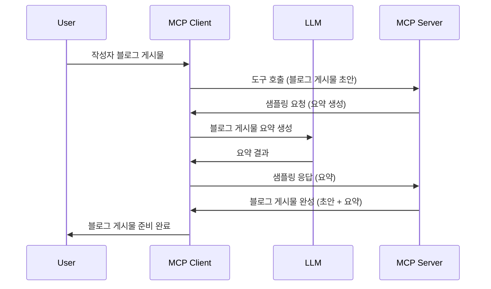

# 샘플링 - 클라이언트에 기능 위임하기

때때로, MCP 클라이언트와 MCP 서버가 공동의 목표를 달성하기 위해 협력할 필요가 있습니다. 서버가 클라이언트에 있는 LLM의 도움이 필요한 경우가 있을 수 있습니다. 이런 상황에서 샘플링을 사용해야 합니다.

몇 가지 사용 사례와 샘플링을 포함하는 솔루션을 구축하는 방법을 살펴보겠습니다.

## 개요

이 강의에서는 샘플링을 언제, 어디서 사용해야 하는지와 그것을 구성하는 방법에 대해 중점적으로 설명합니다.

## 학습 목표

이 장에서는:

- 샘플링이 무엇이며 언제 사용하는지 설명합니다.
- MCP에서 샘플링을 구성하는 방법을 보여줍니다.
- 샘플링이 실제로 어떻게 작동하는지 예를 통해 제공합니다.

## 샘플링이란 무엇이며 왜 사용하는가?

샘플링은 다음과 같이 동작하는 고급 기능입니다:


### 샘플링 요청

좋습니다, 이제 신뢰할 수 있는 시나리오를 큰 틀에서 살펴봤으니 서버가 클라이언트에게 다시 보내는 샘플링 요청에 대해 이야기해봅시다. JSON-RPC 형식으로 이 요청은 다음과 같이 보일 수 있습니다:

```json
{
  "jsonrpc": "2.0",
  "id": 1,
  "method": "sampling/createMessage",
  "params": {
    "messages": [
      {
        "role": "user",
        "content": {
          "type": "text",
          "text": "Create a blog post summary of the following blog post: <BLOG POST>"
        }
      }
    ],
    "modelPreferences": {
      "hints": [
        {
          "name": "claude-3-sonnet"
        }
      ],
      "intelligencePriority": 0.8,
      "speedPriority": 0.5
    },
    "systemPrompt": "You are a helpful assistant.",
    "maxTokens": 100
  }
}
```

여기서 주목할 만한 몇 가지 점은 다음과 같습니다:

- content -> text 아래의 Prompt는 LLM에게 블로그 게시물 내용을 요약하도록 지시하는 프롬프트입니다.

- **modelPreferences**. 이 부분은 말 그대로 LLM 구성에 대해 추천하는 설정입니다. 사용자는 이 권장사항을 따를지 아니면 변경할지 선택할 수 있습니다. 이 경우, 사용할 모델, 속도 우선순위 및 지능 우선순위에 관한 권장사항이 포함되어 있습니다.
- **systemPrompt**는 LLM에게 개성과 지침을 제공하는 일반적인 시스템 프롬프트입니다.
- **maxTokens**는 이 작업에 권장되는 토큰 수를 나타내는 속성입니다.

### 샘플링 응답

이 응답은 MCP 클라이언트가 LLM에 호출을 한 후 응답을 기다리고 이를 구성하여 MCP 서버에 다시 보내는 메시지입니다. JSON-RPC 형식은 다음과 같습니다:

```json
{
  "jsonrpc": "2.0",
  "id": 1,
  "result": {
    "role": "assistant",
    "content": {
      "type": "text",
      "text": "Here's your abstract <ABSTRACT>"
    },
    "model": "gpt-5",
    "stopReason": "endTurn"
  }
}
```

응답이 요청한 대로 블로그 게시물의 요약본인 점을 주목하세요. 또한 사용된 `model`이 요청한 "claude-3-sonnet"이 아니라 "gpt-5"인 점도 눈여겨보세요. 이는 사용자가 사용할 모델을 변경할 수 있고, 샘플링 요청이 권장사항임을 보여주기 위함입니다.

좋습니다, 이제 주요 흐름과 "블로그 게시물 작성 + 요약"이라는 유용한 작업을 이해했으니 작동시키기 위해 해야 할 일을 알아봅시다.

### 메시지 유형

샘플링 메시지는 텍스트에만 국한되지 않고 이미지와 오디오도 보낼 수 있습니다. JSON-RPC가 어떻게 다른지 살펴보겠습니다:

**텍스트**

```json
{
  "type": "text",
  "text": "The message content"
}
```

**이미지 콘텐츠**

```json
{
  "type": "image",
  "data": "base64-encoded-image-data",
  "mimeType": "image/jpeg"
}
```

**오디오 콘텐츠**

```json
{
  "type": "audio",
  "data": "base64-encoded-audio-data",
  "mimeType": "audio/wav"
}
```

> NOTE: 샘플링에 대한 더 자세한 정보는 [공식 문서](https://modelcontextprotocol.io/specification/2025-06-18/client/sampling)를 참고하세요.

## 클라이언트에서 샘플링 구성하는 방법

> 참고: 서버만 구축하는 경우 이 부분은 크게 신경 쓸 필요가 없습니다.

클라이언트에서는 다음과 같이 기능을 지정해야 합니다:

```json
{
  "capabilities": {
    "sampling": {}
  }
}
```

이후 선택한 클라이언트가 서버와 초기화할 때 이 설정이 적용됩니다.

## 샘플링 예제 - 블로그 게시물 만들기

함께 샘플링 서버를 코딩해봅시다. 다음 작업이 필요합니다:

1. 서버에서 도구를 생성합니다.
2. 해당 도구는 샘플링 요청을 생성해야 합니다.
3. 도구는 클라이언트의 샘플링 요청에 대한 응답을 기다려야 합니다.
4. 그런 다음 도구 결과를 생성합니다.

단계별로 코드를 살펴봅시다:

### -1- 도구 생성하기

**python**

```python
@mcp.tool()
async def create_blog(title: str, content: str, ctx: Context[ServerSession, None]) -> str:
    """Create a blog post and generate a summary"""

```

### -2- 샘플링 요청 생성하기

다음 코드를 도구에 추가하십시오:

**python**

```python
post = BlogPost(
        id=len(posts) + 1,
        title=title,
        content=content,
        abstract=""
    )

prompt = f"Create an abstract of the following blog post: title: {title} and draft: {content} "

result = await ctx.session.create_message(
        messages=[
            SamplingMessage(
                role="user",
                content=TextContent(type="text", text=prompt),
            )
        ],
        max_tokens=100,
)

```

### -3- 응답을 기다리고 반환하기

**python**

```python
post.abstract = result.content.text

posts.append(post)

# 완성된 제품을 반환합니다
return json.dumps({
    "id": post.title,
    "abstract": post.abstract
})
```

### -4- 전체 코드

**python**

```python
from starlette.applications import Starlette
from starlette.routing import Mount, Host

from mcp.server.fastmcp import Context, FastMCP

from mcp.server.session import ServerSession
from mcp.types import SamplingMessage, TextContent

import json


from uuid import uuid4
from typing import List
from pydantic import BaseModel


mcp = FastMCP("Blog post generator")

# app = FastAPI()

posts = []

class BlogPost(BaseModel):
    id: int
    title: str
    content: str
    abstract: str

posts: List[BlogPost] = []

@mcp.tool()
async def create_blog(title: str, content: str, ctx: Context[ServerSession, None]) -> str:
    """Create a blog post and generate a summary"""

    post = BlogPost(
        id=len(posts) + 1,
        title=title,
        content=content,
        abstract=""
    )

    prompt = f"Create an abstract of the following blog post: title: {title} and draft: {content} "

    result = await ctx.session.create_message(
        messages=[
            SamplingMessage(
                role="user",
                content=TextContent(type="text", text=prompt),
            )
        ],
        max_tokens=100,
    )

    post.abstract = result.content.text

    posts.append(post)

    # 전체 블로그 게시물을 반환합니다
    return json.dumps({
        "id": post.title,
        "abstract": post.abstract
    })

if __name__ == "__main__":
    print("Starting server...")
    # mcp.run()
    mcp.run(transport="streamable-http")

# 다음 명령어로 앱을 실행합니다: python server.py
```

### -5- Visual Studio Code에서 테스트하기

Visual Studio Code에서 이 코드를 테스트하려면 다음을 수행하세요:

1. 터미널에서 서버를 시작합니다.
2. *mcp.json*에 서버를 추가하고 서버가 시작되었는지 확인합니다. 예를 들면 다음과 같습니다:

   ```json
   "servers": {
      "blog-server": {
        "type": "http",
        "url": "http://localhost:8000/mcp"
      }
   }
   ```

3. 프롬프트를 입력합니다:

   ```text
   create a blog post named "Where Python comes from", the content is "Python is actually named after Monty Python Flying Circus"
   ```

4. 샘플링 과정을 진행하세요. 처음 테스트할 때는 추가 대화상자가 나타나며 이를 승인해야 합니다. 그 후 도구 실행 여부를 묻는 정상 대화상자가 표시됩니다.

5. 결과를 확인하세요. 결과가 GitHub Copilot Chat에서 깔끔하게 렌더링된 모습뿐 아니라 원시 JSON 응답도 확인할 수 있습니다.

**보너스**. Visual Studio Code 도구는 샘플링을 매우 잘 지원합니다. 설치된 서버에서 샘플링 접근을 구성하려면 다음 단계를 따르세요:

1. 확장 기능 섹션으로 이동합니다.
2. "MCP SERVERS - INSTALLED" 섹션에서 설치된 서버의 톱니바퀴 아이콘을 선택합니다.
3. "Configure Model Access"를 선택하면 GitHub Copilot이 샘플링 시 사용할 수 있는 모델을 선택할 수 있습니다. 또한 "Show Sampling requests"를 선택해 최근 샘플링 요청 내역을 볼 수 있습니다.

## 과제

이번 과제에서는 약간 다른 샘플링, 즉 제품 설명 생성을 지원하는 샘플링 통합을 구축합니다. 시나리는 다음과 같습니다:

**시나리오**: 전자상거래 백오피스 직원은 제품 설명 생성에 너무 많은 시간이 걸려 도움을 필요로 합니다. 따라서 "title"과 "keywords"를 인수로 받아 완전한 제품 정보를 생성하는 "create_product" 도구를 구축하세요. 제품에는 클라이언트의 LLM이 채워야 하는 "description" 필드가 포함되어야 합니다.

TIP: 앞서 배운 샘플링 요청을 사용해 서버와 도구를 구성하는 방법을 활용하세요.

## 솔루션

[Solution](./solution/README.md)

## 주요 내용 정리

샘플링은 서버가 LLM의 도움이 필요할 때 클라이언트에 작업을 위임할 수 있는 강력한 기능입니다.

## 다음 단계

- [4장 - 실무 구현](../../04-PracticalImplementation/README.md)

---

<!-- CO-OP TRANSLATOR DISCLAIMER START -->
**면책 조항**:  
이 문서는 AI 번역 서비스 [Co-op Translator](https://github.com/Azure/co-op-translator)를 사용하여 번역되었습니다. 정확성을 위해 최선을 다하고 있으나, 자동 번역 결과에는 오류 또는 부정확한 내용이 포함될 수 있음을 유의하시기 바랍니다. 원문은 권위 있는 출처로 간주되어야 합니다. 중요한 정보의 경우 전문적인 인간 번역을 권장합니다. 본 번역의 사용으로 인한 오해나 잘못된 해석에 대해 당사는 책임을 지지 않습니다.
<!-- CO-OP TRANSLATOR DISCLAIMER END -->