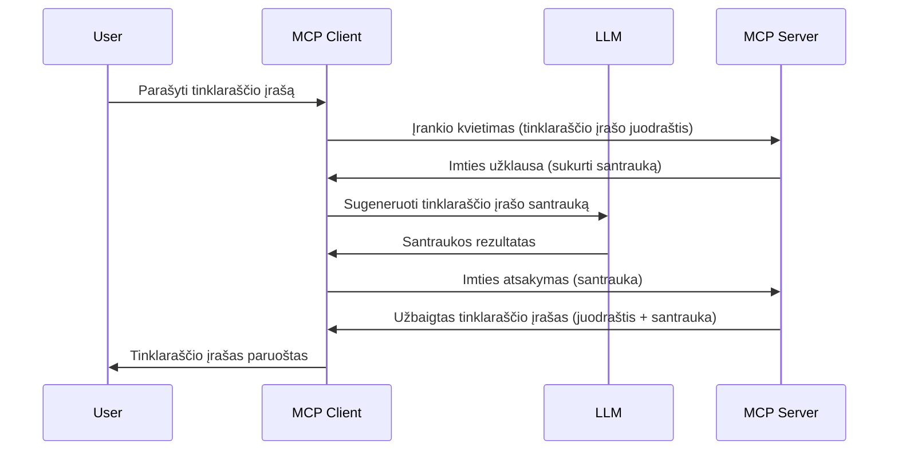

# Atranka – funkcijų delegavimas klientui

Kartais reikia, kad MCP klientas ir MCP serveris bendradarbiautų siekiant bendro tikslo. Gali būti atvejis, kai serveriui reikia pagalbos iš LLM, kuris yra kliento pusėje. Tokiu atveju reikėtų naudoti atranką.

Pažvelkime į kai kuriuos naudojimo atvejus ir kaip sukurti sprendimą, kuriame naudojama atranka.

## Apžvalga

Šioje pamokoje daugiausia dėmesio skirsime paaiškinimui, kada ir kur naudoti atranką bei kaip ją sukonfigūruoti.

## Mokymosi tikslai

Šiame skyriuje mes:

- Paaiškinsime, kas yra atranka ir kada ją naudoti.
- Parodysime, kaip konfigūruoti atranką MCP aplinkoje.
- Pateiksime atrankos naudojimo pavyzdžių.

## Kas yra atranka ir kodėl ją naudoti?

Atranka yra pažangi funkcija, veikianti tokiu būdu:


### Atrankos užklausa

Gerai, dabar turime bendrą patikimo scenarijaus vaizdą, aptarkime užklausą, kurią serveris siunčia klientui. Štai kaip tokia užklausa gali atrodyti JSON-RPC formatu:

```json
{
  "jsonrpc": "2.0",
  "id": 1,
  "method": "sampling/createMessage",
  "params": {
    "messages": [
      {
        "role": "user",
        "content": {
          "type": "text",
          "text": "Create a blog post summary of the following blog post: <BLOG POST>"
        }
      }
    ],
    "modelPreferences": {
      "hints": [
        {
          "name": "claude-3-sonnet"
        }
      ],
      "intelligencePriority": 0.8,
      "speedPriority": 0.5
    },
    "systemPrompt": "You are a helpful assistant.",
    "maxTokens": 100
  }
}
```

Čia verta paminėti keletą dalykų:

- Prompt, po content -> text, yra mūsų promptas, tai nurodymas LLM pateikti tinklaraščio įrašo turinio santrauką.

- **modelPreferences**. Ši dalis yra tiesiog rekomendacija, nurodanti, kokią konfigūraciją naudoti su LLM. Vartotojas gali pasirinkti, ar laikytis šių rekomendacijų, ar jas keisti. Šiuo atveju pateiktos rekomendacijos dėl naudojamo modelio, greičio ir intelekto prioriteto.
- **systemPrompt**, tai jūsų įprastas sistemos promptas, suteikiantis LLM asmenybę ir turintis nurodymus.
- **maxTokens**, dar viena savybė, nurodanti, kiek tokenų rekomenduojama naudoti šiai užduočiai.

### Atrankos atsakymas

Šis atsakymas yra tas, kurį MCP klientas galiausiai siunčia atgal MCP serveriui, tai yra kliento kvietimo LLM rezultatas, po kurio sukuriamas šis pranešimas. Štai kaip tai gali atrodyti JSON-RPC formatu:

```json
{
  "jsonrpc": "2.0",
  "id": 1,
  "result": {
    "role": "assistant",
    "content": {
      "type": "text",
      "text": "Here's your abstract <ABSTRACT>"
    },
    "model": "gpt-5",
    "stopReason": "endTurn"
  }
}
```

Atkreipkite dėmesį, kad atsakymas yra tinklaraščio įrašo santrauka, kaip ir prašėme. Taip pat pastebėkite, kad naudotas `model` nėra tas, kurio prašėme, o "gpt-5" vietoje "claude-3-sonnet". Tai iliustruoja, kad vartotojas gali pakeisti savo nuomonę dėl naudojamo modelio, o jūsų atrankos užklausa yra tik rekomendacija.

Gerai, dabar, kai suprantame pagrindinį srautą ir naudingą užduotį, kuriai ją naudoti „tinklaraščio įrašo kūrimas + santrauka“, pažiūrėkime, ką reikia padaryti, kad tai veiktų.

### Žinučių tipai

Atrankos žinutės nėra ribojamos tik tekstu – galite siųsti ir paveikslėlius bei garsą. Štai kaip JSON-RPC skiriasi:

**Tekstas**

```json
{
  "type": "text",
  "text": "The message content"
}
```

**Vaizdo turinys**

```json
{
  "type": "image",
  "data": "base64-encoded-image-data",
  "mimeType": "image/jpeg"
}
```

**Garso turinys**

```json
{
  "type": "audio",
  "data": "base64-encoded-audio-data",
  "mimeType": "audio/wav"
}
```

> PASTABA: detalesnę informaciją apie atranką rasite [oficialioje dokumentacijoje](https://modelcontextprotocol.io/specification/2025-06-18/client/sampling)

## Kaip konfigūruoti atranką kliente

> Pastaba: jei kuriate tik serverį, čia daug veiksmų nereikia atlikti.

Kliente turite nurodyti šią funkciją tokiu būdu:

```json
{
  "capabilities": {
    "sampling": {}
  }
}
```

Tai bus aptikta, kai pasirinktas klientas prisijungs prie serverio.

## Atrankos pavyzdys – sukurti tinklaraščio įrašą

Parašykime kartu atrankos serverį, mums reikės atlikti šiuos veiksmus:

1. Sukurti įrankį serveryje.
1. Šis įrankis turi sukurti atrankos užklausą.
1. Įrankis turi laukti, kol bus gautas kliento atsakymas į atrankos užklausą.
1. Tada turi būti sugeneruotas įrankio rezultatas.

Pažiūrėkime kodą žingsnis po žingsnio:

### -1- Sukurti įrankį

**python**

```python
@mcp.tool()
async def create_blog(title: str, content: str, ctx: Context[ServerSession, None]) -> str:
    """Create a blog post and generate a summary"""

```

### -2- Sukurti atrankos užklausą

Išplėskite savo įrankį šiuo kodu:

**python**

```python
post = BlogPost(
        id=len(posts) + 1,
        title=title,
        content=content,
        abstract=""
    )

prompt = f"Create an abstract of the following blog post: title: {title} and draft: {content} "

result = await ctx.session.create_message(
        messages=[
            SamplingMessage(
                role="user",
                content=TextContent(type="text", text=prompt),
            )
        ],
        max_tokens=100,
)

```

### -3- Palaukti atsakymo ir grąžinti jį

**python**

```python
post.abstract = result.content.text

posts.append(post)

# grąžinkite visą produktą
return json.dumps({
    "id": post.title,
    "abstract": post.abstract
})
```

### -4- Visas kodas

**python**

```python
from starlette.applications import Starlette
from starlette.routing import Mount, Host

from mcp.server.fastmcp import Context, FastMCP

from mcp.server.session import ServerSession
from mcp.types import SamplingMessage, TextContent

import json


from uuid import uuid4
from typing import List
from pydantic import BaseModel


mcp = FastMCP("Blog post generator")

# app = FastAPI()

posts = []

class BlogPost(BaseModel):
    id: int
    title: str
    content: str
    abstract: str

posts: List[BlogPost] = []

@mcp.tool()
async def create_blog(title: str, content: str, ctx: Context[ServerSession, None]) -> str:
    """Create a blog post and generate a summary"""

    post = BlogPost(
        id=len(posts) + 1,
        title=title,
        content=content,
        abstract=""
    )

    prompt = f"Create an abstract of the following blog post: title: {title} and draft: {content} "

    result = await ctx.session.create_message(
        messages=[
            SamplingMessage(
                role="user",
                content=TextContent(type="text", text=prompt),
            )
        ],
        max_tokens=100,
    )

    post.abstract = result.content.text

    posts.append(post)

    # grąžina visą tinklaraščio įrašą
    return json.dumps({
        "id": post.title,
        "abstract": post.abstract
    })

if __name__ == "__main__":
    print("Starting server...")
    # mcp.run()
    mcp.run(transport="streamable-http")

# paleiskite programą su: python server.py
```

### -5- Testavimas Visual Studio Code

Norėdami tai išbandyti Visual Studio Code, atlikite šiuos veiksmus:

1. Paleiskite serverį terminale
1. Pridėkite jį į *mcp.json* (ir įsitikinkite, kad jis paleistas), pavyzdžiui taip:

   ```json
   "servers": {
      "blog-server": {
        "type": "http",
        "url": "http://localhost:8000/mcp"
      }
   }
   ```

1. Įveskite promptą:

   ```text
   create a blog post named "Where Python comes from", the content is "Python is actually named after Monty Python Flying Circus"
   ```

1. Leiskite vykti atrankai. Pirmą kartą tai bandydami, pamatysite papildomą dialogą, kurį turėsite patvirtinti, po to bus rodoma įprasta priemonės paleidimo užklausa.

1. Patikrinkite rezultatus. Juos matysite ir gražiai pateiktus GitHub Copilot Chat, ir galite peržiūrėti žalią JSON atsakymą.

**Papildomai**. Visual Studio Code įrankiai puikiai palaiko atranką. Galite sukonfigūruoti prieigą prie Atrankos savo įdiegto serveryje taip:

1. Eikite į plėtinių skyrių.
1. Pasirinkite krumpliaračio piktogramą prie įdiegto serverio skiltyje „MCP SERVERS - INSTALLED“.
1. Pasirinkite „Configure Model Access“, čia galite pasirinkti, kuriuos modelius GitHub Copilot gali naudoti vykdydamas atranką. Taip pat galite peržiūrėti visus neseniai įvykusius atrankos užsakymus pasirinkę „Show Sampling requests“.

## Užduotis

Šioje užduotyje sukursite šiek tiek kitokią atrankos integraciją, palaikančią produkto aprašymo generavimą. Štai jūsų scenarijus:

**Scenarijus**: internetinės prekybos darbuotojui reikia pagalbos, nes gaminių aprašymų generavimas užima per daug laiko. Todėl turite sukurti sprendimą, kuriame kviečiate įrankį "create_product" su argumentais „title“ ir „keywords“, o jis turi sukurti pilną produktą, į kurį bus įtrauktas „description“ laukas, užpildytas kliento LLM.

PATARIMAS: naudokite anksčiau išmoktas žinias, kaip sukurti šį serverį ir jo įrankį naudojant atrankos užklausą.

## Sprendimas

[Sprendimas](./solution/README.md)

## Svarbiausios mintys

Atranka – galinga funkcija, leidžianti serveriui deleguoti užduotis klientui, kai reikia LLM pagalbos.

## Kas toliau

- [4 skyrius – praktinė įgyvendinimas](../../04-PracticalImplementation/README.md)

---

<!-- CO-OP TRANSLATOR DISCLAIMER START -->
**Atsakomybės apribojimas**:  
Šis dokumentas buvo išverstas naudojant AI vertimo tarnybą [Co-op Translator](https://github.com/Azure/co-op-translator). Nors stengiamės užtikrinti tikslumą, prašome atkreipti dėmesį, kad automatizuoti vertimai gali turėti klaidų ar netikslumų. Originalus dokumentas gimtąja kalba turėtų būti laikomas autoritetingu šaltiniu. Svarbiai informacijai rekomenduojama naudoti profesionalų žmogaus atliktą vertimą. Mes neatsakome už bet kokius nesusipratimus ar klaidingas interpretacijas, kylančias dėl šio vertimo naudojimo.
<!-- CO-OP TRANSLATOR DISCLAIMER END -->