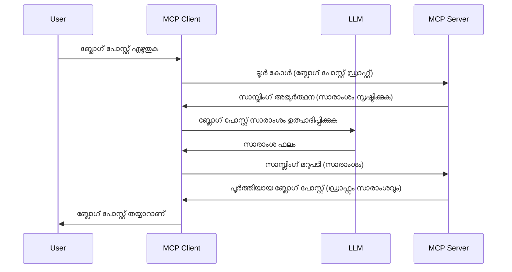

# സാമ്പിളിംഗ് - ക്ലയന്റിലേക്ക് ഫീച്ചറുകൾ ദീലിഗേറ്റ് ചെയ്യുക

അതിനുശേഷം, MCP ക്ലയന്റും MCP സെർവറും ഒരു സാധാരണ ലക്ഷ്യത്തിന്റെ ഭാഗമായി സഹകരിക്കേണ്ടി വരാം. സെർവർക്ക് ക്ലയന്റിലുള്ള LLMയുടെ സഹായം ആവശ്യമായ ഒരു സാഹചര്യമുണ്ടാകാം. ഈ സാഹചര്യത്തിൽ സാമ്പിളിംഗ് നിങ്ങളുടെ ഉപയോഗിക്കേണ്ടതായ മാർഗമാണ്.

ചില ഉപയോഗകേസുകളും സാമ്പിളിംഗ് ഉൾപ്പെടുന്ന ഒരു പരിഹാരനിർമ്മിക്കാനുള്ള രീതിയും അപരിമിതമായി പരിശോധിക്കാം.

## അവലോകനം

ഈ പാഠത്തിൽ നാം സാമ്പിളിംഗ് എപ്പോൾ എങ്ങനെ ഉപയോഗിക്കേണ്ടതും എങ്ങനെ കോൺഫിഗർ ചെയ്യേണ്ടതും വിശദീകരിക്കാം.

## പഠന ലക്ഷ്യങ്ങൾ

ഈ അധ്യായത്തിൽ, നാം:

- സാമ്പിളിംഗ് എന്താണെന്ന് എപ്പോൾ ഉപയോഗിക്കേണ്ടതെന്ന് വ്യക്തമാക്കും.
- MCPയിൽ സാമ്പിളിംഗ് എങ്ങനെ കോൺഫിഗർ ചെയ്യാമെന്ന് കാണിക്കും.
- പ്രവർത്തനത്തിലുളള സാമ്പിളിംഗിൻ്റെ ഉദാഹരണങ്ങൾ നൽകും.

## സാമ്പിളിംഗ് എന്താണ്, അത് ഉപയോഗിക്കേണ്ടതെൻ്റെ കാരണം?

സാമ്പിളിംഗ് ഒരു ആധുനിക ഫീച്ചറാണ്, ഇത് താഴെ പറയുന്ന വിധത്തിലാണ് പ്രവർത്തിക്കുന്നത്:


### സാമ്പ്ളിംഗ് അഭ്യർത്ഥന

സമ്പൂർണ്ണമായ ഒരു സാഹചര്യത്തിന്റെ വൃവശം നമുക്ക് കിട്ടിയപ്പോൾ, സെർവർ ക്ലയന്റിലേക്ക് അയക്കുന്ന സാമ്പിളിംഗ് അഭ്യർത്ഥനയെക്കുറിച്ച് സംസാരിക്കാം. JSON-RPC ഫോർമാറ്റിൽ ഇത്തരം ഒരു അഭ്യർത്ഥനം ഇങ്ങനെ കാണാം:

```json
{
  "jsonrpc": "2.0",
  "id": 1,
  "method": "sampling/createMessage",
  "params": {
    "messages": [
      {
        "role": "user",
        "content": {
          "type": "text",
          "text": "Create a blog post summary of the following blog post: <BLOG POST>"
        }
      }
    ],
    "modelPreferences": {
      "hints": [
        {
          "name": "claude-3-sonnet"
        }
      ],
      "intelligencePriority": 0.8,
      "speedPriority": 0.5
    },
    "systemPrompt": "You are a helpful assistant.",
    "maxTokens": 100
  }
}
```

ഇവിടെ ചില കാര്യങ്ങൾ ശ്രദ്ധേയമാണ്:

- content -> text എടുക്കുമ്പോൾ prompt, LLMക്ക് ബ്ലോഗ് പോസ്റ്റ് ഉള്ളടക്കം സംഗ്രഹിക്കാൻ നൽകിയ നിർദ്ദേശമാണ്.

- **modelPreferences**. ഈ ഭാഗം LLM കൊണ്ടുള്ള കോൺഫിഗറേഷൻ ഉപയോഗിക്കേണ്ട റഫറൻസാണ്, ഉപയോക്താവ് ഈ ശിപാർശകൾ സ്വീകരിക്കാമോ അല്ലെങ്കിൽ മാറ്റാമോ എന്ന് തിരഞ്ഞെടുക്കാം. ഈ സന്ദർഭത്തിൽ മോഡലും വേഗവും ബുദ്ധിമുട്ട് മുൻഗണനകൾ ഉൾപ്പെടുത്തിയ ശിപാർശകളുണ്ട്.
- **systemPrompt**, ഇത് നിങ്ങളുടെ സാധാരണ സിസ്റ്റം പ്രകോപനമാണ്, നിങ്ങളുടെ LLMക്ക് വ്യക്തിത്വം നൽകുകയും മാർഗനിർദ്ദേശങ്ങൾ അടങ്ങിയിരിക്കുകയും ചെയ്യുന്നു.
- **maxTokens**, ഈ പ്രോപ്പർട്ടി ഈ ടാസ്കിനായി എത്ര ടോക്കണുകൾ ഉപയോഗിക്കണമെന്ന് പരാമർശിക്കുന്നു.

### സാമ്പ്ളിംഗ് പ്രതികരണം

ഈ പ്രതികരണം MCP ക്ലയന്റ് MCP സെർവറിലേക്ക് കൾവ് ചെയ്ത് LLM വിളിച്ച് ഫലം ലഭിച്ച ശേഷം രൂപീകരിക്കുന്ന സന്ദേശമാണ്. JSON-RPCയിൽ ഇത് ഇങ്ങനെ കാണാം:

```json
{
  "jsonrpc": "2.0",
  "id": 1,
  "result": {
    "role": "assistant",
    "content": {
      "type": "text",
      "text": "Here's your abstract <ABSTRACT>"
    },
    "model": "gpt-5",
    "stopReason": "endTurn"
  }
}
```

പതിലിന്റെ പ്രകാരം, ബ്ലോഗ് പോസ്റ്റിന്റെ ഒരു സംഗ്രഹമാണ്, നമുക്ക് വേണ്ടിയത്. ഉപയോഗിച്ച `model` നമുക്ക് ആവശ്യമാക്കിയ മോഡൽ അല്ലാതെയാണെങ്കിലും, ഉദാ: "claude-3-sonnet"യുടെ പകരം "gpt-5". ഉപയോക്താവ് ഉപയോഗിക്കാൻ തീരുമാനിക്കുന്ന മോഡൽ മാറാമെന്ന് കാണിക്കുന്നതിനാണ് ഇത്.

അധികമായി മുഖ്യപ്രവാഹം മനസ്സിലാക്കുകയും "ബ്ലോഗ് പോസ്റ്റ് സൃഷ്ടിയും + സംഗ്രഹവും" പോലുള്ള ഉപയോഗപ്രദമായ ടാസ്കിനായി ഇത് ഉപയോഗിക്കാൻ എന്ത് ചെയ്യണമെന്നും നമുക്ക് നോക്കാം.

### സന്ദേശ രീതികൾ

സാമ്പിളിംഗ് സന്ദേശങ്ങൾ പവരെ ടെക്സ്റ്റിൽ മാത്രം തിരിമറി വച്ച് നിർത്തുന്നില്ല, ചিত্রങ്ങളും ഓഡിയോകളും അയക്കാം. JSON-RPC ഇന്റെ വ്യത്യാസം ഇങ്ങനെയാണ്:

**ടെക്സ്റ്റ്**

```json
{
  "type": "text",
  "text": "The message content"
}
```

**ചിത്ര ഉള്ളടക്കം**

```json
{
  "type": "image",
  "data": "base64-encoded-image-data",
  "mimeType": "image/jpeg"
}
```

**ഓഡിയോ ഉള്ളടക്കം**

```json
{
  "type": "audio",
  "data": "base64-encoded-audio-data",
  "mimeType": "audio/wav"
}
```

> [!NOTE] കൂടുതൽ വിശദമായ വിവരങ്ങൾക്ക് Sampling സംബന്ധിച്ച [അധികൃത ഡോക്യുമെന്റേഷൻ](https://modelcontextprotocol.io/specification/2025-06-18/client/sampling) പരിശോധിക്കുക

## ക്ലയന്റിൽ Sampling എങ്ങനെ കോൺഫിഗർ ചെയ്യാം

> കുറിപ്പ്: നിങ്ങൾ ഒരു സെർവർ മാത്രം നിർമ്മിക്കുന്നുവെങ്കിൽ, ഇവിടെ കൂടുതൽ പിടിച്ചൊടുക്കേണ്ടതില്ല.

ഒരു ക്ലയന്റിൽ ഇങ്ങനെ താഴെ പറയുന്ന ഫീച്ചറുകൾ നിർദ്ദേശിക്കേണ്ടതാണ്:

```json
{
  "capabilities": {
    "sampling": {}
  }
}
```

തുടർന്ന്, നിങ്ങളുടെ തിരഞ്ഞെടുക്കപ്പെട്ട ക്ലയന്റ് സെർവറുമായി ആരംഭിക്കുമ്പോൾ ഇത് പ്രവർത്തിക്കും.

## പ്രവർത്തനത്തോട് അനുബന്ധിച്ച Sampling ഉദാഹരണം - ബ്ലോഗ് പോസ്റ്റ് സൃഷ്ടിക്കുക

ഒരു സാമ്പിളിംഗ് സെർവർ നമുക്ക് കൂട്ടായി കോഡ് ചെയ്യാം, ഇതിന് ചെയ്യേണ്ടത്:

1. സെർവറിൽ ഒരു ടൂൾ സൃഷ്ടിക്കുക.
1. ആ ടൂൾ ഒരു സാമ്പിളിംഗ് അഭ്യർത്ഥന സൃഷ്ടിക്കണം
1. ടൂൾ ക്ലയന്റിന്റെ സാമ്പിളിംഗ് അഭ്യർത്ഥനയുടെ മറുപടി വരുന്നത് വരെ കാത്തിരിക്കണം.
1. തുടർന്ന് ടൂളിന്റെ ഫലം ഉൽപ്പാദിപ്പിക്കണം.

നോട്ട് പ്രകാരം ഒരു ഘട്ടം കൂടി വിശദീകരിച്ച് നോക്കാം:

### -1- ടൂൾ സൃഷ്ടിക്കുക

**python**

```python
@mcp.tool()
async def create_blog(title: str, content: str, ctx: Context[ServerSession, None]) -> str:
    """Create a blog post and generate a summary"""

```

### -2- Sampling അഭ്യർത്ഥനം സൃഷ്ടിക്കുക

നിങ്ങളുടെ ടൂളിൽ താഴെ പറയുന്ന കോഡ് ചേർക്കുക:

**python**

```python
post = BlogPost(
        id=len(posts) + 1,
        title=title,
        content=content,
        abstract=""
    )

prompt = f"Create an abstract of the following blog post: title: {title} and draft: {content} "

result = await ctx.session.create_message(
        messages=[
            SamplingMessage(
                role="user",
                content=TextContent(type="text", text=prompt),
            )
        ],
        max_tokens=100,
)

```

### -3- മറുപടി വരുന്നത് വരെ കാത്തിരിക്കുകയായും മറുപടി റിട്ടേൺ ചെയ്യുകയുമായ്

**python**

```python
post.abstract = result.content.text

posts.append(post)

# പൂര്‍ണ ഉല്‍പന്നം തിരികെ നല്‍കുക
return json.dumps({
    "id": post.title,
    "abstract": post.abstract
})
```

### -4- പൂർണ്ണ കോഡ്

**python**

```python
from starlette.applications import Starlette
from starlette.routing import Mount, Host

from mcp.server.fastmcp import Context, FastMCP

from mcp.server.session import ServerSession
from mcp.types import SamplingMessage, TextContent

import json


from uuid import uuid4
from typing import List
from pydantic import BaseModel


mcp = FastMCP("Blog post generator")

# app = FastAPI()

posts = []

class BlogPost(BaseModel):
    id: int
    title: str
    content: str
    abstract: str

posts: List[BlogPost] = []

@mcp.tool()
async def create_blog(title: str, content: str, ctx: Context[ServerSession, None]) -> str:
    """Create a blog post and generate a summary"""

    post = BlogPost(
        id=len(posts) + 1,
        title=title,
        content=content,
        abstract=""
    )

    prompt = f"Create an abstract of the following blog post: title: {title} and draft: {content} "

    result = await ctx.session.create_message(
        messages=[
            SamplingMessage(
                role="user",
                content=TextContent(type="text", text=prompt),
            )
        ],
        max_tokens=100,
    )

    post.abstract = result.content.text

    posts.append(post)

    # പൂർണ ബ്ലോഗ് പോസ്റ്റ് തിരിച്ചോസ്‌െത്
    return json.dumps({
        "id": post.title,
        "abstract": post.abstract
    })

if __name__ == "__main__":
    print("Starting server...")
    # mcp.run()
    mcp.run(transport="streamable-http")

# ആപ്പ് idle്ക്കാൻ: python server.py
```

### -5- Visual Studio Code ൽ പരിശോധിക്കൽ

Visual Studio Code ൽ ഇതുപോലെ പരിശോധന നടത്തുക:

1. ടെർമിനലിൽ സെർവർ ആരംഭിക്കുക
1. *mcp.json* ൽ ചേർക്കുക (സെർവർ ആരംഭിച്ചിരിക്കണം), ഉദാഹരണത്തിന് ഈ വിധം:

   ```json
   "servers": {
      "blog-server": {
        "type": "http",
        "url": "http://localhost:8000/mcp"
      }
   }
   ```

1. ഒരു പ്രോമ്പ്റ്റ് ടൈപ്പുചെയ്യൂ:

   ```text
   create a blog post named "Where Python comes from", the content is "Python is actually named after Monty Python Flying Circus"
   ```

1. സാമ്പിളിംഗ് നടക്കാൻ അനുവദിക്കുക. ആദ്യമായ് പരീക്ഷിക്കുമ്പോൾ, നിങ്ങൾക്ക് ഒരു അധിക ഡയലോഗ് സ്വീകരിക്കേണ്ടി വരും, തുടർന്ന് ടൂൾ റൺ ചെയ്യാൻ സാധാരണ ഡയലോഗ് കാണിക്കും.

1. ഫലം പരിശോധിക്കുക. ഫലങ്ങൾ GitHub Copilot Chat ൽ നന്നായി കാണും; കൂടെ സർവ്വകമായ JSON പ്രതികരണവും പരിശോധിക്കാം.

**ബോണസ്**. Visual Studio Code ടൂളിംഗ് സാമ്പിളിംഗിന് മികച്ച പിന്തുണ നൽകുന്നു. നിങ്ങളുടെ ഇൻസ്റ്റാൾ ചെയ്ത സെർവറിന്റെ Sampling ആക്‌സസ് ഇങ്ങനെ കോൺഫിഗർ ചെയ്യാം:

1. എക്സ്റ്റൻഷൻ സെക്ഷനിൽ ചെല്ലുക.
1. "MCP SERVERS - INSTALLED" വിഭാഗത്തിൽ ഇൻസ്റ്റാൾ ചെയ്ത സെർവറിന്റെ കോഗ് ഐക്കൺ തിരഞ്ഞെടുക്കുക.
1. "Configure Model Access" തിരഞ്ഞെടുക്കുക, ഇവിടെ Sampling നടത്തുമ്പോൾ GitHub Copilot ഏതു മോഡലുകൾ ഉപയോഗിക്കുമെന്നു തിരഞ്ഞെടുക്കാം. അടുത്തിടെ നടന്ന Sampling അഭ്യർത്ഥനകളും "Show Sampling requests" വഴി കാണാം.

## അസൈന്മെന്റ്

ഈ അസൈന്മെന്റിൽ, നിങ്ങൾക്ക് വ്യത്യസ്തമായ Sampling നിർമ്മിക്കേണ്ടതുണ്ട്, പ്രത്യേകിച്ച് ഉൽപ്പന്ന വിവരണം സൃഷ്ടിക്കാൻ Sampling ഇത്തരമാണ്. നിങ്ങളുടെ കാഴ്‌ചപ്പാട് ഇങ്ങനെ:

**കാഴ്ചപ്പാട്**: ഇ-കൊമേഴ്‌സിന്റെ ബാക്ക് ഓഫീസ് തൊഴിലാളിക്ക് സഹായം ആവശ്യമുണ്ട്, ഉൽപ്പന്ന വിവരണങ്ങൾ സൃഷ്ടിക്കാൻ വളരെ സമയം ചെലവാകുന്നു. അതിനാൽ, "create_product" എന്ന ടൂളിൽ "title" ഉം "keywords" ഉം argument ആയി കൊടുത്ത്, "description" ഫീൽഡ് LLM ക്ലയന്റിലുണ്ടായിരിക്കണം എന്നുള്ള ഒരു പരിഹാര നിർമ്മിക്കുക.

TIP: മുമ്പ് പഠിച്ചിട്ടുള്ളതുപോലെ ഈ സെർവർ ടൂൾ നിർമ്മിക്കുക Sampling അഭ്യർത്ഥന ഉപയോഗിച്ച്.

## പരിഹാരം

[Solution](./solution/README.md)

## പ്രധാനപ്പെട്ട പഠനപാഠങ്ങൾ

സാമ്പിളിംഗ് ഒരു ശക്തമായ ഫീച്ചർ ആണ്, സെർവർക്ക് LLM സഹായം ആവശ്യമായപ്പോൾ ടാസ്കുകൾ ക്ലയന്റിലേക്ക് കളയാൻ അനുവദിക്കുന്നു.

## അടുത്തത്

- [Chapter 4 - Practical implementation](../../04-PracticalImplementation/README.md)

---

<!-- CO-OP TRANSLATOR DISCLAIMER START -->
**ഷരത്:**
ഈ ഡോക്യുമെന്റ് AI വിവര്‍ത്തന സേവനം [Co-op Translator](https://github.com/Azure/co-op-translator) ഉപയോഗിച്ച് വിവര്‍ത്തനം ചെയ്തിരിക്കുന്നു. ഞങ്ങള്‍ സമഗ്രതയ്ക്കായി ശ്രമിച്ചിട്ടും, സ്വയം പ്രവർത്തിക്കുന്ന വിവര്‍ത്തനങ്ങളിൽ പിശകുകൾ അല്ലെങ്കില്‍ വ്യത്യാസങ്ങൾ ഉണ്ടാകാനിടയുണ്ടെന്നത് ദയവായി കരുതുക. സ്വഭാവഭാഷയിലെ ആദിമ രേഖയെ വിശ്വസനീയമായ ഉറവിടമായി കാണണം. നിർണായക വിവരങ്ങൾക്കായി, പ്രൊഫഷണൽ മനുഷ്യ വിവര്‍ത്തനം ശുപാർശ ചെയ്യപ്പെടുന്നു. ഈ വിവര്‍ത്തനം ഉപയോഗിക്കുന്നതിനാൽ ഉണ്ടാകുന്ന തെറ്റിദ്ധാരണകൾക്ക് ഞങ്ങൾ ഉത്തരവാദിത്വം വഹിക്കുന്നില്ല.
<!-- CO-OP TRANSLATOR DISCLAIMER END -->