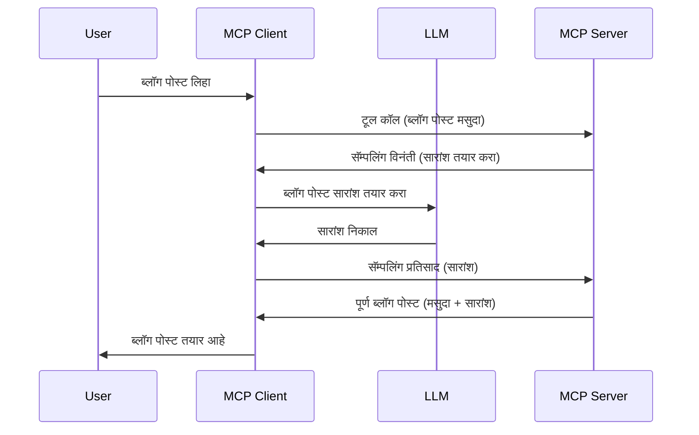

# नमुना घेणे - क्लायंटला वैशिष्ट्ये प्रतिनिधित्व करणे

कधीकधी, आपल्याला MCP क्लायंट आणि MCP सर्व्हर यांना एका सामान्य उद्दिष्टासाठी सहकार्य करण्याची गरज असते. आपल्याकडे असा प्रकरण असू शकतो जिथे सर्व्हरला क्लायंटवर असलेल्या LLM ची मदत लागते. अशा परिस्थितीत, नमुना घेणे हे वापरायचे उपाय आहे.

चला काही वापर प्रकरणे पाहू आणि नमुना घेणे याशी संबंधित उपाय कसा बनवायचा ते पाहू.

## सारांश

या धड्यामध्ये, आपण नमुना घेणे कधी आणि कुठे वापरायचे ते समजावून सांगणार आहोत आणि त्याचे कॉन्फिगर कसे करायचे ते पाहणार आहोत.

## शिकण्याचे उद्दिष्ट

या प्रकरणात, आपण:

- नमुना घेणे म्हणजे काय आणि कधी वापरायचे हे समजावून सांगू.
- MCP मध्ये नमुना घेणे कसे कॉन्फिगर करायचे ते दाखवू.
- नमुना घेण्याच्या कृतीचे उदाहरणे देऊ.

## नमुना घेणे म्हणजे काय आणि का वापरावे?

नमुना घेणे एक प्रगत वैशिष्ट्य आहे जे खालील प्रकारे कार्य करते:


### नमुना विनंती

ठीक आहे, आता आपल्याकडे एक विश्वासार्ह परिस्थितीचे विशाल आढावा आहे, चला पाहू मित्रानं क्लायंटकडे परत पाठविल्या जाणाऱ्या नमुना विनंतीबद्दल काय आहे. JSON-RPC फॉरमॅटमध्ये अशी एक विनंती कशी दिसू शकते ते येथे आहे:

```json
{
  "jsonrpc": "2.0",
  "id": 1,
  "method": "sampling/createMessage",
  "params": {
    "messages": [
      {
        "role": "user",
        "content": {
          "type": "text",
          "text": "Create a blog post summary of the following blog post: <BLOG POST>"
        }
      }
    ],
    "modelPreferences": {
      "hints": [
        {
          "name": "claude-3-sonnet"
        }
      ],
      "intelligencePriority": 0.8,
      "speedPriority": 0.5
    },
    "systemPrompt": "You are a helpful assistant.",
    "maxTokens": 100
  }
}
```

येथे काही मुद्दे लक्षात घेण्यासारखे आहेत:

- Prompt, content -> text अंतर्गत, हा आपला सूचना आहे ज्याद्वारे LLM ला ब्लॉग पोस्टच्या मजकुराचा सारांश तयार करण्याचे सूचित केले आहे.

- **modelPreferences**. हा विभाग फक्त त्याच्याच प्रमाणे आहे, एक पसंती, LLM सोबत कोणती कॉन्फिगरेशन वापरायची याबाबत शिफारस. वापरकर्ता ह्या शिफारसी स्वीकारू शकतो किंवा त्यात बदल करू शकतो. या प्रकरणात, वापरायच्या मॉडेलबद्दल आणि गती आणि बुद्धिमत्ता प्राधान्याबद्दल शिफारसी आहेत.
- **systemPrompt**, हा आपला सामान्य सिस्टीम प्रॉम्प्ट आहे जो आपल्या LLM ला वैयक्तिकता देतो आणि मार्गदर्शन सूचनांचा समावेश असतो.
- **maxTokens**, हा आणखी एक गुणधर्म आहे जो सांगतो की या कार्यासाठी किती टोकन्स वापरणे शिफारस केले आहे.

### नमुना प्रतिसाद

हा प्रतिसाद MCP क्लायंट परत MCP सर्व्हरला पाठवतो आणि हा त्याचा परिणाम असतो की क्लायंट LLM ला कॉल करतो, त्या प्रतिसादाची वाट पाहतो आणि मग हा संदेश तयार करतो. JSON-RPC मध्ये कसा दिसू शकतो ते येथे आहे:

```json
{
  "jsonrpc": "2.0",
  "id": 1,
  "result": {
    "role": "assistant",
    "content": {
      "type": "text",
      "text": "Here's your abstract <ABSTRACT>"
    },
    "model": "gpt-5",
    "stopReason": "endTurn"
  }
}
```

लक्ष द्या की हा प्रतिसाद ब्लॉग पोस्टचा सारांश आहे जसे आपण मागितले होते. तसेच वापरलेले `model` आपल्याला मागितलेले नाही पण "gpt-5" आहे जे "claude-3-sonnet" वर आहे. हे दाखवण्यासाठी की वापरकर्ता वापरायच्या मॉडेल बद्दल आपले विचार बदलू शकतो आणि आपली नमुना विनंती फक्त एक शिफारस आहे.

ठीक आहे, आता आपण मुख्य प्रवाह आणि उपयुक्त कार्य "ब्लॉग पोस्ट तयार करणे + सारांश" समजून घेतला आहे, चला पाहू की हे कार्यान्वित करण्यासाठी काय करावे लागेल.

### संदेश प्रकार

नमुना संदेश फक्त टेक्स्टपुरतेच मर्यादित नाहीत, तर आपण प्रतिमा आणि ऑडिओ देखील पाठवू शकता. JSON-RPC कसा वेगळा दिसतो हे येथे आहे:

**टेक्स्ट**

```json
{
  "type": "text",
  "text": "The message content"
}
```

**प्रतिमा सामग्री**

```json
{
  "type": "image",
  "data": "base64-encoded-image-data",
  "mimeType": "image/jpeg"
}
```

**ऑडिओ सामग्री**

```json
{
  "type": "audio",
  "data": "base64-encoded-audio-data",
  "mimeType": "audio/wav"
}
```

> NOTE: नमुना घेण्याबद्दल अधिक सविस्तर माहितीकरिता, [अधिकृत दस्तऐवज](https://modelcontextprotocol.io/specification/2025-06-18/client/sampling) पाहा.

## क्लायंटमध्ये नमुना घेणे कसे कॉन्फिगर करावे

> टीप: जर आपण फक्त सर्व्हर तयार करत असाल, तर येथे जास्त काही करण्याची गरज नाही.

क्लायंटमध्ये आपण खालीलप्रमाणे वैशिष्ट्य निर्दिष्ट करणे आवश्यक आहे:

```json
{
  "capabilities": {
    "sampling": {}
  }
}
```

हे नंतर आपला निवडलेला क्लायंट सर्व्हर सोबत प्रारंभ करताना घेतले जाईल.

## क्रियाशील नमुना घेण्याचा उदाहरण - ब्लॉग पोस्ट तयार करा

चला एक नमुना सर्व्हर कोड करूया, आपल्याला खालील करायचं आहे:

1. सर्व्हरवर एक टूल तयार करा.
2. त्या टूलने एक नमुना विनंती तयार करावी.
3. टूलने क्लायंटच्या नमुना विनंतीस प्रतिसाद येईपर्यंत वाट पाहावी.
4. नंतर टूल परिणाम तयार करावा.

चला कोड टप्प्याटप्प्याने पाहू:

### -1- टूल तयार करा

**python**

```python
@mcp.tool()
async def create_blog(title: str, content: str, ctx: Context[ServerSession, None]) -> str:
    """Create a blog post and generate a summary"""

```

### -2- नमुना विनंती तयार करा

खालील कोड वापरून तुमच्या टूलचे विस्तार करा:

**python**

```python
post = BlogPost(
        id=len(posts) + 1,
        title=title,
        content=content,
        abstract=""
    )

prompt = f"Create an abstract of the following blog post: title: {title} and draft: {content} "

result = await ctx.session.create_message(
        messages=[
            SamplingMessage(
                role="user",
                content=TextContent(type="text", text=prompt),
            )
        ],
        max_tokens=100,
)

```

### -3- प्रतिसादाची वाट पाहा आणि प्रतिसाद परत करा

**python**

```python
post.abstract = result.content.text

posts.append(post)

# पूर्ण उत्पादन परत करा
return json.dumps({
    "id": post.title,
    "abstract": post.abstract
})
```

### -4- संपूर्ण कोड

**python**

```python
from starlette.applications import Starlette
from starlette.routing import Mount, Host

from mcp.server.fastmcp import Context, FastMCP

from mcp.server.session import ServerSession
from mcp.types import SamplingMessage, TextContent

import json


from uuid import uuid4
from typing import List
from pydantic import BaseModel


mcp = FastMCP("Blog post generator")

# app = FastAPI()

posts = []

class BlogPost(BaseModel):
    id: int
    title: str
    content: str
    abstract: str

posts: List[BlogPost] = []

@mcp.tool()
async def create_blog(title: str, content: str, ctx: Context[ServerSession, None]) -> str:
    """Create a blog post and generate a summary"""

    post = BlogPost(
        id=len(posts) + 1,
        title=title,
        content=content,
        abstract=""
    )

    prompt = f"Create an abstract of the following blog post: title: {title} and draft: {content} "

    result = await ctx.session.create_message(
        messages=[
            SamplingMessage(
                role="user",
                content=TextContent(type="text", text=prompt),
            )
        ],
        max_tokens=100,
    )

    post.abstract = result.content.text

    posts.append(post)

    # संपूर्ण ब्लॉग पोस्ट परत करा
    return json.dumps({
        "id": post.title,
        "abstract": post.abstract
    })

if __name__ == "__main__":
    print("Starting server...")
    # mcp.run()
    mcp.run(transport="streamable-http")

# अॅप चालवा: python server.py
```

### -5- Visual Studio Code मध्ये चाचणी

याची चाचणी करण्यासाठी Visual Studio Code मध्ये खालील करा:

1. टर्मिनलमध्ये सर्व्हर सुरू करा
2. *mcp.json* मध्ये त्याला जोडा (आणि ते सुरू असल्याची खात्री करा) उदा. असे काही:

   ```json
   "servers": {
      "blog-server": {
        "type": "http",
        "url": "http://localhost:8000/mcp"
      }
   }
   ```

3. एक प्रॉम्प्ट टाइप करा:

   ```text
   create a blog post named "Where Python comes from", the content is "Python is actually named after Monty Python Flying Circus"
   ```

4. नमुना घेण्याची परवानगी द्या. पहिल्यांदा आपण हे तपासत असताना अतिरिक्त संवाद दिसेल ज्याला आपण स्वीकारावे लागेल, नंतर साधा संवाद दिसेल ज्यात टूल चालवण्याची विनंती केली जाईल.

5. निकाल तपासा. आपण निकाल दोन्ही GitHub Copilot Chat मध्ये छान प्रकारे दिसतील तसेच आपण रॉ JSON प्रतिसाद देखील तपासू शकता.

**बोनस**. Visual Studio Code टूलिंगमध्ये नमुना घेण्याला छान समर्थन आहे. आपण आपल्या इन्स्टॉल केलेल्या सर्व्हरची नमुना प्रवेश कॉन्फिगर करू शकता खालीलप्रमाणे:

1. विस्तार विभागात जा.
2. "MCP SERVERS - INSTALLED" विभागात तुमच्या इन्स्टॉल केलेल्या सर्व्हरच्या कॉग आयकॉनवर क्लिक करा.
3. "Configure Model Access" निवडा, येथे आपण कोणते मॉडेल्स GitHub Copilot ला नमुना प्रक्रिया करताना वापरण्याची परवानगी देणार ते निवडू शकता. येथे "Show Sampling requests" निवडून अलीकडील सर्व नमुना विनंत्या देखील पाहू शकता.

## असाइनमेंट

या असाइनमेंटमध्ये, आपण एक थोडक्यावेगळा नमुना तयार कराल जो उत्पाद वर्णन तयार करण्यासाठी नमुना एकत्रीकरणास समर्थन देतो. तुमची परिस्थिती अशी आहे:

**परिस्थिती**: ई-कॉमर्समधील बॅक ऑफिस कर्मचारी मदतीची गरज आहे, उत्पादन वर्णने तयार करणे खूप वेळखाऊ आहे. म्हणून, आपण असा उपाय तयार करणार आहात जिथे आपण "create_product" नावाचा टूल "title" आणि "keywords" या अर्ग्युमेंटसह कॉल करू शकाल आणि त्याचा परिणाम म्हणून पूर्ण उत्पाद तयार होईल ज्यामध्ये "description" फील्ड असेल आणि ते क्लायंटच्या LLM कडून भरण्यात येईल.

टीप: मागील शिकलेल्या प्रमाणे या सर्व्हर आणि टूलला नमुना विनंती वापरून कसे तयार करायचे ते वापरा.

## उपाय

[उपाय](./solution/README.md)

## मुख्य मुद्दे

नमुना घेणे हे एक शक्तिशाली वैशिष्ट्य आहे जे सर्व्हरला आवश्यक LLM ची मदत हवी असताना ग्राहकाला काम सोपवण्याची परवानगी देते.

## पुढे काय

- [अध्याय 4 - व्यावहारिक अंमलबजावणी](../../04-PracticalImplementation/README.md)

---

<!-- CO-OP TRANSLATOR DISCLAIMER START -->
**सूचना**:
हा दस्तऐवज AI भाषांतर सेवा [Co-op Translator](https://github.com/Azure/co-op-translator) वापरून भाषांतरित केला आहे. आम्ही अचूकतेसाठी प्रयत्नशील आहोत, तरी कृपया ध्यानात ठेवा की स्वयंचलित भाषांतरणांमध्ये चुका किंवा अचूकतेची कमतरता असू शकते. मूळ दस्तऐवज त्याच्या मूळ भाषेत अधिकृत स्रोत मानला जावा. महत्त्वाची माहिती असल्यास व्यावसायिक मानवी भाषांतर घेण्याची शिफारस करण्यात येते. या भाषांतरणाच्या वापरामुळे उद्भवलेल्या कोणत्याही गैरसमजुती किंवा चुकीच्या अर्थांच्या जबाबदारी आम्ही स्वीकारत नाही.
<!-- CO-OP TRANSLATOR DISCLAIMER END -->