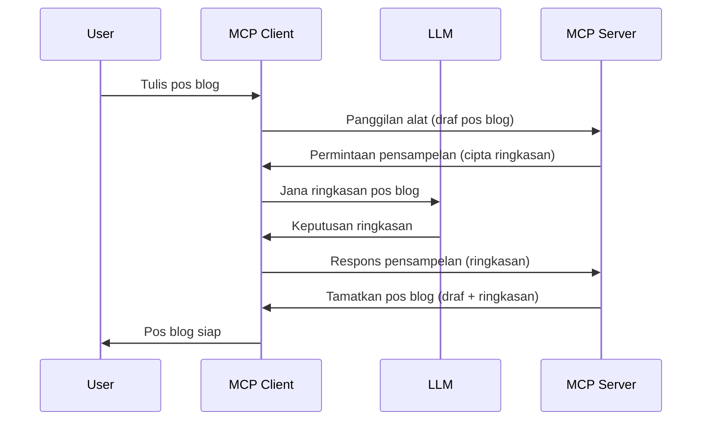

# Sampling - mendelegasikan ciri kepada Klien

Kadang-kadang, anda memerlukan Klien MCP dan Pelayan MCP untuk bekerjasama untuk mencapai matlamat yang sama. Anda mungkin mempunyai kes di mana Pelayan memerlukan bantuan LLM yang berada di klien. Untuk situasi ini, sampling adalah apa yang anda patut guna.

Mari kita terokai beberapa kes penggunaan dan cara membina penyelesaian yang melibatkan sampling.

## Gambaran Keseluruhan

Dalam pelajaran ini, kita fokus pada penerangan bila dan di mana untuk menggunakan Sampling dan bagaimana untuk mengkonfigurasinya.

## Objektif Pembelajaran

Dalam bab ini, kita akan:

- Terangkan apa itu Sampling dan bila untuk menggunakannya.
- Tunjukkan cara mengkonfigurasi Sampling dalam MCP.
- Berikan contoh-contoh Sampling dalam tindakan.

## Apa itu Sampling dan kenapa menggunakannya?

Sampling adalah ciri canggih yang berfungsi dengan cara berikut:


### Permintaan Sampling

Ok, sekarang kita ada pandangan sepintas lalu tentang senario yang boleh dipercayai, mari kita bincangkan permintaan sampling yang dihantar oleh pelayan kembali kepada klien. Berikut adalah bagaimana permintaan tersebut boleh kelihatan dalam format JSON-RPC:

```json
{
  "jsonrpc": "2.0",
  "id": 1,
  "method": "sampling/createMessage",
  "params": {
    "messages": [
      {
        "role": "user",
        "content": {
          "type": "text",
          "text": "Create a blog post summary of the following blog post: <BLOG POST>"
        }
      }
    ],
    "modelPreferences": {
      "hints": [
        {
          "name": "claude-3-sonnet"
        }
      ],
      "intelligencePriority": 0.8,
      "speedPriority": 0.5
    },
    "systemPrompt": "You are a helpful assistant.",
    "maxTokens": 100
  }
}
```

Ada beberapa perkara di sini yang patut diketengahkan:

- Prompt, di bawah content -> text, ialah arahan kita yang merupakan arahan untuk LLM merumus kandungan pos blog.

- **modelPreferences**. Bahagian ini adalah satu keutamaan, satu cadangan konfigurasi yang digunakan dengan LLM. Pengguna boleh memilih sama ada untuk menerima cadangan ini atau mengubahnya. Dalam kes ini, terdapat cadangan mengenai model untuk digunakan dan keutamaan kelajuan serta kecerdasan.
- **systemPrompt**, ini adalah prompt sistem biasa anda yang memberikan LLM anda personaliti dan mengandungi arahan panduan.
- **maxTokens**, ini adalah satu lagi sifat yang digunakan untuk menyatakan berapa banyak token yang disyorkan untuk digunakan untuk tugasan ini.

### Respons Sampling

Respons ini adalah apa yang akhirnya dihantar kembali oleh Klien MCP kepada Pelayan MCP dan merupakan hasil klien memanggil LLM, menunggu respons itu dan kemudian membina mesej ini. Berikut adalah bagaimana ia boleh kelihatan dalam JSON-RPC:

```json
{
  "jsonrpc": "2.0",
  "id": 1,
  "result": {
    "role": "assistant",
    "content": {
      "type": "text",
      "text": "Here's your abstract <ABSTRACT>"
    },
    "model": "gpt-5",
    "stopReason": "endTurn"
  }
}
```

Perhatikan bagaimana respons itu adalah abstrak pos blog seperti yang diminta. Juga perhatikan bagaimana `model` yang digunakan bukan yang kita minta tetapi "gpt-5" berbanding "claude-3-sonnet". Ini untuk menggambarkan bahawa pengguna boleh berubah fikiran tentang apa yang hendak digunakan dan bahawa permintaan sampling anda adalah cadangan.

Ok, sekarang kita faham aliran utama, dan tugasan berguna untuk menggunakannya untuk "pembuatan pos blog + abstrak", mari lihat apa yang perlu dilakukan untuk menjadikannya berfungsi.

### Jenis mesej

Mesej Sampling tidak terhad kepada teks sahaja tetapi anda juga boleh menghantar imej dan audio. Inilah bagaimana JSON-RPC kelihatan berbeza:

**Teks**

```json
{
  "type": "text",
  "text": "The message content"
}
```

**Kandungan imej**

```json
{
  "type": "image",
  "data": "base64-encoded-image-data",
  "mimeType": "image/jpeg"
}
```

**Kandungan audio**

```json
{
  "type": "audio",
  "data": "base64-encoded-audio-data",
  "mimeType": "audio/wav"
}
```

> NOTE: untuk maklumat lebih terperinci tentang Sampling, sila rujuk [dokumen rasmi](https://modelcontextprotocol.io/specification/2025-06-18/client/sampling)

## Cara Mengkonfigurasi Sampling dalam Klien

> Nota: jika anda hanya membina pelayan, anda tidak perlu melakukan banyak perkara di sini.

Dalam klien, anda perlu menyatakan ciri berikut seperti ini:

```json
{
  "capabilities": {
    "sampling": {}
  }
}
```

Ini kemudian akan diambil apabila klien pilihan anda memulakan dengan pelayan tersebut.

## Contoh Sampling dalam Tindakan - Mencipta Pos Blog

Mari kita kodkan pelayan sampling bersama-sama, kita perlu melakukan perkara berikut:

1. Cipta alat di Pelayan.
1. Alat tersebut perlu mencipta permintaan sampling.
1. Alat perlu menunggu permintaan sampling klien dijawab.
1. Kemudian hasil alat tersebut perlu dihasilkan.

Mari lihat kod langkah demi langkah:

### -1- Cipta alat

**python**

```python
@mcp.tool()
async def create_blog(title: str, content: str, ctx: Context[ServerSession, None]) -> str:
    """Create a blog post and generate a summary"""

```

### -2- Cipta permintaan sampling

Kembangkan alat anda dengan kod berikut:

**python**

```python
post = BlogPost(
        id=len(posts) + 1,
        title=title,
        content=content,
        abstract=""
    )

prompt = f"Create an abstract of the following blog post: title: {title} and draft: {content} "

result = await ctx.session.create_message(
        messages=[
            SamplingMessage(
                role="user",
                content=TextContent(type="text", text=prompt),
            )
        ],
        max_tokens=100,
)

```

### -3- Tunggu respons dan pulangkan respons

**python**

```python
post.abstract = result.content.text

posts.append(post)

# kembalikan produk lengkap
return json.dumps({
    "id": post.title,
    "abstract": post.abstract
})
```

### -4- Kod penuh

**python**

```python
from starlette.applications import Starlette
from starlette.routing import Mount, Host

from mcp.server.fastmcp import Context, FastMCP

from mcp.server.session import ServerSession
from mcp.types import SamplingMessage, TextContent

import json


from uuid import uuid4
from typing import List
from pydantic import BaseModel


mcp = FastMCP("Blog post generator")

# app = FastAPI()

posts = []

class BlogPost(BaseModel):
    id: int
    title: str
    content: str
    abstract: str

posts: List[BlogPost] = []

@mcp.tool()
async def create_blog(title: str, content: str, ctx: Context[ServerSession, None]) -> str:
    """Create a blog post and generate a summary"""

    post = BlogPost(
        id=len(posts) + 1,
        title=title,
        content=content,
        abstract=""
    )

    prompt = f"Create an abstract of the following blog post: title: {title} and draft: {content} "

    result = await ctx.session.create_message(
        messages=[
            SamplingMessage(
                role="user",
                content=TextContent(type="text", text=prompt),
            )
        ],
        max_tokens=100,
    )

    post.abstract = result.content.text

    posts.append(post)

    # pulangkan pos blog lengkap
    return json.dumps({
        "id": post.title,
        "abstract": post.abstract
    })

if __name__ == "__main__":
    print("Starting server...")
    # mcp.run()
    mcp.run(transport="streamable-http")

# jalankan app dengan: python server.py
```

### -5- Uji di Visual Studio Code

Untuk menguji ini di Visual Studio Code, lakukan perkara berikut:

1. Mulakan pelayan dalam terminal
1. Tambahkannya ke *mcp.json* (dan pastikan ia dimulakan) contohnya seperti berikut:

   ```json
   "servers": {
      "blog-server": {
        "type": "http",
        "url": "http://localhost:8000/mcp"
      }
   }
   ```

1. Taip arahan:

   ```text
   create a blog post named "Where Python comes from", the content is "Python is actually named after Monty Python Flying Circus"
   ```

1. Benarkan sampling berlaku. Kali pertama anda menguji ini, anda akan dibentangkan dengan dialog tambahan yang perlu anda terima, kemudian anda akan melihat dialog biasa yang meminta anda menjalankan alat

1. Periksa hasil. Anda akan melihat hasil yang dipersembahkan dengan baik dalam GitHub Copilot Chat tetapi anda juga boleh periksa respons JSON mentah.

**Bonus**. Alat Visual Studio Code mempunyai sokongan hebat untuk sampling. Anda boleh mengkonfigurasi akses Sampling pada pelayan yang dipasang dengan menavigasi seperti ini:

1. Navigasi ke bahagian sambungan.
1. Pilih ikon roda gigi untuk pelayan yang dipasang dalam bahagian "MCP SERVERS - INSTALLED".
1 Pilih "Configure Model Access", di sini anda boleh memilih model mana yang dibenarkan GitHub Copilot untuk digunakan apabila melakukan sampling. Anda juga boleh melihat semua permintaan sampling yang berlaku baru-baru ini dengan memilih "Show Sampling requests".

## Tugasan

Dalam tugasan ini, anda akan membina Sampling yang sedikit berbeza iaitu integrasi sampling yang menyokong penjanaan penerangan produk. Ini adalah senario anda:

**Senario**: Pekerja pejabat belakang di e-dagang memerlukan bantuan, ia mengambil masa terlalu lama untuk menghasilkan penerangan produk. Oleh itu, anda dikehendaki membina penyelesaian di mana anda boleh memanggil alat "create_product" dengan "title" dan "keywords" sebagai argumen dan ia harus menghasilkan produk lengkap termasuk medan "description" yang harus diisi oleh LLM klien.

TIP: gunakan apa yang anda pelajari sebelum ini tentang cara membina pelayan ini dan alatnya menggunakan permintaan sampling.

## Penyelesaian

[Penyelesaian](./solution/README.md)

## Intipati Utama

Sampling adalah ciri yang berkuasa yang membenarkan pelayan mendelegasikan tugasan kepada klien apabila ia memerlukan bantuan LLM.

## Apa Yang Seterusnya

- [Bab 4 - Pelaksanaan praktikal](../../04-PracticalImplementation/README.md)

---

<!-- CO-OP TRANSLATOR DISCLAIMER START -->
**Penafian**:  
Dokumen ini telah diterjemahkan menggunakan perkhidmatan penterjemahan AI [Co-op Translator](https://github.com/Azure/co-op-translator). Walaupun kami berusaha untuk ketepatan, sila maklum bahawa terjemahan automatik mungkin mengandungi kesilapan atau ketidaktepatan. Dokumen asal dalam bahasa asalnya hendaklah dianggap sebagai sumber yang sahih. Untuk maklumat penting, penterjemahan profesional oleh manusia adalah digalakkan. Kami tidak bertanggungjawab atas sebarang salah faham atau tafsiran yang timbul daripada penggunaan terjemahan ini.
<!-- CO-OP TRANSLATOR DISCLAIMER END -->