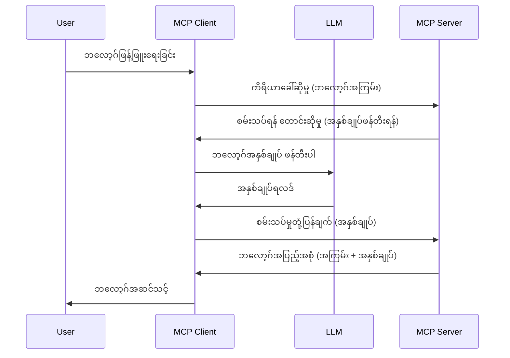

# Sampling - Client ကို Features Delegate ပေးခြင်း

တခါတရံ MCP Client နဲ့ MCP Server သည် ပူးပေါင်းဆောင်ရွက်ရန် လိုအပ်ပါတယ်။ Server မှာ client ပေါ်မှာ ထိုင်သည့် LLM ရဲ့ အကူအညီကို လိုအပ်သော အခန်းကဏ္ဍရှိနိုင်ပါတယ်။ ဒီအချိန်မှာ sampling ကို သုံးရမှာဖြစ်ပါတယ်။

Sampling ပါဝင်တဲ့ အချို့သော အသုံးပြုမှုဆိုင်ရာ ရောနှောချက်များနဲ့ sampling ပါဝင်တဲ့ ဖြေရှင်းချက် ဖန်တီးနည်းကို လေ့လာကြရအောင်။

## အနှစ်ချုပ်

ဒီသင်ခန်းစာမှာ Sampling ကို ဘယ်အချိန်မှာ၊ ဘယ်မှာ သုံးရမလဲဆိုတာ နားလည်ပေးမှာဖြစ်ပြီး Sampling ကို မည်သို့ configure ပြုလုပ်ရမယ်ဆိုတာ ရှင်းပြပါမယ်။

## သင်ယူရန်ရည်ရွယ်ချက်များ

ဒီအခန်းမှာ ကျွန်တော်တို့ မျှဝေရမှာက -

- Sampling ဆိုတာဘာလဲ၊ ဘယ်အချိန်သုံးရမလဲဆိုတာရှင်းပြခြင်း။
- MCP မှာ Sampling ကို configure ပြုလုပ်နည်း ပြသခြင်း။
- Sampling ကို လက်တွေ့ အသုံးချသည့် ဥပမာများ ပေးခြင်း။

## Sampling ဆိုတာဘာလဲ၊ မည်သို့အသုံးပြုရမည်နည်း?

Sampling ဆိုတာ အောက်တိုဘာမျိုးစုံ feature ဖြစ်ပြီး အလုပ်လုပ်ပုံမှာ အောက်ပါအတိုင်းဖြစ်ပါတယ်။


### Sampling တောင်းဆိုချက်

အရင်ဆုံး စိတ်ကူးယဉ်ထားတဲ့ စနစ်တစ်ခုကို မြင်ကြရအောင်၊ ထို့နဲ့ Server က Client ကို ပြန်ပို့တဲ့ sampling တောင်းဆိုချက်ကိုပြောကြရအောင်။ JSON-RPC ပုံစံမှာ ဒီလိုပါလိမ့်မယ် -

```json
{
  "jsonrpc": "2.0",
  "id": 1,
  "method": "sampling/createMessage",
  "params": {
    "messages": [
      {
        "role": "user",
        "content": {
          "type": "text",
          "text": "Create a blog post summary of the following blog post: <BLOG POST>"
        }
      }
    ],
    "modelPreferences": {
      "hints": [
        {
          "name": "claude-3-sonnet"
        }
      ],
      "intelligencePriority": 0.8,
      "speedPriority": 0.5
    },
    "systemPrompt": "You are a helpful assistant.",
    "maxTokens": 100
  }
}
```

ဒီမှာ သတိထားဖို့အချက်အချို့ရှိပါတယ် -

- Prompt လို့ခေါ်တာ content -> text အောက်က ကျွန်တော်တို့၏ prompt ဖြစ်ပြီး LLM ကို ဘလော့ဂ် post အကြောင်းအရာကို အကျဉ်းချုပ်ရန် အညွှန်းပေးမှု ဖြစ်ပါတယ်။

- **modelPreferences** ဆိုတာကတော့ အကြံပြုချက်ပဲဖြစ်ပြီး LLM နဲ့သုံးမယ့် configuration ကို သတ်မှတ်ထားပါတယ်။ အသုံးပြုသူက ဒီအကြံပြုချက်တွေကို ယူမလား၊ မပြောင်းဘဲ မလုပ်မလား ရွေးချယ်နိုင်ပါတယ်။ ဒီကိစ္စမှာ model ကို သုံးရန်နှင့် အရှိန်နှင့် ဇာတိမြင့်ဆုံးခြင်းအပေါ် အကြံပြုချက်များ ပါဝင်ပါတယ်။
- **systemPrompt** ကတော့ သင်၏ LLM ကို ကိုယ်ပိုင်အက္ခရာပေးပြီး လမ်းညွှန်ချက်တွေပါဝင်တယ်။
- **maxTokens** ကတော့ ဒီလုပ်ငန်းအတွက် ဘယ်နှစ်tokens အသုံးပြုဖို့ အကြံပြုထားတယ် ဆိုတာ ပြောဆိုတဲ့ အချက်တစ်ခုဖြစ်ပါတယ်။

### Sampling တုန့်ပြန်ချက်

ဒီတုန့်ပြန်ချက်က MCP Client က MCP Server ကို ပြန်ပို့တဲ့ အကြောင်းအရာဖြစ်ပြီး Client က LLM ကို ခေါ်ယူပြီး ထိုတုန့်ပြန်ချက်ကို စောင့်ဆိုင်းမှ ပြန်လည်ဖန်တီးထားတာဖြစ်ပါတယ်။ JSON-RPC ပုံစံမှာ ဒီလိုပါလိမ့်မယ် -

```json
{
  "jsonrpc": "2.0",
  "id": 1,
  "result": {
    "role": "assistant",
    "content": {
      "type": "text",
      "text": "Here's your abstract <ABSTRACT>"
    },
    "model": "gpt-5",
    "stopReason": "endTurn"
  }
}
```

ပေးထားတဲ့ တုန့်ပြန်ချက်က 우리가 ဘလော့ဂ် post ကို အကျဉ်းချုပ်ဖို့ တောင်းဆိုလိုက်သလို အကျဉ်းချုပ်ပေးထားတာကို သတိပြုပါ။ သတိပြုဖို့က မူလတောင်းဆိုမှုမှာ အသုံးပြုဖို့ "claude-3-sonnet" လို့ ရေးထားတာကိုအစား "gpt-5" ကို သုံးထားတာ ဖြစ်ပါတယ်။ ဒါက အသုံးပြုသူက မည်သည့် model သုံးမလဲ ပြောင်းလဲစဉ်းစားနိုင်ကြောင်းကို ဖော်ပြတာပါ။

အိုကေ၊ အဓိက flow ကို နားလည်သွားပြီနောက် "ဘလော့ဂ် post ဖန်တီးခြင်း + အကျဉ်းချုပ်" လုပ်ငန်းအတွက် အသုံးဝင်တာဆိုရင် ဆက်လက်အလုပ်လုပ်ဖို့ မည်သည့်အချက်များ လုပ်ဆောင်ရမလဲ ကို ကြည့်ကြရအောင်။

### Message မျိုးအစားများ

Sampling message တွေက စာသားသာမက ပုံ၊ အသံ စသဖြင့် ပို့ပေးနိုင်ပါတယ်။ JSON-RPC ပုံစံမှာ မတူညီမှု ဒီလိုဖြစ်ပါတယ် -

**စာသား**

```json
{
  "type": "text",
  "text": "The message content"
}
```

**ပုံ**

```json
{
  "type": "image",
  "data": "base64-encoded-image-data",
  "mimeType": "image/jpeg"
}
```

**အသံ**

```json
{
  "type": "audio",
  "data": "base64-encoded-audio-data",
  "mimeType": "audio/wav"
}
```

> NOTE: Sampling ဆိုင်ရာ အသေးစိတ်ကို [တရားဝင်စာရွက်စာတမ်းများ](https://modelcontextprotocol.io/specification/2025-06-18/client/sampling) မှာကြည့်ပါ။

## Client မှာ Sampling ကို မည်သို့ Configure ပြုလုပ်မည်နည်း

> မှတ်ချက် - သင်က Server ကိုသာ တည်ဆောက်နေတယ်ဆိုရင် ဒီမှာ မများပြားစွာ လုပ်ရန် မလိုပါ။

Client မှာ အောက်ပါ features တွေကို သတ်မှတ်ပေးဖို့ လိုတယ် -

```json
{
  "capabilities": {
    "sampling": {}
  }
}
```

ဒီအတိုင်း သင့်ရွေးချယ်ထားတဲ့ client က Server နဲ့ချိတ်ဆက်လျက်ရှိရင် ထည့်သွင်းခံစားမှာ ဖြစ်သည်။

## Sampling ကို လက်တွေ့အသုံးပြုခြင်း - ဘလော့ဂ် post ဖန်တီးခြင်း

Sampling server တစ်ခု ကိုဒီအတိုင်းဖန်တီးကြရအောင် - လုပ်ရမယ့်အဆင့်တွေက -

1. Server ပေါ်မှာ tool တစ်ခု ဖန်တီးခြင်း။
2. ထို tool က sampling တောင်းဆိုချက်ဖန်တီးရန်။
3. Client ၏ sampling တောင်းဆိုချက်ကို ဖြေကြောင်းကို စောင့်ချိန်ရန်။
4. နောက်တစ်ဆင့်မှာ tool ရလဒ်ကို ထုတ်လုပ်ရန်။

အဆင့်ချင်းနဲ့ code ကိုကြည့်ရှုရအောင် -

### -1- Tool ဖန်တီးခြင်း

**python**

```python
@mcp.tool()
async def create_blog(title: str, content: str, ctx: Context[ServerSession, None]) -> str:
    """Create a blog post and generate a summary"""

```

### -2- Sampling တောင်းဆိုချက် ဖန်တီးခြင်း

Tool ကို အောက်ပါကုဒ်ဖြင့် တိုးချဲ့ပါ -

**python**

```python
post = BlogPost(
        id=len(posts) + 1,
        title=title,
        content=content,
        abstract=""
    )

prompt = f"Create an abstract of the following blog post: title: {title} and draft: {content} "

result = await ctx.session.create_message(
        messages=[
            SamplingMessage(
                role="user",
                content=TextContent(type="text", text=prompt),
            )
        ],
        max_tokens=100,
)

```

### -3- တုန့်ပြန်ချက်ကို စောင့်ပြီး ပြန်လာသော တုန့်ပြန်ချက်ကို Return ပြန်ပေးခြင်း

**python**

```python
post.abstract = result.content.text

posts.append(post)

# ပစ္စည်းတစ်ချက်လုံးကို ပြန်ပေးပါ
return json.dumps({
    "id": post.title,
    "abstract": post.abstract
})
```

### -4- ပြည့်စုံသောကုဒ်

**python**

```python
from starlette.applications import Starlette
from starlette.routing import Mount, Host

from mcp.server.fastmcp import Context, FastMCP

from mcp.server.session import ServerSession
from mcp.types import SamplingMessage, TextContent

import json


from uuid import uuid4
from typing import List
from pydantic import BaseModel


mcp = FastMCP("Blog post generator")

# app = FastAPI()

posts = []

class BlogPost(BaseModel):
    id: int
    title: str
    content: str
    abstract: str

posts: List[BlogPost] = []

@mcp.tool()
async def create_blog(title: str, content: str, ctx: Context[ServerSession, None]) -> str:
    """Create a blog post and generate a summary"""

    post = BlogPost(
        id=len(posts) + 1,
        title=title,
        content=content,
        abstract=""
    )

    prompt = f"Create an abstract of the following blog post: title: {title} and draft: {content} "

    result = await ctx.session.create_message(
        messages=[
            SamplingMessage(
                role="user",
                content=TextContent(type="text", text=prompt),
            )
        ],
        max_tokens=100,
    )

    post.abstract = result.content.text

    posts.append(post)

    # ပြည့်စုံသော ဘလော့ဂ်ဖော်ပြချက်ကို ပြန်ပေးသည်
    return json.dumps({
        "id": post.title,
        "abstract": post.abstract
    })

if __name__ == "__main__":
    print("Starting server...")
    # mcp.run()
    mcp.run(transport="streamable-http")

# app ကိုစတင်ရန်: python server.py ဖြင့် run နိုင်သည်
```

### -5- Visual Studio Code မှာ စမ်းသပ်ခြင်း

Visual Studio Code မှာ စမ်းသပ်ဖို့အတွက် လုပ်ဆောင်ရမည့်အရာတွေက -

1. Terminal မှာ Server စတင်ပါ။
1. *mcp.json* ထဲ ထည့်၍ (စတင်ထားမယ်ဆိုတာ သေချာစေရန်) ဥပမာ -

   ```json
   "servers": {
      "blog-server": {
        "type": "http",
        "url": "http://localhost:8000/mcp"
      }
   }
   ```

1. Prompt ရိုက်ထည့်ပါ -

   ```text
   create a blog post named "Where Python comes from", the content is "Python is actually named after Monty Python Flying Circus"
   ```

1. Sampling ဖြစ်ပေါ်ခိုင်းပါမယ်။ ပထမတစ်ကြိမ် စမ်းသပ်တဲ့အခါမှာ သင်အတည်ပြုရမယ့် dialog တစ်ခု ပေါ်လာပါမယ်။ ထို့နောက် tool ကို လည်ပတ်ရန် တောင်းဆိုတဲ့ dialog ပုံမှန်ပေါ်လာပါလိမ့်မယ်။

1. ရလဒ်များကို ကြည့်ပါ။ GitHub Copilot Chat မှာ အလန်းစားဖော်ပြချက်နဲ့အတူ raw JSON response ကိုပါ ကြည့်ရှုနိုင်ပါသည်။

**အပိုဆောင်း**။ Visual Studio Code tooling မှာ Sampling ကို အလွန်ကောင်းမွန်စွာ ပံ့ပိုးပေးပါတယ်။ သင့်တပ်ဆင်ထားသော Server မှာ Sampling access ကို ဒီလို ပြင်ဆင်နိုင်ပါတယ် -

1. Extension ပိုင်းကို သွားပါ။
1. "MCP SERVERS - INSTALLED" အောက်မှ သင့်တပ်ဆင်ထားသော Server နာမည်ရဲ့ စက်လည် icon ကိုရွေးပါ။
1. "Configure Model Access" ကိုရွေးပါ၊ ဒီမှာ GitHub Copilot Sampling လုပ်စဉ်အတွင်း အသုံးပြုခွင့်ရှိသော Models များကို ရွေးချယ်နိုင်ပြီး၊ နောက်ဆုံး Sampling requests များကိုလည်း "Show Sampling requests" နှိပ်ခြင်းဖြင့် ကြည့်ရှုနိုင်သည်။

## အလုပ်အပ်

ဒီအလုပ်အပ်မှာ သင့်မှာ sampling ကို ပိုမိုကွဲပြားတယ့် နမူနာတစ်ခု တည်ဆောက်ဖို့ရှိပါတယ်။ ထို sampling integration က အသုံးပြုသူများအတွက် ထုတ်ကုန်ဖော်ပြချက် ထုတ်ပေးရန် ထောက်ပံ့ပေးသွားမှာပါ။ သင့်ရဲ့ ဒါရိုက်တာက -

**အခြေအနေ**: အွန်လိုင်းစီးပွားရေး ဝန်ထမ်းများသည် ထုတ်ကုန်ဖော်ပြချက်များ တည်ဆောက်ရာတွင် အချိန်များစွာကုန်ဆုံးနေပါသည်။ ထို့ကြောင့် "create_product" ဆို tool ကို "title" နဲ့ "keywords" ဖြစ်သော argument များဖြင့် ခေါ်ယူပြီး client သည် "description" အကွက်ဖြင့် ပြည့်စုံသော ထုတ်ကုန်ဖော်ပြချက်တစ်ခု ထုတ်ပေးသွားရန် ဖြေရှင်းချက် တည်ဆောက်သင့်ပါသည်။

TIP: နောက်ပြီး Server နဲ့ tool ကို sampling request အသုံးပြု ကုဒ်ညွှန်းမထားခဲ့တာ ထပ်မံအသုံးချပါ။

## ဖြေရှင်းချက်

[Solution](./solution/README.md)

## အဓိက သင်ယူချက်များ

Sampling ဆိုတာ Server က client ထံသို့ LLM အကူအညီ လိုအပ်သော အခါ task များကို delegate ပြုလုပ်နိုင်သော အင်အားအပြည့် feature ဖြစ်သည်။

## နောက်တစ်ခု ဘာလဲ

- [အခန်း ၄ - လက်တွေ့အကောင်အထည်ဖော်ခြင်း](../../04-PracticalImplementation/README.md)

---

<!-- CO-OP TRANSLATOR DISCLAIMER START -->
**ဂရုတစိုက်ဖော်ပြချက်**  
ဤစာတမ်းကို AI ဘာသာပြန်ဝန်ဆောင်မှု [Co-op Translator](https://github.com/Azure/co-op-translator) ဖြင့် ဘာသာပြန်ထားပါသည်။ ကျွန်ုပ်တို့သည် တိကျမှန်ကန်မှုအတွက် ကြိုးစားသည်မှာဖြစ်ပေမယ့် အလိုအလျောက် ဘာသာပြန်ခြင်းတွင် အမှားများ သို့မဟုတ် မှားယွင်းချက်များ ပါဝင်နိုင်သည်ကို ကျေးဇူးပြု၍ သိရှိအပ်ပါသည်။ မူရင်းစာတမ်းကို မူလဘာသာဖြင့်သာ အာဏာပိုင်ရင်းမြစ်အဖြစ် သတ်မှတ်ရမည်ဖြစ်သည်။ အရေးကြီးသောသတင်းအချက်အလက်များအတွက် မူရင်းလူ့ဘာသာပြန်ခြင်းကို အကြံပြုပါသည်။ ဤဘာသာပြန်ချက်ကို အသုံးပြုရာမှ ဖြစ်ပေါ်နိုင်သည့် မမှန်ကန်မှုများ သို့မဟုတ် မှားယွင်းစေမည့် အတားအဆီးများအတွက် ကျွန်ုပ်တို့အား တာဝန်မရှိပါ။
<!-- CO-OP TRANSLATOR DISCLAIMER END -->