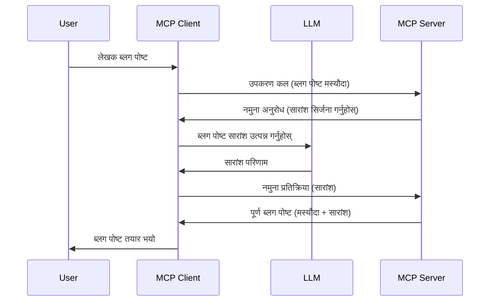

# नमुना लिने - क्लाइन्टमा सुविधा प्रतिनिधित्व गर्ने

कहिलेकाहीं, तपाईंलाई MCP क्लाइन्ट र MCP सर्भरबीच साझेदारीको आवश्यकता पर्छ एउटा साझा लक्ष्य प्राप्त गर्न। तपाईंको यस्तो अवस्थामा हुन सक्छ जहाँ सर्भरले क्लाइन्टमा बसेको LLM को मद्दत चाहिन्छ। यस्तो अवस्थामा, नमुना लिनु तपाईंले प्रयोग गर्नुपर्ने कुरा हो।

आउनुहोस्, केही प्रयोग केसहरूसँग परिचय गरौं र नमुना लिनसँग सम्बन्धित समाधान कसरी निर्माण गर्ने हेर्नुहोस्।

## अवलोकन

यस पाठमा, हामी नमुना लिने कहिले र कहाँ प्रयोग गर्ने र कसरी त्यसलाई कन्फिगर गर्ने बारे स्पष्ट पार्छौं।

## सिकाइका उद्देश्यहरू

यस अध्यायमा, हामीले:

- नमुना लिने के हो र कहिले प्रयोग गर्ने भन्ने व्याख्या गर्ने।
- MCP मा नमुना कसरी कन्फिगर गर्ने देखाउने।
- नमुना क्रियाशील अवस्थामा रहेको केही उदाहरणहरू प्रदान गर्ने।

## नमुना लिने के हो र किन प्रयोग गर्ने?

नमुना लिने एक उन्नत सुविधा हो जुन निम्न तरिकाले काम गर्छ:


### नमुना अनुरोध

अब हामीसँग एक विश्वसनीय परिदृश्यको उचाइबाट हेर्ने प्रभावी दृष्टिकोण छ, आउनुहोस् सर्भरले क्लाइन्टमा पठाउने नमुना अनुरोधबारे कुरा गरौं। यस्तो अनुरोध JSON-RPC ढाँचामा यसरी देखिन सक्छ:

```json
{
  "jsonrpc": "2.0",
  "id": 1,
  "method": "sampling/createMessage",
  "params": {
    "messages": [
      {
        "role": "user",
        "content": {
          "type": "text",
          "text": "Create a blog post summary of the following blog post: <BLOG POST>"
        }
      }
    ],
    "modelPreferences": {
      "hints": [
        {
          "name": "claude-3-sonnet"
        }
      ],
      "intelligencePriority": 0.8,
      "speedPriority": 0.5
    },
    "systemPrompt": "You are a helpful assistant.",
    "maxTokens": 100
  }
}
```

यहाँ केहि कुराहरू महत्त्वपूर्ण छन्:

- Prompt, content -> text अन्तर्गत, हाम्रो सोधनी हो जुन LLM लाई ब्लग पोस्ट सामग्री सारांश गर्ने निर्देशन हो।

- **modelPreferences**। यस भागमा LLM सँग के कन्फिगरेसन प्रयोग गर्ने भन्ने सिफारिस दिइएको हुन्छ। प्रयोगकर्ताले यी सिफारिसहरू स्वीकार्न वा परिवर्तन गर्न सक्छ। यस अवस्थामा मोडेल, गति, र बुद्धिमत्ताको प्राथमिकतामा सिफारिसहरू छन्।
- **systemPrompt**, यो तपाईंको सामान्य सिस्टम प्रॉम्प्ट हो जुन तपाईंको LLM लाई व्यक्तिगतता दिन्छ र मार्गदर्शन सम्बन्धी निर्देशनहरू समावेश गर्दछ।
- **maxTokens**, यो अर्को सम्पत्ति हो जसले कति टोकन्स प्रयोग गर्न सिफारिस गरिन्छ भन्ने जनाउँछ।

### नमुना प्रतिक्रिया

यो प्रतिक्रिया MCP क्लाइन्टले अन्ततः MCP सर्भरलाई फिर्ता पठाउने कुरा हो र क्लाइन्टले LLM कल गरेर प्राप्त गरेको परिणाम हो। JSON-RPC मा यसरी देखिन सक्छ:

```json
{
  "jsonrpc": "2.0",
  "id": 1,
  "result": {
    "role": "assistant",
    "content": {
      "type": "text",
      "text": "Here's your abstract <ABSTRACT>"
    },
    "model": "gpt-5",
    "stopReason": "endTurn"
  }
}
```

कसरी प्रतिक्रिया ब्लग पोस्टको सारांश हो जुन हामीले मागेका थियौं ध्यान दिनुहोस्। साथै ध्यान दिनुहोस् कि प्रयोग गरिएको `model` सोधिएको होइन तर "gpt-5" छ जुन "claude-3-sonnet" भन्दा छ। यसले देखाउन चाहन्छ कि प्रयोगकर्ताले आफ्नो चाहना परिवर्तन गर्न सक्छ र तपाईंको नमुना अनुरोध एउटा सिफारिस मात्र हो।

अब मुख्य प्रवाह बुझिसकेपछि, र उपयोगी कार्य "ब्लग पोस्ट सिर्जना + सारांश" को लागि यो प्रयोग गर्ने, आउनुहोस् यो कसरी काम गर्ने देखौं।

### संदेश प्रकारहरू

नमुनाका संदेशहरू केवल पाठमा सीमित छैनन्, तपाईंले तस्बिर र अडियो पनि पठाउन सक्नुहुन्छ। JSON-RPC यसप्रकार फरक देखिन्छ:

**पाठ**

```json
{
  "type": "text",
  "text": "The message content"
}
```

**तस्बिर सामग्री**

```json
{
  "type": "image",
  "data": "base64-encoded-image-data",
  "mimeType": "image/jpeg"
}
```

**अडियो सामग्री**

```json
{
  "type": "audio",
  "data": "base64-encoded-audio-data",
  "mimeType": "audio/wav"
}
```

> नोट: नमुनामा थप विस्तृत जानकारीका लागि, [अधिकृत कागजातहरू](https://modelcontextprotocol.io/specification/2025-06-18/client/sampling) अवलोकन गर्नुहोस्।

## क्लाइन्टमा नमुना कसरी कन्फिगर गर्ने

> नोट: यदि तपाईं केवल सर्भर निर्माण गर्दै हुनुहुन्छ भने यहाँ धेरै गर्न आवश्यक छैन।

क्लाइन्टमा तपाईँले निम्न सुविधाहरू यसरी निर्दिष्ट गर्नुपर्छ:

```json
{
  "capabilities": {
    "sampling": {}
  }
}
```

तपाईंले छनौट गरेको क्लाइन्ट सर्भरसँग सुरु हुँदा यसलाई लोड गरिनेछ।

## नमुना क्रियाशील अवस्थामा - ब्लग पोस्ट सिर्जना गर्ने उदाहरण

आउनुहोस् सँगै एउटा नमुना सर्भर कोड गरौं, हामीले निम्न गर्नुपर्नेछ:

1. सर्भरमा एउटा उपकरण (tool) बनाउने।
2. उक्त उपकरणले एउटा नमुना अनुरोध सिर्जना गर्ने।
3. उपकरणले क्लाइन्टको नमुना अनुरोधको उत्तर पर्खनु पर्ने।
4. त्यसपछि उपकरणले नतिजा उत्पादन गर्ने।

अब कोड चरण अनुसार हेर्नुहोस्:

### -1- उपकरण सिर्जना गर्नुहोस्

**python**

```python
@mcp.tool()
async def create_blog(title: str, content: str, ctx: Context[ServerSession, None]) -> str:
    """Create a blog post and generate a summary"""

```

### -2- नमुना अनुरोध सिर्जना गर्नुहोस्

तपाईंको उपकरणलाई तलको कोडले विस्तार गर्नुहोस्:

**python**

```python
post = BlogPost(
        id=len(posts) + 1,
        title=title,
        content=content,
        abstract=""
    )

prompt = f"Create an abstract of the following blog post: title: {title} and draft: {content} "

result = await ctx.session.create_message(
        messages=[
            SamplingMessage(
                role="user",
                content=TextContent(type="text", text=prompt),
            )
        ],
        max_tokens=100,
)

```

### -3- प्रतिक्रिया पर्खनुहोस् र प्रतिक्रिया फर्काउनुहोस्

**python**

```python
post.abstract = result.content.text

posts.append(post)

# पूर्ण उत्पादन फिर्ता गर्नुहोस्
return json.dumps({
    "id": post.title,
    "abstract": post.abstract
})
```

### -4- पूर्ण कोड

**python**

```python
from starlette.applications import Starlette
from starlette.routing import Mount, Host

from mcp.server.fastmcp import Context, FastMCP

from mcp.server.session import ServerSession
from mcp.types import SamplingMessage, TextContent

import json


from uuid import uuid4
from typing import List
from pydantic import BaseModel


mcp = FastMCP("Blog post generator")

# app = FastAPI()

posts = []

class BlogPost(BaseModel):
    id: int
    title: str
    content: str
    abstract: str

posts: List[BlogPost] = []

@mcp.tool()
async def create_blog(title: str, content: str, ctx: Context[ServerSession, None]) -> str:
    """Create a blog post and generate a summary"""

    post = BlogPost(
        id=len(posts) + 1,
        title=title,
        content=content,
        abstract=""
    )

    prompt = f"Create an abstract of the following blog post: title: {title} and draft: {content} "

    result = await ctx.session.create_message(
        messages=[
            SamplingMessage(
                role="user",
                content=TextContent(type="text", text=prompt),
            )
        ],
        max_tokens=100,
    )

    post.abstract = result.content.text

    posts.append(post)

    # पूर्ण ब्लग पोस्ट फर्काउनुहोस्
    return json.dumps({
        "id": post.title,
        "abstract": post.abstract
    })

if __name__ == "__main__":
    print("Starting server...")
    # mcp.run()
    mcp.run(transport="streamable-http")

# अनुप्रयोग चलाउनुहोस्: python server.py
```

### -5- Visual Studio Code मा परीक्षण

Visual Studio Code मा परीक्षण गर्न तलका कुराहरू गर्नुहोस्:

1. टर्मिनलमा सर्भर सुरु गर्नुहोस्
1. यसलाई *mcp.json* मा थप्नुहोस् (र सुनिश्चित गर्नुहोस् कि सुरु भएको छ), उदाहरणका लागि:

   ```json
   "servers": {
      "blog-server": {
        "type": "http",
        "url": "http://localhost:8000/mcp"
      }
   }
   ```

1. सोधनी टाइप गर्नुहोस्:

   ```text
   create a blog post named "Where Python comes from", the content is "Python is actually named after Monty Python Flying Circus"
   ```

1. नमुना लिन अनुमति दिनुहोस्। पहिलोपटक परीक्षण गर्दा तपाईंलाई एउटा अतिरिक्त संवाद संवाद देखाइनेछ जसलाई स्वीकार्नु पर्नेछ, त्यसपछि सामान्य उपकरण चलाउन सोध्ने संवाद देखिनेछ।

1. परिणाम जाँच गर्नुहोस्। तपाईंले परिणामहरू GitHub Copilot Chat मा राम्रोसँग देख्न सक्नुहुनेछ साथै कच्चा JSON प्रतिक्रिया पनि जाँच गर्न सक्नुहुन्छ।

**बोनस**। Visual Studio Code उपकरणले नमुनामा राम्रो समर्थन गर्दछ। तपाईं यसरी यसलाई कन्फिगर गर्न सक्नुहुन्छ:

1. विस्तार सेक्सनमा जानुहोस्।
1. "MCP SERVERS - INSTALLED" सेक्सनमा तपाईंको स्थापित सर्भरको लागि गियर आइकन चयन गर्नुहोस्।
1. "Configure Model Access" चयन गर्नुहोस्, यहाँ तपाईंले GitHub Copilot ले नमुना लिन प्रयोग गर्ने मोडेलहरू चयन गर्नसक्नुहुन्छ। पछिल्लो समयमा भएको सबै नमुना अनुरोधहरू "Show Sampling requests" चयन गरेर हेर्न सक्नुहुन्छ।

## असाइनमेन्ट

यस असाइनमेन्टमा, तपाईंले थोरै फरक नमुना बनाउनु हुनेछ, अर्थात् उत्पादन विवरण उत्पन्न गर्ने नमुना एकीकरण। यहाँ तपाईंको परिदृश्य:

**परिदृश्य**: ई-कॉमर्सको ब्याक अफिस कर्मचारीलाई उत्पादन विवरण सिर्जनामा धेरै समय लाग्छ। त्यसैले, तपाईंले एउटा समाधान निर्माण गर्नुहुनेछ जहाँ "create_product" नामक उपकरणलाई "title" र "keywords" आर्गुमेन्टका रूपमा दिइनेछ र यसले एउटा पूर्ण उत्पादन सिर्जना गर्नेछ जसमा "description" फिल्डले क्लाइन्टको LLM बाट भर्नु पर्नेछ।

सुझाव: पहिले सिकेका कुराहरू प्रयोग गरी यो सर्भर र यसको उपकरण नमुना अनुरोध प्रयोग गरेर निर्माण गर्ने।

## समाधान

[Solution](./solution/README.md)

## मुख्य हाइलाइटहरू

नमूना लिनु एक शक्तिशाली सुविधा हो जसले सर्भरलाई क्लाइन्टलाई कार्य प्रतिनिधित्व गर्न अनुमति दिन्छ जब यसलाई LLM को मद्दत आवश्यक पर्छ।

## के छ अर्को

- [अध्याय ४ - व्यवहारिक कार्यान्वयन](../../04-PracticalImplementation/README.md)

---

<!-- CO-OP TRANSLATOR DISCLAIMER START -->
**अस्वीकरण**:  
यस दस्तावेजलाई AI अनुवाद सेवा [Co-op Translator](https://github.com/Azure/co-op-translator) प्रयोग गरेर अनुवाद गरिएको हो। हामी शुद्धताका लागि प्रयासरत छौं, तर कृपया ध्यान दिनुहोस् कि स्वचालित अनुवादमा त्रुटिहरू वा अशुद्धता हुन सक्छ। मूल दस्तावेज यसको मूल भाषामा अधिकारिक स्रोत मानिनु पर्छ। महत्वपूर्ण जानकारीका लागि व्यावसायिक मानव अनुवाद सिफारिस गरिन्छ। यस अनुवादको प्रयोगबाट उत्पन्न कुनै पनि गलतफहमी वा भ्रमका लागि हामी जिम्मेवार हुने छैनौं।
<!-- CO-OP TRANSLATOR DISCLAIMER END -->