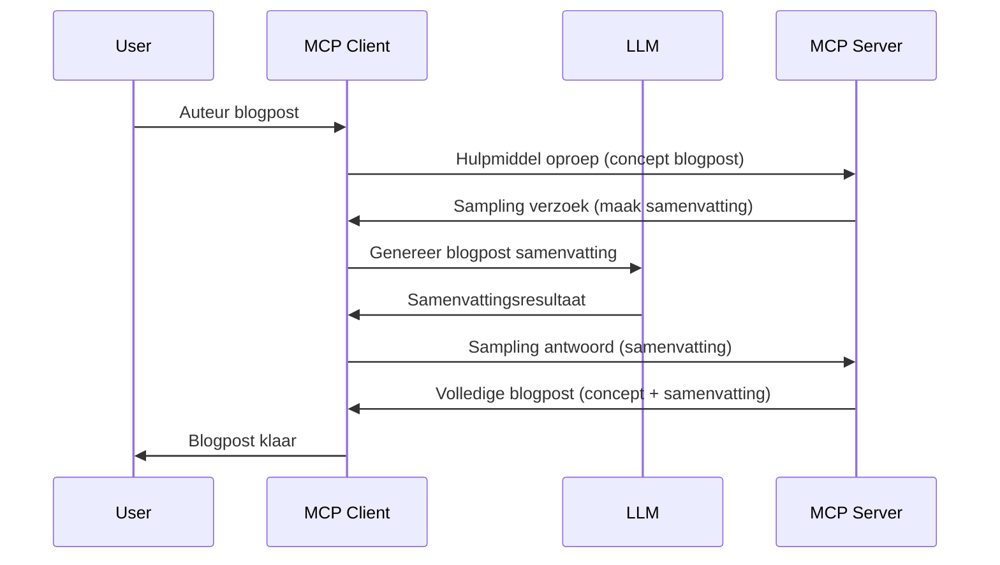

# Sampling - delegeren van functies aan de Client

Soms moeten de MCP Client en de MCP Server samenwerken om een gemeenschappelijk doel te bereiken. Je kunt een situatie hebben waarbij de Server de hulp nodig heeft van een LLM die op de client draait. Voor deze situatie is sampling wat je zou moeten gebruiken.

Laten we enkele use-cases verkennen en hoe je een oplossing bouwt met sampling.

## Overzicht

In deze les richten we ons op het uitleggen wanneer en waar Sampling te gebruiken is en hoe je dit configureert.

## Leerdoelen

In dit hoofdstuk zullen we:

- Uitleggen wat Sampling is en wanneer het te gebruiken.
- Tonen hoe Sampling in MCP te configureren.
- Voorbeelden geven van Sampling in actie.

## Wat is Sampling en waarom gebruiken?

Sampling is een geavanceerde feature die als volgt werkt:


### Sampling verzoek

Oké, nu hebben we een overzicht van een geloofwaardig scenario, laten we het hebben over het sampling verzoek dat de server terugstuurt naar de client. Zo ziet zo’n verzoek er uit in JSON-RPC formaat:

```json
{
  "jsonrpc": "2.0",
  "id": 1,
  "method": "sampling/createMessage",
  "params": {
    "messages": [
      {
        "role": "user",
        "content": {
          "type": "text",
          "text": "Create a blog post summary of the following blog post: <BLOG POST>"
        }
      }
    ],
    "modelPreferences": {
      "hints": [
        {
          "name": "claude-3-sonnet"
        }
      ],
      "intelligencePriority": 0.8,
      "speedPriority": 0.5
    },
    "systemPrompt": "You are a helpful assistant.",
    "maxTokens": 100
  }
}
```

Er zijn hier een paar dingen die het waard zijn om uit te lichten:

- Prompt, onder content -> text, is onze prompt die een instructie is voor de LLM om de inhoud van een blogpost samen te vatten.

- **modelPreferences**. Dit gedeelte is precies dat, een voorkeur, een aanbeveling welke configuratie te gebruiken met de LLM. De gebruiker kan zelf kiezen of hij deze aanbevelingen volgt of aanpast. In dit geval zijn er aanbevelingen over welk model te gebruiken en de prioriteit voor snelheid en intelligentie.
- **systemPrompt**, dit is je normale systeem prompt die je LLM een persoonlijkheid geeft en richtlijnen bevat.
- **maxTokens**, dit is een andere eigenschap die aangeeft hoeveel tokens aanbevolen zijn om te gebruiken voor deze taak.

### Sampling respons

Dit antwoord is wat de MCP Client uiteindelijk terugstuurt aan de MCP Server en is het resultaat van de client die de LLM aanroept, wacht op die respons en dan dit bericht samenstelt. Zo kan het eruit zien in JSON-RPC:

```json
{
  "jsonrpc": "2.0",
  "id": 1,
  "result": {
    "role": "assistant",
    "content": {
      "type": "text",
      "text": "Here's your abstract <ABSTRACT>"
    },
    "model": "gpt-5",
    "stopReason": "endTurn"
  }
}
```

Let op hoe het antwoord een abstract is van de blogpost, precies zoals we gevraagd hebben. Let ook op dat het gebruikte `model` niet is wat we vroegen maar "gpt-5" in plaats van "claude-3-sonnet". Dit illustreert dat de gebruiker van gedachte kan veranderen over wat te gebruiken en dat je sampling verzoek een aanbeveling is.

Oké, nu we de hoofdflow begrijpen, en een nuttige taak om het voor te gebruiken "blogpost creatie + abstract", laten we kijken wat we moeten doen om het werkend te krijgen.

### Berichttypes

Sampling berichten zijn niet alleen beperkt tot tekst maar je kunt ook afbeeldingen en audio sturen. Zo ziet de JSON-RPC er dan anders uit:

**Tekst**

```json
{
  "type": "text",
  "text": "The message content"
}
```

**Afbeeldingscontent**

```json
{
  "type": "image",
  "data": "base64-encoded-image-data",
  "mimeType": "image/jpeg"
}
```

**Audiocontent**

```json
{
  "type": "audio",
  "data": "base64-encoded-audio-data",
  "mimeType": "audio/wav"
}
```

> NOTE: voor meer gedetailleerde info over Sampling, bekijk de [officiële docs](https://modelcontextprotocol.io/specification/2025-06-18/client/sampling)

## Hoe Sampling te configureren in de Client

> Opmerking: als je alleen een server bouwt, hoef je hier weinig te doen.

In een client moet je de volgende feature specificeren zoals:

```json
{
  "capabilities": {
    "sampling": {}
  }
}
```

Dit wordt dan opgepikt wanneer je gekozen client initialiseert met de server.

## Voorbeeld van Sampling in actie - Maak een blogpost

Laten we samen een sampling server coderen, dit moeten we doen:

1. Maak een tool op de Server.
1. Deze tool moet een sampling verzoek maken.
1. De tool moet wachten totdat het sampling verzoek van de client beantwoord wordt.
1. Dan moet het resultaat van de tool geproduceerd worden.

Laten we de code stap voor stap bekijken:

### -1- Maak de tool

**python**

```python
@mcp.tool()
async def create_blog(title: str, content: str, ctx: Context[ServerSession, None]) -> str:
    """Create a blog post and generate a summary"""

```

### -2- Maak een sampling verzoek

Breid je tool uit met de volgende code:

**python**

```python
post = BlogPost(
        id=len(posts) + 1,
        title=title,
        content=content,
        abstract=""
    )

prompt = f"Create an abstract of the following blog post: title: {title} and draft: {content} "

result = await ctx.session.create_message(
        messages=[
            SamplingMessage(
                role="user",
                content=TextContent(type="text", text=prompt),
            )
        ],
        max_tokens=100,
)

```

### -3- Wacht op de respons en retourneer het antwoord

**python**

```python
post.abstract = result.content.text

posts.append(post)

# retourneer het complete product
return json.dumps({
    "id": post.title,
    "abstract": post.abstract
})
```

### -4- Volledige code

**python**

```python
from starlette.applications import Starlette
from starlette.routing import Mount, Host

from mcp.server.fastmcp import Context, FastMCP

from mcp.server.session import ServerSession
from mcp.types import SamplingMessage, TextContent

import json


from uuid import uuid4
from typing import List
from pydantic import BaseModel


mcp = FastMCP("Blog post generator")

# app = FastAPI()

posts = []

class BlogPost(BaseModel):
    id: int
    title: str
    content: str
    abstract: str

posts: List[BlogPost] = []

@mcp.tool()
async def create_blog(title: str, content: str, ctx: Context[ServerSession, None]) -> str:
    """Create a blog post and generate a summary"""

    post = BlogPost(
        id=len(posts) + 1,
        title=title,
        content=content,
        abstract=""
    )

    prompt = f"Create an abstract of the following blog post: title: {title} and draft: {content} "

    result = await ctx.session.create_message(
        messages=[
            SamplingMessage(
                role="user",
                content=TextContent(type="text", text=prompt),
            )
        ],
        max_tokens=100,
    )

    post.abstract = result.content.text

    posts.append(post)

    # retourneer het volledige blogbericht
    return json.dumps({
        "id": post.title,
        "abstract": post.abstract
    })

if __name__ == "__main__":
    print("Starting server...")
    # mcp.run()
    mcp.run(transport="streamable-http")

# voer app uit met: python server.py
```

### -5- Testen in Visual Studio Code

Om dit te testen in Visual Studio Code, doe het volgende:

1. Start de server in de terminal
1. Voeg het toe aan *mcp.json* (en zorg dat het gestart is) bijvoorbeeld zo:

   ```json
   "servers": {
      "blog-server": {
        "type": "http",
        "url": "http://localhost:8000/mcp"
      }
   }
   ```

1. Typ een prompt:

   ```text
   create a blog post named "Where Python comes from", the content is "Python is actually named after Monty Python Flying Circus"
   ```

1. Laat sampling plaatsvinden. De eerste keer dat je dit test wordt je een extra dialoog gepresenteerd die je moet accepteren, daarna zie je de normale dialoog om een tool te starten.

1. Inspecteer de resultaten. Je ziet de resultaten mooi weergegeven in GitHub Copilot Chat maar je kunt ook de ruwe JSON respons inspecteren.

**Bonus**. Visual Studio Code tooling heeft uitstekende ondersteuning voor sampling. Je kunt Sampling toegang configureren op je geïnstalleerde server door zo te navigeren:

1. Navigeer naar de extensiesectie.
1. Selecteer het tandwielicoon voor je geïnstalleerde server in de sectie "MCP SERVERS - INSTALLED".
1. Selecteer "Configure Model Access", hier kun je kiezen welke modellen GitHub Copilot mag gebruiken bij het uitvoeren van sampling. Je kunt ook alle recente sampling verzoeken bekijken door "Show Sampling requests" te selecteren.

## Opdracht

In deze opdracht ga je een iets andere sampling bouwen, namelijk een sampling integratie die het genereren van een productbeschrijving ondersteunt. Dit is je scenario:

**Scenario**: De backoffice medewerker bij een e-commerce heeft hulp nodig, het kost veel te veel tijd om productbeschrijvingen te genereren. Daarom ga je een oplossing bouwen waar je een tool "create_product" kunt aanroepen met "title" en "keywords" als argumenten en het een compleet product moet opleveren inclusief een "description" veld dat gevuld wordt door de LLM van een client.

TIP: gebruik wat je eerder hebt geleerd over hoe je deze server en tool opbouwt met een sampling verzoek.

## Oplossing

[Oplossing](./solution/README.md)

## Belangrijkste punten

Sampling is een krachtige feature die de server in staat stelt om taken te delegeren aan de client wanneer hij de hulp nodig heeft van een LLM.

## Wat nu?

- [Hoofdstuk 4 - Praktische implementatie](../../04-PracticalImplementation/README.md)

---

<!-- CO-OP TRANSLATOR DISCLAIMER START -->
**Disclaimer**:
Dit document is vertaald met behulp van de AI-vertalingsdienst [Co-op Translator](https://github.com/Azure/co-op-translator). Hoewel we streven naar nauwkeurigheid, dient u zich ervan bewust te zijn dat automatische vertalingen fouten of onjuistheden kunnen bevatten. Het oorspronkelijke document in de oorspronkelijke taal moet als de gezaghebbende bron worden beschouwd. Voor kritieke informatie wordt professionele menselijke vertaling aanbevolen. Wij zijn niet aansprakelijk voor eventuele misverstanden of verkeerde interpretaties die voortvloeien uit het gebruik van deze vertaling.
<!-- CO-OP TRANSLATOR DISCLAIMER END -->