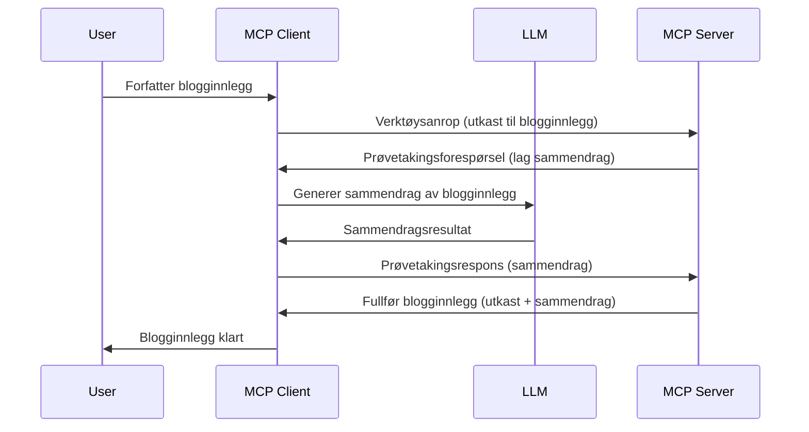

# Sampling - delegere funksjoner til klienten

Noen ganger trenger du at MCP-klienten og MCP-serveren samarbeider for å oppnå et felles mål. Du kan ha en situasjon hvor serveren trenger hjelp fra en LLM som kjører på klienten. For denne situasjonen er sampling det du bør bruke.

La oss utforske noen brukstilfeller og hvordan man bygger en løsning som involverer sampling.

## Oversikt

I denne leksjonen fokuserer vi på å forklare når og hvor man bør bruke Sampling og hvordan man konfigurerer det.

## Læringsmål

I dette kapittelet skal vi:

- Forklare hva Sampling er og når man bør bruke det.
- Vise hvordan man konfigurerer Sampling i MCP.
- Gi eksempler på Sampling i praksis.

## Hva er Sampling og hvorfor bruke det?

Sampling er en avansert funksjon som fungerer på følgende måte:


### Sampling-forespørsel

Ok, nå har vi en overordnet forståelse av et troverdig scenario, la oss snakke om sampling-forespørselen som serveren sender tilbake til klienten. Slik kan en slik forespørsel se ut i JSON-RPC-format:

```json
{
  "jsonrpc": "2.0",
  "id": 1,
  "method": "sampling/createMessage",
  "params": {
    "messages": [
      {
        "role": "user",
        "content": {
          "type": "text",
          "text": "Create a blog post summary of the following blog post: <BLOG POST>"
        }
      }
    ],
    "modelPreferences": {
      "hints": [
        {
          "name": "claude-3-sonnet"
        }
      ],
      "intelligencePriority": 0.8,
      "speedPriority": 0.5
    },
    "systemPrompt": "You are a helpful assistant.",
    "maxTokens": 100
  }
}
```

Det er noen ting her verdt å påpeke:

- Prompt, under content -> text, er vår prompt, som er en instruksjon til LLM om å oppsummere innholdet i blogginnlegget.

- **modelPreferences**. Denne seksjonen er nettopp det, en preferanse, en anbefaling av hvilken konfigurasjon som skal brukes med LLM. Brukeren kan velge om de vil følge disse anbefalingene eller endre dem. I dette tilfellet er det anbefalinger om hvilken modell som skal brukes og prioritet mellom hastighet og intelligens.
- **systemPrompt**, dette er din normale system-prompt som gir LLM-en din en personlighet og inneholder veiledningsinstrukser.
- **maxTokens**, dette er en annen egenskap som brukes for å angi hvor mange tokens som anbefales å bli brukt for denne oppgaven.

### Sampling-svar

Dette svaret er det MCP-klienten til slutt sender tilbake til MCP-serveren, og er resultatet av at klienten kaller LLM, venter på responsen og deretter konstruerer denne meldingen. Slik kan den se ut i JSON-RPC:

```json
{
  "jsonrpc": "2.0",
  "id": 1,
  "result": {
    "role": "assistant",
    "content": {
      "type": "text",
      "text": "Here's your abstract <ABSTRACT>"
    },
    "model": "gpt-5",
    "stopReason": "endTurn"
  }
}
```

Legg merke til hvordan svaret er et sammendrag av blogginnlegget akkurat som vi ba om. Merk også at `model` som ble brukt ikke er den vi ba om, men "gpt-5" i stedet for "claude-3-sonnet". Dette illustrerer at brukeren kan ombestemme seg på hva som skal brukes, og at sampling-forespørselen din er en anbefaling.

Ok, nå som vi forstår hovedflyten, og et nyttig oppgaveområde å bruke det til er "blogginnlegg-opprettelse + sammendrag", la oss se hva vi må gjøre for å få det til å fungere.

### Meldings-typer

Sampling-meldinger er ikke begrenset til bare tekst, men du kan også sende bilder og lyd. Slik ser JSON-RPC annerledes ut:

**Tekst**

```json
{
  "type": "text",
  "text": "The message content"
}
```

**Bildeinnhold**

```json
{
  "type": "image",
  "data": "base64-encoded-image-data",
  "mimeType": "image/jpeg"
}
```

**Lydinnhold**

```json
{
  "type": "audio",
  "data": "base64-encoded-audio-data",
  "mimeType": "audio/wav"
}
```

> NOTE: for mer detaljert info om Sampling, sjekk ut de [offisielle dokumentene](https://modelcontextprotocol.io/specification/2025-06-18/client/sampling)

## Hvordan konfigurere Sampling i klienten

> Merk: hvis du kun bygger en server, trenger du ikke gjøre mye her.

I en klient må du spesifisere følgende funksjon slik:

```json
{
  "capabilities": {
    "sampling": {}
  }
}
```

Dette vil da plukkes opp når din valgte klient initialiseres med serveren.

## Eksempel på Sampling i praksis - Opprette et blogginnlegg

La oss kode en sampling-server sammen, vi må gjøre følgende:

1. Opprette et verktøy på serveren.
1. Det verktøyet skal lage en sampling-forespørsel.
1. Verktøyet skal vente på at klientens sampling-forespørsel blir besvart.
1. Så skal verktøyet produsere resultatet.

La oss se på koden steg for steg:

### -1- Opprett verktøyet

**python**

```python
@mcp.tool()
async def create_blog(title: str, content: str, ctx: Context[ServerSession, None]) -> str:
    """Create a blog post and generate a summary"""

```

### -2- Opprett en sampling-forespørsel

Utvid verktøyet ditt med følgende kode:

**python**

```python
post = BlogPost(
        id=len(posts) + 1,
        title=title,
        content=content,
        abstract=""
    )

prompt = f"Create an abstract of the following blog post: title: {title} and draft: {content} "

result = await ctx.session.create_message(
        messages=[
            SamplingMessage(
                role="user",
                content=TextContent(type="text", text=prompt),
            )
        ],
        max_tokens=100,
)

```

### -3- Vent på svar og returner svaret

**python**

```python
post.abstract = result.content.text

posts.append(post)

# returner det komplette produktet
return json.dumps({
    "id": post.title,
    "abstract": post.abstract
})
```

### -4- Fullstendig kode

**python**

```python
from starlette.applications import Starlette
from starlette.routing import Mount, Host

from mcp.server.fastmcp import Context, FastMCP

from mcp.server.session import ServerSession
from mcp.types import SamplingMessage, TextContent

import json


from uuid import uuid4
from typing import List
from pydantic import BaseModel


mcp = FastMCP("Blog post generator")

# app = FastAPI()

posts = []

class BlogPost(BaseModel):
    id: int
    title: str
    content: str
    abstract: str

posts: List[BlogPost] = []

@mcp.tool()
async def create_blog(title: str, content: str, ctx: Context[ServerSession, None]) -> str:
    """Create a blog post and generate a summary"""

    post = BlogPost(
        id=len(posts) + 1,
        title=title,
        content=content,
        abstract=""
    )

    prompt = f"Create an abstract of the following blog post: title: {title} and draft: {content} "

    result = await ctx.session.create_message(
        messages=[
            SamplingMessage(
                role="user",
                content=TextContent(type="text", text=prompt),
            )
        ],
        max_tokens=100,
    )

    post.abstract = result.content.text

    posts.append(post)

    # returner hele blogginnlegget
    return json.dumps({
        "id": post.title,
        "abstract": post.abstract
    })

if __name__ == "__main__":
    print("Starting server...")
    # mcp.run()
    mcp.run(transport="streamable-http")

# kjør app med: python server.py
```

### -5- Teste det i Visual Studio Code

For å teste dette i Visual Studio Code gjør du følgende:

1. Start serveren i terminalen
1. Legg den til i *mcp.json* (og sørg for at den er startet), for eksempel slik:

   ```json
   "servers": {
      "blog-server": {
        "type": "http",
        "url": "http://localhost:8000/mcp"
      }
   }
   ```

1. Skriv en prompt:

   ```text
   create a blog post named "Where Python comes from", the content is "Python is actually named after Monty Python Flying Circus"
   ```

1. Tillat sampling å skje. Første gang du tester dette vil du få en ekstra dialog du må akseptere, deretter vil du se normal dialog som ber deg kjøre et verktøy.

1. Inspiser resultatene. Du vil se resultatene både pent rendret i GitHub Copilot Chat, men du kan også inspisere rå JSON-respons.

**Bonus**. Visual Studio Code-verktøyene har flott støtte for sampling. Du kan konfigurere Sampling-tilgang på din installerte server ved å navigere slik:

1. Gå til utvidelsesdelen.
1. Velg tannhjulikonet for din installerte server under "MCP SERVERS - INSTALLED".
1. Velg "Configure Model Access", her kan du velge hvilke modeller GitHub Copilot har tillatelse til å bruke under sampling. Du kan også se alle sampling-forespørsler som har skjedd nylig ved å velge "Show Sampling requests".

## Oppgave

I denne oppgaven skal du lage en litt annerledes Sampling, nemlig en sampling-integrasjon som støtter generering av produktbeskrivelser. Her er ditt scenario:

**Scenario**: Bakkontormedarbeideren i en nettbutikk trenger hjelp, det tar altfor mye tid å generere produktbeskrivelser. Derfor skal du bygge en løsning hvor du kan kalle et verktøy "create_product" med "title" og "keywords" som argumenter, og det skal produsere et komplett produkt inkludert et "description"-felt som skal fylles ut av klientens LLM.

TIP: bruk det du lærte tidligere om hvordan du konstruerer denne serveren og verktøyet med en sampling-forespørsel.

## Løsning

[Løsning](./solution/README.md)

## Viktige poenger

Sampling er en kraftfull funksjon som lar serveren delegere oppgaver til klienten når den trenger hjelp fra en LLM.

## Hva nå

- [Kapittel 4 - Praktisk implementering](../../04-PracticalImplementation/README.md)

---

<!-- CO-OP TRANSLATOR DISCLAIMER START -->
**Ansvarsfraskrivelse**:
Dette dokumentet er oversatt ved hjelp av AI-oversettelsestjenesten [Co-op Translator](https://github.com/Azure/co-op-translator). Selv om vi streber etter nøyaktighet, vennligst vær oppmerksom på at automatiske oversettelser kan inneholde feil eller unøyaktigheter. Det opprinnelige dokumentet på dets morsmål bør betraktes som den autoritative kilden. For kritisk informasjon anbefales profesjonell menneskelig oversettelse. Vi er ikke ansvarlige for eventuelle misforståelser eller feiltolkninger som oppstår som følge av bruk av denne oversettelsen.
<!-- CO-OP TRANSLATOR DISCLAIMER END -->