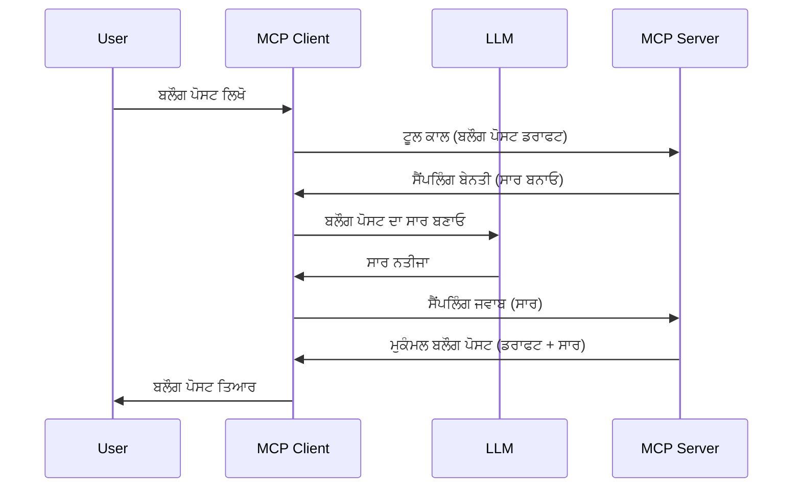

# ਸੈਂਪਲਿੰਗ - ਫੀਚਰਾਂ ਨੂੰ ਕਲਾਇੰਟ ਨੂੰ ਸੌਂਪਣਾ

ਕਈ ਵਾਰ, ਤੁਹਾਨੂੰ MCP ਕਲਾਇੰਟ ਅਤੇ MCP ਸਰਵਰ ਨੂੰ ਇੱਕ ਸਾਂਝੇ ਉਦੇਸ਼ ਨੂੰ ਪ੍ਰਾਪਤ ਕਰਨ ਲਈ ਸਹਿਯੋਗ ਕਰਨਾ ਪੈਂਦਾ ਹੈ। ਤੁਹਾਡੇ ਕੋਲ ਐਸਾ ਮਾਮਲਾ ਹੋ ਸਕਦਾ ਹੈ ਜਿੱਥੇ ਸਰਵਰ ਨੂੰ ਉਸ ਲਕੜੀ ਤੇ ਬੈਠੇ LLM ਦੀ ਮਦਦ ਦੀ ਲੋੜ ਹੈ। ਇਸ ਸਥਿਤੀ ਲਈ, ਸੈਂਪਲਿੰਗ ਉਹ ਚੀਜ਼ ਹੈ ਜੋ ਤੁਸੀਂ ਵਰਤਣਾ ਚਾਹੀਦਾ ਹੈ।

ਆਓ ਕੁਝ ਵਰਤੋਂ ਦੇ ਕੇਸਾਂ ਦੀ ਪੜਚੋਲ ਕਰੀਏ ਅਤੇ ਸੈਂਪਲਿੰਗ ਸ਼ਾਮਿਲ ਇਕ ਹੱਲ ਕਿਵੇਂ ਬਣਾਇਆ ਜਾ ਸਕਦਾ ਹੈ।

## ਸਰਵੇਖਣ

ਇਸ ਪਾਠ ਵਿੱਚ, ਅਸੀਂ ਇਹ ਸਮਝਾਊਂਗੇ ਕਿ ਕਦੋਂ ਅਤੇ ਕਿੱਥੇ ਸੈਂਪਲਿੰਗ ਵਰਤੂ ਅਤੇ ਇਸਨੂੰ ਕਿਵੇਂ ਕਨਫਿਗਰ ਕਰਨਾ ਹੈ।

## ਸਿੱਖਣ ਦੇ ਟੀਚੇ

ਇਸ ਅਧਿਆਇ ਵਿੱਚ, ਅਸੀਂ:

- ਸਮਝਾਊਂਗੇ ਕਿ ਸੈਂਪਲਿੰਗ ਕੀ ਹੈ ਅਤੇ ਕਦੋਂ ਇਸਦਾ ਉਪਯੋਗ ਕਰਨਾ ਤੇ ਕਿਵੇਂ।
- MCP ਵਿੱਚ ਸੈਂਪਲਿੰਗ ਕਿਵੇਂ ਕਨਫਿਗਰ ਕਰਨੀ ਹੈ, ਦਿਖਾਵਾਂਗੇ।
- ਕਿਰਿਆ ਵਿੱਚ ਸੈਂਪਲਿੰਗ ਦੇ ਉਦਾਹਰਣ ਦਿਆਂਗੇ।

## ਸੈਂਪਲਿੰਗ ਕੀ ਹੈ ਅਤੇ ਇਸਦਾ ਉਪਯੋਗ ਕਿਉਂ ਕਰੀਏ?

ਸੈਂਪਲਿੰਗ ਇਕ ਅੱਡਵਾਂਸਡ ਫੀਚਰ ਹੈ ਜੋ ਹੇਠਾਂ ਦਿੱਤੇ ਤਰੀਕੇ ਨਾਲ ਕੰਮ ਕਰਦਾ ਹੈ:


### ਸੈਂਪਲਿੰਗ ਬੇਨਤੀ

ਠੀਕ ਹੈ, ਹੁਣ ਸਾਡੇ ਕੋਲ ਇੱਕ ਮਾਈਲ ਦੀ ਉਚਾਈ ਦਾ ਭਰੋਸੇਮੰਦ ਸਿੰਨਰੀਓ ਹੈ, ਆਓ ਸੈਂਪਲਿੰਗ ਬੇਨਤੀ ਜਿਸ ਨੂੰ ਸਰਵਰ ਕਲਾਇੰਟ ਨੂੰ ਭੇਜਦਾ ਹੈ, ਬਾਰੇ ਗੱਲ ਕਰੀਏ। JSON-RPC ਫਾਰਮੈਟ ਵਿੱਚ ਇਸ ਤਰ੍ਹਾਂ ਦੀ ਬੇਨਤੀ ਦੇਖਣੀ ਏ:

```json
{
  "jsonrpc": "2.0",
  "id": 1,
  "method": "sampling/createMessage",
  "params": {
    "messages": [
      {
        "role": "user",
        "content": {
          "type": "text",
          "text": "Create a blog post summary of the following blog post: <BLOG POST>"
        }
      }
    ],
    "modelPreferences": {
      "hints": [
        {
          "name": "claude-3-sonnet"
        }
      ],
      "intelligencePriority": 0.8,
      "speedPriority": 0.5
    },
    "systemPrompt": "You are a helpful assistant.",
    "maxTokens": 100
  }
}
```

ਇੱਥੇ ਕੁਝ ਗੱਲਾਂ ਕਹਿਣ ਯੋਗ ਹਨ:

- ਪ੍ਰਾਂਪਟ, content -> text ਵਿੱਚ, ਸਾਡਾ ਪ੍ਰਾਂਪਟ ਹੈ ਜੋ LLM ਨੂੰ ਬਲੌਗ ਪੋਸਟ ਸਮੱਗਰੀ ਦਾ ਸੰਖੇਪ ਕਰਨ ਦਾ ਨਿਰਦੇਸ਼ ਹੈ।

- **modelPreferences**. ਇਹ ਭਾਗ ਇੱਕ ਪਸੰਦ ਹੈ, LLM ਨਾਲ ਕਿਸ ਤਰ੍ਹਾਂ ਕਨਫਿਗਰ ਕਰਨਾ ਚਾਹੀਦਾ ਹੈ ਇਸ ਦੀ ਸਿਫਾਰਿਸ਼। ਯੂਜ਼ਰ ਇਨ੍ਹਾਂ ਸਿਫਾਰਿਸ਼ਾਂ ਨੂੰ ਮਨਜ਼ੂਰ ਜਾਂ ਬਦਲ ਸਕਦਾ ਹੈ। ਇਸ ਵਿੱਚ ਮਾਡਲ ਉਪਯੋਗ ਕਰਨ, ਤੇਜ਼ੀ ਅਤੇ ਬੁੱਧੀਮਤਾ ਦੀ ਪ੍ਰਾਥਮਿਕਤਾ ਲਈ ਸਿਫਾਰਸ਼ਾਂ ਹਨ।
- **systemPrompt**, ਇਹ ਤੁਹਾਡਾ ਆਮ ਸਿਸਟਮ ਪ੍ਰਾਂਪਟ ਹੈ ਜੋ ਤੁਹਾਡੇ LLM ਨੂੰ ਵਿਅਕਤੀਗਤ ਪਝਾਣ ਦਿੰਦਾ ਹੈ ਅਤੇ ਦਿਸ਼ਾ-ਨਿਰਦੇਸ਼ ਦਿੰਦਾ ਹੈ।
- **maxTokens**, ਇਹ ਹੋਰ ਇੱਕ ਗੁਣ ਹੈ ਜੋ ਦੱਸਦਾ ਹੈ ਕਿ ਇਸ ਕਾਰਜ ਲਈ ਕਿੰਨੇ ਟੋਕਨ ਵਰਤਣ ਦੀ ਸਿਫਾਰਿਸ਼ ਕੀਤੀ ਜਾਂਦੀ ਹੈ।

### ਸੈਂਪਲਿੰਗ ਜਵਾਬ

ਇਹ ਜਵਾਬ MCP ਕਲਾਇੰਟ ਵੱਲੋਂ MCP ਸਰਵਰ ਨੂੰ ਭੇਜਿਆ ਜਾਂਦਾ ਹੈ ਜੋ ਕਲਾਇੰਟ ਦੇ LLM ਨੂੰ ਕਾਲ ਕਰਨ, ਉੱਤਰ ਦੀ ਉਡੀਕ ਕਰਨ ਅਤੇ ਫਿਰ ਇਹ ਸੁਨੇਹਾ ਬਣਾਉਣ ਦਾ ਨਤੀਜਾ ਹੁੰਦਾ ਹੈ। JSON-RPC ਵਿੱਚ ਇਹ ਇਸ ਤਰ੍ਹਾਂ ਦਿਖਾਈ ਦੇ ਸਕਦਾ ਹੈ:

```json
{
  "jsonrpc": "2.0",
  "id": 1,
  "result": {
    "role": "assistant",
    "content": {
      "type": "text",
      "text": "Here's your abstract <ABSTRACT>"
    },
    "model": "gpt-5",
    "stopReason": "endTurn"
  }
}
```

ਧਿਆਨ ਦਿਓ ਕਿ ਜਵਾਬ ਬਲੌਗ ਪੋਸਟ ਦੇ ਸੰਖੇਪ ਵਰਗਾ ਹੀ ਹੈ ਜਿਸਦਾ ਅਸੀਂ ਮੰਗ ਕੀਤੀ ਸੀ। ਨਾਲ ਹੀ ਦੇਖੋ ਕਿ ਵਰਤਿਆ ਮਾਡਲ "`gpt-5`" ਹੈ ਨਾ ਕਿ "`claude-3-sonnet`" ਜੋ ਕਿ ਅਸੀਂ ਮੰਗਿਆ ਸੀ। ਇਹ ਦਰਸਾਉਂਦਾ ਹੈ ਕਿ ਯੂਜ਼ਰ ਆਪਣਾ ਮਨ ਬਦਲ ਸਕਦਾ ਹੈ ਅਤੇ ਤੁਹਾਡੀ ਸੈਂਪਲਿੰਗ ਬੇਨਤੀ ਸਿਫਾਰਿਸ਼ ਹੀ ਹੈ।

ਠੀਕ ਹੈ, ਹੁਣ ਜਦੋਂ ਅਸੀਂ ਮੂਲ ਪ੍ਰਕਿਰਿਆ ਨੂੰ ਸਮਝ ਚੁੱਕੇ ਹਾਂ, ਅਤੇ ਇਸਦਾ ਉਪਯੋਗ ਕਰਕੇ "ਬਲੌਗ ਪੋਸਟ ਬਣਾਉਣਾ + ਸੰਖੇਪ", ਆਓ ਦੇਖੀਏ ਕਿ ਇਸਨੂੰ ਕਿਵੇਂ ਕੰਮ ਕਰਵਾਉਣਾ ਹੈ।

### ਸੁਨੇਹੇ ਦੇ ਕਿਸਮਾਂ

ਸੈਂਪਲਿੰਗ ਸੰਦੇਸ਼ ਸਿਰਫ ਟੈਕਸਟ ਤੱਕ ਸੀਮਿਤ ਨਹੀਂ ਹਨ, ਤੁਸੀਂ ਵੀ ਛਬੀਆਂ ਅਤੇ ਆਡੀਓ ਭੇਜ ਸਕਦੇ ਹੋ। JSON-RPC ਐਸਾ ਵੱਖਰਾ ਦਿਖਾਈ ਦਿੰਦਾ ਹੈ:

**ਟੈਕਸਟ**

```json
{
  "type": "text",
  "text": "The message content"
}
```

**ਛਬੀ ਸਮੱਗਰੀ**

```json
{
  "type": "image",
  "data": "base64-encoded-image-data",
  "mimeType": "image/jpeg"
}
```

**ਆਡੀਓ ਸਮੱਗਰੀ**

```json
{
  "type": "audio",
  "data": "base64-encoded-audio-data",
  "mimeType": "audio/wav"
}
```

> NOTE: ਵਧੇਰੇ ਵਿਸਥਾਰ ਨਾਲ ਸੈਂਪਲਿੰਗ ਬਾਰੇ ਜਾਣਕਾਰੀ ਲਈ, [ਅਧਿਕਾਰਿਕ ਡੌਕ](https://modelcontextprotocol.io/specification/2025-06-18/client/sampling) ਵੇਖੋ।

## ਕਲਾਇੰਟ ਵਿੱਚ ਸੈਂਪਲਿੰਗ ਕਿਵੇਂ ਕਨਫਿਗਰ ਕਰੀਏ

> ਨੋਟ: ਜੇਕਰ ਤੁਸੀਂ ਸਿਰਫ ਸਰਵਰ ਬਣਾ ਰਹੇ ਹੋ, ਤਾਂ ਇੱਥੇ ਜ਼ਿਆਦਾ ਕੁਝ ਕਰਨ ਦੀ ਲੋੜ ਨਹੀਂ।

ਇੱਕ ਕੁਲਾਇੰਟ ਵਿੱਚ ਤੁਹਾਨੂੰ ਹੇਠਾਂ ਦਿੱਤੇ ਫੀਚਰ ਨੂੰ ਇਸ ਤਰ੍ਹਾਂ ਦਰਜ ਕਰਨਾ ਪਵੇਗਾ:

```json
{
  "capabilities": {
    "sampling": {}
  }
}
```

ਇਹ ਫਿਰ ਚੁਣੇ ਹੋਏ ਕਲਾਇੰਟ ਨੂੰ ਸਰਵਰ ਨਾਲ ਸ਼ੁਰੂ ਕਰਨ ਸਮੇਂ ਚੁੱਕਿਆ ਜਾਵੇਗਾ।

## ਸੈਂਪਲਿੰਗ ਦੀ ਕਾਰਗਰਤਾ ਦਾ ਉਦਾਹਰਣ - ਬਲੌਗ ਪੋਸਟ ਬਣਾਓ

ਆਓ ਇਕੱਠੇ ਸੈਂਪਲਿੰਗ ਸਰਵਰ ਕੋਡ ਕਰੀਏ, ਸਾਡੇ ਨੂੰ ਇਹ ਕਰਨ ਦੀ ਲੋੜ ਹੋਏਗੀ:

1. ਸਰਵਰ ਵਿੱਚ ਇੱਕ ਟੂਲ ਬਣਾਓ।
1. ਇਹ ਟੂਲ ਸੈਂਪਲਿੰਗ ਬੇਨਤੀ ਬਣਾਏ।
1. ਟੂਲ ਨੂੰ ਕਲਾਇੰਟ ਦੀ ਸੈਂਪਲਿੰਗ ਬੇਨਤੀ ਦੇ ਉੱਤਰ ਦੀ ਉਡੀਕ ਕਰਨੀ ਚਾਹੀਦੀ ਹੈ।
1. ਫਿਰ ਟੂਲ ਨਤੀਜਾ ਤਿਆਰ ਕੀਤਾ ਜਾਵੇ।

ਕੋਡ ਕਦਮ-ਦਰ-ਕਦਮ ਦੇਖੀਏ:

### -1- ਟੂਲ ਬਣਾਓ

**python**

```python
@mcp.tool()
async def create_blog(title: str, content: str, ctx: Context[ServerSession, None]) -> str:
    """Create a blog post and generate a summary"""

```

### -2- ਸੈਂਪਲਿੰਗ ਬੇਨਤੀ ਬਣਾਓ

ਆਪਣੇ ਟੂਲ ਨੂੰ ਹੇਠਾਂ ਦਿੱਤੇ ਕੋਡ ਨਾਲ ਵਧਾਓ:

**python**

```python
post = BlogPost(
        id=len(posts) + 1,
        title=title,
        content=content,
        abstract=""
    )

prompt = f"Create an abstract of the following blog post: title: {title} and draft: {content} "

result = await ctx.session.create_message(
        messages=[
            SamplingMessage(
                role="user",
                content=TextContent(type="text", text=prompt),
            )
        ],
        max_tokens=100,
)

```

### -3- ਜਵਾਬ ਦੀ ਉਡੀਕ ਕਰੋ ਅਤੇ ਜਵਾਬ ਨੂੰ ਵਾਪਸ ਦਿਓ

**python**

```python
post.abstract = result.content.text

posts.append(post)

# ਪੂਰਾ ਉਤਪਾਦ ਵਾਪਸ ਕਰੋ
return json.dumps({
    "id": post.title,
    "abstract": post.abstract
})
```

### -4- ਪੂਰਾ ਕੋਡ

**python**

```python
from starlette.applications import Starlette
from starlette.routing import Mount, Host

from mcp.server.fastmcp import Context, FastMCP

from mcp.server.session import ServerSession
from mcp.types import SamplingMessage, TextContent

import json


from uuid import uuid4
from typing import List
from pydantic import BaseModel


mcp = FastMCP("Blog post generator")

# ਐਪ = FastAPI()

posts = []

class BlogPost(BaseModel):
    id: int
    title: str
    content: str
    abstract: str

posts: List[BlogPost] = []

@mcp.tool()
async def create_blog(title: str, content: str, ctx: Context[ServerSession, None]) -> str:
    """Create a blog post and generate a summary"""

    post = BlogPost(
        id=len(posts) + 1,
        title=title,
        content=content,
        abstract=""
    )

    prompt = f"Create an abstract of the following blog post: title: {title} and draft: {content} "

    result = await ctx.session.create_message(
        messages=[
            SamplingMessage(
                role="user",
                content=TextContent(type="text", text=prompt),
            )
        ],
        max_tokens=100,
    )

    post.abstract = result.content.text

    posts.append(post)

    # ਪੂਰੀ ਬਲੌਗ ਪੋਸਟ ਵਾਪਸ ਕਰੋ
    return json.dumps({
        "id": post.title,
        "abstract": post.abstract
    })

if __name__ == "__main__":
    print("Starting server...")
    # mcp.run()
    mcp.run(transport="streamable-http")

# ਐਪ ਚਲਾਉਣ ਲਈ: python server.py
```

### -5- Visual Studio Code ਵਿੱਚ ਟੈਸਟ ਕਰਨਾ

ਇਸਨੂੰ Visual Studio Code ਵਿੱਚ ਟੈਸਟ ਕਰਨ ਲਈ, ਇਹ ਕਰੀਏ:

1. ਟਰਮਿਨਲ ਵਿੱਚ ਸਰਵਰ ਚਾਲੂ ਕਰੋ
1. ਇਸਨੂੰ *mcp.json* ਵਿੱਚ ਸ਼ਾਮਿਲ ਕਰੋ (ਅਤੇ ਪੱਕਾ ਕਰੋ ਕਿ ਇਹ ਚਾਲੂ ਹੈ) ਜਿਵੇਂ ਉਦਾਹਰਣ ਹੇਠਾਂ ਦਿੱਤਾ ਹੈ:

   ```json
   "servers": {
      "blog-server": {
        "type": "http",
        "url": "http://localhost:8000/mcp"
      }
   }
   ```

1. ਇੱਕ ਪ੍ਰਾਂਪਟ ਟਾਈਪ ਕਰੋ:

   ```text
   create a blog post named "Where Python comes from", the content is "Python is actually named after Monty Python Flying Circus"
   ```

1. ਸੈਂਪਲਿੰਗ ਦੀ ਆਗਿਆ ਦਿਓ। ਪਹਿਲੀ ਵਾਰੀ ਜਦੋਂ ਤੁਸੀਂ ਇਸਨੂੰ ਟੈਸਟ ਕਰੋਗੇ ਤਾਂ ਇਕ ਵਾਧੂ ਡਾਇਲਾਗ ਵਿਆਹੇਗਾ ਜਿਹਨੂੰ ਤੁਹਾਨੂੰ ਮਨਜ਼ੂਰ ਕਰਨਾ ਪਵੇਗਾ, ਫਿਰ ਬਧਾਈ ਡਾਇਲਾਗ ਨਜ਼ਰ ਆਵੇਗੀ ਜੋ ਤੁਹਾਨੂੰ ਟੂਲ ਚਲਾਉਣ ਲਈ ਪੁੱਛੇਗੀ।

1. ਨਤੀਜੇ ਦੀ ਜਾਂਚ ਕਰੋ। ਤੁਸੀਂ ਨਤੀਜੇ GitHub Copilot Chat ਵਿੱਚ ਸੁੰਦਰ ਤਰੀਕੇ ਨਾਲ ਤੇ ਕੱਚੇ JSON ਜਵਾਬ ਵੀ ਦੇਖ ਸਕਦੇ ਹੋ।

**ਬੋਨਸ**: Visual Studio Code ਟੂਲਿੰਗ ਸੈਂਪਲਿੰਗ ਲਈ ਬਹੁਤ ਵਧੀਆ ਸਹਾਇਤਾ ਰੱਖਦਾ ਹੈ। ਤੁਸੀਂ ਆਪਣੇ ਇੰਸਟਾਲ ਕੀਤੇ ਸਰਵਰ ਤੇ ਸੈਂਪਲਿੰਗ ਐਕਸੈਸ ਕਨਫਿਗਰ ਕਰ ਸਕਦੇ ਹੋ ਇਨ੍ਹਾਂ ਪਦਰਾਂ ਨਾਲ:

1. ਵਧਾਇਕ ਬਿਭਾਗ ਤੇ ਜਾਓ।
1. "MCP SERVERS - INSTALLED" ਭਾਗ ਵਿੱਚ ਆਪਣੇ ਇੰਸਟਾਲ ਕੀਤੇ ਸਰਵਰ ਲਈ ਸੈੱਟਿੰਗ ਗੀਅਰ ਚਿੰਨ੍ਹ ਸਲੈਕਟ ਕਰੋ।
1. "Configure Model Access" ਸਲੈਕਟ ਕਰੋ, ਇੱਥੇ ਤੁਸੀਂ ਚੁਣ ਸਕਦੇ ਹੋ ਕਿ GitHub Copilot ਨੂੰ ਸੈਂਪਲਿੰਗ ਦੌਰਾਨ ਕਿਹੜੇ ਮਾਡਲ ਵਰਤਣੇ ਦੀ ਆਗਿਆ ਹੈ। ਤੁਸੀਂ ਹਾਲ ਹੀ ਵਿੱਚ ਹੋਈਆਂ ਸਾਰੀਆਂ ਸੈਂਪਲਿੰਗ ਬੇਨਤੀਆਂ ਵੀ "Show Sampling requests" ਨਾਲ ਵੇਖ ਸਕਦੇ ਹੋ।

## ਅਸਾਈਨਮੈਂਟ

ਇਸ ਅਸਾਈਨਮੈਂਟ ਵਿੱਚ, ਤੁਸੀਂ ਇੱਕ ਥੋੜਾ ਜਿਹਾ ਵੱਖਰਾ ਸੈਂਪਲਿੰਗ ਬਣਾਵੋਗੇ, ਜੋ ਪ੍ਰੋਡਕਟ ਵਰਣਨ ਬਣਾਉਣ ਦੇ ਯੋਗ ਹੈ। ਤੁਸੀਂ ਇਹ ਸਿੰਨਰੀਓ ਲਵੋ:

**ਸਿੰਨਰੀਓ**: ਈ-ਕਾਮਰਸ ਦਾ ਬੈਕ-ਆਫਿਸ ਕਰਮਚਾਰੀ ਮਦਦ ਚਾਹੁੰਦਾ ਹੈ, ਉਹਨਾਂ ਲਈ ਪ੍ਰੋਡਕਟ ਵਰਣਨ ਬਣਾਉਣਾ ਬਹੁਤ ਸਮਾਂ ਲੈਂਦਾ ਹੈ। ਇਸ ਲਈ, ਤੁਸੀਂ ਐਸਾ ਹੱਲ ਬਣਾਉਣੇ ਹੋ, ਜਿਸ ਵਿੱਚ ਤੁਸੀਂ "create_product" ਨਾਮ ਦਾ ਟੂਲ ਕਾਲ ਕਰ ਸਕੋਗੇ ਜਿਥੇ "title" ਅਤੇ "keywords" ਦੇ ਦਲੀਲਾਂ ਨਾਲ ਇੱਕ ਪੂਰਾ ਉਤਪਾਦ ਬਣੇਗਾ ਜਿਸਦਾ "description" ਫੀਲਡ ਕਲਾਇੰਟ ਦੇ LLM ਵੱਲੋਂ ਭਰਿਆ ਜਾਵੇਗਾ।

TIP: ਅਗਲੇ ਲਈ ਸਿੱਖਿਆ ਅਨੁਸਾਰ ਇਸ ਸਰਵਰ ਅਤੇ ਇਸਦਾ ਟੂਲ ਸੈਂਪਲਿੰਗ ਬੇਨਤੀ ਨਾਲ ਕਿਵੇਂ ਬਣਾਉਣਾ ਹੈ, ਇਸਦਾ ਉਪਯੋਗ ਕਰੋ।

## ਹੱਲ

[Solution](./solution/README.md)

## ਮੁੱਖ ਸਿੱਖਾਂ

ਸੈਂਪਲਿੰਗ ਇਕ ਤਾਕਤਵਰ ਫੀਚਰ ਹੈ ਜੋ ਸਰਵਰ ਨੂੰ ਜਦੋਂ LLM ਦੀ ਮਦਦ ਚਾਹੀਦੀ ਹੈ ਤਾਂ ਕਲਾਇੰਟ ਨੂੰ ਕਾਰਜ ਸੌਂਪਣ ਦਿੰਦਾ ਹੈ।

## ਅਗਲਾ ਕੀ ਹੈ

- [ਅਧਿਆਇ 4 - ਪ੍ਰਯੋਗਿਕ ਅਮਲ](../../04-PracticalImplementation/README.md)

---

<!-- CO-OP TRANSLATOR DISCLAIMER START -->
**ਅਸੂਲ-ਰਿਹਾ**:  
ਇਹ ਦਸਤਾਵੇਜ਼ AI ਅਨੁਵਾਦ ਸੇਵਾ [Co-op Translator](https://github.com/Azure/co-op-translator) ਦੀ ਵਰਤੋਂ ਕਰਕੇ ਅਨੁਵਾਦ ਕੀਤਾ ਗਿਆ ਹੈ। ਜਦੋਂਕਿ ਅਸੀਂ ਸੁਚਿੱਟਤਾ ਲਈ ਕੋਸ਼ਿਸ਼ ਕਰਦੇ ਹਾਂ, ਕਿਰਪਾ ਕਰਕੇ ਧਿਆਨ ਰੱਖੋ ਕਿ ਸਵੈਚਾਲਿਤ ਅਨੁਵਾਦਾਂ ਵਿੱਚ ਗਲਤੀਆਂ ਜਾਂ ਭੁੱਲਾਂ ਹੋ ਸਕਦੀਆਂ ਹਨ। ਮੂਲ ਦਸਤਾਵੇਜ਼ ਆਪਣੇ ਮੂਲ ਭਾਸ਼ਾ ਵਿੱਚ ਹੀ ਪ੍ਰਮਾਣਿਕ ਸਰੋਤ ਮੰਨਿਆ ਜਾਣਾ ਚਾਹੀਦਾ ਹੈ। ਮਹੱਤਵਪੂਰਨ ਜਾਣਕਾਰੀ ਲਈ, ਪੇਸ਼ੇਵਰ ਮਾਨਵ ਅਨੁਵਾਦ ਦੀ ਸਿਫ਼ਾਰਿਸ਼ ਕੀਤੀ ਜਾਂਦੀ ਹੈ। ਇਸ ਅਨੁਵਾਦ ਦੇ ਇਸਤੇਮਾਲ ਤੋਂ ਪੈਦਾ ਹੋਣ ਵਾਲੀਆਂ ਕਿਸੇ ਵੀ ਗਲਤਫਹਮੀਆਂ ਜਾਂ ਭੁੱਲਾਂ ਲਈ ਅਸੀ ਜ਼ਿੰਮੇਵਾਰ ਨਹੀਂ ਹਾਂ।
<!-- CO-OP TRANSLATOR DISCLAIMER END -->