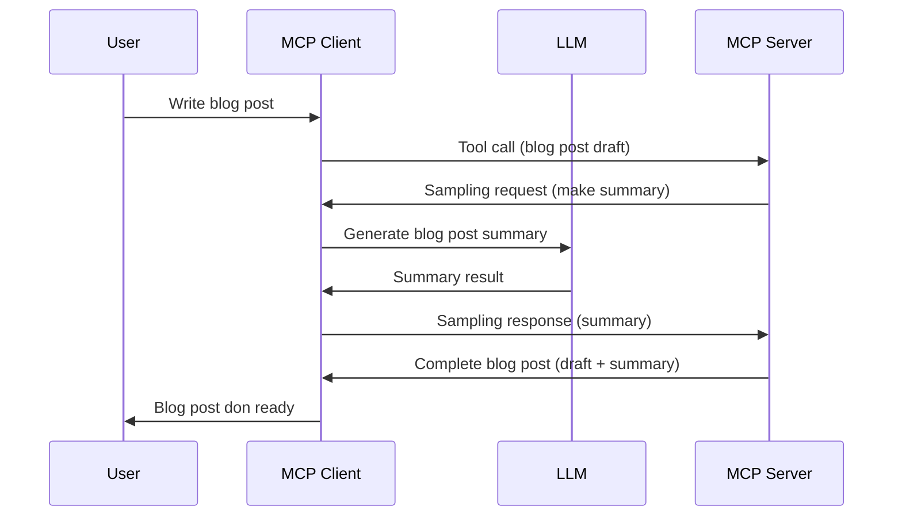

# Sampling - delegate features to the Client

Sometimes, you need di MCP Client and di MCP Server to work together to achieve one common goal. You fit get situation where di Server need di help of one LLM wey dey for di client. For dis kain situation, sampling na wetin you for use.

Make we check some use cases and how to build solution wey involve sampling.

## Overview

For dis lesson, we go focus on talk when and where to use Sampling and how to set am up.

## Learning Objectives

For dis chapter, we go:

- Explain wetin Sampling be and when to use am.
- Show how to set Sampling for MCP.
- Show examples of Sampling for action.

## Wetin Sampling be and why you go use am?

Sampling na one advanced feature wey dey work dis way:


### Sampling request

Ok, now we get one clear idea of one real-life case, make we talk about di sampling request wey di server go send back to di client. Na so di kain request fit look like for JSON-RPC format:

```json
{
  "jsonrpc": "2.0",
  "id": 1,
  "method": "sampling/createMessage",
  "params": {
    "messages": [
      {
        "role": "user",
        "content": {
          "type": "text",
          "text": "Create a blog post summary of the following blog post: <BLOG POST>"
        }
      }
    ],
    "modelPreferences": {
      "hints": [
        {
          "name": "claude-3-sonnet"
        }
      ],
      "intelligencePriority": 0.8,
      "speedPriority": 0.5
    },
    "systemPrompt": "You are a helpful assistant.",
    "maxTokens": 100
  }
}
```

Some tins dey here wey worth to talk about:

- Prompt, under content -> text, na our prompt wey be instruction for di LLM to summarize blog post content.

- **modelPreferences**. Dis section na just preference, na recommendation for which configuration to use with di LLM. Di user fit choose if im go follow these recommendations or change dem. For dis case, dem recommend which model to use and speed plus intelligence priority.
- **systemPrompt**, na your regular system prompt wey give your LLM personality and dey carry guidance instructions.
- **maxTokens**, dis na another property wey dey tell how many tokens dem recommend to use for dis work.

### Sampling response

Dis response na wetin MCP Client go send back to di MCP Server and na di result of di client calling di LLM, dey wait for di answer then build dis message. Na so e fit look like for JSON-RPC:

```json
{
  "jsonrpc": "2.0",
  "id": 1,
  "result": {
    "role": "assistant",
    "content": {
      "type": "text",
      "text": "Here's your abstract <ABSTRACT>"
    },
    "model": "gpt-5",
    "stopReason": "endTurn"
  }
}
```

Note how di response na summary of di blog post as we request. Also notice how di model wey dem use no be wetin we ask, na "gpt-5" instead of "claude-3-sonnet". Dis show say di user fit change im mind about which model to use and your sampling request na only recommendation.

Ok, now we sabi di main flow, and good work to use am for "blog post creation + abstract", make we see wetin we need to do to make am work.

### Message types

Sampling messages no restrict to just text, you fit send images and audio too. Na so di JSON-RPC fit look different:

**Text**

```json
{
  "type": "text",
  "text": "The message content"
}
```

**Image content**

```json
{
  "type": "image",
  "data": "base64-encoded-image-data",
  "mimeType": "image/jpeg"
}
```

**Audio content**

```json
{
  "type": "audio",
  "data": "base64-encoded-audio-data",
  "mimeType": "audio/wav"
}
```

> NOTE: for more detailed info on Sampling, check out the [official docs](https://modelcontextprotocol.io/specification/2025-06-18/client/sampling)

## How to Configure Sampling in the Client

> Note: if you dey build only server, you no need to do much here.

For client, you gats specify this feature like dis:

```json
{
  "capabilities": {
    "sampling": {}
  }
}
```

This one go dey picked up when your chosen client connect to the server.

## Example of Sampling in Action - Create a Blog Post

Make we code one sampling server together, we go need to do dis ones:

1. Create tool for di Server.
1. Di tool suppose create sampling request.
1. Tool go wait for client sampling request make e answer am.
1. Then e go produce di tool result.

Make we see di code step by step:

### -1- Create di tool

**python**

```python
@mcp.tool()
async def create_blog(title: str, content: str, ctx: Context[ServerSession, None]) -> str:
    """Create a blog post and generate a summary"""

```

### -2- Create one sampling request

Add dis code to your tool:

**python**

```python
post = BlogPost(
        id=len(posts) + 1,
        title=title,
        content=content,
        abstract=""
    )

prompt = f"Create an abstract of the following blog post: title: {title} and draft: {content} "

result = await ctx.session.create_message(
        messages=[
            SamplingMessage(
                role="user",
                content=TextContent(type="text", text=prompt),
            )
        ],
        max_tokens=100,
)

```

### -3- Wait for di response and return am

**python**

```python
post.abstract = result.content.text

posts.append(post)

# return di whole product
return json.dumps({
    "id": post.title,
    "abstract": post.abstract
})
```

### -4- Full code

**python**

```python
from starlette.applications import Starlette
from starlette.routing import Mount, Host

from mcp.server.fastmcp import Context, FastMCP

from mcp.server.session import ServerSession
from mcp.types import SamplingMessage, TextContent

import json


from uuid import uuid4
from typing import List
from pydantic import BaseModel


mcp = FastMCP("Blog post generator")

# app = FastAPI()

posts = []

class BlogPost(BaseModel):
    id: int
    title: str
    content: str
    abstract: str

posts: List[BlogPost] = []

@mcp.tool()
async def create_blog(title: str, content: str, ctx: Context[ServerSession, None]) -> str:
    """Create a blog post and generate a summary"""

    post = BlogPost(
        id=len(posts) + 1,
        title=title,
        content=content,
        abstract=""
    )

    prompt = f"Create an abstract of the following blog post: title: {title} and draft: {content} "

    result = await ctx.session.create_message(
        messages=[
            SamplingMessage(
                role="user",
                content=TextContent(type="text", text=prompt),
            )
        ],
        max_tokens=100,
    )

    post.abstract = result.content.text

    posts.append(post)

    # return di complete blog post
    return json.dumps({
        "id": post.title,
        "abstract": post.abstract
    })

if __name__ == "__main__":
    print("Starting server...")
    # mcp.run()
    mcp.run(transport="streamable-http")

# run di app wit: python server.py
```

### -5- Test am for Visual Studio Code

To test dis for Visual Studio Code, do dis ones:

1. Start server for terminal
1. Add am to *mcp.json* (make sure say e start) like dis:

   ```json
   "servers": {
      "blog-server": {
        "type": "http",
        "url": "http://localhost:8000/mcp"
      }
   }
   ```

1. Type your prompt:

   ```text
   create a blog post named "Where Python comes from", the content is "Python is actually named after Monty Python Flying Circus"
   ```

1. Allow sampling to happen. First time you test dis, you go see extra dialog wey you must accept, then you go see normal dialog wey ask you to run tool

1. Check di results. You go see di results nicely shown for GitHub Copilot Chat but you fit also check di raw JSON response.

**Bonus**. Visual Studio Code tools get beta support for sampling. You fit configure Sampling access on your installed server like dis:

1. Go extension section.
1. Click di cog icon for your installed server under "MCP SERVERS - INSTALLED".
1 Click "Configure Model Access", here you fit choose which Models GitHub Copilot go fit use when dem dey do sampling. You fit also see all sampling requests wey happen recently by clicking "Show Sampling requests".

## Assignment

For dis assignment, you go build one kind different Sampling wey be sampling integration wey support to generate product description. Here na your scenario:

**Scenario**: Di back office worker for one e-commerce need help, e dey take too much time to generate product descriptions. So, you go build solution wey fit call tool "create_product" with "title" and "keywords" as argument and e go produce full product including "description" field wey go fill by client’s LLM.

TIP: use wetin you learn before on how to build dis server and im tool with sampling request.

## Solution

[Solution](./solution/README.md)

## Key Takeaways

Sampling na beta feature wey allow server to delegate tasks to client when e need help from LLM.

## What's Next

- [Chapter 4 - Practical implementation](../../04-PracticalImplementation/README.md)

---

<!-- CO-OP TRANSLATOR DISCLAIMER START -->
**Disclaimer**:  
Dis document don translate wit AI translation service [Co-op Translator](https://github.com/Azure/co-op-translator). Even tho we try make e correct, abeg sabi say automated translation fit get mistakes or no too correct. Di original document wey e dey for im own language na di correct one to rely on. If na serious matter, better make person wey sabi do translation translate am. We no go take responsibility if person no understand well or mix up tins because of dis translation.
<!-- CO-OP TRANSLATOR DISCLAIMER END -->