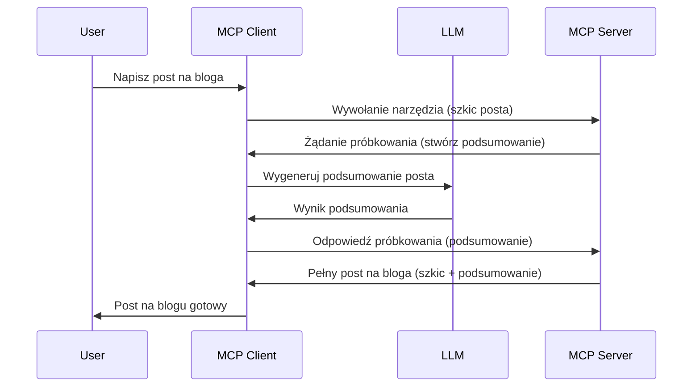

# Próbkowanie - delegowanie funkcji do Klienta

Czasami potrzebujesz, aby klient MCP i serwer MCP współpracowały w celu osiągnięcia wspólnego celu. Możesz mieć sytuację, w której serwer wymaga pomocy LLM znajdującego się u klienta. W takim przypadku powinieneś użyć próbkowania.

Przyjrzyjmy się niektórym przypadkom użycia i jak zbudować rozwiązanie z wykorzystaniem próbkowania.

## Przegląd

W tej lekcji skupimy się na wyjaśnieniu, kiedy i gdzie używać próbkowania oraz jak je konfigurować.

## Cele nauki

W tym rozdziale:

- Wyjaśnimy, czym jest próbkowanie i kiedy go używać.
- Pokażemy, jak skonfigurować próbkowanie w MCP.
- Zaprezentujemy przykłady działania próbkowania.

## Czym jest próbkowanie i dlaczego go używać?

Próbkowanie to zaawansowana funkcja, która działa w następujący sposób:


### Żądanie próbkowania

Ok, teraz mamy ogólny zarys wiarygodnego scenariusza, porozmawiajmy o żądaniu próbkowania, które serwer wysyła z powrotem do klienta. Tak może wyglądać takie żądanie w formacie JSON-RPC:

```json
{
  "jsonrpc": "2.0",
  "id": 1,
  "method": "sampling/createMessage",
  "params": {
    "messages": [
      {
        "role": "user",
        "content": {
          "type": "text",
          "text": "Create a blog post summary of the following blog post: <BLOG POST>"
        }
      }
    ],
    "modelPreferences": {
      "hints": [
        {
          "name": "claude-3-sonnet"
        }
      ],
      "intelligencePriority": 0.8,
      "speedPriority": 0.5
    },
    "systemPrompt": "You are a helpful assistant.",
    "maxTokens": 100
  }
}
```

Jest tu kilka rzeczy, które warto podkreślić:

- Prompt, pod content -> text, to nasza zachęta, instrukcja dla LLM, aby podsumował treść wpisu na blogu.

- **modelPreferences**. Ta sekcja to właśnie preferencje, rekomendacja konfiguracji do użycia z LLM. Użytkownik może zdecydować, czy zastosować te rekomendacje, czy je zmienić. W tym przypadku są rekomendacje dotyczące modelu oraz priorytetu szybkości i inteligencji.
- **systemPrompt**, to normalny prompt systemowy, który nadaje Twojemu LLM osobowość i zawiera instrukcje.
- **maxTokens**, to kolejne pole używane do określenia, ile tokenów zaleca się użyć dla tego zadania.

### Odpowiedź próbkowania

Ta odpowiedź jest tym, co Klient MCP kończy wysyłać z powrotem do Serwera MCP i jest wynikiem wywołania przez klienta LLM, oczekiwania na tę odpowiedź, a następnie zbudowania tej wiadomości. Tak może to wyglądać w JSON-RPC:

```json
{
  "jsonrpc": "2.0",
  "id": 1,
  "result": {
    "role": "assistant",
    "content": {
      "type": "text",
      "text": "Here's your abstract <ABSTRACT>"
    },
    "model": "gpt-5",
    "stopReason": "endTurn"
  }
}
```

Zwróć uwagę, że odpowiedź jest streszczeniem wpisu na blogu, dokładnie tak, jak poprosiliśmy. Zauważ też, że użyty `model` to nie ten, którego prosiliśmy, ale "gpt-5" zamiast "claude-3-sonnet". To pokazuje, że użytkownik może zmienić zdanie co do wyboru modelu, a Twoje żądanie próbkowania to rekomendacja.

Dobrze, teraz gdy rozumiemy główny przebieg oraz przydatne zadanie do użycia "tworzenie wpisu na blogu + streszczenie", zobaczmy, co musimy zrobić, aby to działało.

### Typy wiadomości

Wiadomości próbkowania nie ograniczają się tylko do tekstu, ale możesz także wysyłać obrazy i dźwięki. Oto jak wygląda różnica w JSON-RPC:

**Tekst**

```json
{
  "type": "text",
  "text": "The message content"
}
```

**Zawartość obrazu**

```json
{
  "type": "image",
  "data": "base64-encoded-image-data",
  "mimeType": "image/jpeg"
}
```

**Zawartość audio**

```json
{
  "type": "audio",
  "data": "base64-encoded-audio-data",
  "mimeType": "audio/wav"
}
```

> NOTE: po więcej szczegółów o próbkowaniu, sprawdź [oficjalną dokumentację](https://modelcontextprotocol.io/specification/2025-06-18/client/sampling)

## Jak skonfigurować próbkowanie u klienta

> Uwaga: jeśli budujesz tylko serwer, nie musisz tu robić wiele.

U klienta musisz określić następującą funkcję w ten sposób:

```json
{
  "capabilities": {
    "sampling": {}
  }
}
```

Zostanie to uwzględnione podczas inicjalizacji wybranego klienta z serwerem.

## Przykład próbkowania w praktyce - Tworzenie wpisu na bloga

Zaprogramujmy razem serwer próbkowania, musimy wykonać następujące kroki:

1. Utworzyć narzędzie na serwerze.
1. To narzędzie powinno stworzyć żądanie próbkowania.
1. Narzędzie powinno poczekać na odpowiedź na żądanie próbkowania klienta.
1. Następnie powinien zostać wygenerowany wynik narzędzia.

Zobaczmy kod krok po kroku:

### -1- Utwórz narzędzie

**python**

```python
@mcp.tool()
async def create_blog(title: str, content: str, ctx: Context[ServerSession, None]) -> str:
    """Create a blog post and generate a summary"""

```

### -2- Stwórz żądanie próbkowania

Rozszerz swoje narzędzie o następujący kod:

**python**

```python
post = BlogPost(
        id=len(posts) + 1,
        title=title,
        content=content,
        abstract=""
    )

prompt = f"Create an abstract of the following blog post: title: {title} and draft: {content} "

result = await ctx.session.create_message(
        messages=[
            SamplingMessage(
                role="user",
                content=TextContent(type="text", text=prompt),
            )
        ],
        max_tokens=100,
)

```

### -3- Poczekaj na odpowiedź i zwróć ją

**python**

```python
post.abstract = result.content.text

posts.append(post)

# zwróć kompletny produkt
return json.dumps({
    "id": post.title,
    "abstract": post.abstract
})
```

### -4- Pełny kod

**python**

```python
from starlette.applications import Starlette
from starlette.routing import Mount, Host

from mcp.server.fastmcp import Context, FastMCP

from mcp.server.session import ServerSession
from mcp.types import SamplingMessage, TextContent

import json


from uuid import uuid4
from typing import List
from pydantic import BaseModel


mcp = FastMCP("Blog post generator")

# app = FastAPI()

posts = []

class BlogPost(BaseModel):
    id: int
    title: str
    content: str
    abstract: str

posts: List[BlogPost] = []

@mcp.tool()
async def create_blog(title: str, content: str, ctx: Context[ServerSession, None]) -> str:
    """Create a blog post and generate a summary"""

    post = BlogPost(
        id=len(posts) + 1,
        title=title,
        content=content,
        abstract=""
    )

    prompt = f"Create an abstract of the following blog post: title: {title} and draft: {content} "

    result = await ctx.session.create_message(
        messages=[
            SamplingMessage(
                role="user",
                content=TextContent(type="text", text=prompt),
            )
        ],
        max_tokens=100,
    )

    post.abstract = result.content.text

    posts.append(post)

    # zwróć cały wpis na blogu
    return json.dumps({
        "id": post.title,
        "abstract": post.abstract
    })

if __name__ == "__main__":
    print("Starting server...")
    # mcp.run()
    mcp.run(transport="streamable-http")

# uruchom aplikację za pomocą: python server.py
```

### -5- Testowanie w Visual Studio Code

Aby przetestować to w Visual Studio Code, wykonaj następujące kroki:

1. Uruchom serwer w terminalu
1. Dodaj go do *mcp.json* (upewnij się, że jest uruchomiony), na przykład tak:

   ```json
   "servers": {
      "blog-server": {
        "type": "http",
        "url": "http://localhost:8000/mcp"
      }
   }
   ```

1. Wpisz prompt:

   ```text
   create a blog post named "Where Python comes from", the content is "Python is actually named after Monty Python Flying Circus"
   ```

1. Pozwól na realizację próbkowania. Za pierwszym razem, gdy to testujesz, pojawi się dodatkowe okno dialogowe, które trzeba zaakceptować, potem zobaczysz normalne okno dialogowe z prośbą o uruchomienie narzędzia

1. Sprawdź wyniki. Zobaczysz rezultaty dobrze wyrenderowane w GitHub Copilot Chat, ale możesz też przejrzeć surową odpowiedź JSON.

**Bonus**. Narzędzia Visual Studio Code mają świetne wsparcie dla próbkowania. Możesz skonfigurować dostęp do próbkowania na zainstalowanym serwerze, wykonując następujące kroki:

1. Przejdź do sekcji rozszerzeń.
1. Wybierz ikonę koła zębatego przy Twoim zainstalowanym serwerze w sekcji "MCP SERVERS - INSTALLED".
1. Wybierz "Configure Model Access", tutaj możesz wybrać, które modele GitHub Copilot może używać podczas próbkowania. Możesz też zobaczyć wszystkie ostatnie żądania próbkowania, wybierając "Show Sampling requests".

## Zadanie

W tym zadaniu zbudujesz nieco inne próbkowanie, a mianowicie integrację próbkowania, która wspiera generowanie opisu produktu. Oto Twój scenariusz:

**Scenariusz**: Pracownik back office w e-commerce potrzebuje pomocy, zajmuje zbyt dużo czasu generowanie opisów produktów. Dlatego masz zbudować rozwiązanie, w którym wywołujesz narzędzie "create_product" z argumentami "title" i "keywords", które powinno wygenerować kompletny produkt włącznie z polem "description", które powinno być wypełnione przez LLM klienta.

Wskazówka: użyj tego, czego nauczyłeś się wcześniej o konstrukcji tego serwera i narzędzia za pomocą żądania próbkowania.

## Rozwiązanie

[Solution](./solution/README.md)

## Kluczowe wnioski

Próbkowanie to potężna funkcja pozwalająca serwerowi delegować zadania klientowi, gdy potrzebuje pomocy LLM.

## Co dalej

- [Rozdział 4 - Praktyczna implementacja](../../04-PracticalImplementation/README.md)

---

<!-- CO-OP TRANSLATOR DISCLAIMER START -->
**Zastrzeżenie**:  
Dokument ten został przetłumaczony za pomocą usługi tłumaczenia AI [Co-op Translator](https://github.com/Azure/co-op-translator). Mimo że dążymy do dokładności, prosimy mieć na uwadze, że tłumaczenia automatyczne mogą zawierać błędy lub niedokładności. Oryginalny dokument w języku źródłowym należy uznać za źródło wiążące. Dla informacji o kluczowym znaczeniu zalecane jest skorzystanie z profesjonalnego, ludzkiego tłumaczenia. Nie ponosimy odpowiedzialności za jakiekolwiek nieporozumienia lub błędne interpretacje wynikające z użycia tego tłumaczenia.
<!-- CO-OP TRANSLATOR DISCLAIMER END -->