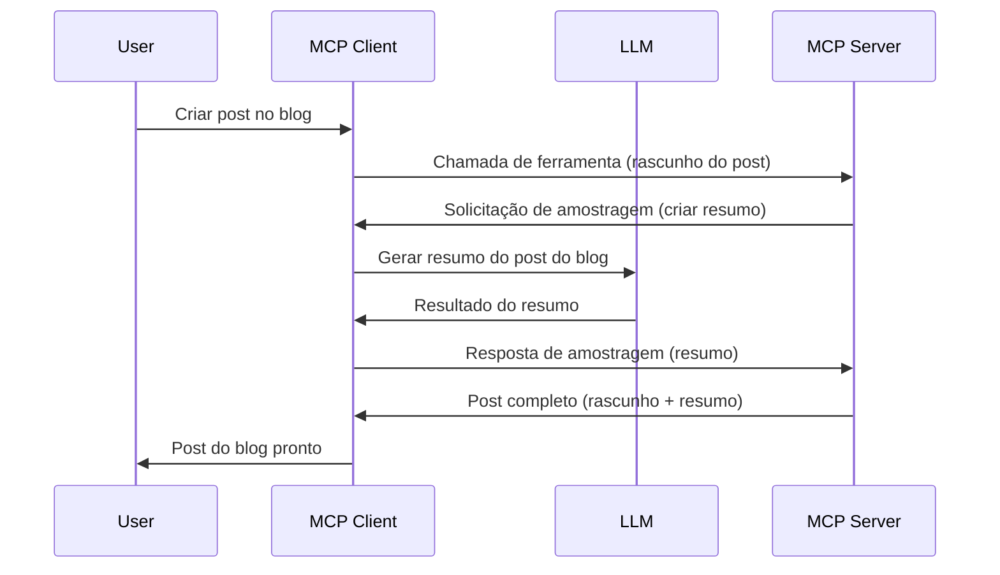

# Amostragem - delegar recursos para o Cliente

Às vezes, é necessário que o Cliente MCP e o Servidor MCP colaborem para alcançar um objetivo comum. Pode haver um caso em que o Servidor precisa da ajuda de um LLM que está no cliente. Para essa situação, a amostragem é o que você deve usar.

Vamos explorar alguns casos de uso e como construir uma solução envolvendo a amostragem.

## Visão Geral

Nesta lição, focamos em explicar quando e onde usar a Amostragem e como configurá-la.

## Objetivos de Aprendizagem

Neste capítulo, vamos:

- Explicar o que é Amostragem e quando usá-la.
- Mostrar como configurar a Amostragem no MCP.
- Fornecer exemplos de Amostragem em ação.

## O que é Amostragem e por que usá-la?

A Amostragem é um recurso avançado que funciona da seguinte maneira:


### Solicitação de Amostragem

Ok, agora que temos uma visão geral de um cenário plausível, vamos falar sobre a solicitação de amostragem que o servidor envia de volta para o cliente. Eis como tal solicitação pode parecer no formato JSON-RPC:

```json
{
  "jsonrpc": "2.0",
  "id": 1,
  "method": "sampling/createMessage",
  "params": {
    "messages": [
      {
        "role": "user",
        "content": {
          "type": "text",
          "text": "Create a blog post summary of the following blog post: <BLOG POST>"
        }
      }
    ],
    "modelPreferences": {
      "hints": [
        {
          "name": "claude-3-sonnet"
        }
      ],
      "intelligencePriority": 0.8,
      "speedPriority": 0.5
    },
    "systemPrompt": "You are a helpful assistant.",
    "maxTokens": 100
  }
}
```

Há algumas coisas aqui que vale a pena destacar:

- Prompt, em content -> text, é nosso prompt que é uma instrução para o LLM resumir o conteúdo do post do blog.

- **modelPreferences**. Esta seção é exatamente isso, uma preferência, uma recomendação de qual configuração usar com o LLM. O usuário pode escolher seguir essas recomendações ou alterá-las. Neste caso, há recomendações sobre qual modelo usar e prioridades de velocidade e inteligência.
- **systemPrompt**, este é o seu prompt normal do sistema que dá uma personalidade ao seu LLM e contém instruções de orientação.
- **maxTokens**, esta é outra propriedade usada para indicar quantos tokens é recomendado usar para essa tarefa.

### Resposta de Amostragem

Essa resposta é o que o Cliente MCP acaba enviando de volta para o Servidor MCP e é o resultado do cliente chamar o LLM, esperar essa resposta e então construir essa mensagem. Aqui está como pode parecer em JSON-RPC:

```json
{
  "jsonrpc": "2.0",
  "id": 1,
  "result": {
    "role": "assistant",
    "content": {
      "type": "text",
      "text": "Here's your abstract <ABSTRACT>"
    },
    "model": "gpt-5",
    "stopReason": "endTurn"
  }
}
```

Note como a resposta é um resumo do post do blog, exatamente como pedimos. Também note como o `model` usado não é o que solicitamos, mas "gpt-5" em vez de "claude-3-sonnet". Isso serve para ilustrar que o usuário pode mudar de ideia sobre o que usar e que sua solicitação de amostragem é uma recomendação.

Ok, agora que entendemos o fluxo principal e uma tarefa útil para usá-la — "criação + resumo de post de blog" — vamos ver o que precisamos fazer para fazer isso funcionar.

### Tipos de mensagem

Mensagens de amostragem não estão restritas a apenas texto, mas você também pode enviar imagens e áudio. Veja como o JSON-RPC fica diferente:

**Texto**

```json
{
  "type": "text",
  "text": "The message content"
}
```

**Conteúdo de imagem**

```json
{
  "type": "image",
  "data": "base64-encoded-image-data",
  "mimeType": "image/jpeg"
}
```

**Conteúdo de áudio**

```json
{
  "type": "audio",
  "data": "base64-encoded-audio-data",
  "mimeType": "audio/wav"
}
```

> NOTA: para mais informações detalhadas sobre Amostragem, confira a [documentação oficial](https://modelcontextprotocol.io/specification/2025-06-18/client/sampling)

## Como Configurar Amostragem no Cliente

> Nota: se você está apenas construindo um servidor, não precisa fazer muito aqui.

Em um cliente, você precisa especificar o recurso da seguinte forma:

```json
{
  "capabilities": {
    "sampling": {}
  }
}
```

Isso será então considerado quando seu cliente escolhido for inicializado com o servidor.

## Exemplo de Amostragem em Ação - Criar um Post de Blog

Vamos codificar um servidor de amostragem juntos, precisaremos fazer o seguinte:

1. Criar uma ferramenta no Servidor.
1. Essa ferramenta deve criar uma solicitação de amostragem.
1. A ferramenta deve aguardar a resposta da solicitação de amostragem do cliente.
1. Em seguida, o resultado da ferramenta deve ser produzido.

Vamos ver o código passo a passo:

### -1- Criar a ferramenta

**python**

```python
@mcp.tool()
async def create_blog(title: str, content: str, ctx: Context[ServerSession, None]) -> str:
    """Create a blog post and generate a summary"""

```

### -2- Criar uma solicitação de amostragem

Estenda sua ferramenta com o seguinte código:

**python**

```python
post = BlogPost(
        id=len(posts) + 1,
        title=title,
        content=content,
        abstract=""
    )

prompt = f"Create an abstract of the following blog post: title: {title} and draft: {content} "

result = await ctx.session.create_message(
        messages=[
            SamplingMessage(
                role="user",
                content=TextContent(type="text", text=prompt),
            )
        ],
        max_tokens=100,
)

```

### -3- Aguarde a resposta e retorne a resposta

**python**

```python
post.abstract = result.content.text

posts.append(post)

# retorne o produto completo
return json.dumps({
    "id": post.title,
    "abstract": post.abstract
})
```

### -4- Código completo

**python**

```python
from starlette.applications import Starlette
from starlette.routing import Mount, Host

from mcp.server.fastmcp import Context, FastMCP

from mcp.server.session import ServerSession
from mcp.types import SamplingMessage, TextContent

import json


from uuid import uuid4
from typing import List
from pydantic import BaseModel


mcp = FastMCP("Blog post generator")

# app = FastAPI()

posts = []

class BlogPost(BaseModel):
    id: int
    title: str
    content: str
    abstract: str

posts: List[BlogPost] = []

@mcp.tool()
async def create_blog(title: str, content: str, ctx: Context[ServerSession, None]) -> str:
    """Create a blog post and generate a summary"""

    post = BlogPost(
        id=len(posts) + 1,
        title=title,
        content=content,
        abstract=""
    )

    prompt = f"Create an abstract of the following blog post: title: {title} and draft: {content} "

    result = await ctx.session.create_message(
        messages=[
            SamplingMessage(
                role="user",
                content=TextContent(type="text", text=prompt),
            )
        ],
        max_tokens=100,
    )

    post.abstract = result.content.text

    posts.append(post)

    # retorna o post completo do blog
    return json.dumps({
        "id": post.title,
        "abstract": post.abstract
    })

if __name__ == "__main__":
    print("Starting server...")
    # mcp.run()
    mcp.run(transport="streamable-http")

# execute o app com: python server.py
```

### -5- Testando no Visual Studio Code

Para testar isso no Visual Studio Code, faça o seguinte:

1. Inicie o servidor no terminal
1. Adicione-o ao *mcp.json* (e certifique-se de que está iniciado), algo assim:

   ```json
   "servers": {
      "blog-server": {
        "type": "http",
        "url": "http://localhost:8000/mcp"
      }
   }
   ```

1. Digite um prompt:

   ```text
   create a blog post named "Where Python comes from", the content is "Python is actually named after Monty Python Flying Circus"
   ```

1. Permita que a amostragem ocorra. Na primeira vez que testar isso, você será apresentado a um diálogo adicional que precisará aceitar, depois verá o diálogo normal solicitando que execute uma ferramenta.

1. Inspecione os resultados. Você verá os resultados renderizados de forma agradável no GitHub Copilot Chat, mas também pode inspecionar a resposta JSON bruta.

**Bônus**. As ferramentas do Visual Studio Code têm excelente suporte para amostragem. Você pode configurar o acesso à Amostragem no seu servidor instalado da seguinte forma:

1. Navegue até a seção de extensões.
1. Selecione o ícone de engrenagem para seu servidor instalado na seção "MCP SERVERS - INSTALLED".
1. Selecione "Configure Model Access". Aqui você pode escolher quais modelos o GitHub Copilot pode usar ao realizar amostragem. Você também pode ver todas as solicitações de amostragem recentes selecionando "Show Sampling requests".

## Exercício

Neste exercício, você construirá uma Amostragem um pouco diferente, nomeadamente uma integração de amostragem que suporta a geração de descrição de produto. Aqui está seu cenário:

**Cenário**: O funcionário de back office de um e-commerce precisa de ajuda, leva tempo demais para gerar descrições de produtos. Portanto, você deve construir uma solução onde pode chamar uma ferramenta "create_product" com "title" e "keywords" como argumentos e ela deve produzir um produto completo incluindo um campo "description" que deve ser preenchido com o LLM do cliente.

DICA: use o que você aprendeu anteriormente sobre como construir este servidor e sua ferramenta usando uma solicitação de amostragem.

## Solução

[Solution](./solution/README.md)

## Principais Aprendizados

A amostragem é um recurso poderoso que permite ao servidor delegar tarefas para o cliente quando precisa da ajuda de um LLM.

## O que vem a seguir

- [Capítulo 4 - Implementação prática](../../04-PracticalImplementation/README.md)

---

<!-- CO-OP TRANSLATOR DISCLAIMER START -->
**Aviso Legal**:  
Este documento foi traduzido utilizando o serviço de tradução por IA [Co-op Translator](https://github.com/Azure/co-op-translator). Embora nos esforcemos pela precisão, esteja ciente de que traduções automáticas podem conter erros ou imprecisões. O documento original em seu idioma nativo deve ser considerado a fonte autorizada. Para informações críticas, recomenda-se a tradução profissional realizada por humanos. Não nos responsabilizamos por quaisquer mal-entendidos ou interpretações incorretas decorrentes do uso desta tradução.
<!-- CO-OP TRANSLATOR DISCLAIMER END -->