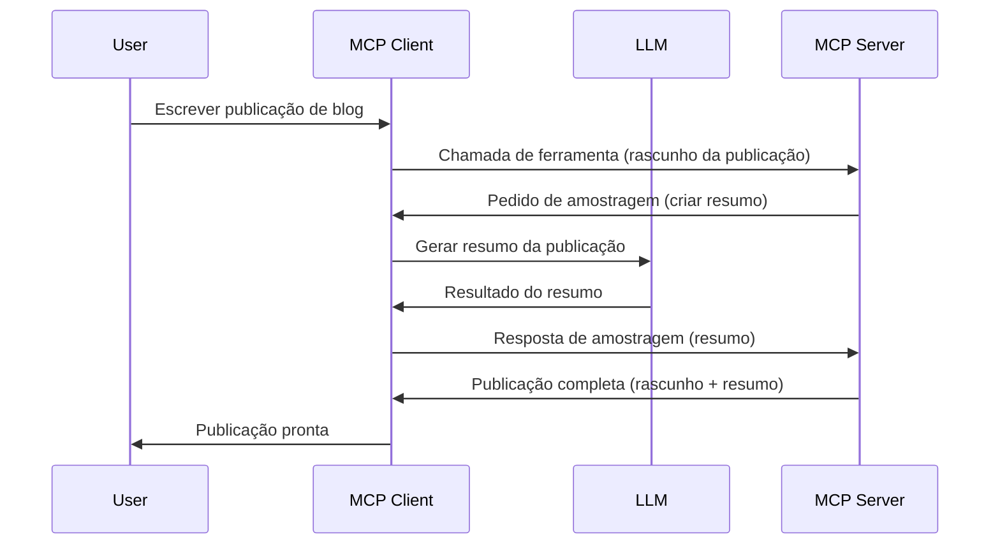

# Amostragem - delegar funcionalidades ao Cliente

Por vezes, é necessário que o Cliente MCP e o Servidor MCP colaborem para atingir um objetivo comum. Poderá existir um caso em que o Servidor necessita da ajuda de um LLM que está no cliente. Para esta situação, a amostragem é o que deve utilizar.

Vamos explorar alguns casos de uso e como construir uma solução envolvendo a amostragem.

## Visão geral

Nesta lição, vamos focar em explicar quando e onde usar Amostragem e como configurá-la.

## Objetivos de aprendizagem

Neste capítulo, iremos:

- Explicar o que é Amostragem e quando usá-la.
- Mostrar como configurar a Amostragem no MCP.
- Fornecer exemplos de Amostragem em ação.

## O que é Amostragem e porque usá-la?

A Amostragem é uma funcionalidade avançada que funciona da seguinte forma:


### Pedido de amostragem

Ok, agora que temos uma visão geral de um cenário credível, vamos falar sobre o pedido de amostragem que o servidor envia de volta ao cliente. Eis como este pedido pode parecer no formato JSON-RPC:

```json
{
  "jsonrpc": "2.0",
  "id": 1,
  "method": "sampling/createMessage",
  "params": {
    "messages": [
      {
        "role": "user",
        "content": {
          "type": "text",
          "text": "Create a blog post summary of the following blog post: <BLOG POST>"
        }
      }
    ],
    "modelPreferences": {
      "hints": [
        {
          "name": "claude-3-sonnet"
        }
      ],
      "intelligencePriority": 0.8,
      "speedPriority": 0.5
    },
    "systemPrompt": "You are a helpful assistant.",
    "maxTokens": 100
  }
}
```

Há aqui alguns aspetos que vale a pena destacar:

- Prompt, sob content -> text, é o nosso prompt que é uma instrução para o LLM resumir o conteúdo do post do blog.

- **modelPreferences**. Esta secção é exatamente isso, uma preferência, uma recomendação de qual configuração usar com o LLM. O utilizador pode optar por seguir estas recomendações ou alterá-las. Neste caso, há recomendações sobre o modelo a usar e prioridades de velocidade e inteligência.
- **systemPrompt**, este é o seu prompt normal de sistema que dá ao seu LLM uma personalidade e contém instruções de orientação.
- **maxTokens**, esta é outra propriedade usada para indicar quantos tokens se recomenda usar para esta tarefa.

### Resposta da amostragem

Esta resposta é o que o Cliente MCP acaba por enviar de volta ao Servidor MCP e é o resultado do cliente chamar o LLM, aguardar essa resposta e depois construir esta mensagem. Eis como pode parecer no JSON-RPC:

```json
{
  "jsonrpc": "2.0",
  "id": 1,
  "result": {
    "role": "assistant",
    "content": {
      "type": "text",
      "text": "Here's your abstract <ABSTRACT>"
    },
    "model": "gpt-5",
    "stopReason": "endTurn"
  }
}
```

Note como a resposta é um resumo do post do blog exatamente como pedimos. Note também como o `model` usado não é o que pedimos mas "gpt-5" em vez de "claude-3-sonnet". Isto é para ilustrar que o utilizador pode mudar de opinião sobre o que usar e que o seu pedido de amostragem é uma recomendação.

Ok, agora que entendemos o fluxo principal, e a tarefa útil para a usar "criação + resumo de post de blog", vamos ver o que precisamos fazer para que funcione.

### Tipos de mensagem

As mensagens de amostragem não estão limitadas apenas a texto, mas também pode enviar imagens e áudio. Eis como o JSON-RPC é diferente:

**Texto**

```json
{
  "type": "text",
  "text": "The message content"
}
```

**Conteúdo de imagem**

```json
{
  "type": "image",
  "data": "base64-encoded-image-data",
  "mimeType": "image/jpeg"
}
```

**Conteúdo de áudio**

```json
{
  "type": "audio",
  "data": "base64-encoded-audio-data",
  "mimeType": "audio/wav"
}
```

> NOTA: para informações mais detalhadas sobre Amostragem, consulte os [documentos oficiais](https://modelcontextprotocol.io/specification/2025-06-18/client/sampling)

## Como Configurar Amostragem no Cliente

> Nota: se está só a desenvolver um servidor, não precisa de fazer muito aqui.

Numa cliente, precisa especificar a seguinte funcionalidade assim:

```json
{
  "capabilities": {
    "sampling": {}
  }
}
```

Isto será então carregado quando o cliente escolhido inicializar com o servidor.

## Exemplo de Amostragem em Ação - Criar um Post no Blog

Vamos programar um servidor de amostragem juntos, teremos de fazer o seguinte:

1. Criar uma ferramenta no Servidor.
1. Essa ferramenta deve criar um pedido de amostragem
1. A ferramenta deve aguardar pela resposta do pedido de amostragem do cliente.
1. Depois, o resultado da ferramenta deve ser produzido.

Vamos ver o código passo a passo:

### -1- Criar a ferramenta

**python**

```python
@mcp.tool()
async def create_blog(title: str, content: str, ctx: Context[ServerSession, None]) -> str:
    """Create a blog post and generate a summary"""

```

### -2- Criar um pedido de amostragem

Estenda a sua ferramenta com o seguinte código:

**python**

```python
post = BlogPost(
        id=len(posts) + 1,
        title=title,
        content=content,
        abstract=""
    )

prompt = f"Create an abstract of the following blog post: title: {title} and draft: {content} "

result = await ctx.session.create_message(
        messages=[
            SamplingMessage(
                role="user",
                content=TextContent(type="text", text=prompt),
            )
        ],
        max_tokens=100,
)

```

### -3- Aguarde a resposta e retorne a resposta

**python**

```python
post.abstract = result.content.text

posts.append(post)

# retornar o produto completo
return json.dumps({
    "id": post.title,
    "abstract": post.abstract
})
```

### -4- Código completo

**python**

```python
from starlette.applications import Starlette
from starlette.routing import Mount, Host

from mcp.server.fastmcp import Context, FastMCP

from mcp.server.session import ServerSession
from mcp.types import SamplingMessage, TextContent

import json


from uuid import uuid4
from typing import List
from pydantic import BaseModel


mcp = FastMCP("Blog post generator")

# app = FastAPI()

posts = []

class BlogPost(BaseModel):
    id: int
    title: str
    content: str
    abstract: str

posts: List[BlogPost] = []

@mcp.tool()
async def create_blog(title: str, content: str, ctx: Context[ServerSession, None]) -> str:
    """Create a blog post and generate a summary"""

    post = BlogPost(
        id=len(posts) + 1,
        title=title,
        content=content,
        abstract=""
    )

    prompt = f"Create an abstract of the following blog post: title: {title} and draft: {content} "

    result = await ctx.session.create_message(
        messages=[
            SamplingMessage(
                role="user",
                content=TextContent(type="text", text=prompt),
            )
        ],
        max_tokens=100,
    )

    post.abstract = result.content.text

    posts.append(post)

    # retornar o post completo do blog
    return json.dumps({
        "id": post.title,
        "abstract": post.abstract
    })

if __name__ == "__main__":
    print("Starting server...")
    # mcp.run()
    mcp.run(transport="streamable-http")

# correr a aplicação com: python server.py
```

### -5- Testar no Visual Studio Code

Para testar isto no Visual Studio Code, faça o seguinte:

1. Inicie o servidor no terminal
1. Adicione-o ao *mcp.json* (e certifique-se que está iniciado) por exemplo assim:

   ```json
   "servers": {
      "blog-server": {
        "type": "http",
        "url": "http://localhost:8000/mcp"
      }
   }
   ```

1. Escreva um prompt:

   ```text
   create a blog post named "Where Python comes from", the content is "Python is actually named after Monty Python Flying Circus"
   ```

1. Permita que a amostragem aconteça. Na primeira vez que testar isto, vai aparecer uma caixa de diálogo adicional que precisa aceitar, depois verá a caixa de diálogo normal a pedir para executar uma ferramenta

1. Verifique os resultados. Verá os resultados tanto apresentados de forma agradável no GitHub Copilot Chat mas também pode inspecionar a resposta JSON bruta.

**Bónus**. As ferramentas do Visual Studio Code têm ótimo suporte para amostragem.  Pode configurar o acesso à Amostragem no seu servidor instalado navegando assim:

1. Navegue para a secção de extensões.
1. Selecione o ícone da roda dentada para o seu servidor instalado na secção "MCP SERVERS - INSTALLED".
1 Selecione "Configure Model Access", aqui pode escolher quais modelos o GitHub Copilot está autorizado a usar ao executar amostragem. Pode também ver todos os pedidos de amostragem que aconteceram recentemente selecionando "Show Sampling requests".

## Exercício

Neste exercício, irá construir uma Amostragem ligeiramente diferente, nomeadamente uma integração de amostragem que suporta gerar uma descrição de produto. Eis o seu cenário:

**Cenário**: O funcionário do back office de um e-commerce precisa de ajuda, demora demasiado tempo a gerar descrições de produtos. Por isso, deve construir uma solução onde pode chamar uma ferramenta "create_product" com "title" e "keywords" como argumentos e esta deve produzir um produto completo incluindo um campo "description" que será preenchido pelo LLM do cliente.

DICA: use o que aprendeu anteriormente sobre como construir este servidor e a sua ferramenta usando um pedido de amostragem.

## Solução

[Solution](./solution/README.md)

## Principais Conclusões

A Amostragem é uma funcionalidade poderosa que permite ao servidor delegar tarefas ao cliente quando precisa da ajuda de um LLM.

## O que vem a seguir

- [Capítulo 4 - Implementação prática](../../04-PracticalImplementation/README.md)

---

<!-- CO-OP TRANSLATOR DISCLAIMER START -->
**Aviso Legal**:  
Este documento foi traduzido utilizando o serviço de tradução por IA [Co-op Translator](https://github.com/Azure/co-op-translator). Embora nos esforcemos pela precisão, esteja ciente de que traduções automáticas podem conter erros ou imprecisões. O documento original no seu idioma nativo deve ser considerado a fonte oficial. Para informações críticas, recomenda-se a tradução profissional humana. Não nos responsabilizamos por quaisquer mal-entendidos ou interpretações incorretas decorrentes do uso desta tradução.
<!-- CO-OP TRANSLATOR DISCLAIMER END -->