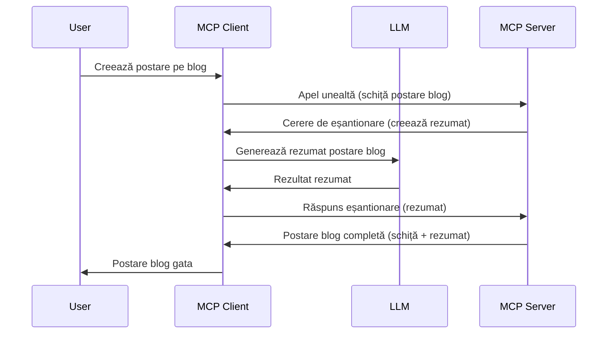

# Sampling - delegarea funcționalităților către Client

Uneori, este nevoie ca MCP Client și MCP Server să colaboreze pentru a atinge un scop comun. S-ar putea întâmpla ca Serverul să aibă nevoie de ajutorul unui LLM care stă pe client. Pentru această situație, sampling-ul este ceea ce ar trebui să folosești.

Să explorăm câteva cazuri de utilizare și cum să construim o soluție care implică sampling.

## Prezentare generală

În această lecție, ne concentrăm pe explicarea când și unde să folosești Sampling și cum să îl configurezi.

## Obiectivele lecției

În acest capitol, vom:

- Explica ce este Sampling și când să îl folosești.
- Arăta cum să configurezi Sampling în MCP.
- Oferi exemple de Sampling în acțiune.

## Ce este Sampling și de ce să îl folosești?

Sampling este o funcționalitate avansată care funcționează astfel:


### Cerere de sampling

Ok, acum că avem o vedere de ansamblu la nivel înalt a unui scenariu credibil, să vorbim despre cererea de sampling pe care serverul o trimite înapoi către client. Iată cum poate arăta o astfel de cerere în format JSON-RPC:

```json
{
  "jsonrpc": "2.0",
  "id": 1,
  "method": "sampling/createMessage",
  "params": {
    "messages": [
      {
        "role": "user",
        "content": {
          "type": "text",
          "text": "Create a blog post summary of the following blog post: <BLOG POST>"
        }
      }
    ],
    "modelPreferences": {
      "hints": [
        {
          "name": "claude-3-sonnet"
        }
      ],
      "intelligencePriority": 0.8,
      "speedPriority": 0.5
    },
    "systemPrompt": "You are a helpful assistant.",
    "maxTokens": 100
  }
}
```

Există câteva aspecte notabile aici:

- Promptul, sub content -> text, este promptul nostru, o instrucțiune pentru LLM să rezume conținutul unui articol de blog.

- **modelPreferences**. Această secțiune este exact asta, o preferință, o recomandare privind ce configurație să se folosească cu LLM-ul. Utilizatorul poate alege dacă urmează aceste recomandări sau să le schimbe. În acest caz, există recomandări despre modelul de folosit și prioritatea între viteză și inteligență.
- **systemPrompt**, acesta este promptul sistem normal care oferă LLM-ului tău o personalitate și conține instrucțiuni ghid.
- **maxTokens**, aceasta este o altă proprietate folosită pentru a specifica câți tokeni se recomandă pentru această sarcină.

### Răspuns de sampling

Acest răspuns este ceea ce MCP Client trimite înapoi MCP Server-ului și este rezultatul apelării LLM-ului de către client, așteptarea răspunsului și apoi construirea acestui mesaj. Iată cum poate arăta în JSON-RPC:

```json
{
  "jsonrpc": "2.0",
  "id": 1,
  "result": {
    "role": "assistant",
    "content": {
      "type": "text",
      "text": "Here's your abstract <ABSTRACT>"
    },
    "model": "gpt-5",
    "stopReason": "endTurn"
  }
}
```

Observați cum răspunsul este un rezumat al articolului de blog, exact cum am cerut. De asemenea, observați cum modelul `model` folosit nu este cel pe care l-am cerut, ci "gpt-5" în loc de "claude-3-sonnet". Acest lucru ilustrează că utilizatorul își poate schimba opinia despre ce să folosească și că cererea ta de sampling este o recomandare.

Ok, acum că înțelegem fluxul principal și o sarcină utilă pentru a-l folosi, adică „creare articol de blog + rezumat”, să vedem ce trebuie să facem ca să funcționeze.

### Tipuri de mesaje

Mesajele de sampling nu sunt limitate doar la text, ci poți trimite și imagini și audio. Iată cum arată diferit JSON-RPC:

**Text**

```json
{
  "type": "text",
  "text": "The message content"
}
```

**Conținut imagine**

```json
{
  "type": "image",
  "data": "base64-encoded-image-data",
  "mimeType": "image/jpeg"
}
```

**Conținut audio**

```json
{
  "type": "audio",
  "data": "base64-encoded-audio-data",
  "mimeType": "audio/wav"
}
```

> NOTE: pentru informații mai detaliate despre Sampling, consultă [documentația oficială](https://modelcontextprotocol.io/specification/2025-06-18/client/sampling)

## Cum să configurezi Sampling în Client

> Notă: dacă construiești doar un server, nu trebuie să faci prea multe aici.

Într-un client, trebuie să specifici următoarea funcționalitate astfel:

```json
{
  "capabilities": {
    "sampling": {}
  }
}
```

Aceasta va fi apoi preluată când clientul ales se inițializează cu serverul.

## Exemplu de Sampling în acțiune - Crearea unui articol de blog

Să codăm împreună un server de sampling, va trebui să facem următoarele:

1. Crearea unui instrument pe Server.
1. Acest instrument trebuie să producă o cerere de sampling.
1. Instrumentul trebuie să aștepte răspunsul la cererea de sampling a clientului.
1. Apoi să producă rezultatul instrumentului.

Să vedem codul pas cu pas:

### -1- Crearea instrumentului

**python**

```python
@mcp.tool()
async def create_blog(title: str, content: str, ctx: Context[ServerSession, None]) -> str:
    """Create a blog post and generate a summary"""

```

### -2- Crearea unui request de sampling

Extinde instrumentul cu următorul cod:

**python**

```python
post = BlogPost(
        id=len(posts) + 1,
        title=title,
        content=content,
        abstract=""
    )

prompt = f"Create an abstract of the following blog post: title: {title} and draft: {content} "

result = await ctx.session.create_message(
        messages=[
            SamplingMessage(
                role="user",
                content=TextContent(type="text", text=prompt),
            )
        ],
        max_tokens=100,
)

```

### -3- Așteaptă răspunsul și returnează răspunsul

**python**

```python
post.abstract = result.content.text

posts.append(post)

# returnează produsul complet
return json.dumps({
    "id": post.title,
    "abstract": post.abstract
})
```

### -4- Cod complet

**python**

```python
from starlette.applications import Starlette
from starlette.routing import Mount, Host

from mcp.server.fastmcp import Context, FastMCP

from mcp.server.session import ServerSession
from mcp.types import SamplingMessage, TextContent

import json


from uuid import uuid4
from typing import List
from pydantic import BaseModel


mcp = FastMCP("Blog post generator")

# app = FastAPI()

posts = []

class BlogPost(BaseModel):
    id: int
    title: str
    content: str
    abstract: str

posts: List[BlogPost] = []

@mcp.tool()
async def create_blog(title: str, content: str, ctx: Context[ServerSession, None]) -> str:
    """Create a blog post and generate a summary"""

    post = BlogPost(
        id=len(posts) + 1,
        title=title,
        content=content,
        abstract=""
    )

    prompt = f"Create an abstract of the following blog post: title: {title} and draft: {content} "

    result = await ctx.session.create_message(
        messages=[
            SamplingMessage(
                role="user",
                content=TextContent(type="text", text=prompt),
            )
        ],
        max_tokens=100,
    )

    post.abstract = result.content.text

    posts.append(post)

    # returnează articolul complet al blogului
    return json.dumps({
        "id": post.title,
        "abstract": post.abstract
    })

if __name__ == "__main__":
    print("Starting server...")
    # mcp.run()
    mcp.run(transport="streamable-http")

# rulează aplicația cu: python server.py
```

### -5- Testarea în Visual Studio Code

Pentru a testa în Visual Studio Code, fă următoarele:

1. Pornește serverul în terminal
1. Adaugă-l în *mcp.json* (și asigură-te că este pornit) ceva de genul:

   ```json
   "servers": {
      "blog-server": {
        "type": "http",
        "url": "http://localhost:8000/mcp"
      }
   }
   ```

1. Scrie un prompt:

   ```text
   create a blog post named "Where Python comes from", the content is "Python is actually named after Monty Python Flying Circus"
   ```

1. Permite sampling-ului să se întâmple. Prima dată când testezi, vei primi o fereastră suplimentară pe care va trebui să o accepți, apoi vei vedea dialogul normal care îți cere să rulezi un instrument.

1. Inspectează rezultatele. Vei vedea rezultatele afișate frumos în GitHub Copilot Chat, dar poți și inspecta răspunsul JSON brut.

**Bonus**. Instrumentele Visual Studio Code au suport excelent pentru sampling. Poți configura accesul la Sampling pe serverul instalat navigând astfel:

1. Navighează la secțiunea de extensii.
1. Selectează pictograma cog pentru serverul instalat din secțiunea "MCP SERVERS - INSTALLED".
1. Selectează "Configure Model Access", aici poți alege ce modele poate folosi GitHub Copilot când face sampling. De asemenea, poți vedea toate cererile de sampling recente selectând "Show Sampling requests".

## Tema

În această temă, vei construi un Sampling puțin diferit, anume o integrare de sampling care suportă generarea unei descrieri de produs. Iată scenariul tău:

**Scenariu**: Angajatul din back office la un magazin e-commerce are nevoie de ajutor, i se ia prea mult timp să genereze descrieri de produse. Prin urmare, trebuie să construiești o soluție în care poți apela un instrument "create_product" cu argumentele "title" și "keywords" și acesta să genereze un produs complet inclusiv un câmp "description" care va fi completat de un LLM al clientului.

TIP: folosește ce ai învățat mai devreme despre cum să construiești acest server și instrumentul său folosind o cerere de sampling.

## Soluție

[Soluție](./solution/README.md)

## Concluzii cheie

Sampling este o funcționalitate puternică care permite serverului să dea sarcini clientului atunci când are nevoie de ajutorul unui LLM.

## Ce urmează

- [Capitolul 4 - Implementare practică](../../04-PracticalImplementation/README.md)

---

<!-- CO-OP TRANSLATOR DISCLAIMER START -->
**Declinare de responsabilitate**:  
Acest document a fost tradus folosind serviciul de traducere AI [Co-op Translator](https://github.com/Azure/co-op-translator). Deși ne străduim pentru acuratețe, vă rugăm să aveți în vedere că traducerile automate pot conține erori sau inexactități. Documentul original în limba sa nativă trebuie considerat sursa autorizată. Pentru informații critice, se recomandă traducerea profesională realizată de un specialist uman. Nu ne asumăm răspunderea pentru neînțelegeri sau interpretări greșite rezultate din utilizarea acestei traduceri.
<!-- CO-OP TRANSLATOR DISCLAIMER END -->