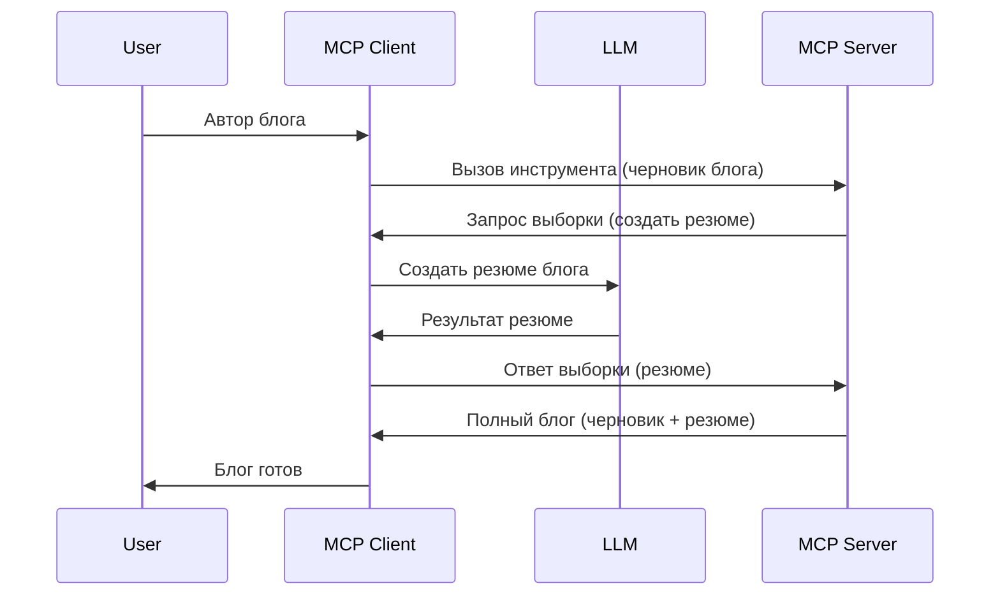

# Sampling - делегирование функций клиенту

Иногда нужно, чтобы MCP Клиент и MCP Сервер работали вместе для достижения общей цели. Может возникнуть ситуация, когда серверу нужна помощь LLM, которая работает на клиенте. Для таких случаев следует использовать sampling.

Давайте рассмотрим несколько вариантов использования и как построить решение с использованием sampling.

## Обзор

В этом уроке мы сосредоточимся на объяснении, когда и где применять Sampling, а также как его настроить.

## Цели обучения

В этой главе мы:

- Объясним, что такое Sampling и когда его использовать.
- Покажем, как настроить Sampling в MCP.
- Приведем примеры использования Sampling на практике.

## Что такое Sampling и зачем его использовать?

Sampling — это продвинутая функция, которая работает следующим образом:


### Запрос sampling

Хорошо, теперь у нас есть общее представление о правдоподобном сценарии, поговорим о запросе sampling, который сервер отправляет клиенту. Вот как может выглядеть такой запрос в формате JSON-RPC:

```json
{
  "jsonrpc": "2.0",
  "id": 1,
  "method": "sampling/createMessage",
  "params": {
    "messages": [
      {
        "role": "user",
        "content": {
          "type": "text",
          "text": "Create a blog post summary of the following blog post: <BLOG POST>"
        }
      }
    ],
    "modelPreferences": {
      "hints": [
        {
          "name": "claude-3-sonnet"
        }
      ],
      "intelligencePriority": 0.8,
      "speedPriority": 0.5
    },
    "systemPrompt": "You are a helpful assistant.",
    "maxTokens": 100
  }
}
```

Здесь есть несколько важных моментов:

- Prompt, в content -> text, — это наш prompt, инструкция для LLM, чтобы суммировать содержимое блог-поста.

- **modelPreferences** — этот раздел является предпочтением, рекомендацией по настройке для LLM. Пользователь может согласиться с этими рекомендациями или изменить их. В данном случае есть рекомендации по модели, скорости и приоритету интеллекта.
- **systemPrompt** — это ваш обычный системный prompt, который задает LLM личность и содержит инструкции.
- **maxTokens** — еще одно свойство, которое указывает, сколько токенов рекомендуется использовать для этой задачи.

### Ответ sampling

Этот ответ — то, что MCP Клиент в итоге отправляет обратно MCP Серверу, и является результатом вызова клиентом LLM, ожидания ответа и формирования этого сообщения. Вот как это может выглядеть в JSON-RPC:

```json
{
  "jsonrpc": "2.0",
  "id": 1,
  "result": {
    "role": "assistant",
    "content": {
      "type": "text",
      "text": "Here's your abstract <ABSTRACT>"
    },
    "model": "gpt-5",
    "stopReason": "endTurn"
  }
}
```

Обратите внимание, что ответ является аннотацией к блог-посту, как мы и просили. Также обратите внимание, что использованная `model` не та, что была запрошена, а "gpt-5" вместо "claude-3-sonnet". Это показывает, что пользователь может изменить решение о модели, а ваш sampling-запрос служит рекомендацией.

Хорошо, теперь, когда мы понимаем основной процесс и полезную задачу, для которой это применяется — "создание блог-поста + аннотация", давайте посмотрим, что нужно сделать, чтобы это заработало.

### Типы сообщений

Sampling-сообщения не ограничиваются только текстом, вы также можете отправлять изображения и аудио. Вот как JSON-RPC отличается:

**Текст**

```json
{
  "type": "text",
  "text": "The message content"
}
```

**Изображение**

```json
{
  "type": "image",
  "data": "base64-encoded-image-data",
  "mimeType": "image/jpeg"
}
```

**Аудио**

```json
{
  "type": "audio",
  "data": "base64-encoded-audio-data",
  "mimeType": "audio/wav"
}
```

> NOTE: для более подробной информации о Sampling ознакомьтесь с [официальной документацией](https://modelcontextprotocol.io/specification/2025-06-18/client/sampling)

## Как настроить Sampling на клиенте

> Примечание: если вы только создаёте сервер, здесь делать особо нечего.

На клиенте нужно указать следующую функцию так:

```json
{
  "capabilities": {
    "sampling": {}
  }
}
```

Она будет зарегистрирована при инициализации выбранного клиента с сервером.

## Пример использования Sampling — создание блог-поста

Давайте вместе напишем sampling-сервер, нам нужно сделать следующее:

1. Создать инструмент на сервере.
1. Этот инструмент должен создавать sampling-запрос.
1. Инструмент должен ждать ответа на sampling-запрос от клиента.
1. Затем генерируется результат инструмента.

Давайте рассмотрим код по шагам:

### -1- Создание инструмента

**python**

```python
@mcp.tool()
async def create_blog(title: str, content: str, ctx: Context[ServerSession, None]) -> str:
    """Create a blog post and generate a summary"""

```

### -2- Создание sampling-запроса

Расширьте инструмент следующим кодом:

**python**

```python
post = BlogPost(
        id=len(posts) + 1,
        title=title,
        content=content,
        abstract=""
    )

prompt = f"Create an abstract of the following blog post: title: {title} and draft: {content} "

result = await ctx.session.create_message(
        messages=[
            SamplingMessage(
                role="user",
                content=TextContent(type="text", text=prompt),
            )
        ],
        max_tokens=100,
)

```

### -3- Ждать ответ и вернуть результат

**python**

```python
post.abstract = result.content.text

posts.append(post)

# вернуть полный продукт
return json.dumps({
    "id": post.title,
    "abstract": post.abstract
})
```

### -4- Полный код

**python**

```python
from starlette.applications import Starlette
from starlette.routing import Mount, Host

from mcp.server.fastmcp import Context, FastMCP

from mcp.server.session import ServerSession
from mcp.types import SamplingMessage, TextContent

import json


from uuid import uuid4
from typing import List
from pydantic import BaseModel


mcp = FastMCP("Blog post generator")

# app = FastAPI()

posts = []

class BlogPost(BaseModel):
    id: int
    title: str
    content: str
    abstract: str

posts: List[BlogPost] = []

@mcp.tool()
async def create_blog(title: str, content: str, ctx: Context[ServerSession, None]) -> str:
    """Create a blog post and generate a summary"""

    post = BlogPost(
        id=len(posts) + 1,
        title=title,
        content=content,
        abstract=""
    )

    prompt = f"Create an abstract of the following blog post: title: {title} and draft: {content} "

    result = await ctx.session.create_message(
        messages=[
            SamplingMessage(
                role="user",
                content=TextContent(type="text", text=prompt),
            )
        ],
        max_tokens=100,
    )

    post.abstract = result.content.text

    posts.append(post)

    # вернуть полный блог-пост
    return json.dumps({
        "id": post.title,
        "abstract": post.abstract
    })

if __name__ == "__main__":
    print("Starting server...")
    # mcp.run()
    mcp.run(transport="streamable-http")

# запустить приложение командой: python server.py
```

### -5- Тестирование в Visual Studio Code

Чтобы протестировать это в Visual Studio Code, сделайте следующее:

1. Запустите сервер в терминале
1. Добавьте его в *mcp.json* (убедитесь, что сервер запущен), например так:

   ```json
   "servers": {
      "blog-server": {
        "type": "http",
        "url": "http://localhost:8000/mcp"
      }
   }
   ```

1. Введите prompt:

   ```text
   create a blog post named "Where Python comes from", the content is "Python is actually named after Monty Python Flying Circus"
   ```

1. Разрешите выполнение sampling. В первый раз при тестировании появится дополнительный диалог, который нужно принять, затем отобразится обычное окно запроса на запуск инструмента.

1. Проверьте результаты. Вы увидите результаты удобочитаемые в GitHub Copilot Chat, а также сможете просмотреть сырой JSON-ответ.

**Бонус**. Инструменты Visual Studio Code отлично поддерживают sampling. Вы можете настроить доступ к sampling для установленного сервера следующим образом:

1. Перейдите в раздел расширений.
1. Нажмите на иконку шестерёнки рядом с вашим сервером в разделе "MCP SERVERS - INSTALLED".
1. Выберите "Configure Model Access" — здесь вы можете выбрать, какие модели GitHub Copilot может использовать для sampling. Также вы можете увидеть все недавние sampling-запросы, выбрав "Show Sampling requests".

## Задание

В этом задании вы создадите чуть другой Sampling — интеграцию, генерирующую описание продукта. Вот ваш сценарий:

**Сценарий**: сотруднику бэк-офиса в электронной коммерции нужно помочь, так как на генерацию описаний товаров уходит слишком много времени. Ваша задача — создать решение, позволяющее вызывать инструмент "create_product" с аргументами "title" и "keywords", который должен формировать полный продукт, включая поле "description", которое будет заполнено с помощью LLM клиента.

TIP: используйте знания, полученные ранее о том, как строить сервер и инструмент с помощью sampling-запроса.

## Решение

[Solution](./solution/README.md)

## Ключевые выводы

Sampling — мощная функция, позволяющая серверу делегировать задачи клиенту, когда нужна помощь LLM.

## Что дальше

- [Глава 4 - Практическая реализация](../../04-PracticalImplementation/README.md)

---

<!-- CO-OP TRANSLATOR DISCLAIMER START -->
**Отказ от ответственности**:
Этот документ был переведен с помощью сервиса автоматического перевода [Co-op Translator](https://github.com/Azure/co-op-translator). Несмотря на наши усилия обеспечить точность, пожалуйста, имейте в виду, что автоматический перевод может содержать ошибки или неточности. Оригинальный документ на его исходном языке должен считаться авторитетным источником. Для критически важной информации рекомендуется профессиональный перевод человеком. Мы не несем ответственности за любые недоразумения или неправильные толкования, возникшие в результате использования данного перевода.
<!-- CO-OP TRANSLATOR DISCLAIMER END -->