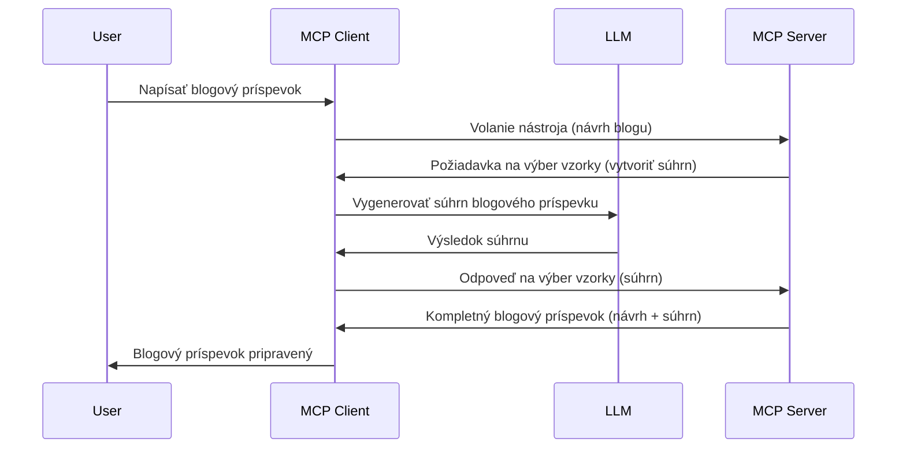

# Sampling - delegovanie funkcií klientovi

Niekedy je potrebná spolupráca MCP klienta a MCP servera na dosiahnutie spoločného cieľa. Môže sa stať, že server potrebuje pomoc LLM, ktorý je na strane klienta. Pre túto situáciu je vhodné použiť sampling.

Pozrime sa na niekoľko prípadov použitia a ako vytvoriť riešenie zahŕňajúce sampling.

## Prehľad

V tejto lekcii sa zameriame na vysvetlenie, kedy a kde použiť Sampling a ako ho nakonfigurovať.

## Výukové ciele

V tejto kapitole:

- Vysvetlíme, čo je Sampling a kedy ho použiť.
- Ukážeme, ako nakonfigurovať Sampling v MCP.
- Poskytneme príklady použitia Sampling.

## Čo je Sampling a prečo ho používať?

Sampling je pokročilá funkcia, ktorá funguje nasledovne:


### Sampling request

Dobre, teraz máme široký prehľad o reálnom scenári, poďme hovoriť o sampling requeste, ktorý server posiela klientovi. Takýto request môže vyzerať v JSON-RPC formáte takto:

```json
{
  "jsonrpc": "2.0",
  "id": 1,
  "method": "sampling/createMessage",
  "params": {
    "messages": [
      {
        "role": "user",
        "content": {
          "type": "text",
          "text": "Create a blog post summary of the following blog post: <BLOG POST>"
        }
      }
    ],
    "modelPreferences": {
      "hints": [
        {
          "name": "claude-3-sonnet"
        }
      ],
      "intelligencePriority": 0.8,
      "speedPriority": 0.5
    },
    "systemPrompt": "You are a helpful assistant.",
    "maxTokens": 100
  }
}
```

Tu je niekoľko vecí, ktoré stojí za zmienku:

- Prompt, pod content -> text, je naša výzva, inštrukcia pre LLM, aby zhrnul obsah blogového príspevku.

- **modelPreferences**. Táto sekcia je práve to, preferencia, odporúčanie konfigurácie, ktorú použiť s LLM. Používateľ sa môže rozhodnúť, či tieto odporúčania dodrží alebo zmení. V tomto prípade sú tu odporúčania ohľadom modelu, rýchlosti a priority inteligencie.
- **systemPrompt** je bežný systémový prompt, ktorý dáva LLM osobnosť a obsahuje pokyny.
- **maxTokens** je ďalšia vlastnosť, ktorá odporúča, koľko tokenov použiť pre túto úlohu.

### Sampling response

Táto odpoveď je to, čo MCP klient nakoniec pošle späť MCP serveru a je výsledkom volania LLM na strane klienta, čakania na odpoveď a následného zostavenia tejto správy. Môže vyzerať takto v JSON-RPC formáte:

```json
{
  "jsonrpc": "2.0",
  "id": 1,
  "result": {
    "role": "assistant",
    "content": {
      "type": "text",
      "text": "Here's your abstract <ABSTRACT>"
    },
    "model": "gpt-5",
    "stopReason": "endTurn"
  }
}
```

Všimnite si, že odpoveď je abstrakt blogového príspevku, presne ako sme požadovali. Tiež všimnite, že použitý model nie je ten, ktorý sme si žiadali, ale "gpt-5" namiesto "claude-3-sonnet". Tým chceme ukázať, že používateľ si môže zmeniť názor na používaný model a že váš sampling request je odporúčanie.

Dobre, teraz keď chápeme hlavný priebeh a užitočnú úlohu pre "tvorbu blogového príspevku + abstrakt", poďme sa pozrieť, čo musíme spraviť, aby to fungovalo.

### Typy správ

Sampling správy nemusia byť obmedzené len na text, ale môžete posielať aj obrázky a audio. Tu je ukážka, ako sa JSON-RPC líši:

**Text**

```json
{
  "type": "text",
  "text": "The message content"
}
```

**Obsah obrázka**

```json
{
  "type": "image",
  "data": "base64-encoded-image-data",
  "mimeType": "image/jpeg"
}
```

**Audio obsah**

```json
{
  "type": "audio",
  "data": "base64-encoded-audio-data",
  "mimeType": "audio/wav"
}
```

> NOTE: pre podrobnejšie informácie o Sampleingu si pozrite [oficiálnu dokumentáciu](https://modelcontextprotocol.io/specification/2025-06-18/client/sampling)

## Ako nakonfigurovať Sampling v Klientovi

> Poznámka: ak vytvárate len server, tu veľa nemusíte robiť.

V klientovi je potrebné špecifikovať nasledujúcu funkciu takto:

```json
{
  "capabilities": {
    "sampling": {}
  }
}
```

Táto konfigurácia sa potom použije, keď sa váš vybraný klient pripojí k serveru.

## Príklad použitia Sampling - Vytvorenie blogového príspevku

Napíšme sampling server spolu, potrebujeme urobiť nasledovné:

1. Vytvoriť nástroj na serveri.
1. Tento nástroj vytvorí sampling request.
1. Nástroj počká na odpoveď od klienta na sampling request.
1. Následne sa vyprodukuje výsledok nástroja.

Pozrime sa na kód krok po kroku:

### -1- Vytvorenie nástroja

**python**

```python
@mcp.tool()
async def create_blog(title: str, content: str, ctx: Context[ServerSession, None]) -> str:
    """Create a blog post and generate a summary"""

```

### -2- Vytvorenie sampling requestu

Rozšírte svoj nástroj o nasledujúci kód:

**python**

```python
post = BlogPost(
        id=len(posts) + 1,
        title=title,
        content=content,
        abstract=""
    )

prompt = f"Create an abstract of the following blog post: title: {title} and draft: {content} "

result = await ctx.session.create_message(
        messages=[
            SamplingMessage(
                role="user",
                content=TextContent(type="text", text=prompt),
            )
        ],
        max_tokens=100,
)

```

### -3- Čakanie na odpoveď a vrátenie odpovede

**python**

```python
post.abstract = result.content.text

posts.append(post)

# vrátiť kompletný produkt
return json.dumps({
    "id": post.title,
    "abstract": post.abstract
})
```

### -4- Kompletný kód

**python**

```python
from starlette.applications import Starlette
from starlette.routing import Mount, Host

from mcp.server.fastmcp import Context, FastMCP

from mcp.server.session import ServerSession
from mcp.types import SamplingMessage, TextContent

import json


from uuid import uuid4
from typing import List
from pydantic import BaseModel


mcp = FastMCP("Blog post generator")

# app = FastAPI()

posts = []

class BlogPost(BaseModel):
    id: int
    title: str
    content: str
    abstract: str

posts: List[BlogPost] = []

@mcp.tool()
async def create_blog(title: str, content: str, ctx: Context[ServerSession, None]) -> str:
    """Create a blog post and generate a summary"""

    post = BlogPost(
        id=len(posts) + 1,
        title=title,
        content=content,
        abstract=""
    )

    prompt = f"Create an abstract of the following blog post: title: {title} and draft: {content} "

    result = await ctx.session.create_message(
        messages=[
            SamplingMessage(
                role="user",
                content=TextContent(type="text", text=prompt),
            )
        ],
        max_tokens=100,
    )

    post.abstract = result.content.text

    posts.append(post)

    # vráti celý blogový príspevok
    return json.dumps({
        "id": post.title,
        "abstract": post.abstract
    })

if __name__ == "__main__":
    print("Starting server...")
    # mcp.spusti()
    mcp.run(transport="streamable-http")

# spusti aplikáciu pomocou: python server.py
```

### -5- Testovanie vo Visual Studio Code

Na otestovanie tohto vo Visual Studio Code urobte nasledovné:

1. Spustite server v termináli
1. Pridajte ho do *mcp.json* (a uistite sa, že je spustený), napríklad takto:

   ```json
   "servers": {
      "blog-server": {
        "type": "http",
        "url": "http://localhost:8000/mcp"
      }
   }
   ```

1. Napíšte prompt:

   ```text
   create a blog post named "Where Python comes from", the content is "Python is actually named after Monty Python Flying Circus"
   ```

1. Povoliť sampling. Pri prvom teste sa zobrazí ďalší dialóg, ktorý musíte akceptovať, potom uvidíte bežný dialóg žiadajúci vás o spustenie nástroja.

1. Skontrolujte výsledky. Výsledky uvidíte pekne zobrazené v GitHub Copilot Chat, ale môžete tiež prezrieť surovú JSON odpoveď.

**Bonus**. Nástroje Visual Studio Code majú výbornú podporu pre sampling. Sampling môžete nakonfigurovať na vašom nainštalovanom serveri takto:

1. Prejdite do sekcie rozšírení.
1. Vyberte ikonu ozubeného kolieska pre váš nainštalovaný server v sekcii "MCP SERVERS - INSTALLED".
1. Vyberte "Configure Model Access", kde môžete nastaviť, ktoré modely môže GitHub Copilot používať pri vykonávaní sampleingu. Tiež môžete vidieť všetky nedávne sampling requesty kliknutím na "Show Sampling requests".

## Zadanie

V tomto zadaní vytvoríte trochu odlišný Sampling, konkrétne integráciu sampleingu podporujúcu generovanie popisu produktu. Tu je váš scenár:

**Scenár**: Zamestnanec back office v e-shope potrebuje pomoc, trvá príliš veľa času generovať popisy produktov. Preto máte vytvoriť riešenie, kde môžete zavolať nástroj "create_product" s argumentmi "title" a "keywords" a mal by vytvoriť kompletný produkt vrátane poľa "description", ktoré vyplní LLM na strane klienta.

TIP: použite, čo ste sa naučili skôr, ako zostaviť tento server a jeho nástroj pomocou sampling requestu.

## Riešenie

[Riešenie](./solution/README.md)

## Kľúčové zistenia

Sampling je výkonná funkcia, ktorá umožňuje serveru delegovať úlohy klientovi, keď potrebuje pomoc LLM.

## Čo ďalej

- [Kapitola 4 - Praktická implementácia](../../04-PracticalImplementation/README.md)

---

<!-- CO-OP TRANSLATOR DISCLAIMER START -->
**Vyhlásenie o zodpovednosti**:
Tento dokument bol preložený pomocou AI prekladateľskej služby [Co-op Translator](https://github.com/Azure/co-op-translator). Aj keď sa usilujeme o presnosť, prosím, majte na pamäti, že automatizované preklady môžu obsahovať chyby alebo nepresnosti. Pôvodný dokument v jeho natívnom jazyku by mal byť považovaný za autoritatívny zdroj. Pre kritické informácie sa odporúča profesionálny ľudský preklad. Nie sme zodpovední za akékoľvek nedorozumenia alebo nesprávne interpretácie vyplývajúce z používania tohto prekladu.
<!-- CO-OP TRANSLATOR DISCLAIMER END -->