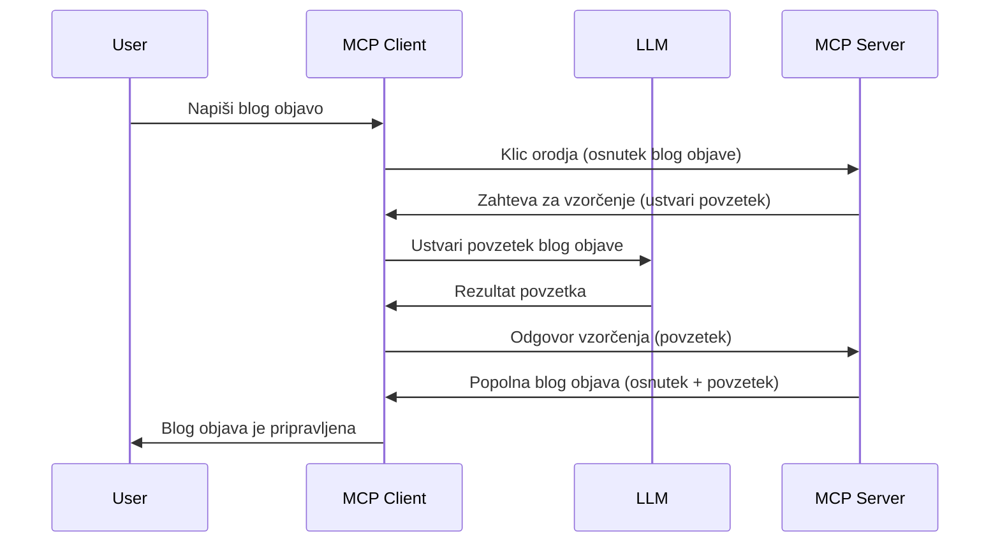

# Sampling - delegiranje funkcij odjemalcu

Včasih je potrebno, da MCP odjemalec in MCP strežnik sodelujeta za dosego skupnega cilja. Lahko imate primer, kjer strežnik potrebuje pomoč LLM, ki je nameščen pri odjemalcu. Za ta primer je sampling tisto, kar morate uporabiti.

Raziščimo nekaj primerov uporabe in kako zgraditi rešitev, ki vključuje sampling.

## Pregled

V tej lekciji se osredotočamo na pojasnitev, kdaj in kje uporabiti sampling ter kako ga konfigurirati.

## Cilji učenja

V tem poglavju bomo:

- Pojasnili, kaj je sampling in kdaj ga uporabiti.
- Prikazali, kako konfigurirati sampling v MCP.
- Priskrbeli primere uporabe samplinga v praksi.

## Kaj je sampling in zakaj ga uporabljati?

Sampling je napredna funkcija, ki deluje na naslednji način:


### Zahteva za sampling

Ok, zdaj imamo širok pogled na verjeten scenarij, pogovorimo se o zahtevi za sampling, ki jo strežnik pošlje nazaj odjemalcu. Tako izgleda zahteva v formatu JSON-RPC:

```json
{
  "jsonrpc": "2.0",
  "id": 1,
  "method": "sampling/createMessage",
  "params": {
    "messages": [
      {
        "role": "user",
        "content": {
          "type": "text",
          "text": "Create a blog post summary of the following blog post: <BLOG POST>"
        }
      }
    ],
    "modelPreferences": {
      "hints": [
        {
          "name": "claude-3-sonnet"
        }
      ],
      "intelligencePriority": 0.8,
      "speedPriority": 0.5
    },
    "systemPrompt": "You are a helpful assistant.",
    "maxTokens": 100
  }
}
```

Tukaj je nekaj stvari, ki jih je vredno izpostaviti:

- Poziv (Prompt), pod content -> text, je naš poziv, ki je navodilo LLM-ju, naj povzema vsebino blog zapisa.

- **modelPreferences**. Ta del je ravno to, preference, priporočilo, katero konfiguracijo uporabiti z LLM-jem. Uporabnik se lahko odloči, ali bo sledil tem priporočilom ali jih spremenil. V tem primeru so priporočila glede modela za uporabo ter prioritet hitrosti in inteligence.
- **systemPrompt**, to je vaš običajni sistemski poziv, ki vašemu LLM-ju daje osebnost in vsebuje navodila za vodenje.
- **maxTokens**, še ena lastnost, ki določa, koliko tokenov je priporočeno uporabiti za to nalogo.

### Odziv na sampling

Ta odziv je tisto, kar MCP odjemalec na koncu pošlje nazaj MCP strežniku in je rezultat klica LLM-ja pri odjemalcu, čakanja na odgovor in nato sestave tega sporočila. Tako izgleda v JSON-RPC:

```json
{
  "jsonrpc": "2.0",
  "id": 1,
  "result": {
    "role": "assistant",
    "content": {
      "type": "text",
      "text": "Here's your abstract <ABSTRACT>"
    },
    "model": "gpt-5",
    "stopReason": "endTurn"
  }
}
```

Opazite, da je odziv abstrakt blog zapisa, kot smo zahtevali. Opazite tudi, da uporabljen `model` ni tisti, za katerega smo prosili, ampak "gpt-5" namesto "claude-3-sonnet". To ilustrira, da lahko uporabnik spremeni svoj izbor in da je vaša zahteva za sampling samo priporočilo.

Ok, zdaj ko razumemo glavni tok in uporabno nalogo za "ustvarjanje blog prispevka + povzetka", poglejmo, kaj moramo narediti, da to deluje.

### Tipi sporočil

Sampling sporočila niso omejena le na besedilo, ampak lahko pošljete tudi slike in zvočne posnetke. Tako izgleda JSON-RPC za različne vrste:

**Besedilo**

```json
{
  "type": "text",
  "text": "The message content"
}
```

**Vsebina slike**

```json
{
  "type": "image",
  "data": "base64-encoded-image-data",
  "mimeType": "image/jpeg"
}
```

**Vsebina zvoka**

```json
{
  "type": "audio",
  "data": "base64-encoded-audio-data",
  "mimeType": "audio/wav"
}
```

> [!NOTE] Za bolj podrobne informacije o samplingu preverite [uradne dokumente](https://modelcontextprotocol.io/specification/2025-06-18/client/sampling)

## Kako konfigurirati sampling v odjemalcu

> Opomba: če gradite samo strežnik, tukaj ne morate storiti veliko.

Pri odjemalcu morate določiti naslednjo funkcijo tako:

```json
{
  "capabilities": {
    "sampling": {}
  }
}
```

To bo nato zaznano, ko se izbrani odjemalec inicializira s strežnikom.

## Primer uporabe samplinga - Ustvarjanje blog zapisa

Napišimo strežnik za sampling skupaj, potrebujemo naslednje:

1. Ustvariti orodje na strežniku.
1. Orodje mora ustvariti zahtevo za sampling.
1. Orodje mora počakati na odgovor na zahtevo za sampling od odjemalca.
1. Nato mora orodje vrniti rezultat.

Poglejmo kodo korak za korakom:

### -1- Ustvari orodje

**python**

```python
@mcp.tool()
async def create_blog(title: str, content: str, ctx: Context[ServerSession, None]) -> str:
    """Create a blog post and generate a summary"""

```

### -2- Ustvari zahtevo za sampling

Razširite svoje orodje s spodnjo kodo:

**python**

```python
post = BlogPost(
        id=len(posts) + 1,
        title=title,
        content=content,
        abstract=""
    )

prompt = f"Create an abstract of the following blog post: title: {title} and draft: {content} "

result = await ctx.session.create_message(
        messages=[
            SamplingMessage(
                role="user",
                content=TextContent(type="text", text=prompt),
            )
        ],
        max_tokens=100,
)

```

### -3- Počakaj na odgovor in ga vrni

**python**

```python
post.abstract = result.content.text

posts.append(post)

# vrni dokončni produkt
return json.dumps({
    "id": post.title,
    "abstract": post.abstract
})
```

### -4- Celotna koda

**python**

```python
from starlette.applications import Starlette
from starlette.routing import Mount, Host

from mcp.server.fastmcp import Context, FastMCP

from mcp.server.session import ServerSession
from mcp.types import SamplingMessage, TextContent

import json


from uuid import uuid4
from typing import List
from pydantic import BaseModel


mcp = FastMCP("Blog post generator")

# app = FastAPI()

posts = []

class BlogPost(BaseModel):
    id: int
    title: str
    content: str
    abstract: str

posts: List[BlogPost] = []

@mcp.tool()
async def create_blog(title: str, content: str, ctx: Context[ServerSession, None]) -> str:
    """Create a blog post and generate a summary"""

    post = BlogPost(
        id=len(posts) + 1,
        title=title,
        content=content,
        abstract=""
    )

    prompt = f"Create an abstract of the following blog post: title: {title} and draft: {content} "

    result = await ctx.session.create_message(
        messages=[
            SamplingMessage(
                role="user",
                content=TextContent(type="text", text=prompt),
            )
        ],
        max_tokens=100,
    )

    post.abstract = result.content.text

    posts.append(post)

    # vrni celoten blog objavo
    return json.dumps({
        "id": post.title,
        "abstract": post.abstract
    })

if __name__ == "__main__":
    print("Starting server...")
    # mcp.run()
    mcp.run(transport="streamable-http")

# zaženi aplikacijo z: python server.py
```

### -5- Testiranje v Visual Studio Code

Za testiranje v Visual Studio Code naredite naslednje:

1. Zaženite strežnik v terminalu.
1. Dodajte ga v *mcp.json* (in poskrbite, da je zagnan), nekaj takega:

   ```json
   "servers": {
      "blog-server": {
        "type": "http",
        "url": "http://localhost:8000/mcp"
      }
   }
   ```

1. Vnesite poziv (prompt):

   ```text
   create a blog post named "Where Python comes from", the content is "Python is actually named after Monty Python Flying Circus"
   ```

1. Dovolite sampling. Prvič ko to testirate, se vam prikaže dodatni dialog, ki ga boste morali sprejeti, nato boste videli običajen dialog za zagon orodja.

1. Preglejte rezultate. Rezultate boste videli lepo prikazane v GitHub Copilot Chat, lahko pa tudi pregledate surovi JSON odziv.

**Bonus**. Orodja Visual Studio Code imajo odlično podporo za sampling. Sampling dostop na nameščenem strežniku lahko konfigurirate tako:

1. Pojdite v razdelek z razširitvami.
1. Izberite ikono zobnika za vaš nameščeni strežnik v delu "MCP SERVERS - INSTALLED".
1. Izberite "Configure Model Access", tukaj lahko izberete, kateri modeli so dovoljeni za uporabo GitHub Copilot-a med samplingom. Prav tako lahko vidite vse nedavne zahteve za sampling, če izberete "Show Sampling requests".

## Naloga

V tej nalogi boste zgradili nekoliko drugačen sampling – integracijo za ustvarjanje opisa izdelka. Tukaj je vaš scenarij:

**Scenarij**: Zaposleni v back office oddelku e-trgovine potrebuje pomoč, saj izdelava opisov izdelkov vzame preveč časa. Zato morate zgraditi rešitev, kjer lahko s klicem orodja "create_product" z argumentoma "title" in "keywords" ustvarite celoten izdelek, ki vključuje polje "description", ki naj bo izpolnjeno z LLM-jem odjemalca.

NAMIG: uporabite, kar ste se naučili prej, kako sestaviti strežnik in orodje s pomočjo zahteve za sampling.

## Rešitev

[Rešitev](./solution/README.md)

## Ključne ugotovitve

Sampling je zmogljiva funkcija, ki omogoča strežniku, da delegira naloge odjemalcu, kadar potrebuje pomoč LLM-ja.

## Kaj sledi

- [Poglavje 4 - Praktična implementacija](../../04-PracticalImplementation/README.md)

---

<!-- CO-OP TRANSLATOR DISCLAIMER START -->
**Omejitev odgovornosti**:
Ta dokument je bil preveden z uporabo storitve za prevajanje z umetno inteligenco [Co-op Translator](https://github.com/Azure/co-op-translator). Čeprav si prizadevamo za natančnost, upoštevajte, da avtomatizirani prevodi lahko vsebujejo napake ali netočnosti. Izvirni dokument v izvorni jezik je treba obravnavati kot avtoritativni vir. Za pomembne informacije priporočamo profesionalni prevod s strani človeka. Nismo odgovorni za kakršne koli nesporazume ali napačne interpretacije, ki izhajajo iz uporabe tega prevoda.
<!-- CO-OP TRANSLATOR DISCLAIMER END -->