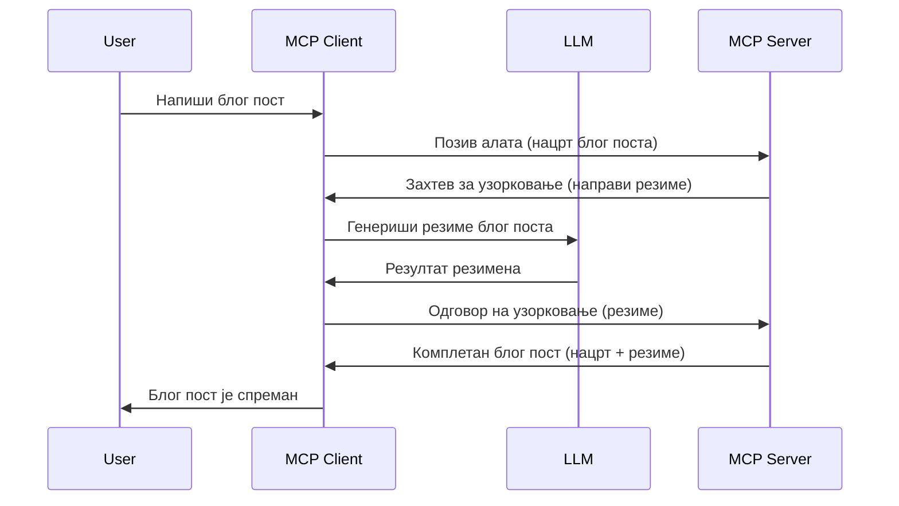

# Узораковање - делегирање функција Клијенту

Понекад је потребно да MCP Клијент и MCP Сервер сарађују да би постигли заједнички циљ. Можда имате сценарио у коме Сервер треба помоћ LLM-а који се налази на клијенту. За ову ситуацију треба користити узораковање.

Хајде да истражимо неке примерке употребе и како направити решење које укључује узораковање.

## Преглед

У овом часу фокусирамо се на објашњење када и где користити узораковање и како га конфигурисати.

## Циљеви учења

У овом поглављу ћемо:

- Објаснити шта је узораковање и када га користити.
- Приказати како се конфигурише узораковање у MCP.
- Пружити примере узораковања у акцији.

## Шта је узораковање и зашто га користити?

Узораковање је напредна функција која ради на следећи начин:


### Захтев за узораковање

У реду, сада имамо широк приказ вероватног сценарија, хајде да причамо о захтеву за узораковање који сервер шаље клијенту. Ево како такав захтев може изгледати у JSON-RPC формату:

```json
{
  "jsonrpc": "2.0",
  "id": 1,
  "method": "sampling/createMessage",
  "params": {
    "messages": [
      {
        "role": "user",
        "content": {
          "type": "text",
          "text": "Create a blog post summary of the following blog post: <BLOG POST>"
        }
      }
    ],
    "modelPreferences": {
      "hints": [
        {
          "name": "claude-3-sonnet"
        }
      ],
      "intelligencePriority": 0.8,
      "speedPriority": 0.5
    },
    "systemPrompt": "You are a helpful assistant.",
    "maxTokens": 100
  }
}
```

Постоји неколико ствари вредних нагласка:

- Промпт, у пољу content -> text, је наш упит који је инструкција LLM-у да сажме садржај блога.

- **modelPreferences**. Овај део је управо то, преференца, препорука која конфигурација треба да се користи за LLM. Корисник може изабрати да ли ће ићи по овим препорукама или их променити. У овом случају постоје препоруке за модел који треба користити и приоритет брзине и интелигенције.
- **systemPrompt**, ово је уобичајени системски промпт који даје LLM-у личност и садржи упутства.
- **maxTokens**, ово је још једно својство које говори колико токена је препоручено за ову задатак.

### Одговор узораковања

Овај одговор је оно што MCP Клијент на крају шаље назад MCP Серверу и резултат је позива LLM-а од стране клијента, чекања одговора и састављања ове поруке. Ево како може изгледати у JSON-RPC формату:

```json
{
  "jsonrpc": "2.0",
  "id": 1,
  "result": {
    "role": "assistant",
    "content": {
      "type": "text",
      "text": "Here's your abstract <ABSTRACT>"
    },
    "model": "gpt-5",
    "stopReason": "endTurn"
  }
}
```

Обратите пажњу како је одговор апстрактни сажетак блог поста баш као што смо тражили. Такође, приметите како коришћени `model` није онај који смо захтевали већ "gpt-5" уместо "claude-3-sonnet". Ово илуструје да корисник може променити мишљење о томе шта ће користити и да је ваш захтев за узораковање само препорука.

У реду, сада када разумемо главни ток и користан задатак за његову употребу "креирање блог поста + апстракт", хајде да видимо шта треба да урадимо да би ово функционисало.

### Типови порука

Поруке узораковања нису ограничене само на текст, већ можете послати и слике и аудио. Ево како JSON-RPC изгледа другачије:

**Текст**

```json
{
  "type": "text",
  "text": "The message content"
}
```

**Садржај слике**

```json
{
  "type": "image",
  "data": "base64-encoded-image-data",
  "mimeType": "image/jpeg"
}
```

**Аудио садржај**

```json
{
  "type": "audio",
  "data": "base64-encoded-audio-data",
  "mimeType": "audio/wav"
}
```

> NOTE: за детаљније информације о узораковању, погледајте званичну [документацију](https://modelcontextprotocol.io/specification/2025-06-18/client/sampling)

## Како конфигурисати узораковање у Клијенту

> Напомена: ако правите само сервер, не морате много овде радити.

У клијенту морате одредити следећу функцију овако:

```json
{
  "capabilities": {
    "sampling": {}
  }
}
```

Ово ће бити уочено када изабрани клијент иницијализује везу са сервером.

## Пример узораковања у акцији - Креирање блог поста

Хајде да заједно напишемо сервер за узораковање, потребно је урадити следеће:

1. Креирати алат на Серверу.
1. Тај алат треба да креира захтев за узораковање.
1. Алат треба да причека да добије одговор на захтев за узораковање од клијента.
1. Онда треба произвести резултат алата.

Погледајмо код корак по корак:

### -1- Креирање алата

**python**

```python
@mcp.tool()
async def create_blog(title: str, content: str, ctx: Context[ServerSession, None]) -> str:
    """Create a blog post and generate a summary"""

```

### -2- Креирање захтева за узораковање

Проширите свој алат следећим кодом:

**python**

```python
post = BlogPost(
        id=len(posts) + 1,
        title=title,
        content=content,
        abstract=""
    )

prompt = f"Create an abstract of the following blog post: title: {title} and draft: {content} "

result = await ctx.session.create_message(
        messages=[
            SamplingMessage(
                role="user",
                content=TextContent(type="text", text=prompt),
            )
        ],
        max_tokens=100,
)

```

### -3- Чекање на одговор и враћање одговора

**python**

```python
post.abstract = result.content.text

posts.append(post)

# врати комплетан производ
return json.dumps({
    "id": post.title,
    "abstract": post.abstract
})
```

### -4- Цео код

**python**

```python
from starlette.applications import Starlette
from starlette.routing import Mount, Host

from mcp.server.fastmcp import Context, FastMCP

from mcp.server.session import ServerSession
from mcp.types import SamplingMessage, TextContent

import json


from uuid import uuid4
from typing import List
from pydantic import BaseModel


mcp = FastMCP("Blog post generator")

# app = FastAPI()

posts = []

class BlogPost(BaseModel):
    id: int
    title: str
    content: str
    abstract: str

posts: List[BlogPost] = []

@mcp.tool()
async def create_blog(title: str, content: str, ctx: Context[ServerSession, None]) -> str:
    """Create a blog post and generate a summary"""

    post = BlogPost(
        id=len(posts) + 1,
        title=title,
        content=content,
        abstract=""
    )

    prompt = f"Create an abstract of the following blog post: title: {title} and draft: {content} "

    result = await ctx.session.create_message(
        messages=[
            SamplingMessage(
                role="user",
                content=TextContent(type="text", text=prompt),
            )
        ],
        max_tokens=100,
    )

    post.abstract = result.content.text

    posts.append(post)

    # враћа цео блог пост
    return json.dumps({
        "id": post.title,
        "abstract": post.abstract
    })

if __name__ == "__main__":
    print("Starting server...")
    # mcp.run()
    mcp.run(transport="streamable-http")

# покрени апликацију са: python server.py
```

### -5- Тестирање у Visual Studio Code

Да бисте тестирали ово у Visual Studio Code-у, урадите следеће:

1. Покрените сервер у терминалу
1. Додајте га у *mcp.json* (и уверите се да је покренут), на пример овако:

   ```json
   "servers": {
      "blog-server": {
        "type": "http",
        "url": "http://localhost:8000/mcp"
      }
   }
   ```

1. Унесите упит:

   ```text
   create a blog post named "Where Python comes from", the content is "Python is actually named after Monty Python Flying Circus"
   ```

1. Дозволите да се узораковање одвије. При првом тестирању бићете ускочени дијалог којем морате дати сагласност, након чега ћете видети уобичајени дијалог који вас пита да ли желите да покренете алат.

1. Испитајте резултате. Видећете резултате лепо приказане у GitHub Copilot Chat-у, али и можете прегледати и необрађени JSON одговор.

**Бонус**. Visual Studio Code има одличну алатку за подршку узораковању. Можете конфигурисати приступ узораковању за инсталирани сервер овако:

1. Идите у одељак екстензија.
1. Изаберите иконицу зупчаника за ваш инсталирани сервер у одељку "MCP SERVERS - INSTALLED".
1. Изаберите "Configure Model Access", где можете изабрати које моделе GitHub Copilot сме да користи приликом узораковања. Такође можете видети све недавне захтеве за узораковање кликом на "Show Sampling requests".

## Задатак

У овом задатку ћете направити нешто мало другачији систем узораковања, тачније интеграцију узораковања која подржава генерисање описа производа. Ево вашег сценарија:

**Сценарио**: Запосленом у позадини е-трговине је потребна помоћ јер му превише времена одузима креирање описа производа. Стога треба да направите решење где можете позвати алат "create_product" са аргументима "title" и "keywords", а он треба да произведе комплетан производ укључујући поље "description" које ће бити попуњено LLM-ом на клијенту.

TIP: искористите оно што сте раније научили о томе како направити сервер и његов алат са захтевом за узораковање.

## Решење

[Solution](./solution/README.md)

## Кључне поуке

Узораковање је моћна функција која омогућава серверу да делегира задатке клијенту кад му је потребна помоћ LLM-а.

## Шта следи

- [Поглавље 4 - Практична примена](../../04-PracticalImplementation/README.md)

---

<!-- CO-OP TRANSLATOR DISCLAIMER START -->
**Одрицање одговорности**:
Овај документ је преведен коришћењем АИ сервиса за превод [Co-op Translator](https://github.com/Azure/co-op-translator). Иако тежимо прецизности, молимо имајте у виду да аутоматизовани преводи могу садржати грешке или нетачности. Оригинални документ на његовом матерњем језику треба сматрати ауторитетним извором. За критичне информације препоручује се професионални људски превод. Нисмо одговорни за било какве неспоразуме или погрешна тумачења настала употребом овог превода.
<!-- CO-OP TRANSLATOR DISCLAIMER END -->