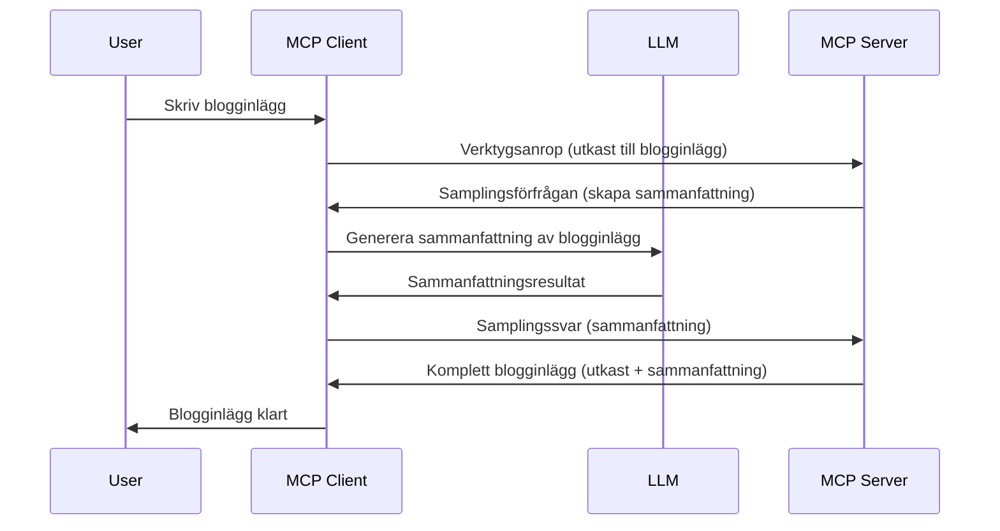

# Sampling - delegera funktioner till Klienten

Ibland behöver du att MCP-klienten och MCP-servern samarbetar för att uppnå ett gemensamt mål. Du kan ha ett fall där servern behöver hjälp av en LLM som sitter på klienten. För denna situation är sampling det du bör använda.

Låt oss utforska några användningsfall och hur man bygger en lösning som involverar sampling.

## Översikt

I denna lektion fokuserar vi på att förklara när och var samplingsmetod bör användas och hur man konfigurerar den.

## Lärandemål

I det här kapitlet ska vi:

- Förklara vad sampling är och när det ska användas.
- Visa hur man konfigurerar sampling i MCP.
- Ge exempel på sampling i praktiken.

## Vad är sampling och varför använda det?

Sampling är en avancerad funktion som fungerar på följande sätt:


### Samplingförfrågan

Ok, nu har vi en övergripande bild av ett trovärdigt scenario, låt oss prata om samplingsförfrågan som servern skickar tillbaka till klienten. Så här kan en sådan förfrågan se ut i JSON-RPC-format:

```json
{
  "jsonrpc": "2.0",
  "id": 1,
  "method": "sampling/createMessage",
  "params": {
    "messages": [
      {
        "role": "user",
        "content": {
          "type": "text",
          "text": "Create a blog post summary of the following blog post: <BLOG POST>"
        }
      }
    ],
    "modelPreferences": {
      "hints": [
        {
          "name": "claude-3-sonnet"
        }
      ],
      "intelligencePriority": 0.8,
      "speedPriority": 0.5
    },
    "systemPrompt": "You are a helpful assistant.",
    "maxTokens": 100
  }
}
```

Det finns några saker här värda att påpeka:

- Prompt, under content -> text, är vår prompt som är en instruktion för LLM att sammanfatta blogginnehållet.

- **modelPreferences**. Denna sektion är just det, en preferens, en rekommendation om vilken konfiguration som ska användas med LLM. Användaren kan välja att följa dessa rekommendationer eller ändra dem. I detta fall finns rekommendationer om modell att använda samt prioritering mellan hastighet och intelligens.
- **systemPrompt**, detta är din vanliga systemprompt som ger din LLM en personlighet och innehåller vägledande instruktioner.
- **maxTokens**, detta är en annan egenskap som används för att ange hur många tokens det rekommenderas att använda för denna uppgift.

### Sampling-svar

Detta svar är vad MCP-klienten slutligen skickar tillbaka till MCP-servern och är resultatet av att klienten anropar LLM, väntar på svaret och sedan konstruerar detta meddelande. Så här kan det se ut i JSON-RPC:

```json
{
  "jsonrpc": "2.0",
  "id": 1,
  "result": {
    "role": "assistant",
    "content": {
      "type": "text",
      "text": "Here's your abstract <ABSTRACT>"
    },
    "model": "gpt-5",
    "stopReason": "endTurn"
  }
}
```

Lägg märke till hur svaret är en sammanfattning av bloggposten precis som vi bad om. Notera också hur den använda `model` inte är den vi bad om utan "gpt-5" istället för "claude-3-sonnet". Detta för att illustrera att användaren kan ändra sig om vad som ska användas och att din samplingsförfrågan är en rekommendation.

Ok, nu när vi förstår huvudflödet och en användbar uppgift att använda det för "skapande av blogginlägg + sammanfattning", låt oss se vad vi behöver göra för att få det att fungera.

### Meddelandetyper

Sampling-meddelanden begränsas inte till bara text utan du kan också skicka bilder och ljud. Så här ser JSON-RPC annorlunda ut:

**Text**

```json
{
  "type": "text",
  "text": "The message content"
}
```

**Bildinnehåll**

```json
{
  "type": "image",
  "data": "base64-encoded-image-data",
  "mimeType": "image/jpeg"
}
```

**Ljudinnehåll**

```json
{
  "type": "audio",
  "data": "base64-encoded-audio-data",
  "mimeType": "audio/wav"
}
```

> NOTE: för mer detaljerad info om Sampling, kolla in de [officiella dokumenten](https://modelcontextprotocol.io/specification/2025-06-18/client/sampling)

## Hur man konfigurerar Sampling i Klienten

> Notera: Om du bara bygger en server behöver du inte göra mycket här.

I en klient behöver du specificera följande funktion så här:

```json
{
  "capabilities": {
    "sampling": {}
  }
}
```

Detta kommer sedan plockas upp när din valda klient initialiseras med servern.

## Exempel på Sampling i praktiken - Skapa ett Blogginlägg

Låt oss koda en samplingsserver tillsammans, vi kommer behöva göra följande:

1. Skapa ett verktyg på servern.
1. Verktyget ska skapa en samplingsförfrågan.
1. Verktyget ska vänta på att klientens samplingsförfrågan besvaras.
1. Sedan ska verktygets resultat produceras.

Låt oss se koden steg för steg:

### -1- Skapa verktyget

**python**

```python
@mcp.tool()
async def create_blog(title: str, content: str, ctx: Context[ServerSession, None]) -> str:
    """Create a blog post and generate a summary"""

```

### -2- Skapa en samplingsförfrågan

Utöka ditt verktyg med följande kod:

**python**

```python
post = BlogPost(
        id=len(posts) + 1,
        title=title,
        content=content,
        abstract=""
    )

prompt = f"Create an abstract of the following blog post: title: {title} and draft: {content} "

result = await ctx.session.create_message(
        messages=[
            SamplingMessage(
                role="user",
                content=TextContent(type="text", text=prompt),
            )
        ],
        max_tokens=100,
)

```

### -3- Vänta på svaret och returnera svaret

**python**

```python
post.abstract = result.content.text

posts.append(post)

# returnera den kompletta produkten
return json.dumps({
    "id": post.title,
    "abstract": post.abstract
})
```

### -4- Fullständig kod

**python**

```python
from starlette.applications import Starlette
from starlette.routing import Mount, Host

from mcp.server.fastmcp import Context, FastMCP

from mcp.server.session import ServerSession
from mcp.types import SamplingMessage, TextContent

import json


from uuid import uuid4
from typing import List
from pydantic import BaseModel


mcp = FastMCP("Blog post generator")

# app = FastAPI()

posts = []

class BlogPost(BaseModel):
    id: int
    title: str
    content: str
    abstract: str

posts: List[BlogPost] = []

@mcp.tool()
async def create_blog(title: str, content: str, ctx: Context[ServerSession, None]) -> str:
    """Create a blog post and generate a summary"""

    post = BlogPost(
        id=len(posts) + 1,
        title=title,
        content=content,
        abstract=""
    )

    prompt = f"Create an abstract of the following blog post: title: {title} and draft: {content} "

    result = await ctx.session.create_message(
        messages=[
            SamplingMessage(
                role="user",
                content=TextContent(type="text", text=prompt),
            )
        ],
        max_tokens=100,
    )

    post.abstract = result.content.text

    posts.append(post)

    # returnera hela blogginlägget
    return json.dumps({
        "id": post.title,
        "abstract": post.abstract
    })

if __name__ == "__main__":
    print("Starting server...")
    # mcp.run()
    mcp.run(transport="streamable-http")

# kör app med: python server.py
```

### -5- Testa det i Visual Studio Code

För att testa detta i Visual Studio Code, gör så här:

1. Starta servern i terminalen
1. Lägg till den i *mcp.json* (och säkerställ att den är startad), t.ex. något i stil med:

   ```json
   "servers": {
      "blog-server": {
        "type": "http",
        "url": "http://localhost:8000/mcp"
      }
   }
   ```

1. Skriv en prompt:

   ```text
   create a blog post named "Where Python comes from", the content is "Python is actually named after Monty Python Flying Circus"
   ```

1. Tillåt sampling ske. Första gången du testar detta kommer du att mötas av en extra dialog som du måste acceptera, sedan ser du den normala dialogen som frågar dig att köra ett verktyg.

1. Inspektera resultaten. Du kommer att se resultaten snyggt återgivna i GitHub Copilot Chat men du kan också inspektera det råa JSON-svaret.

**Bonus**. Visual Studio Code-verktygen har bra stöd för sampling. Du kan konfigurera Sampling-åtkomst på din installerade server genom att navigera så här:

1. Gå till avsnittet för tillägg.
1. Välj kugghjulsikonen för din installerade server i sektionen "MCP SERVERS - INSTALLED".
1 Välj "Configure Model Access", här kan du välja vilka modeller GitHub Copilot får använda när sampling utförs. Du kan också se alla samplingsförfrågningar som nyligen skett genom att välja "Show Sampling requests".

## Uppgift

I denna uppgift ska du bygga en något annorlunda sampling, nämligen en sampling-integration som stöder generering av en produktbeskrivning. Här är ditt scenario:

**Scenario**: Backoffice-arbetaren på en e-handel behöver hjälp, det tar alldeles för lång tid att generera produktbeskrivningar. Därför ska du bygga en lösning där du kan anropa ett verktyg "create_product" med "title" och "keywords" som argument och det ska producera en komplett produkt inklusive ett "description"-fält som ska fyllas i av en LLM på klienten.

TIP: använd det du lärde dig tidigare om hur man konstruerar denna server och dess verktyg med en samplingsförfrågan.

## Lösning

[Lösning](./solution/README.md)

## Viktiga punkter

Sampling är en kraftfull funktion som tillåter servern att delegera uppgifter till klienten när den behöver hjälp av en LLM.

## Vad är nästa steg

- [Kapitel 4 - Praktisk implementering](../../04-PracticalImplementation/README.md)

---

<!-- CO-OP TRANSLATOR DISCLAIMER START -->
**Ansvarsfriskrivning**:
Detta dokument har översatts med hjälp av AI-översättningstjänsten [Co-op Translator](https://github.com/Azure/co-op-translator). Trots att vi strävar efter noggrannhet, var vänlig notera att automatiska översättningar kan innehålla fel eller brister. Det ursprungliga dokumentet på dess modersmål bör betraktas som den auktoritativa källan. För viktig information rekommenderas professionell mänsklig översättning. Vi ansvarar inte för några missförstånd eller feltolkningar som uppstår vid användning av denna översättning.
<!-- CO-OP TRANSLATOR DISCLAIMER END -->