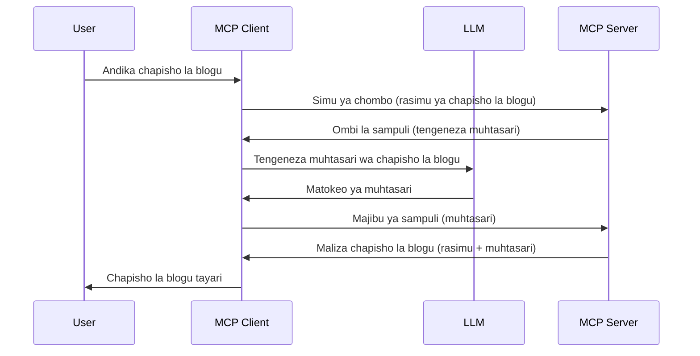

# Kuchagua sampuli - kuteua majukumu kwa Mteja

Wakati mwingine, unahitaji MCP Client na MCP Server kushirikiana kufanikisha lengo la pamoja. Huenda ukaona hali ambapo Server inahitaji msaada wa LLM inayokaa kwenye mteja. Kwa hali hii, kuchagua sampuli ndicho unachopaswa kutumia.

Tuchunguze baadhi ya hali za matumizi na jinsi ya kujenga suluhisho linalohusisha kuchagua sampuli.

## Muhtasari

Katika somo hili, tunazingatia kuelezea lini na wapi kutumia Kuchagua Sampuli na jinsi ya kuiwezesha.

## Malengo ya Kujifunza

Katika sura hii, tutafanya:

- Elezea nini ni Kuchagua Sampuli na lini kuitumia.
- Onyesha jinsi ya kuiwezesha Kuchagua Sampuli katika MCP.
- Toa mifano ya Kuchagua Sampuli katika utendaji.

## Nini ni Kuchagua Sampuli na kwa nini kuitumia?

Kuchagua Sampuli ni kipengele cha juu kinachofanya kazi kwa njia ifuatayo:


### Ombi la Kuchagua Sampuli

Sawa, sasa tuna mtazamo wa juu wa hali yenye uwezekano, tuzungumze kuhusu ombi la kuchagua sampuli ambalo server hutuma kwa mteja. Hivi ndivyo ombi kama hilo linaweza kuonekana katika muundo wa JSON-RPC:

```json
{
  "jsonrpc": "2.0",
  "id": 1,
  "method": "sampling/createMessage",
  "params": {
    "messages": [
      {
        "role": "user",
        "content": {
          "type": "text",
          "text": "Create a blog post summary of the following blog post: <BLOG POST>"
        }
      }
    ],
    "modelPreferences": {
      "hints": [
        {
          "name": "claude-3-sonnet"
        }
      ],
      "intelligencePriority": 0.8,
      "speedPriority": 0.5
    },
    "systemPrompt": "You are a helpful assistant.",
    "maxTokens": 100
  }
}
```

Kuna mambo machache hapa yanayostahili kuzingatiwa:

- Prompt, chini ya content -> text, ni maelekezo yetu ambayo ni maagizo kwa LLM kupanga muhtasari wa maudhui ya chapisho la blogu.

- **modelPreferences**. Sehemu hii ni ile ile, upendeleo, mapendekezo ya usanidi wa kutumia na LLM. Mtumiaji anaweza kuchagua kama atafuata mapendekezo haya au kubadilisha. Katika kesi hii kuna mapendekezo kuhusu mfano wa kutumia na kipaumbele cha kasi na akili.
- **systemPrompt**, hii ni prompt ya kawaida ya mfumo inayompa LLM yako utu binafsi na ina maelekezo ya mwongozo.
- **maxTokens**, hii ni mali nyingine inayotumiwa kusema ni vipi idadi ya tokeni inavyopendekezwa kwa kazi hii.

### Jibu la Kuchagua Sampuli

Jibu hili ndilo MCP Client huhitimisha kutuma kurudi kwa MCP Server na ni matokeo ya mteja kupiga simu kwa LLM, kusubiri jibu hilo na kisha kuunda ujumbe huu. Hivi ndivyo linaweza kuonekana katika JSON-RPC:

```json
{
  "jsonrpc": "2.0",
  "id": 1,
  "result": {
    "role": "assistant",
    "content": {
      "type": "text",
      "text": "Here's your abstract <ABSTRACT>"
    },
    "model": "gpt-5",
    "stopReason": "endTurn"
  }
}
```

Angalia jinsi jibu linavyo kuwa muhtasari wa chapisho la blogu kama tulivyoomba. Pia angalia jinsi `model` iliyotumika si ile tuliyoomba bali "gpt-5" badala ya "claude-3-sonnet". Hii inaonyesha kuwa mtumiaji anaweza kubadilisha maoni juu ya kile cha kutumia na kwamba ombi lako la kuchagua ni mapendekezo.

Sawa, sasa tunapoelewa mzunguko mkuu, na kazi muhimu ya kuitumia kwa "utengenezaji wa chapisho la blogu + muhtasari", tuchunguze kile tunachohitaji kufanya ili iweze kufanya kazi.

### Aina za Ujumbe

Ujumbe wa kuchagua sampuli hauzuiliki kwa maandishi pekee bali pia unaweza kutuma, picha na sauti. Hivi ndivyo JSON-RPC inavyoonekana tofauti:

**Maandishi**

```json
{
  "type": "text",
  "text": "The message content"
}
```

**Maudhui ya picha**

```json
{
  "type": "image",
  "data": "base64-encoded-image-data",
  "mimeType": "image/jpeg"
}
```

**Maudhui ya sauti**

```json
{
  "type": "audio",
  "data": "base64-encoded-audio-data",
  "mimeType": "audio/wav"
}
```

> NOTE: kwa maelezo zaidi kuhusu Kuchagua Sampuli, angalia [nyaraka rasmi](https://modelcontextprotocol.io/specification/2025-06-18/client/sampling)

## Jinsi ya Kuwezesha Kuchagua Sampuli kwenye Mteja

> Kumbuka: kama unajenga server tu, hauhitaji kufanya mengi hapa.

Katika mteja, unahitaji kubainisha kipengele kama ifuatavyo:

```json
{
  "capabilities": {
    "sampling": {}
  }
}
```

Hii itachukuliwa wakati mteja ulioteuliwa anapoanzisha na server.

## Mfano wa Kuchagua Sampuli Katika Matendo - Tengeneza Chapisho la Blogu

Hebu tundae server ya kuchagua sampuli pamoja, tutahitaji kufanya yafuatayo:

1. Tengeneza chombo kwenye Server.
1. Chombo hicho kitengeneze ombi la kuchagua sampuli
1. Chombo kisubiri jibu la ombi la kuchagua sampuli la mteja.
1. Kisha matokeo ya chombo yatatengenezwa.

Tuchunguze msimbo hatua kwa hatua:

### -1- Tengeneza chombo

**python**

```python
@mcp.tool()
async def create_blog(title: str, content: str, ctx: Context[ServerSession, None]) -> str:
    """Create a blog post and generate a summary"""

```

### -2- Tengeneza ombi la kuchagua sampuli

Panua chombo chako na msimbo ufuatao:

**python**

```python
post = BlogPost(
        id=len(posts) + 1,
        title=title,
        content=content,
        abstract=""
    )

prompt = f"Create an abstract of the following blog post: title: {title} and draft: {content} "

result = await ctx.session.create_message(
        messages=[
            SamplingMessage(
                role="user",
                content=TextContent(type="text", text=prompt),
            )
        ],
        max_tokens=100,
)

```

### -3- Subiri jibu na rudisha jibu

**python**

```python
post.abstract = result.content.text

posts.append(post)

# rudisha bidhaa kamili
return json.dumps({
    "id": post.title,
    "abstract": post.abstract
})
```

### -4- Msimbo kamili

**python**

```python
from starlette.applications import Starlette
from starlette.routing import Mount, Host

from mcp.server.fastmcp import Context, FastMCP

from mcp.server.session import ServerSession
from mcp.types import SamplingMessage, TextContent

import json


from uuid import uuid4
from typing import List
from pydantic import BaseModel


mcp = FastMCP("Blog post generator")

# app = FastAPI()

posts = []

class BlogPost(BaseModel):
    id: int
    title: str
    content: str
    abstract: str

posts: List[BlogPost] = []

@mcp.tool()
async def create_blog(title: str, content: str, ctx: Context[ServerSession, None]) -> str:
    """Create a blog post and generate a summary"""

    post = BlogPost(
        id=len(posts) + 1,
        title=title,
        content=content,
        abstract=""
    )

    prompt = f"Create an abstract of the following blog post: title: {title} and draft: {content} "

    result = await ctx.session.create_message(
        messages=[
            SamplingMessage(
                role="user",
                content=TextContent(type="text", text=prompt),
            )
        ],
        max_tokens=100,
    )

    post.abstract = result.content.text

    posts.append(post)

    # rudisha chapisho kamili la blogu
    return json.dumps({
        "id": post.title,
        "abstract": post.abstract
    })

if __name__ == "__main__":
    print("Starting server...")
    # mcp.run()
    mcp.run(transport="streamable-http")

# endesha app kwa: python server.py
```

### -5- Kuipima katika Visual Studio Code

Ili kuipima katika Visual Studio Code, fanya yafuatayo:

1. Anzisha server kwenye terminal
1. Iongeze kwenye *mcp.json* (na hakikisha imeanzishwa) mfano kama ifuatavyo:

   ```json
   "servers": {
      "blog-server": {
        "type": "http",
        "url": "http://localhost:8000/mcp"
      }
   }
   ```

1. Andika prompt:

   ```text
   create a blog post named "Where Python comes from", the content is "Python is actually named after Monty Python Flying Circus"
   ```

1. Ruhusu kuchagua sampuli kufanyika. Mara ya kwanza unapotest hii utaoneshwa kidialogi kingine utakachohitaji kukubali, kisha utaona kidialogi cha kawaida kinachokuomba utumie chombo

1. Angalia matokeo. Utaona matokeo yakiwasilishwa vyema ndani ya GitHub Copilot Chat lakini pia unaweza kuchunguza jibu tosha la JSON.

**Ziada**. Zana za Visual Studio Code zina msaada mzuri kwa kuchagua sampuli. Unaweza kuanzisha upatikanaji wa Kuchagua Sampuli kwenye server uliyoisakinisha kwa kwenda sehemu ifuatayo:

1. Nenda sehemu ya upanuzi.
1. Chagua ikoni ya gia kwa server uliyoisakinisha katika sehemu ya "MCP SERVERS - INSTALLED".
1 Chagua "Configure Model Access", hapa unaweza kuchagua modeli gani GitHub Copilot inaruhusiwa kutumia wakati wa kuchagua sampuli. Pia unaweza kuona maombi yote ya kuchagua sampuli yaliyotokea karibuni kwa kuchagua "Show Sampling requests".

## Kazi ya Nyumbani

Katika kazi hii ya nyumbani, utajenga aina tofauti ya Kuchagua Sampuli, yaani ujumuishaji wa sampuli unaounga mkono uzalishaji wa maelezo ya bidhaa. Huu hapa ni mchezo wako:

**Hali ya Sanaa**: Mfanyakazi wa ofisi ya nyuma katika dukani la mtandaoni anahitaji msaada, hutumia muda mwingi kuandaa maelezo ya bidhaa. Kwa hivyo, unatakiwa kujenga suluhisho ambapo unaweza kupiga simu kwa chombo "create_product" na hoja "title" na "keywords" na kitajumuisha bidhaa kamili ikiwa na uwanja wa "description" ambao unatakiwa kujazwa na LLM ya mteja.

USHERAA: tumia kile ulichojifunza awali jinsi ya kuunda server hii na chombo chake kwa kutumia ombi la kuchagua sampuli.

## Suluhisho

[Solution](./solution/README.md)

## Muhimu za Kukumbuka

Kuchagua Sampuli ni kipengele chenye nguvu kinachoruhusu server kuteua majukumu kwa mteja wakati inahitaji msaada wa LLM.

## Kinacho Fuata

- [Sura ya 4 - Utekelezaji wa vitendo](../../04-PracticalImplementation/README.md)

---

<!-- CO-OP TRANSLATOR DISCLAIMER START -->
**Kandhari**:
Nyaraka hii imetafsiriwa kwa kutumia huduma ya tafsiri ya AI [Co-op Translator](https://github.com/Azure/co-op-translator). Ingawa tunajitahidi kutoa usahihi, tafadhali fahamu kuwa tafsiri za kishine zinaweza kuwa na makosa au upungufu. Nyaraka ya asili katika lugha yake halisi inapaswa kuchukuliwa kama chanzo cha uhakika. Kwa taarifa muhimu, kuna ushauri wa kutumia huduma ya mtafsiri mzoefu wa kibinadamu. Hatubebei uwajibikaji wowote kwa kutoelewana au tafsiri potofu zinazotokana na matumizi ya tafsiri hii.
<!-- CO-OP TRANSLATOR DISCLAIMER END -->