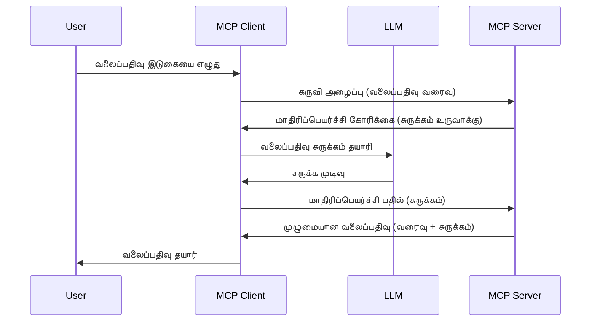

# மாதிரிப்படுத்தல் - கிளையண்டுக்கான பணிகளைக் கையளித்தல்

சில நேரங்களில், MCP கிளையண்டும் MCP சர்வரும் ஒரு பொதுவான குறிக்கோளை அடைவதற்காக ஒருங்கிணைந்திருக்க வேண்டும். சில சமயங்களில், சர்வருக்கு கிளையண்டில் இருக்கும் LLM (Language Learning Model) உதவி தேவைப்படலாம். இந்த சூழலுக்கு, மாதிரிப்படுத்தலை பயன்படுத்த வேண்டும்.

மாதிரிப்படுத்தலைப் பயன்படுத்தும் சில பயன்பாடுகளை இப்போது பார்க்கலாம் மற்றும் அதை எப்படி கட்டமைப்பது என்பதை ஆராய்வோம்.

## கண்ணோட்டம்

இந்த பாடத்தில், மாதிரிப்படுத்தலை எப்போது மற்றும் எப்போது பயன்படுத்த வேண்டும் என்று விளக்குவோம் மற்றும் அதை எப்படி அமைக்க வேண்டும் என்பதைக் காண்போம்.

## கற்றல் குறிக்கோள்கள்

இந்த அத்தியாயத்தில், நாம்:

- மாதிரிப்படுத்தல் என்றால் என்ன மற்றும் அதை எப்போது பயன்படுத்த வேண்டும் என்பதை விளக்குகிறோம்.
- MCP இல் மாதிரிப்படுத்தலை எப்படி அமைப்பது என்பதை காண்பிக்கிறோம்.
- மாதிரிப்படுத்தல் நடைமுறையில் எடுப்புகளைக் கொடுக்கிறோம்.

## மாதிரிப்படுத்தல் என்றால் என்ன மற்றும் அதை ஏன் பயன்படுத்த வேண்டும்?

மாதிரிப்படுத்தல் என்பது அதிவிரிவான வசதியாகும், இது பின்வரும் முறையில் செயல்படுகிறது:


### மாதிரிப்படுத்தல் கோரிக்கை

சரி, இப்போது நம்பகமான சூழல் பற்றி மேலோட்ட கண்ணோட்டம் பெற்றோம்; சர்வர் கிளையண்டுக்குக் கணக்கிடும் மாதிரிப்படுத்தல் கோரிக்கையைப் பற்றி பேசுவோம். JSON-RPC வடிவத்தில் இப்படிப் போல் இருக்கும்:

```json
{
  "jsonrpc": "2.0",
  "id": 1,
  "method": "sampling/createMessage",
  "params": {
    "messages": [
      {
        "role": "user",
        "content": {
          "type": "text",
          "text": "Create a blog post summary of the following blog post: <BLOG POST>"
        }
      }
    ],
    "modelPreferences": {
      "hints": [
        {
          "name": "claude-3-sonnet"
        }
      ],
      "intelligencePriority": 0.8,
      "speedPriority": 0.5
    },
    "systemPrompt": "You are a helpful assistant.",
    "maxTokens": 100
  }
}
```

இங்கே குறிப்பிட வேண்டிய சில விஷயங்கள் உள்ளன:

- Prompt, content -> text கீழ் உள்ளது, இது LLMக்கு ஒரு கட்டளை, அது வலைப்பதிவின் உள்ளடக்கத்தை சுருக்க வேண்டும்.

- **modelPreferences**. இதுவே ஒரு விருப்பம், LLM உடன் எந்த கட்டமைப்பை பயன்படுத்த வேண்டும் என்பதற்கான பரிந்துரையாகும். பயனர் இந்த பரிந்துரைகளை ஏற்கலாம் அல்லது மாற்றலாம். இங்கு மாதிரி தேர்வு மற்றும் வேகம் மற்றும் நுண்ணறிவு முன்னுரிமைகள் குறித்து பரிந்துரைகள் உள்ளன.
- **systemPrompt**, இது உங்கள் சாதாரண அமைப்பு கட்டளை, அது உங்கள் LLMக்கு தனிப்பட்ட முறையில் வழிகாட்டல் அளிக்கிறது.
- **maxTokens**, இந்த சொத்து, இந்த பணிக்கான பரிந்துரைக்கப்பட்ட டோக்கன் எண்ணிக்கையை குறிப்பிடுகிறது.

### மாதிரிப்படுத்தல் பதில்

இந்த பதில் MCP கிளையண்ட் MCP சர்வருக்கு அனுப்பும் முடிவாகும், இதன் மூலம் கிளையண்ட் LLM ஐ அழைத்து பதிலை எதிர்பார்த்து அந்த செய்தியை உருவாக்குகிறது. JSON-RPC வடிவத்தில் இப்படி இருக்கும்:

```json
{
  "jsonrpc": "2.0",
  "id": 1,
  "result": {
    "role": "assistant",
    "content": {
      "type": "text",
      "text": "Here's your abstract <ABSTRACT>"
    },
    "model": "gpt-5",
    "stopReason": "endTurn"
  }
}
```

பதிலில் வலைப்பதிவு அஞ்சலின் சுருக்கம்தான் உள்ளது, எங்களைப் போன்றே. பயன்படுத்திய `model` நாம் கேட்டதல்ல ஆனால் "gpt-5" என்றது "claude-3-sonnet"வுக்கு பதிலாக உள்ளது. இது பயனர் பரிந்துரையை மாற்றக்கூடியதெனவும் உங்கள் மாதிரிப்படுத்தல் கோரிக்கை பரிந்துரையாக இருப்பதையும் காட்சி படுத்தும்.

சரி, இப்போது பிரதான ஓட்டமும், பயனுள்ள பணி "வலைப்பதிவு உருவாக்க + சுருக்கம்" பற்றியும் புரிந்துகொண்டோம், அதை செயல்படுத்த என்ன செய்வது என்பதை பார்ப்போம்.

### செய்தி வகைகள்

மாதிரிப்படுத்தல் செய்திகள் வெறும் எழுத்துக்கே கட்டுப்பாடு இல்லை; படங்கள் மற்றும் ஆடியோவும் அனுப்ப முடியும். JSON-RPC இவ்வாறு வேறுபடுகிறது:

**எழுத்து**

```json
{
  "type": "text",
  "text": "The message content"
}
```

**பட உள்ளடக்கம்**

```json
{
  "type": "image",
  "data": "base64-encoded-image-data",
  "mimeType": "image/jpeg"
}
```

**ஆடியோ உள்ளடக்கம்**

```json
{
  "type": "audio",
  "data": "base64-encoded-audio-data",
  "mimeType": "audio/wav"
}
```

> NOTE: மாதிரிப்படுத்தல் பற்றி விரிவான தகவலுக்கு, [அதிகாரப்பூர்வ ஆவணங்களை](https://modelcontextprotocol.io/specification/2025-06-18/client/sampling) பாருங்கள்

## கிளையண்டில் மாதிரிப்படுத்தலை எப்படி அமைப்பது

> குறிப்பு: நீங்கள் சர்வர் மட்டும் உருவாக்கினால், இங்கே அதிகம் செய்ய தேவையில்லை.

ஒரு கிளையண்டில், பின்வரும் வசதிகளை இப்படி குறிப்பிட வேண்டும்:

```json
{
  "capabilities": {
    "sampling": {}
  }
}
```

இதுவே நீங்கள் தேர்ந்தெடுக்கும் கிளையண்ட் சர்வருடன் இணையும் போது ஏற்றுக் கொள்ளப்படும்.

## மாதிரிப்படுத்தல் செயல்பாட்டின் எடுத்துக்காட்டு - ஒரு வலைப்பதிவு உருவாக்குதல்

ஒரு மாதிரிப்படுத்தல் சர்வரை ஒன்றாகக் கொடுக்கலாம், இதற்கு நாம் பின்வரும் செய்ய வேண்டும்:

1. சர்வரில் ஒரு கருவி உருவாக்குக.
2. அந்த கருவி மாதிரிப்படுத்தல் கோரிக்கையை உருவாக்க வேண்டும்.
3. கருவி கிளையண்டின் மாதிரிப்படுத்தல் கோரிக்கைக்கு பதில் வரும் வரை காத்திருக்க வேண்டும்.
4. பின்னர் கருவியின் முடிவு உருவாக்கப்பட வேண்டும்.

கட்டளையை படிப்படியாகப் பார்க்கலாம்:

### -1- கருவி உருவாக்குதல்

**python**

```python
@mcp.tool()
async def create_blog(title: str, content: str, ctx: Context[ServerSession, None]) -> str:
    """Create a blog post and generate a summary"""

```

### -2- மாதிரிப்படுத்தல் கோரிக்கையை உருவாக்குதல்

உங்கள் கருவியுடன் பின்வரும் குறியீட்டை நீட்டிக்கவும்:

**python**

```python
post = BlogPost(
        id=len(posts) + 1,
        title=title,
        content=content,
        abstract=""
    )

prompt = f"Create an abstract of the following blog post: title: {title} and draft: {content} "

result = await ctx.session.create_message(
        messages=[
            SamplingMessage(
                role="user",
                content=TextContent(type="text", text=prompt),
            )
        ],
        max_tokens=100,
)

```

### -3- பதிலுக்காக காத்திருந்து பதிலைத் திருப்புதல்

**python**

```python
post.abstract = result.content.text

posts.append(post)

# முழு தயாரிப்பை திருப்பி அனுப்புக
return json.dumps({
    "id": post.title,
    "abstract": post.abstract
})
```

### -4- முழு குறியீடு

**python**

```python
from starlette.applications import Starlette
from starlette.routing import Mount, Host

from mcp.server.fastmcp import Context, FastMCP

from mcp.server.session import ServerSession
from mcp.types import SamplingMessage, TextContent

import json


from uuid import uuid4
from typing import List
from pydantic import BaseModel


mcp = FastMCP("Blog post generator")

# app = FastAPI()

posts = []

class BlogPost(BaseModel):
    id: int
    title: str
    content: str
    abstract: str

posts: List[BlogPost] = []

@mcp.tool()
async def create_blog(title: str, content: str, ctx: Context[ServerSession, None]) -> str:
    """Create a blog post and generate a summary"""

    post = BlogPost(
        id=len(posts) + 1,
        title=title,
        content=content,
        abstract=""
    )

    prompt = f"Create an abstract of the following blog post: title: {title} and draft: {content} "

    result = await ctx.session.create_message(
        messages=[
            SamplingMessage(
                role="user",
                content=TextContent(type="text", text=prompt),
            )
        ],
        max_tokens=100,
    )

    post.abstract = result.content.text

    posts.append(post)

    # முழு வலைப்பதிவு பதிவை 반환 செய்க
    return json.dumps({
        "id": post.title,
        "abstract": post.abstract
    })

if __name__ == "__main__":
    print("Starting server...")
    # mcp.run()
    mcp.run(transport="streamable-http")

# செயலியை இயக்கவும்: python server.py
```

### -5- Visual Studio Code இல் பதிவுசெய்தல்

Visual Studio Code இல் இதை சோதிக்க இதை செய்யவும்:

1. டெர்மினலில் சர்வரைத் தொடங்கு
2. அதை *mcp.json* இல் சேர்க்கவும் (பார்க்கவும் அது தொடங்கியிருக்கிறது என்பதை) உதாரணமாக:

   ```json
   "servers": {
      "blog-server": {
        "type": "http",
        "url": "http://localhost:8000/mcp"
      }
   }
   ```

1. ஒரு prompt தட்டச்சு செய்யவும்:

   ```text
   create a blog post named "Where Python comes from", the content is "Python is actually named after Monty Python Flying Circus"
   ```

1. மாதிரிப்படுத்தலை அனுமதிக்கவும். முதன்முறையாக சோதிக்கும் போது கூடுதல் உரையாடல் தோன்றும், அதை ஏற்றுக்கொள்ள வேண்டும்; பின்னர் ஒரு கருவியை இயக்க கேட்கும் சாதாரண உரையாடல் தோன்றும்

1. முடிவுகளை ஆய்வு செய்யவும். முடிவுகள் GitHub Copilot Chat இல் நன்றாக வெளிப்படுத்தப்படும்; நீங்கள் மூல JSON பதிலையும் ஆய்வு செய்யலாம்.

**போனஸ்**. Visual Studio Code கருவிகள் மாதிரிப்படுத்தலை நன்றாக ஆதரிக்கின்றன. உங்கள் நிறுவப்பட்ட சர்வரில் மாதிரிப்படுத்தல் அணுகலை பின்வரும் வழியில் அமைக்கலாம்:

1. விரிவாக்க பிரிவுக்கு செல்.
2. "MCP SERVERS - INSTALLED" பகுதியில் உங்கள் நிறுவப்பட்ட சர்வரின் கேக் ஐகானை தேர்ந்தெடு.
3. "Configure Model Access" ஐ தேர்ந்தெடு; இங்கு GitHub Copilot மாதிரிப்படுத்தலை செய்ய எந்த மாதிரிகளை பயன்படுத்த முடியும் என்பதை தேர்ந்தெடுக்கலாம். முந்தைய மாதிரிப்படுத்தல் கோரிக்கைகள் "Show Sampling requests" என்பதைத் தேர்ந்தெடுத்து பார்க்கவும்.

## பணிப்ப assignment

இந்த பணியில், நீங்கள் சிறிது வேறுபட்ட மாதிரிப்படுத்தலை உருவாக்குவீர்கள், அதாவது ஒரு மாதிரிப்படுத்தல் ஒருங்கிணைப்பை உருவாக்குவது, அது ஒரு தயாரிப்பு விளக்கத்தை உருவாக்க ஆதரவு அளிக்கும். உங்கள் சூழல்:

**சூழல்**: ஒரு ஈ-காமர்ஸ் பின்தள பணியாளர் தயாரிப்பு விளக்கங்கள் தயாரிக்கும் போது மிகவும் நேரம் எடுக்கிறது. எனவே, நீங்கள் "create_product" என்ற கருவியைக் "title" மற்றும் "keywords" என்ற arguments உடன் அழைத்து, முழுமையான தயாரிப்பை "description" என்ற களத்துடன், அது கிளையண்டின் LLM மூலம் நிரப்பப்பட வேண்டும் என்று உருவாக்க ஒரு தீர்வை உருவாக்க வேண்டும்.

TIP: நீங்கள் முன்னர் கற்றுக்கொண்டதை பயன்படுத்தி இந்த சர்வர் மற்றும் கருவியை மாதிரிப்படுத்தலைக் கொண்டு கட்டமைக்கவும்.

## தீர்வு

[தீர்வு](./solution/README.md)

## முக்கியமான கருத்துக்கள்

மாதிரிப்படுத்தல் என்பது சர்வருக்கு LLM உதவி தேவையான போது பணிகளை கிளையண்டுக்கு ஒப்படைக்க அனுமதிக்கும் சக்திவாய்ந்த வசதி.

## அடுத்தது என்ன

- [அத்தியாயம் 4 - நடைமுறை அமல்பு](../../04-PracticalImplementation/README.md)

---

<!-- CO-OP TRANSLATOR DISCLAIMER START -->
**விரோத அறிக்கை**:  
இந்தக் கோப்பு [Co-op Translator](https://github.com/Azure/co-op-translator) என்ற செயற்கை நுண்ணறிவு மொழிபெயர்ப்பு சேவையை பயன்படுத்தி மொழிபெயர்க்கப்பட்டது. நாங்கள் துல்லியத்திற்கு முயற்சித்தாலும், தானாக மொழிபெயர்க்கும் போது பிழைகள் அல்லது தவறுகள் உள்ளது என்பதைக் கவனியுங்கள். வழக்கமான மொழியில் உள்ள அசல் ஆவணம் அதிகாரப்பூர்வமான மூலமாக கருதப்பட வேண்டும். முக்கியமான தகவலுக்காக, தொழில்முறை மனித மொழிபெயர்ப்பு பரிந்துரைக்கப்படுகிறது. இந்த மொழிபெயர்ப்பைப் பயன்படுத்தியதன் மூலம் உண்டாகக்கூடிய தவறான புரிதல்கள் அல்லது தவறான விளக்கங்களுக்கு நாங்கள் பொறுப்பாளர்கள் அல்ல.
<!-- CO-OP TRANSLATOR DISCLAIMER END -->