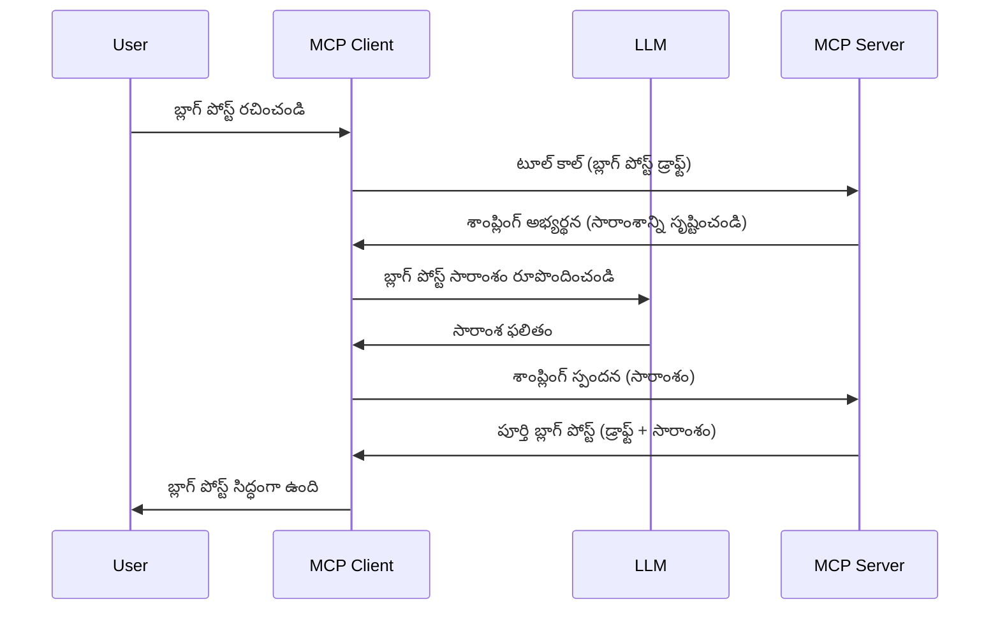

# నమూనా తీసుకోవడం - లక్షణాలను క్లయింట్‌కు పంపించడం

కొన్నిసార్లు, ఒక సాధారణ లక్ష్యాన్ని సాధించేందుకు MCP క్లయింట్ మరియు MCP సర్వర్ కలిసి పని చేయాలి. సర్వర్ క్లయింట్‌లో ఉండే LLM సహాయం అవసరం ఉన్న సందర్భంలో, నమూనా తీసుకోవడం (Sampling) ఉపయోగించాలి.

నమూనా తీసుకోవడం ఘటనలు మరియు దీనిని ఎలా నిర్మించాలో పరిశీలిద్దాం.

## సమీక్ష

ఈ పాఠంలో, నమూనా తీసుకోవడం ఎప్పుడూ, ఎక్కడ ఉపయోగించాలో మరియు దాన్ని ఎలా సెట్ చేయాలో వివరించబడుతుంది.

## అభ్యాస లక్ష్యాలు

ఈ అధ్యాయంలో, మనం:

- నమూనా తీసుకోవడం అంటే ఏమిటి మరియు ఎప్పుడు ఉపయోగించాలో వివరించబోతున్నాము.
- MCPలో నమూనా తీసుకోవడాన్ని ఎలా సెట్ చేయాలో చూపిస్తాము.
- నమూనా తీసుకోవడంలో జరిగే ఉదాహరణలను అందిస్తాము.

## నమూనా తీసుకోవడం అంటే ఏమిటి మరియు దాన్ని ఎందుకు ఉపయోగించాలి?

నమూనా తీసుకోవడం ఒక ప్రగతిశీలమైన ఫీచర్, ఇది ఇలా పనిచేస్తుంది:


### నమూనా అభ్యర్థన

ఓకే, మనకు ఒక విశ్వసనీయ సందర్భం యొక్క పైస్థాయిలో దృష్టి ఉంది, ఇప్పుడు క్లయింట్‌కు సర్వర్ తిరిగి పంపించే నమూనా అభ్యర్థన గురించి మాట్లాడుకుందాం. JSON-RPC ఫార్మాట్‌లో అలాంటిది ఇలా ఉంటుంది:

```json
{
  "jsonrpc": "2.0",
  "id": 1,
  "method": "sampling/createMessage",
  "params": {
    "messages": [
      {
        "role": "user",
        "content": {
          "type": "text",
          "text": "Create a blog post summary of the following blog post: <BLOG POST>"
        }
      }
    ],
    "modelPreferences": {
      "hints": [
        {
          "name": "claude-3-sonnet"
        }
      ],
      "intelligencePriority": 0.8,
      "speedPriority": 0.5
    },
    "systemPrompt": "You are a helpful assistant.",
    "maxTokens": 100
  }
}
```

ఇక్కడ కొన్ని ముఖ్యమైన విషయాలు ఉన్నాయి:

- Prompt, content -> text కింద, మన ప్రాంప్ట్ ఉంది, ఇది LLMకి బ్లాగ్ పోస్టు కోసం సారాంశం తయారుచేయమని సూచన అవుతుంది.

- **modelPreferences**. ఈ భాగం కేవలం ఒక ప్రాధాన్యత, LLM తో ఏ కాన్ఫిగరేషన్ ఉపయోగించాలో సిఫార్సు. వాడుకరి వీటిని తీసుకోవడం లేదా మార్చుకోవడం ఎంచుకోవచ్చు. ఇక్కడ మోడల్, వేగం, బుద్ధి ప్రాధాన్యతలపై సూచనలు ఉన్నాయి.
- **systemPrompt**, ఇది సాధారణ సిస్టమ్ ప్రాంప్ట్, ఇది మీ LLMకి వ్యక్తిత్వాన్ని ఇస్తుంది మరియు మార్గదర్శక సూచనలు కలిగి ఉంటుంది.
- **maxTokens**, ఈ గుణకం, ఈ పని కోసం ఎంత టోకెన్లు ఉపయోగించాలో సూచిస్తుంది.

### నమూనా ప్రతిస్పందన

ఈ ప్రతిస్పందన MCP క్లయింట్ చివర MCP సర్వర్‌కి తిరిగి పంపేది. ఇది క్లయింట్ LLMని కాల్ చేసి, ప్రతిస్పందన కోసం వేచి, ఆ సందేశాన్ని సృష్టించి పంపిన ఫలితం. JSON-RPCలో ఇది ఇలా ఉంటుంది:

```json
{
  "jsonrpc": "2.0",
  "id": 1,
  "result": {
    "role": "assistant",
    "content": {
      "type": "text",
      "text": "Here's your abstract <ABSTRACT>"
    },
    "model": "gpt-5",
    "stopReason": "endTurn"
  }
}
```

ప్రతిస్పందన బ్లాగ్ పోస్ట్ సారాంశం అన్నట్టే ఉందని గమనించండి. అలాగే, మనం అభ్యర్థించిన "claude-3-sonnet" కాదు కానీ "gpt-5" మోడల్ ఉపయోగించడం గమనించండి. ఇది చూపడానికి, వాడుకరి ఎప్పుడు మోడల్ మార్చుకోవచ్చని, నమూనా అభ్యర్థన ఒక సిఫార్సు మాత్రమే అని.

ఓకే, ప్రధాన ప్రవాహం తెలుసుకున్నాం, మరియు దీనిని ఉపయోగించే ఉపయోగకరమైన పని "బ్లాగ్ పోస్ట్ తయారీ + సారాంశం", దాన్ని పని చేయడం కోసం మనం ఏమి చేయాలో చూద్దాం.

### సందేశ రకాలూ

నమూనా సందేశాలు కేవలం టెక్స్ట్ కాదీ, చిత్రాలు, ఆడియో కూడా పంపవచ్చు. JSON-RPC లో ఇలా ఉంటుంది:

**టెక్స్ట్**

```json
{
  "type": "text",
  "text": "The message content"
}
```

**చిత్ర విషయము**

```json
{
  "type": "image",
  "data": "base64-encoded-image-data",
  "mimeType": "image/jpeg"
}
```

**ఆడియో విషయము**

```json
{
  "type": "audio",
  "data": "base64-encoded-audio-data",
  "mimeType": "audio/wav"
}
```

> NOTE: నమూనా తీసుకోవడంపై మరింత వివరాలకు, [అధికారిక డాక్యుమెంట్లు](https://modelcontextprotocol.io/specification/2025-06-18/client/sampling) చూడండి

## క్లయింట్‌లో నమూనా సెట్ చేయడం

> గమనిక: మీరు కేవలం సర్వర్ నిర్మిస్తున్నట్లయితే, ఇక్కడ చాలా చేయాల్సినది లేదు.

క్లయింట్‌లో క్రింది ఫీచర్‌ను ఇలా వివరించాలి:

```json
{
  "capabilities": {
    "sampling": {}
  }
}
```

మీ ఎంపిక చేసిన క్లయింట్ సర్వర్‌తో ప్రారంభించినప్పుడు ఇది స్వయంచాలకంగా ఎంచుకోబడుతుంది.

## నమూనా ఉపయోగంలో ఉదాహరణ - బ్లాగ్ పోస్ట్ తయారీ

చాలా నేరుగా నమూనా సర్వర్ కోడ్ చేద్దాం, దానికి ఇవి చేయాలి:

1. సర్వర్‌పై ఒక టూల్ సృష్టించండి.
2. ఆ టూల్ నమూనా అభ్యర్థనను సృష్టించాలి.
3. టూల్ క్లయింట్ నమూనా అభ్యర్థన సమాధానానికి వేచి ఉండాలి.
4. టూల్ ఫలితం తయారవ్వాలి.

కోడ్ దశలవారీగా చూద్దాం:

### -1- టూల్ సృష్టించండి

**python**

```python
@mcp.tool()
async def create_blog(title: str, content: str, ctx: Context[ServerSession, None]) -> str:
    """Create a blog post and generate a summary"""

```

### -2- నమూనా అభ్యర్థన సృష్టించండి

మీ టూల్‌ను ఈ కోడ్‌తో విస్తరించండి:

**python**

```python
post = BlogPost(
        id=len(posts) + 1,
        title=title,
        content=content,
        abstract=""
    )

prompt = f"Create an abstract of the following blog post: title: {title} and draft: {content} "

result = await ctx.session.create_message(
        messages=[
            SamplingMessage(
                role="user",
                content=TextContent(type="text", text=prompt),
            )
        ],
        max_tokens=100,
)

```

### -3- సమాధానం కోసం వేచి ఉండి, ప్రతిస్పందన ఇవ్వండి

**python**

```python
post.abstract = result.content.text

posts.append(post)

# పూర్తి ఉత్పత్తిని తిరిగి ఇవ్వండి
return json.dumps({
    "id": post.title,
    "abstract": post.abstract
})
```

### -4- పూర్తి కోడ్

**python**

```python
from starlette.applications import Starlette
from starlette.routing import Mount, Host

from mcp.server.fastmcp import Context, FastMCP

from mcp.server.session import ServerSession
from mcp.types import SamplingMessage, TextContent

import json


from uuid import uuid4
from typing import List
from pydantic import BaseModel


mcp = FastMCP("Blog post generator")

# app = FastAPI()

posts = []

class BlogPost(BaseModel):
    id: int
    title: str
    content: str
    abstract: str

posts: List[BlogPost] = []

@mcp.tool()
async def create_blog(title: str, content: str, ctx: Context[ServerSession, None]) -> str:
    """Create a blog post and generate a summary"""

    post = BlogPost(
        id=len(posts) + 1,
        title=title,
        content=content,
        abstract=""
    )

    prompt = f"Create an abstract of the following blog post: title: {title} and draft: {content} "

    result = await ctx.session.create_message(
        messages=[
            SamplingMessage(
                role="user",
                content=TextContent(type="text", text=prompt),
            )
        ],
        max_tokens=100,
    )

    post.abstract = result.content.text

    posts.append(post)

    # పూర్తి బ్లాగ్ పోస్ట్‌ను రిటర్న్ చేయండి
    return json.dumps({
        "id": post.title,
        "abstract": post.abstract
    })

if __name__ == "__main__":
    print("Starting server...")
    # mcp.run()
    mcp.run(transport="streamable-http")

# యాప్ ను నడపండి: python server.py
```

### -5- Visual Studio Code లో పరీక్షించడం

Visual Studio Code లో దీన్ని పరీక్షించేందుకు:

1. టెర్మినల్‌లో సర్వర్ ప్రారంభించండి
2. *mcp.json* లో సర్వర్ ను జోడించండి (మరియు అది ప్రారంభించబడింది అని ధృవీకరించండి), దీనిలాగా:

   ```json
   "servers": {
      "blog-server": {
        "type": "http",
        "url": "http://localhost:8000/mcp"
      }
   }
   ```

3. ఒక ప్రాంప్ట్ టైప్ చేయండి:

   ```text
   create a blog post named "Where Python comes from", the content is "Python is actually named after Monty Python Flying Circus"
   ```

4. నమూనా జరుగుతుందని అనుమతించండి. మొదటిసారిగా పరీక్షించే సమయంలో మీకు అదనపు డైఅలాగ్ వస్తుంది, దాన్ని అంగీకరించాలి, తర్వాత సాధారణ టూల్ అమలు ఇస్తాయి.

5. ఫలితాలు పరిశీలించండి. GitHub Copilot Chat లో ఫలితాలు బాగా చూపుతాయి, అలాగే రా JSON ప్రతిస్పందనను కూడా పరిశీలించవచ్చు.

**బోనస్**. Visual Studio Code టూలింగ్, నమూనా తీసుకోవడాన్ని బాగు మద్దతు ఇస్తుంది. మీరు ఇన్స్టాల్ చేసిన సర్వర్‌లో నమూనా యాక్సెస్‌ను ఇలా సెట్ చేసుకోవచ్చు:

1. విస్తరణల విభాగానికి వెళ్లండి.
2. "MCP SERVERS - INSTALLED" సెక్టోర్లో మీ ఇన్స్టాల్ సర్వర్ కు కాగ్ చిహ్నాన్ని ఎంచుకోండి.
3. "Configure Model Access" ను ఎంచుకోండి, ఇక్కడ మీరు GitHub Copilot నమూనా తీసుకునేటప్పుడు ఉపయోగించే మోడల్స్ ఎంచుకోవచ్చు. అలాగే "Show Sampling requests" ఎంచుకొని గతివారపు నమూనా అభ్యర్థనలను చూడవచ్చు.

## అస్సైన్‌మెంట్

ఈ అస్సైన్‌మెంట్‌లో, మీరు కొంచెం వేరుగా నమూనా ఏర్పాటును బిల్డ్ చేయాలి, అందులో ఒక నమూనా ఇంటిగ్రేషన్ ఉంది, ఇది ఉత్పత్తి వివరణ తయారీలో సాయం చేస్తుంది. మీ సన్నివేశం ఇలా ఉంది:

**సన్నివేశం**: ఈ-కామర్స్ బ్యాక్ ఆఫీసు వర్కర్‌కు ఉత్పత్తి వివరణ తయారీ బ్రోకిందంత సమయం పడుతుంది. కాబట్టి, మీరు "create_product" అనే టూల్‌ని "title" మరియు "keywords" ఆర్గ్యుమెంట్లతో పిలవాలి, ఇది పూర్తి ఉత్పత్తిని, "description" ఫీల్డ్ సహా, క్లయింట్ LLM ద్వారా పూరించి తయారు చేయాలి.

TIP: మీరు ముందుగా నేర్చుకున్నట్లుగా ఈ సర్వర్ మరియు టూల్‌ను నమూనా అభ్యర్థనతో ఎలా నిర్మించాలో ఉపయోగించండి.

## పరిష్కారం

[పరిష్కారం](./solution/README.md)

## ముఖ్యమైన సంగతులు

నమూనా తీసుకోవడం ఒక శక్తివంతమైన ఫీచర్, ఇది సర్వర్ LLM సహాయం అవసరం ఉన్నప్పుడు పనులు క్లయింట్‌కు బదిలీ చేయవచ్చును.

## తరువాతి దశ

- [అధ్యాయం 4 - వ్యావహారిక అమలు](../../04-PracticalImplementation/README.md)

---

<!-- CO-OP TRANSLATOR DISCLAIMER START -->
**నిరేకరణ**:  
ఈ పత్రాన్ని AI అనువాద సేవ [Co-op Translator](https://github.com/Azure/co-op-translator) ఉపయోగించి అనువదించబడింది. మేము పరిగణించే మనది ఖచ్చితత్వం కోసం ప్రయత్నించినప్పటికీ, ఆటోమేటెడ్ అనువాదాల్లో పొరపాట్లు లేదా లోపాలు ఉండవచ్చును. మూల పత్రం స్వదేశీ భాషలో ఉన్నది అధికారిక మూలంగా పరిగణించాలి. ముఖ్యమైన సమాచారం కోసం, నిపుణుల చేతి అనువాదం సిఫార్సు చేసబడుతుంది. ఈ అనువాదం ఉపయోగం ద్వారా ఆయా తప్పుదోవలు లేదా తప్పుడు అర్థం చేసుకోవడంపై మేము బాధ్యత వహించము.
<!-- CO-OP TRANSLATOR DISCLAIMER END -->