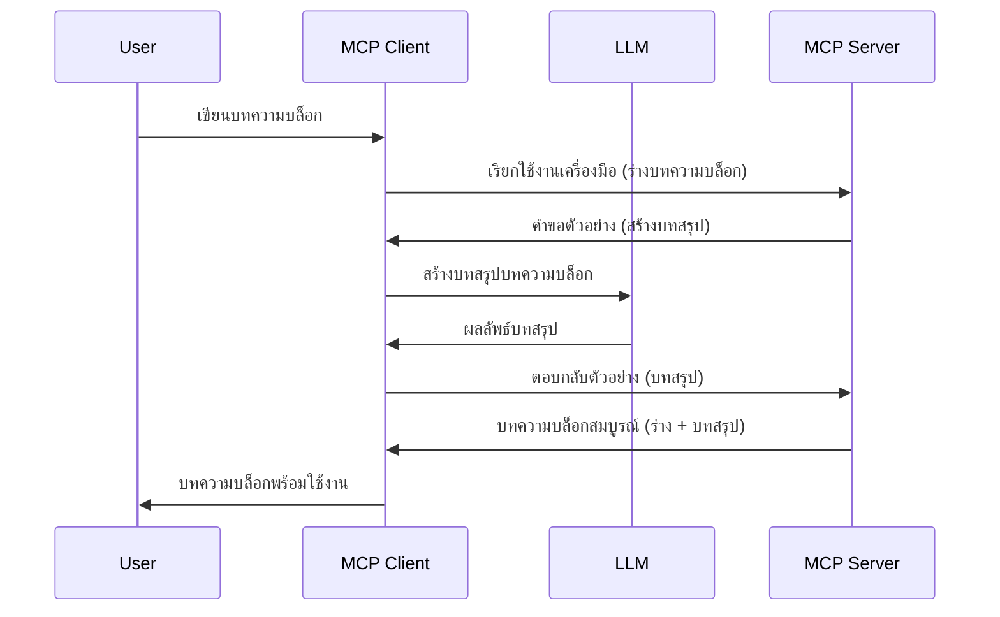

# Sampling - มอบหมายฟีเจอร์ให้กับ Client

บางครั้ง คุณอาจจำเป็นต้องให้ MCP Client และ MCP Server ร่วมมือกันเพื่อบรรลุเป้าหมายร่วมกัน คุณอาจมีกรณีที่ Server ต้องการความช่วยเหลือจาก LLM ที่อยู่บน client สำหรับสถานการณ์นี้ sampling คือสิ่งที่คุณควรใช้

เรามาลองสำรวจกรณีการใช้งานบางอย่างและวิธีสร้างโซลูชันที่เกี่ยวข้องกับ sampling กัน

## ภาพรวม

ในบทเรียนนี้ เราจะเน้นอธิบายว่าเมื่อไหร่และที่ไหนควรใช้ Sampling และวิธีการตั้งค่า

## วัตถุประสงค์การเรียนรู้

ในบทนี้ เราจะ:

- อธิบายว่า Sampling คืออะไรและเมื่อไหร่ควรใช้
- แสดงวิธีตั้งค่า Sampling ใน MCP
- ยกตัวอย่าง Sampling ในการใช้งานจริง

## Sampling คืออะไรและทำไมต้องใช้?

Sampling เป็นฟีเจอร์ขั้นสูงที่ทำงานในลักษณะดังนี้:


### คำร้องขอ Sampling

โอเค ตอนนี้เรามีภาพรวมแบบกว้างของสถานการณ์ที่เชื่อถือได้แล้ว มาดูกันว่าคำร้องขอ sampling ที่ server ส่งกลับไปยัง client จะเป็นอย่างไร นี่คือลักษณะคำร้องในรูปแบบ JSON-RPC:

```json
{
  "jsonrpc": "2.0",
  "id": 1,
  "method": "sampling/createMessage",
  "params": {
    "messages": [
      {
        "role": "user",
        "content": {
          "type": "text",
          "text": "Create a blog post summary of the following blog post: <BLOG POST>"
        }
      }
    ],
    "modelPreferences": {
      "hints": [
        {
          "name": "claude-3-sonnet"
        }
      ],
      "intelligencePriority": 0.8,
      "speedPriority": 0.5
    },
    "systemPrompt": "You are a helpful assistant.",
    "maxTokens": 100
  }
}
```

มีบางส่วนที่ควรกล่าวถึง:

- Prompt ภายใต้ content -> text คือ prompt ของเรา ซึ่งเป็นคำสั่งสำหรับ LLM ให้สรุปเนื้อหาบทความบล็อก

- **modelPreferences**. ส่วนนี้เป็นเพียงความชอบ การแนะนำการตั้งค่าที่จะใช้กับ LLM ผู้ใช้สามารถเลือกว่าจะไปตามคำแนะนำนี้หรือเปลี่ยนแปลง ในกรณีนี้มีคำแนะนำเกี่ยวกับโมเดลที่จะใช้และลำดับความสำคัญของความเร็วและความฉลาด
- **systemPrompt** นี่คือ prompt ระบบทั่วไปที่ให้ LLM ของคุณมีบุคลิกและมีคำแนะนำภายใน
- **maxTokens** นี่คือคุณสมบัติอีกอย่างที่ใช้เพื่อบอกว่าควรใช้จำนวน tokens เท่าไรสำหรับงานนี้

### การตอบกลับ Sampling

การตอบกลับนี้เป็นสิ่งที่ MCP Client ส่งกลับไปยัง MCP Server และเป็นผลลัพธ์จากการที่ client เรียกใช้ LLM รอคำตอบ และสร้างข้อความนี้ขึ้นมา นี่คือลักษณะใน JSON-RPC:

```json
{
  "jsonrpc": "2.0",
  "id": 1,
  "result": {
    "role": "assistant",
    "content": {
      "type": "text",
      "text": "Here's your abstract <ABSTRACT>"
    },
    "model": "gpt-5",
    "stopReason": "endTurn"
  }
}
```

สังเกตว่าการตอบกลับเป็นบทคัดย่อของบทความบล็อกตามที่เราขอ และสังเกตว่า model ที่ใช้ไม่ใช่สิ่งที่เราขอแต่เป็น "gpt-5" แทน "claude-3-sonnet" ซึ่งแสดงให้เห็นว่าผู้ใช้สามารถเปลี่ยนใจได้ว่าต้องการใช้โมเดลไหนและคำร้องขอ sampling ของคุณเป็นเพียงคำแนะนำเท่านั้น

โอเค ตอนนี้ที่เราเข้าใจกระบวนการหลักและงานที่เหมาะสมเช่น "สร้างบทความบล็อก + บทคัดย่อ" แล้ว มาดูกันว่าต้องทำอะไรบ้างเพื่อให้มันทำงานได้

### ประเภทของข้อความ

ข้อความ sampling ไม่ได้จำกัดแค่ข้อความเท่านั้น แต่คุณยังสามารถส่งภาพและเสียงได้ด้วย นี่คือลักษณะ JSON-RPC ที่แตกต่างกัน:

**ข้อความ**

```json
{
  "type": "text",
  "text": "The message content"
}
```

**เนื้อหาภาพ**

```json
{
  "type": "image",
  "data": "base64-encoded-image-data",
  "mimeType": "image/jpeg"
}
```

**เนื้อหาเสียง**

```json
{
  "type": "audio",
  "data": "base64-encoded-audio-data",
  "mimeType": "audio/wav"
}
```

> NOTE: สำหรับข้อมูลเพิ่มเติมเกี่ยวกับ Sampling โปรดดูที่ [เอกสารทางการ](https://modelcontextprotocol.io/specification/2025-06-18/client/sampling)

## วิธีการตั้งค่า Sampling ใน Client

> หมายเหตุ: หากคุณกำลังสร้างเฉพาะ server เท่านั้น คุณไม่จำเป็นต้องทำอะไรเยอะที่นี่

ใน client คุณต้องระบุฟีเจอร์ต่อไปนี้ดังนี้:

```json
{
  "capabilities": {
    "sampling": {}
  }
}
```

จากนั้นฟีเจอร์นี้จะถูกดึงมาใช้เมื่อ client ที่คุณเลือกเริ่มทำงานกับ server

## ตัวอย่างการใช้งาน Sampling - สร้างบทความบล็อก

มาร่วมกันเขียน sampling server โดยเราต้องทำดังนี้:

1. สร้างเครื่องมือบน Server
1. เครื่องมือนั้นควรสร้างคำร้องขอ sampling
1. เครื่องมือต้องรอคำร้องขอ sampling ของ client ตอบกลับ
1. จากนั้นเครื่องมือควรสร้างผลลัพธ์

มาดูโค้ดทีละขั้นตอน:

### -1- สร้างเครื่องมือ

**python**

```python
@mcp.tool()
async def create_blog(title: str, content: str, ctx: Context[ServerSession, None]) -> str:
    """Create a blog post and generate a summary"""

```

### -2- สร้างคำร้องขอ sampling

ขยายเครื่องมือของคุณด้วยโค้ดดังนี้:

**python**

```python
post = BlogPost(
        id=len(posts) + 1,
        title=title,
        content=content,
        abstract=""
    )

prompt = f"Create an abstract of the following blog post: title: {title} and draft: {content} "

result = await ctx.session.create_message(
        messages=[
            SamplingMessage(
                role="user",
                content=TextContent(type="text", text=prompt),
            )
        ],
        max_tokens=100,
)

```

### -3- รอการตอบกลับและคืนค่าผลลัพธ์

**python**

```python
post.abstract = result.content.text

posts.append(post)

# ส่งคืนผลิตภัณฑ์ที่สมบูรณ์
return json.dumps({
    "id": post.title,
    "abstract": post.abstract
})
```

### -4- โค้ดแบบเต็ม

**python**

```python
from starlette.applications import Starlette
from starlette.routing import Mount, Host

from mcp.server.fastmcp import Context, FastMCP

from mcp.server.session import ServerSession
from mcp.types import SamplingMessage, TextContent

import json


from uuid import uuid4
from typing import List
from pydantic import BaseModel


mcp = FastMCP("Blog post generator")

# app = FastAPI()

posts = []

class BlogPost(BaseModel):
    id: int
    title: str
    content: str
    abstract: str

posts: List[BlogPost] = []

@mcp.tool()
async def create_blog(title: str, content: str, ctx: Context[ServerSession, None]) -> str:
    """Create a blog post and generate a summary"""

    post = BlogPost(
        id=len(posts) + 1,
        title=title,
        content=content,
        abstract=""
    )

    prompt = f"Create an abstract of the following blog post: title: {title} and draft: {content} "

    result = await ctx.session.create_message(
        messages=[
            SamplingMessage(
                role="user",
                content=TextContent(type="text", text=prompt),
            )
        ],
        max_tokens=100,
    )

    post.abstract = result.content.text

    posts.append(post)

    # ส่งกลับบทความบล็อกฉบับสมบูรณ์
    return json.dumps({
        "id": post.title,
        "abstract": post.abstract
    })

if __name__ == "__main__":
    print("Starting server...")
    # mcp.run()
    mcp.run(transport="streamable-http")

# รันแอปด้วยคำสั่ง: python server.py
```

### -5- การทดสอบใน Visual Studio Code

เพื่อทดสอบใน Visual Studio Code ให้ทำตามนี้:

1. เริ่ม server ในเทอร์มินัล
1. เพิ่มลงใน *mcp.json* (และตรวจสอบให้แน่ใจว่า server เริ่มทำงานแล้ว) เช่น:

   ```json
   "servers": {
      "blog-server": {
        "type": "http",
        "url": "http://localhost:8000/mcp"
      }
   }
   ```

1. พิมพ์ prompt:

   ```text
   create a blog post named "Where Python comes from", the content is "Python is actually named after Monty Python Flying Circus"
   ```

1. อนุญาตให้ sampling ทำงาน ครั้งแรกที่คุณทดสอบ จะมีไดอะล็อกเพิ่มเติมให้คุณต้องยอมรับ จากนั้นคุณจะเห็นไดอะล็อกปกติสำหรับขอให้รันเครื่องมือ

1. ตรวจสอบผลลัพธ์ คุณจะเห็นผลลัพธ์ที่แสดงสวยงามใน GitHub Copilot Chat และสามารถตรวจสอบการตอบกลับ JSON ดิบได้ด้วย

**โบนัส**. เครื่องมือใน Visual Studio Code สนับสนุน sampling อย่างดี คุณสามารถตั้งค่าการเข้าถึง Sampling บน server ที่ติดตั้งโดยการทำดังนี้:

1. ไปที่ส่วน extension
1. เลือกไอคอนฟันเฟืองของ server ที่ติดตั้งในส่วน "MCP SERVERS - INSTALLED"
1 เลือก "Configure Model Access" ที่นี่คุณสามารถเลือกโมเดลที่ GitHub Copilot สามารถใช้เมื่อทำ sampling ได้ คุณยังสามารถดูคำร้องขอ sampling ที่เกิดขึ้นล่าสุดโดยเลือก "Show Sampling requests"

## แบบฝึกหัด

ในการบ้านนี้ คุณจะสร้าง Sampling ประเภทที่แตกต่างเล็กน้อย คือการผสาน sampling ที่รองรับการสร้างคำอธิบายสินค้า นี่คือสถานการณ์ของคุณ:

**สถานการณ์**: พนักงานหลังบ้านของอีคอมเมิร์ซต้องการความช่วยเหลือ ใช้เวลานานเกินไปในการสร้างคำอธิบายสินค้า ดังนั้นคุณต้องสร้างโซลูชันที่เรียกใช้เครื่องมือ "create_product" โดยมี "title" และ "keywords" เป็นอาร์กิวเมนต์ และควรผลิตสินค้าที่สมบูรณ์รวมถึงช่อง "description" ที่ควรถูกเติมเต็มโดย LLM บน client

TIP: ใช้สิ่งที่คุณเรียนรู้ก่อนหน้านี้เกี่ยวกับการสร้าง server และเครื่องมือโดยใช้คำร้องขอ sampling

## โซลูชัน

[Solution](./solution/README.md)

## ประเด็นสำคัญ

Sampling เป็นฟีเจอร์ทรงพลังที่ช่วยให้ server มอบหมายงานให้ client ได้เมื่อจำเป็นต้องใช้ความช่วยเหลือจาก LLM

## ข้อถัดไป

- [บทที่ 4 - การใช้งานเชิงปฏิบัติ](../../04-PracticalImplementation/README.md)

---

<!-- CO-OP TRANSLATOR DISCLAIMER START -->
**ข้อจำกัดความรับผิดชอบ**:
เอกสารนี้ได้รับการแปลโดยใช้บริการแปลภาษาอัตโนมัติ [Co-op Translator](https://github.com/Azure/co-op-translator) แม้เราจะพยายามให้มีความถูกต้อง แต่กรุณาโปรดทราบว่าการแปลอัตโนมัติอาจมีข้อผิดพลาดหรือความไม่ถูกต้อง เอกสารต้นฉบับในภาษาดั้งเดิมควรถือเป็นแหล่งข้อมูลที่เชื่อถือได้ สำหรับข้อมูลที่สำคัญ แนะนำให้ใช้บริการแปลโดยมืออาชีพที่เป็นมนุษย์ เราไม่รับผิดชอบต่อความเข้าใจผิดหรือการตีความผิดที่เกิดขึ้นจากการใช้การแปลนี้
<!-- CO-OP TRANSLATOR DISCLAIMER END -->