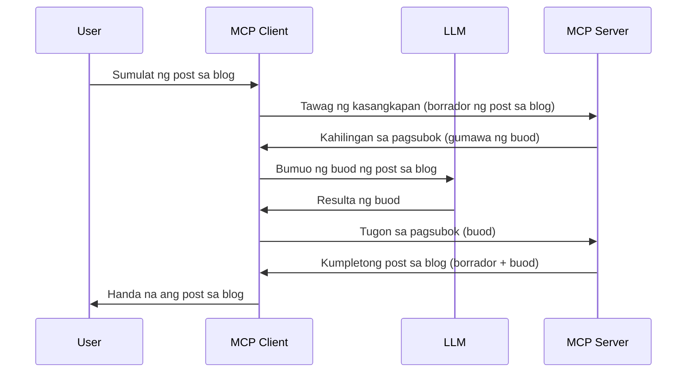

# Sampling - idelegate ang mga tampok sa Kliyente

Minsan, kailangan ng MCP Client at MCP Server na mag-collaborate upang makamit ang isang karaniwang layunin. Maaring magkaroon ka ng sitwasyon kung saan nangangailangan ang Server ng tulong mula sa isang LLM na nasa kliyente. Para sa sitwasyong ito, sampling ang dapat mong gamitin.

Tuklasin natin ang ilang mga kaso ng paggamit at kung paano bumuo ng solusyon na may kinalaman sa sampling.

## Pangkalahatang-ideya

Sa araling ito, tututok tayo sa pagpapaliwanag kung kailan at saan gagamitin ang Sampling at kung paano ito i-configure.

## Mga Layunin sa Pagkatuto

Sa kabanatang ito, ating gagawin ang mga sumusunod:

- Ipaliwanag kung ano ang Sampling at kailan ito gagamitin.
- Ipakita kung paano i-configure ang Sampling sa MCP.
- Magbigay ng mga halimbawa ng Sampling sa aksyon.

## Ano ang Sampling at bakit ito gamitin?

Ang Sampling ay isang advanced na tampok na gumagana sa sumusunod na paraan:


### Sampling request

Ok, ngayon ay mayroon na tayong pangkalahatang ideya ng isang makatotohanang senaryo, pag-usapan naman natin ang sampling request na ipinapadala ng server pabalik sa kliyente. Ganito ang hitsura ng ganitong request sa format na JSON-RPC:

```json
{
  "jsonrpc": "2.0",
  "id": 1,
  "method": "sampling/createMessage",
  "params": {
    "messages": [
      {
        "role": "user",
        "content": {
          "type": "text",
          "text": "Create a blog post summary of the following blog post: <BLOG POST>"
        }
      }
    ],
    "modelPreferences": {
      "hints": [
        {
          "name": "claude-3-sonnet"
        }
      ],
      "intelligencePriority": 0.8,
      "speedPriority": 0.5
    },
    "systemPrompt": "You are a helpful assistant.",
    "maxTokens": 100
  }
}
```

May ilang bagay dito na dapat pansinin:

- Ang Prompt, sa ilalim ng content -> text, ay ang ating prompt na isang tagubilin para sa LLM upang i-summarize ang nilalaman ng blog post.

- **modelPreferences**. Ang seksyong ito ay preference lamang, isang rekomendasyon kung anong konfigurasyon ang gagamitin sa LLM. Maaaring pumili ang user kung susundin ba ang mga rekomendasyong ito o babaguhin ang mga ito. Sa kasong ito, may mga rekomendasyon tungkol sa modelong gagamitin pati na rin ang prayoridad sa bilis at katalinuhan.
- **systemPrompt**, ito ang iyong normal na system prompt na nagbibigay personalidad sa iyong LLM at naglalaman ng mga tagubilin para sa patnubay.
- **maxTokens**, ito ay isa pang property na ginagamit para tukuyin kung gaano karaming tokens ang inirerekomendang gamitin para sa gawaing ito.

### Sampling response

Ang tugon na ito ang ipinapadala ng MCP Client pabalik sa MCP Server bilang resulta ng pagtawag ng kliyente sa LLM, paghihintay ng tugon at pagkatapos ay pagbuo ng mensaheng ito. Ganito ang itsura nito sa JSON-RPC:

```json
{
  "jsonrpc": "2.0",
  "id": 1,
  "result": {
    "role": "assistant",
    "content": {
      "type": "text",
      "text": "Here's your abstract <ABSTRACT>"
    },
    "model": "gpt-5",
    "stopReason": "endTurn"
  }
}
```

Pansinin kung paano ang tugon ay isang abstrak ng blog post tulad ng hinihiling natin. Pansinin din kung paano ang ginamit na `model` ay hindi ang ating hinihingi kundi "gpt-5" imbes na "claude-3-sonnet". Ito ay upang ipakita na maaaring magbago ng isip ang user sa gagamitin at ang iyong sampling request ay isang rekomendasyon lamang.

Ok, ngayon na naintindihan natin ang pangunahing daloy, at ang kapaki-pakinabang na gawain para dito ay "paglikha ng blog post + abstract", tingnan natin kung ano ang kailangan nating gawin para gumana ito.

### Mga uri ng mensahe

Ang mga mensahe sa sampling ay hindi lamang limitado sa teksto kundi maaari ka ring magpadala ng mga larawan at audio. Ganito ang kaibahan sa itsura ng JSON-RPC:

**Teksto**

```json
{
  "type": "text",
  "text": "The message content"
}
```

**Nilalaman ng larawan**

```json
{
  "type": "image",
  "data": "base64-encoded-image-data",
  "mimeType": "image/jpeg"
}
```

**Nilalaman ng audio**

```json
{
  "type": "audio",
  "data": "base64-encoded-audio-data",
  "mimeType": "audio/wav"
}
```

> NOTE: para sa mas detalyadong impormasyon tungkol sa Sampling, tingnan ang [opisyal na dokumentasyon](https://modelcontextprotocol.io/specification/2025-06-18/client/sampling)

## Paano I-configure ang Sampling sa Kliyente

> Tandaan: kung server lang ang iyong ginagawa, hindi mo na kailangang gawin ang karamihan dito.

Sa isang kliyente, kailangan mong tukuyin ang sumusunod na tampok tulad nito:

```json
{
  "capabilities": {
    "sampling": {}
  }
}
```

Ito ay kukunin kapag na-initialize ang iyong piniling kliyente sa server.

## Halimbawa ng Sampling sa Aksyon - Gumawa ng Blog Post

Gumawa tayo ng sampling server nang magkasama, kailangan nating gawin ang mga sumusunod:

1. Gumawa ng tool sa Server.
1. Ang tool na iyon ay dapat gumawa ng sampling request.
1. Hintaying masagot ang sampling request ng kliyente.
1. Pagkatapos ay ang resulta ng tool ay dapat iproseso.

Tingnan natin ang code nang hakbang-hakbang:

### -1- Gumawa ng tool

**python**

```python
@mcp.tool()
async def create_blog(title: str, content: str, ctx: Context[ServerSession, None]) -> str:
    """Create a blog post and generate a summary"""

```

### -2- Gumawa ng sampling request

Palawakin ang iyong tool gamit ang sumusunod na code:

**python**

```python
post = BlogPost(
        id=len(posts) + 1,
        title=title,
        content=content,
        abstract=""
    )

prompt = f"Create an abstract of the following blog post: title: {title} and draft: {content} "

result = await ctx.session.create_message(
        messages=[
            SamplingMessage(
                role="user",
                content=TextContent(type="text", text=prompt),
            )
        ],
        max_tokens=100,
)

```

### -3- Hintayin ang tugon at ibalik ito

**python**

```python
post.abstract = result.content.text

posts.append(post)

# ibalik ang buong produkto
return json.dumps({
    "id": post.title,
    "abstract": post.abstract
})
```

### -4- Buong code

**python**

```python
from starlette.applications import Starlette
from starlette.routing import Mount, Host

from mcp.server.fastmcp import Context, FastMCP

from mcp.server.session import ServerSession
from mcp.types import SamplingMessage, TextContent

import json


from uuid import uuid4
from typing import List
from pydantic import BaseModel


mcp = FastMCP("Blog post generator")

# app = FastAPI()

posts = []

class BlogPost(BaseModel):
    id: int
    title: str
    content: str
    abstract: str

posts: List[BlogPost] = []

@mcp.tool()
async def create_blog(title: str, content: str, ctx: Context[ServerSession, None]) -> str:
    """Create a blog post and generate a summary"""

    post = BlogPost(
        id=len(posts) + 1,
        title=title,
        content=content,
        abstract=""
    )

    prompt = f"Create an abstract of the following blog post: title: {title} and draft: {content} "

    result = await ctx.session.create_message(
        messages=[
            SamplingMessage(
                role="user",
                content=TextContent(type="text", text=prompt),
            )
        ],
        max_tokens=100,
    )

    post.abstract = result.content.text

    posts.append(post)

    # ibalik ang buong post ng blog
    return json.dumps({
        "id": post.title,
        "abstract": post.abstract
    })

if __name__ == "__main__":
    print("Starting server...")
    # mcp.run()
    mcp.run(transport="streamable-http")

# patakbuhin ang app gamit ang: python server.py
```

### -5- Pagsubok nito sa Visual Studio Code

Upang subukan ito sa Visual Studio Code, gawin ang mga sumusunod:

1. Patakbuhin ang server sa terminal
1. Idagdag ito sa *mcp.json* (at siguraduhing ito ay tumatakbo) halimbawang ganito:

   ```json
   "servers": {
      "blog-server": {
        "type": "http",
        "url": "http://localhost:8000/mcp"
      }
   }
   ```

1. Mag-type ng prompt:

   ```text
   create a blog post named "Where Python comes from", the content is "Python is actually named after Monty Python Flying Circus"
   ```

1. Hayaan ang sampling na mangyari. Sa unang pagsubok mo nito, ipapakita sa iyo ang isang dialogong kailangan mong tanggapin, pagkatapos ay makikita mo ang normal na dialog para hilingin na patakbuhin ang isang tool.

1. Suriin ang mga resulta. Makikita mo ang mga resulta na maayos na na-render sa GitHub Copilot Chat ngunit maaari mo ring suriin ang raw na JSON response.

**Bonus**. Ang Visual Studio Code tooling ay may mahusay na suporta para sa sampling. Maaari mong i-configure ang Sampling access sa iyong naka-install na server sa pamamagitan ng pag-navigate nito tulad nito:

1. Pumunta sa seksyon ng mga extension.
1. Piliin ang cog icon para sa naka-install mong server sa seksyong "MCP SERVERS - INSTALLED".
1. Piliin ang "Configure Model Access", dito maaari mong piliin kung anong mga Modelo ang pahihintulutan ng GitHub Copilot na gamitin kapag gumagawa ng sampling. Makikita mo rin ang lahat ng sampling requests na nangyari kamakailan sa pamamagitan ng pagpili ng "Show Sampling requests".

## Takdang-Aralin

Sa takdang-aralin na ito, gagawa ka ng bahagyang ibang Sampling, isang sampling integration na sumusuporta sa pag-generate ng product description. Narito ang iyong senaryo:

**Senaryo**: Ang taga-back office ng isang e-commerce ay nangangailangan ng tulong, masyadong matagal ang pag-generate ng mga product descriptions. Kaya, gagawa ka ng solusyon kung saan tatawagin mo ang tool na "create_product" na may argumentong "title" at "keywords" at dapat mag-produce ito ng kompletong produkto kabilang ang "description" na patlang na popunan ng LLM ng kliyente.

TIP: gamitin ang mga natutunan mo kanina kung paano magbuo ng server at tool gamit ang sampling request.

## Solusyon

[Solusyon](./solution/README.md)

## Pangunahing Mga Aral

Ang Sampling ay isang makapangyarihang tampok na nagpapahintulot sa server na idelegate ang mga gawain sa kliyente kapag kailangan nito ang tulong ng isang LLM.

## Ano ang Susunod

- [Kabanata 4 - Praktikal na implementasyon](../../04-PracticalImplementation/README.md)

---

<!-- CO-OP TRANSLATOR DISCLAIMER START -->
**Paunawa**:  
Ang dokumentong ito ay isinalin gamit ang AI translation service na [Co-op Translator](https://github.com/Azure/co-op-translator). Bagamat nagsusumikap kami para sa katumpakan, pakatandaan na ang mga awtomatikong salin ay maaaring maglaman ng mga pagkakamali o hindi tumpak na impormasyon. Ang orihinal na dokumento sa orihinal nitong wika ang dapat ituring na pangunahing sanggunian. Para sa mahahalagang impormasyon, inirerekomenda ang propesyonal na pagsasalin ng tao. Hindi kami mananagot sa anumang hindi pagkakaintindihan o maling interpretasyon na maaaring magmula sa paggamit ng salin na ito.
<!-- CO-OP TRANSLATOR DISCLAIMER END -->