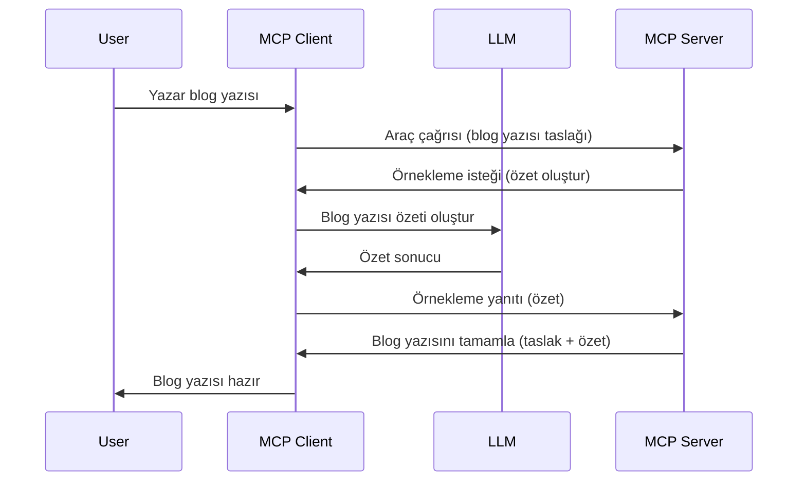

# Örnekleme - Özellikleri İstemciye Devretme

Bazen MCP İstemcisi ve MCP Sunucusu ortak bir hedefe ulaşmak için iş birliği yapmalıdır. Sunucunun, istemcide bulunan bir LLM'in yardımına ihtiyaç duyduğu durumlar olabilir. Böyle durumlarda, kullanmanız gereken şey örneklemedir.

Bazı kullanım durumlarını ve örnekleme içeren bir çözümün nasıl inşa edileceğini keşfedelim.

## Genel Bakış

Bu derste, örneklemenin ne zaman ve nerede kullanılacağını ve nasıl yapılandırılacağını açıklamaya odaklanacağız.

## Öğrenme Hedefleri

Bu bölümde şunları yapacağız:

- Örneklemenin ne olduğunu ve ne zaman kullanılması gerektiğini açıklayacağız.
- MCP'de Örneklemenin nasıl yapılandırılacağını göstereceğiz.
- Örneklemenin uygulamadaki örneklerini vereceğiz.

## Örnekleme nedir ve neden kullanılır?

Örnekleme, şu şekilde çalışan gelişmiş bir özelliktir:


### Örnekleme isteği

Tamam, şimdi gerçekçi bir senaryoyu kuşbakışı gördüğümüze göre, sunucunun istemciye geri gönderdiği örnekleme isteğinden bahsedelim. Böyle bir isteğin JSON-RPC formatında nasıl görünebileceğine bakalım:

```json
{
  "jsonrpc": "2.0",
  "id": 1,
  "method": "sampling/createMessage",
  "params": {
    "messages": [
      {
        "role": "user",
        "content": {
          "type": "text",
          "text": "Create a blog post summary of the following blog post: <BLOG POST>"
        }
      }
    ],
    "modelPreferences": {
      "hints": [
        {
          "name": "claude-3-sonnet"
        }
      ],
      "intelligencePriority": 0.8,
      "speedPriority": 0.5
    },
    "systemPrompt": "You are a helpful assistant.",
    "maxTokens": 100
  }
}
```

Burada vurgulanması gereken birkaç nokta var:

- İçerik -> metin altındaki İstek (Prompt), LLM'in blog yazısı içeriğini özetlemesi için bir talimattır.

- **modelPreferences**. Bu bölüm sadece bir tercihtir, LLM ile hangi yapılandırmanın kullanılacağına dair bir öneridir. Kullanıcı bu önerilere uyabilir veya değiştirebilir. Bu durumda, kullanılacak model, hız ve zeka önceliği için öneriler bulunmaktadır.
- **systemPrompt**, bu sizin normal sistem isteminizdir; LLM'inize bir kişilik verir ve rehberlik talimatlarını içerir.
- **maxTokens**, bu görevde kaç token kullanılmasının önerildiğini belirten başka bir özelliktir.

### Örnekleme yanıtı

Bu yanıt, MCP İstemcisinin MCP Sunucusuna geri gönderdiği yanıttır ve istemcinin LLM'i çağırması, yanıtı beklemesi ve ardından bu mesajı oluşturmasının sonucudur. JSON-RPC formatında şöyle görünebilir:

```json
{
  "jsonrpc": "2.0",
  "id": 1,
  "result": {
    "role": "assistant",
    "content": {
      "type": "text",
      "text": "Here's your abstract <ABSTRACT>"
    },
    "model": "gpt-5",
    "stopReason": "endTurn"
  }
}
```

Yanıtın, blog yazısının özetini tam olarak istediğimiz gibi sunduğuna dikkat edin. Ayrıca kullanılan `model`'in isteğimiz model değil, "claude-3-sonnet" yerine "gpt-5" olduğunu da fark edin. Bu, kullanıcının kullanacağı modeli değiştirebileceğini ve örnekleme isteğinizin bir öneri olduğunu göstermek içindir.

Tamam, ana akışı ve kullanışlı görevi ("blog yazısı oluşturma + özet") anladığımıza göre, çalışması için yapmamız gerekenlere bakalım.

### Mesaj türleri

Örnekleme mesajları sadece metinle sınırlı değildir; aynı zamanda resim ve ses de gönderebilirsiniz. JSON-RPC şu şekilde farklı görünür:

**Metin**

```json
{
  "type": "text",
  "text": "The message content"
}
```

**Resim içeriği**

```json
{
  "type": "image",
  "data": "base64-encoded-image-data",
  "mimeType": "image/jpeg"
}
```

**Ses içeriği**

```json
{
  "type": "audio",
  "data": "base64-encoded-audio-data",
  "mimeType": "audio/wav"
}
```

> NOT: Örnekleme hakkında daha ayrıntılı bilgi için [resmi belgelere](https://modelcontextprotocol.io/specification/2025-06-18/client/sampling) bakabilirsiniz.

## İstemcide Örnekleme Nasıl Yapılandırılır

> Not: Sadece sunucu inşa ediyorsanız, burada pek bir şey yapmanıza gerek yoktur.

Bir istemcide, aşağıdaki özelliği şu şekilde belirtmeniz gerekmektedir:

```json
{
  "capabilities": {
    "sampling": {}
  }
}
```

Bu, seçilen istemciniz sunucu ile başlatıldığında devreye alınacaktır.

## Örnekleme Örneği - Blog Yazısı Oluşturma

Bir örnekleme sunucusu yazalım, şu adımları yapmamız gerekecek:

1. Sunucuda bir araç oluşturun.
1. Bu araç bir örnekleme isteği oluşturmalıdır.
1. Araç, istemcinin örnekleme isteğine yanıt vermesini beklemelidir.
1. Ardından araç sonucu üretilmelidir.

Kodu adım adım görelim:

### -1- Aracı oluşturma

**python**

```python
@mcp.tool()
async def create_blog(title: str, content: str, ctx: Context[ServerSession, None]) -> str:
    """Create a blog post and generate a summary"""

```

### -2- Bir örnekleme isteği oluşturma

Aracınızı aşağıdaki kodla genişletin:

**python**

```python
post = BlogPost(
        id=len(posts) + 1,
        title=title,
        content=content,
        abstract=""
    )

prompt = f"Create an abstract of the following blog post: title: {title} and draft: {content} "

result = await ctx.session.create_message(
        messages=[
            SamplingMessage(
                role="user",
                content=TextContent(type="text", text=prompt),
            )
        ],
        max_tokens=100,
)

```

### -3- Yanıtı bekleyin ve yanıtı döndürün

**python**

```python
post.abstract = result.content.text

posts.append(post)

# tamamlanmış ürünü döndür
return json.dumps({
    "id": post.title,
    "abstract": post.abstract
})
```

### -4- Tam kod

**python**

```python
from starlette.applications import Starlette
from starlette.routing import Mount, Host

from mcp.server.fastmcp import Context, FastMCP

from mcp.server.session import ServerSession
from mcp.types import SamplingMessage, TextContent

import json


from uuid import uuid4
from typing import List
from pydantic import BaseModel


mcp = FastMCP("Blog post generator")

# app = FastAPI()

posts = []

class BlogPost(BaseModel):
    id: int
    title: str
    content: str
    abstract: str

posts: List[BlogPost] = []

@mcp.tool()
async def create_blog(title: str, content: str, ctx: Context[ServerSession, None]) -> str:
    """Create a blog post and generate a summary"""

    post = BlogPost(
        id=len(posts) + 1,
        title=title,
        content=content,
        abstract=""
    )

    prompt = f"Create an abstract of the following blog post: title: {title} and draft: {content} "

    result = await ctx.session.create_message(
        messages=[
            SamplingMessage(
                role="user",
                content=TextContent(type="text", text=prompt),
            )
        ],
        max_tokens=100,
    )

    post.abstract = result.content.text

    posts.append(post)

    # tam blog gönderisini döndür
    return json.dumps({
        "id": post.title,
        "abstract": post.abstract
    })

if __name__ == "__main__":
    print("Starting server...")
    # mcp.run()
    mcp.run(transport="streamable-http")

# uygulamayı çalıştır: python server.py
```

### -5- Visual Studio Code'da test etme

Visual Studio Code'da bunu test etmek için şu adımları izleyin:

1. Terminalde sunucuyu başlatın
1. *mcp.json* dosyasına ekleyin (ve başlatıldığından emin olun), örneğin şöyle:

   ```json
   "servers": {
      "blog-server": {
        "type": "http",
        "url": "http://localhost:8000/mcp"
      }
   }
   ```

1. Bir istek yazın:

   ```text
   create a blog post named "Where Python comes from", the content is "Python is actually named after Monty Python Flying Circus"
   ```

1. Örneklemenin gerçekleşmesine izin verin. İlk testinizde ek bir onay iletişim kutusu göreceksiniz, bunu kabul etmeniz gerekecek, ardından bir aracı çalıştırmanızı isteyen normal iletişim kutusu gelecektir.

1. Sonuçları inceleyin. Sonuçları GitHub Copilot Chat'te güzelce render edilmiş şekilde göreceksiniz, ayrıca ham JSON yanıtını da inceleyebilirsiniz.

**Bonus**. Visual Studio Code araçları örnekleme için çok iyi destek sunar. Yüklü sunucunuzda Örnekleme erişimini şu şekilde yapılandırabilirsiniz:

1. Eklenti bölümüne gidin.
1. "MCP SERVERS - INSTALLED" bölümündeki yüklü sunucunuz için dişli simgesini seçin.
1. "Configure Model Access" seçeneğine tıklayın, burada GitHub Copilot'un örnekleme yaparken hangi modelleri kullanabileceğini seçebilirsiniz. Ayrıca "Show Sampling requests" seçeneği ile son zamanlarda gerçekleşen örnekleme isteklerini görebilirsiniz.

## Ödev

Bu ödevde, ürün açıklaması oluşturmayı destekleyen biraz farklı bir örnekleme entegrasyonu oluşturacaksınız. İşte senaryonuz:

**Senaryo**: Bir e-ticaretin arka ofis çalışanı ürün açıklaması oluşturmakta çok zaman kaybediyor. Bu nedenle, "create_product" adlı bir aracı "title" ve "keywords" argümanlarıyla çağırabileceğiniz ve istemcinin LLM'i tarafından doldurulacak "description" alanı dahil tam bir ürün üretecek bir çözüm oluşturmanız gerekiyor.

İPUCU: Önceden öğrendiklerinizi kullanarak sunucu ve aracını örnekleme isteği ile nasıl oluşturacağınızı hatırlayın.

## Çözüm

[Çözüm](./solution/README.md)

## Temel Noktalar

Örnekleme, sunucunun LLM yardımına ihtiyaç duyduğunda görevleri istemciye devretmesini sağlayan güçlü bir özelliktir.

## Sonraki Ne Var

- [Bölüm 4 - Pratik uygulama](../../04-PracticalImplementation/README.md)

---

<!-- CO-OP TRANSLATOR DISCLAIMER START -->
**Feragatname**:
Bu belge, AI çeviri hizmeti [Co-op Translator](https://github.com/Azure/co-op-translator) kullanılarak çevrilmiştir. Doğruluk konusunda özen göstersek de, otomatik çevirilerin hatalar veya yanlışlıklar içerebileceğini lütfen unutmayın. Orijinal belge, kendi dilinde otorite kaynağı olarak kabul edilmelidir. Kritik bilgiler için profesyonel insan çevirisi önerilir. Bu çevirinin kullanılması sonucu oluşabilecek herhangi bir yanlış anlama veya hatalı yorumlamadan sorumlu değiliz.
<!-- CO-OP TRANSLATOR DISCLAIMER END -->