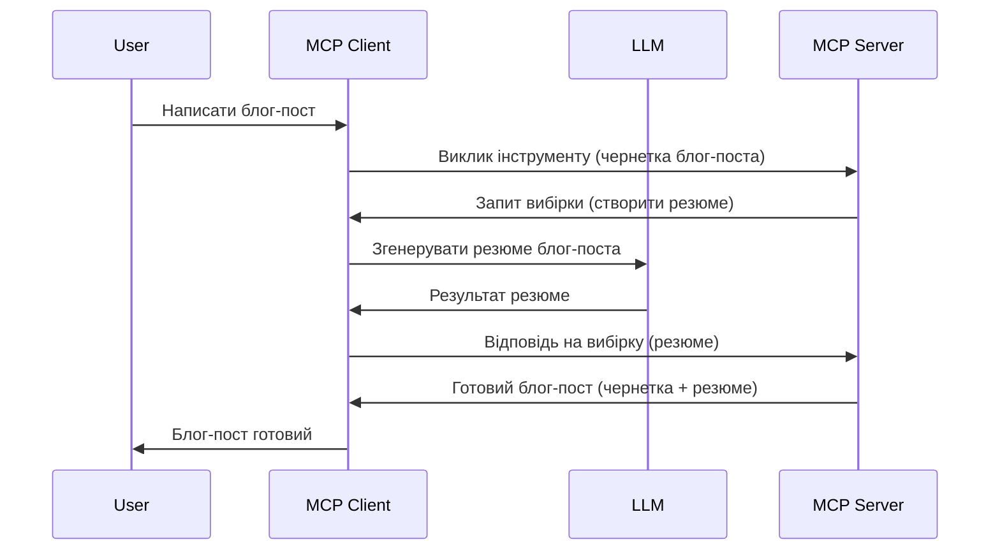

# Sampling - делегування функцій клієнту

Іноді потрібно, щоб MCP Client і MCP Server співпрацювали для досягнення спільної мети. Можливо, у вас є випадок, коли сервер потребує допомоги LLM, який розташований на клієнті. У такій ситуації слід використовувати sampling.

Давайте розглянемо декілька варіантів використання та як побудувати рішення, яке включає sampling.

## Огляд

У цьому уроці ми зосередимося на поясненні коли і де слід використовувати Sampling і як його налаштувати.

## Цілі навчання

У цьому розділі ми:

- Пояснимо, що таке Sampling і коли його використовувати.
- Показуємо як налаштувати Sampling у MCP.
- Наведемо приклади використання Sampling на практиці.

## Що таке Sampling і чому його використовувати?

Sampling — це розширена функція, яка працює наступним чином:


### Запит на Sampling

Отже, тепер у нас є загальний огляд правдоподібного сценарію, давайте поговоримо про запит на sampling, який сервер відправляє клієнту. Ось як може виглядати такий запит у форматі JSON-RPC:

```json
{
  "jsonrpc": "2.0",
  "id": 1,
  "method": "sampling/createMessage",
  "params": {
    "messages": [
      {
        "role": "user",
        "content": {
          "type": "text",
          "text": "Create a blog post summary of the following blog post: <BLOG POST>"
        }
      }
    ],
    "modelPreferences": {
      "hints": [
        {
          "name": "claude-3-sonnet"
        }
      ],
      "intelligencePriority": 0.8,
      "speedPriority": 0.5
    },
    "systemPrompt": "You are a helpful assistant.",
    "maxTokens": 100
  }
}
```

Тут варто звернути увагу на кілька моментів:

- Prompt, під content -> text, це наш запит, який представляє інструкцію для LLM підсумувати вміст блогу.

- **modelPreferences**. Цей розділ — це саме перевага, рекомендація щодо того, яку конфігурацію використовувати з LLM. Користувач може вирішити, чи дотримуватися цих рекомендацій, чи змінити їх. У цьому випадку є рекомендації щодо використання моделі, пріоритету швидкості та інтелекту.
- **systemPrompt** — це ваш звичайний системний запит, який задає особистість вашому LLM і містить інструкції для керівництва.
- **maxTokens** — це ще одна властивість, яка вказує, скільки токенів рекомендується використовувати для цього завдання.

### Відповідь на Sampling

Це відповідь, яку MCP Client зрештою відправляє назад MCP Server і яка є результатом виклику клієнтом LLM, очікування на відповідь і формування цього повідомлення. Ось як це може виглядати у форматі JSON-RPC:

```json
{
  "jsonrpc": "2.0",
  "id": 1,
  "result": {
    "role": "assistant",
    "content": {
      "type": "text",
      "text": "Here's your abstract <ABSTRACT>"
    },
    "model": "gpt-5",
    "stopReason": "endTurn"
  }
}
```

Зверніть увагу, що відповідь є анотацією блогового допису, як ми й просили. Також зверніть увагу, що використана `model` — не та, що ми просили, а "gpt-5" замість "claude-3-sonnet". Це ілюструє, що користувач може передумати щодо вибору і що ваш запит на sampling — це рекомендація.

Отже, тепер, коли ми розуміємо основний потік і корисне завдання для використання — "створення блог-посту + анотація", давайте подивимось, що потрібно зробити, щоб це працювало.

### Типи повідомлень

Повідомлення для Sampling не обмежуються лише текстом, ви також можете передавати зображення та аудіо. Ось як відрізняється JSON-RPC:

**Текст**

```json
{
  "type": "text",
  "text": "The message content"
}
```

**Вміст зображення**

```json
{
  "type": "image",
  "data": "base64-encoded-image-data",
  "mimeType": "image/jpeg"
}
```

**Аудіо-вміст**

```json
{
  "type": "audio",
  "data": "base64-encoded-audio-data",
  "mimeType": "audio/wav"
}
```

> NOTE: для детальнішої інформації про Sampling перегляньте [офіційну документацію](https://modelcontextprotocol.io/specification/2025-06-18/client/sampling)

## Як налаштувати Sampling у клієнті

> Примітка: якщо ви лише створюєте сервер, тут робити багато не потрібно.

Для клієнта потрібно вказати таку функцію:

```json
{
  "capabilities": {
    "sampling": {}
  }
}
```

Це буде враховано, коли ваш вибраний клієнт ініціалізується разом із сервером.

## Приклад використання Sampling — створення блог-посту

Давайте разом напишемо sampling сервер, нам потрібно зробити наступне:

1. Створити інструмент на сервері.
2. Цей інструмент повинен створити запит на sampling.
3. Інструмент має очікувати відповіді на клієнтський запит sampling.
4. Потім має бути сформований результат інструмента.

Розглянемо код крок за кроком:

### -1- Створення інструмента

**python**

```python
@mcp.tool()
async def create_blog(title: str, content: str, ctx: Context[ServerSession, None]) -> str:
    """Create a blog post and generate a summary"""

```

### -2- Створення запиту на sampling

Розширте інструмент наступним кодом:

**python**

```python
post = BlogPost(
        id=len(posts) + 1,
        title=title,
        content=content,
        abstract=""
    )

prompt = f"Create an abstract of the following blog post: title: {title} and draft: {content} "

result = await ctx.session.create_message(
        messages=[
            SamplingMessage(
                role="user",
                content=TextContent(type="text", text=prompt),
            )
        ],
        max_tokens=100,
)

```

### -3- Очікування відповіді та її повернення

**python**

```python
post.abstract = result.content.text

posts.append(post)

# повернути повний продукт
return json.dumps({
    "id": post.title,
    "abstract": post.abstract
})
```

### -4- Повний код

**python**

```python
from starlette.applications import Starlette
from starlette.routing import Mount, Host

from mcp.server.fastmcp import Context, FastMCP

from mcp.server.session import ServerSession
from mcp.types import SamplingMessage, TextContent

import json


from uuid import uuid4
from typing import List
from pydantic import BaseModel


mcp = FastMCP("Blog post generator")

# app = FastAPI()

posts = []

class BlogPost(BaseModel):
    id: int
    title: str
    content: str
    abstract: str

posts: List[BlogPost] = []

@mcp.tool()
async def create_blog(title: str, content: str, ctx: Context[ServerSession, None]) -> str:
    """Create a blog post and generate a summary"""

    post = BlogPost(
        id=len(posts) + 1,
        title=title,
        content=content,
        abstract=""
    )

    prompt = f"Create an abstract of the following blog post: title: {title} and draft: {content} "

    result = await ctx.session.create_message(
        messages=[
            SamplingMessage(
                role="user",
                content=TextContent(type="text", text=prompt),
            )
        ],
        max_tokens=100,
    )

    post.abstract = result.content.text

    posts.append(post)

    # повернути повний блог-пост
    return json.dumps({
        "id": post.title,
        "abstract": post.abstract
    })

if __name__ == "__main__":
    print("Starting server...")
    # mcp.run()
    mcp.run(transport="streamable-http")

# запустити додаток командою: python server.py
```

### -5- Тестування у Visual Studio Code

Щоб протестувати це у Visual Studio Code, зробіть так:

1. Запустіть сервер у терміналі.
2. Додайте його у *mcp.json* (і переконайтеся, що він запущений), наприклад так:

   ```json
   "servers": {
      "blog-server": {
        "type": "http",
        "url": "http://localhost:8000/mcp"
      }
   }
   ```

3. Введіть запит:

   ```text
   create a blog post named "Where Python comes from", the content is "Python is actually named after Monty Python Flying Circus"
   ```

4. Дозвольте виконання sampling. При першому тестуванні з’явиться додаткове діалогове вікно, яке потрібно прийняти, потім ви побачите звичайне діалогове вікно для запуску інструмента.

5. Перевірте результати. Ви побачите їх гарно відображеними в GitHub Copilot Chat, а також можете переглянути сирий JSON-відповідь.

**Бонус**. Інструменти Visual Studio Code мають чудову підтримку для sampling. Ви можете налаштувати доступ до Sampling на встановленому сервері наступним чином:

1. Перейдіть до розділу розширень.
2. Оберіть іконку шестерні для вашого встановленого сервера в секції "MCP SERVERS - INSTALLED".
3. Виберіть "Configure Model Access", тут ви можете вибрати які моделі GitHub Copilot може використовувати при виконанні sampling. Також ви можете переглянути всі нещодавні запити sampling, обравши "Show Sampling requests".

## Завдання

У цьому завданні вам потрібно створити трохи інший Sampling — інтеграцію для генерації опису продукту. Ось ваш сценарій:

**Сценарій**: Працівнику бек-офісу в e-commerce потрібно допомога, адже створення описів продуктів займає надто багато часу. Тож вам потрібно зробити рішення, де можна викликати інструмент "create_product" з аргументами "title" і "keywords", який має створити повний продукт із заповненим полем "description", яке має генеруватися LLM клієнта.

ПІДКАЗКА: скористайтеся тим, що дізналися раніше про побудову сервера і його інструмента з допомогою запиту на sampling.

## Розв’язок

[Розв’язок](./solution/README.md)

## Основні висновки

Sampling — це потужна функція, яка дозволяє серверу делегувати завдання клієнту, коли потрібна допомога LLM.

## Що далі

- [Розділ 4 - Практична реалізація](../../04-PracticalImplementation/README.md)

---

<!-- CO-OP TRANSLATOR DISCLAIMER START -->
**Відмова від відповідальності**:  
Цей документ було перекладено за допомогою сервісу автоматичного перекладу [Co-op Translator](https://github.com/Azure/co-op-translator). Хоча ми докладаємо зусиль для забезпечення точності, будь ласка, майте на увазі, що автоматичні переклади можуть містити помилки або неточності. Оригінальний документ у його рідній мові слід вважати авторитетним джерелом. Для важливої інформації рекомендується звертатися до професійного людського перекладу. Ми не несемо відповідальності за будь-які непорозуміння або неправильні тлумачення, що виникають унаслідок використання цього перекладу.
<!-- CO-OP TRANSLATOR DISCLAIMER END -->