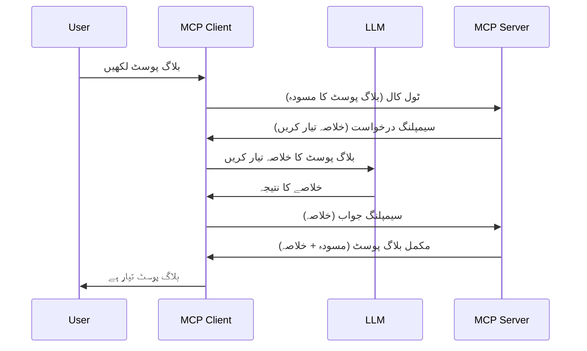

# سیمپلنگ - کلائنٹ کو فیچرز تفویض کرنا

کبھی کبھار، آپ کو MCP کلائنٹ اور MCP سرور کو مشترکہ مقصد حاصل کرنے کے لیے تعاون کرنا ہوتا ہے۔ آپ کے پاس ایسی صورتحال ہو سکتی ہے جہاں سرور کو کلائنٹ پر موجود ایک LLM کی مدد درکار ہو۔ ایسی صورت میں، سیمپلنگ وہ طریقہ ہے جو آپ کو استعمال کرنا چاہیے۔

آئیں کچھ استعمال کے کیسز دیکھتے ہیں اور سیمپلنگ شامل کرنے والے حل کو کیسے بنائیں۔

## جائزہ

اس سبق میں، ہم وضاحت کریں گے کہ سیمپلنگ کب اور کہاں استعمال کرنی ہے اور اسے کیسے ترتیب دینا ہے۔

## تعلیمی مقاصد

اس باب میں، ہم:

- وضاحت کریں گے کہ سیمپلنگ کیا ہے اور کب استعمال کرنا چاہیے۔
- دکھائیں گے کہ MCP میں سیمپلنگ کو کیسے ترتیب دیا جائے۔
- سیمپلنگ کی عملی مثالیں فراہم کریں گے۔

## سیمپلنگ کیا ہے اور کیوں استعمال کریں؟

سیمپلنگ ایک جدید خصوصیت ہے جو درج ذیل طریقے سے کام کرتی ہے:


### سیمپلنگ کی درخواست

اب، ہمارے پاس ایک معتبر منظر نامے کا وسیع جائزہ ہے، آئیے سرور کی جانب سے کلائنٹ کو بھیجی جانے والی سیمپلنگ درخواست کی بات کرتے ہیں۔ JSON-RPC فارمیٹ میں ایسی درخواست کا نمونہ کچھ یوں ہو سکتا ہے:

```json
{
  "jsonrpc": "2.0",
  "id": 1,
  "method": "sampling/createMessage",
  "params": {
    "messages": [
      {
        "role": "user",
        "content": {
          "type": "text",
          "text": "Create a blog post summary of the following blog post: <BLOG POST>"
        }
      }
    ],
    "modelPreferences": {
      "hints": [
        {
          "name": "claude-3-sonnet"
        }
      ],
      "intelligencePriority": 0.8,
      "speedPriority": 0.5
    },
    "systemPrompt": "You are a helpful assistant.",
    "maxTokens": 100
  }
}
```

یہاں چند باتیں قابل ذکر ہیں:

- Prompt، جو content -> text کے تحت ہے، ہماری ہدایت ہے جو LLM کو بلاگ پوسٹ کے مواد کا خلاصہ بنانے کی ہدایت دیتی ہے۔

- **modelPreferences**۔ یہ سیکشن صرف ایک ترجیح ہے، ایک سفارش کہ LLM کے ساتھ کون سا کنفیگریشن استعمال کیا جائے۔ صارف ان سفارشات کو مان سکتا ہے یا انھیں بدل سکتا ہے۔ اس صورت میں، سفارشات ماڈل کے انتخاب اور رفتار و ذہانت کی ترجیح کے بارے میں ہیں۔
- **systemPrompt**، یہ آپ کی معمول کی نظامی ہدایت ہے جو آپ کے LLM کو ایک شخصیتی اور رہنمائی کی ہدایات فراہم کرتی ہے۔
- **maxTokens**، یہ ایک اور پراپرٹی ہے جو بتاتی ہے کہ اس کام کے لیے کتنے ٹوکن استعمال کرنا مناسب ہے۔

### سیمپلنگ کا جواب

یہ جواب MCP کلائنٹ کی طرف سے MCP سرور کو واپس بھیجا جاتا ہے اور یہ اس کا نتیجہ ہوتا ہے کہ کلائنٹ نے LLM کو کال کیا، اس جواب کا انتظار کیا، اور پھر یہ پیغام تیار کیا۔ JSON-RPC میں اس کا نمونہ کچھ یوں ہو سکتا ہے:

```json
{
  "jsonrpc": "2.0",
  "id": 1,
  "result": {
    "role": "assistant",
    "content": {
      "type": "text",
      "text": "Here's your abstract <ABSTRACT>"
    },
    "model": "gpt-5",
    "stopReason": "endTurn"
  }
}
```

نوٹ کریں کہ جواب بلاگ پوسٹ کا خلاصہ ہے جیسے کہ ہم نے درخواست کی تھی۔ یہ بھی نوٹ کریں کہ استعمال شدہ `model` وہ نہیں جو ہم نے طلب کیا تھا بلکہ "gpt-5" ہے "claude-3-sonnet" کی جگہ۔ یہ اس بات کی وضاحت کے لیے ہے کہ صارف اپنے ذہن کو بدل سکتا ہے کہ کیا استعمال کرنا ہے اور آپ کی سیمپلنگ درخواست ایک سفارش ہے۔

اب جب کہ ہم مرکزی بہاؤ کو سمجھ گئے ہیں، اور مفید کام "بلاگ پوسٹ بنانے + خلاصہ" ہے، چلیں دیکھتے ہیں کہ اسے کام کرنے کے لیے ہمیں کیا کرنا ہے۔

### پیغام کی اقسام

سیمپلنگ کے پیغامات صرف متن تک محدود نہیں، بلکہ آپ تصاویر اور آڈیو بھی بھیج سکتے ہیں۔ JSON-RPC میں یہ یوں مختلف نظر آتا ہے:

**متن**

```json
{
  "type": "text",
  "text": "The message content"
}
```

**تصویری مواد**

```json
{
  "type": "image",
  "data": "base64-encoded-image-data",
  "mimeType": "image/jpeg"
}
```

**آڈیو مواد**

```json
{
  "type": "audio",
  "data": "base64-encoded-audio-data",
  "mimeType": "audio/wav"
}
```

> NOTE: مزید تفصیلی معلومات کے لیے سیمپلنگ پر، [سرکاری دستاویزات](https://modelcontextprotocol.io/specification/2025-06-18/client/sampling) دیکھیں۔

## کلائنٹ میں سیمپلنگ کیسے ترتیب دیں

> نوٹ: اگر آپ صرف سرور بنا رہے ہیں تو آپ کو یہاں زیادہ کچھ کرنے کی ضرورت نہیں۔

کلائنٹ میں، آپ کو درج ذیل خصوصیت کو اس طرح متعین کرنا ہوتا ہے:

```json
{
  "capabilities": {
    "sampling": {}
  }
}
```

یہ پھر منتخب شدہ کلائنٹ کے سرور کے ساتھ شروع ہونے پر اٹھا لی جائے گی۔

## سیمپلنگ کی عملی مثال - بلاگ پوسٹ بنائیں

آئیں ایک سیمپلنگ سرور کو کوڈ کریں، ہمیں یہ کرنا ہوگا:

1. سرور پر ایک ٹول بنائیں۔
1. وہ ٹول ایک سیمپلنگ درخواست بنائے۔
1. ٹول کلائنٹ کی سیمپلنگ درخواست کے جواب کا انتظار کرے۔
1. پھر ٹول کا نتیجہ بنایا جائے۔

چلیں مرحلہ وار کوڈ دیکھتے ہیں:

### -1- ٹول بنائیں

**python**

```python
@mcp.tool()
async def create_blog(title: str, content: str, ctx: Context[ServerSession, None]) -> str:
    """Create a blog post and generate a summary"""

```

### -2- سیمپلنگ کی درخواست بنائیں

اپنے ٹول میں درج ذیل کوڈ شامل کریں:

**python**

```python
post = BlogPost(
        id=len(posts) + 1,
        title=title,
        content=content,
        abstract=""
    )

prompt = f"Create an abstract of the following blog post: title: {title} and draft: {content} "

result = await ctx.session.create_message(
        messages=[
            SamplingMessage(
                role="user",
                content=TextContent(type="text", text=prompt),
            )
        ],
        max_tokens=100,
)

```

### -3- جواب کے انتظار کریں اور جواب واپس کریں

**python**

```python
post.abstract = result.content.text

posts.append(post)

# مکمل مصنوع واپس کریں
return json.dumps({
    "id": post.title,
    "abstract": post.abstract
})
```

### -4- مکمل کوڈ

**python**

```python
from starlette.applications import Starlette
from starlette.routing import Mount, Host

from mcp.server.fastmcp import Context, FastMCP

from mcp.server.session import ServerSession
from mcp.types import SamplingMessage, TextContent

import json


from uuid import uuid4
from typing import List
from pydantic import BaseModel


mcp = FastMCP("Blog post generator")

# ایپ = FastAPI()

posts = []

class BlogPost(BaseModel):
    id: int
    title: str
    content: str
    abstract: str

posts: List[BlogPost] = []

@mcp.tool()
async def create_blog(title: str, content: str, ctx: Context[ServerSession, None]) -> str:
    """Create a blog post and generate a summary"""

    post = BlogPost(
        id=len(posts) + 1,
        title=title,
        content=content,
        abstract=""
    )

    prompt = f"Create an abstract of the following blog post: title: {title} and draft: {content} "

    result = await ctx.session.create_message(
        messages=[
            SamplingMessage(
                role="user",
                content=TextContent(type="text", text=prompt),
            )
        ],
        max_tokens=100,
    )

    post.abstract = result.content.text

    posts.append(post)

    # مکمل بلاگ پوسٹ واپس کریں
    return json.dumps({
        "id": post.title,
        "abstract": post.abstract
    })

if __name__ == "__main__":
    print("Starting server...")
    # mcp.run()
    mcp.run(transport="streamable-http")

# ایپ چلائیں: python server.py کے ساتھ
```

### -5- Visual Studio Code میں ٹیسٹ کرنا

Visual Studio Code میں اسے ٹیسٹ کرنے کے لیے، درج ذیل کریں:

1. ٹرمینل میں سرور شروع کریں
1. اسے *mcp.json* میں شامل کریں (اور اس بات کو یقینی بنائیں کہ سرور چل رہا ہے)، کچھ اس طرح:

   ```json
   "servers": {
      "blog-server": {
        "type": "http",
        "url": "http://localhost:8000/mcp"
      }
   }
   ```

1. ایک پرامپٹ لکھیں:

   ```text
   create a blog post named "Where Python comes from", the content is "Python is actually named after Monty Python Flying Circus"
   ```

1. سیمپلنگ کو ہونے دیں۔ پہلی بار جب آپ اسے ٹیسٹ کریں گے تو آپ کے سامنے اضافی ڈائیلاگ آئے گا جسے آپ کو قبول کرنا ہوگا، پھر آپ کو ٹول چلانے کے لیے عام ڈائیلاگ دکھائی دے گا۔

1. نتائج کا معائنہ کریں۔ آپ نتائج کو GitHub Copilot Chat میں خوبصورت طریقے سے دیکھ سکیں گے، اور آپ خام JSON جواب کا بھی جائزہ لے سکتے ہیں۔

**اضافی**۔ Visual Studio Code کا ٹولنگ سیمپلنگ کے لیے عمدہ سپورٹ رکھتا ہے۔ آپ اپنے نصب شدہ سرور پر سیمپلنگ کی رسائی کو اس طرح ترتیب دے سکتے ہیں:

1. ایکسٹینشن سیکشن پر جائیں۔
1. "MCP SERVERS - INSTALLED" سیکشن میں اپنے نصب شدہ سرور کے لیے گیئر آئیکون منتخب کریں۔
1. "Configure Model Access" منتخب کریں، یہاں آپ یہ منتخب کر سکتے ہیں کہ GitHub Copilot سیمپلنگ کرتے وقت کن ماڈلز کو استعمال کرنے کی اجازت دیتا ہے۔ آپ حالیہ سیمپلنگ درخواستوں کو دیکھنے کے لیے "Show Sampling requests" بھی منتخب کر سکتے ہیں۔

## اسائنمنٹ

اس اسائنمنٹ میں، آپ ایک تھوڑا مختلف سیمپلنگ بنائیں گے یعنی ایسی سیمپلنگ انٹیگریشن جو پروڈکٹ کی تفصیل تیار کرنے کی حمایت کرے۔ یہ آپ کا منظر نامہ ہے:

**منظر نامہ**: ای کامرس کے بیک آفس کارکن کو مدد چاہیے، پروڈکٹ کی تفصیل بنانے میں بہت زیادہ وقت لگتا ہے۔ اس لیے، آپ ایک ایسا حل بنائیں گے جہاں آپ ٹول "create_product" کو "title" اور "keywords" آرگیومنٹس کے ساتھ کال کر سکیں اور یہ مکمل پروڈکٹ تیار کرے جس میں ایک "description" فیلڈ ہو جو کلائنٹ کے LLM کے ذریعے بھرا جائے۔

ٹپ: جو کچھ آپ نے پہلے سیکھا ہے اسے استعمال کرتے ہوئے سرور اور اس کے ٹول کو سیمپلنگ درخواست کے ذریعے کیسے بنانا ہے سیکھیں۔

## حل

[حل](./solution/README.md)

## کلیدی نکات

سیمپلنگ ایک طاقتور خصوصیت ہے جو سرور کو کلائنٹ کو کام تفویض کرنے کی اجازت دیتی ہے جب اسے LLM کی مدد کی ضرورت ہو۔

## اگلا کیا ہے

- [باب 4 - عملی نفاذ](../../04-PracticalImplementation/README.md)

---

<!-- CO-OP TRANSLATOR DISCLAIMER START -->
**دفعہ اخطار**:  
یہ دستاویز [Co-op Translator](https://github.com/Azure/co-op-translator) نامی اے آئی ترجمہ سروس کے ذریعے ترجمہ کی گئی ہے۔ اگرچہ ہم درستگی کی مکمل کوشش کرتے ہیں، براہ کرم ذہن میں رکھیں کہ خودکار ترجمے میں غلطیاں یا بے ضابطگیاں ہو سکتی ہیں۔ اصل دستاویز اپنی مادری زبان میں معتبر ماخذ کے طور پر مانی جانی چاہیے۔ اہم معلومات کے لیے پیشہ ور انسانی ترجمہ کی سفارش کی جاتی ہے۔ اس ترجمے کے استعمال سے پیدا ہونے والی کسی بھی غلط فہمی یا غلط تشریح کی ذمہ داری ہم پر عائد نہیں ہوتی۔
<!-- CO-OP TRANSLATOR DISCLAIMER END -->