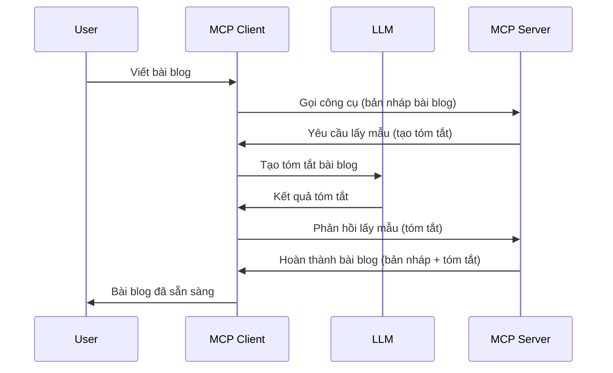

# Sampling - ủy quyền các tính năng cho Client

Đôi khi, bạn cần MCP Client và MCP Server phối hợp với nhau để đạt được một mục tiêu chung. Bạn có thể gặp trường hợp Server cần sự trợ giúp của một LLM nằm trên client. Trong tình huống này, sampling là cách bạn nên sử dụng.

Hãy khám phá một số trường hợp sử dụng và cách xây dựng giải pháp liên quan đến sampling.

## Tổng quan

Trong bài học này, chúng ta sẽ tập trung giải thích khi nào và ở đâu nên sử dụng Sampling và cách cấu hình nó.

## Mục tiêu học tập

Trong chương này, chúng ta sẽ:

- Giải thích Sampling là gì và khi nào nên dùng.
- Trình bày cách cấu hình Sampling trong MCP.
- Cung cấp ví dụ về Sampling trong thực tế.

## Sampling là gì và tại sao sử dụng nó?

Sampling là một tính năng nâng cao hoạt động theo cách sau:


### Yêu cầu Sampling

Ok, giờ chúng ta đã có cái nhìn tổng quan về một kịch bản đáng tin cậy, hãy nói về yêu cầu sampling mà server gửi lại cho client. Đây là cách một yêu cầu như vậy có thể trông như thế nào dưới định dạng JSON-RPC:

```json
{
  "jsonrpc": "2.0",
  "id": 1,
  "method": "sampling/createMessage",
  "params": {
    "messages": [
      {
        "role": "user",
        "content": {
          "type": "text",
          "text": "Create a blog post summary of the following blog post: <BLOG POST>"
        }
      }
    ],
    "modelPreferences": {
      "hints": [
        {
          "name": "claude-3-sonnet"
        }
      ],
      "intelligencePriority": 0.8,
      "speedPriority": 0.5
    },
    "systemPrompt": "You are a helpful assistant.",
    "maxTokens": 100
  }
}
```

Có vài điểm đáng chú ý ở đây:

- Prompt, trong phần content -> text, là lời nhắc nhở của chúng ta, là chỉ dẫn cho LLM để tóm tắt nội dung bài viết blog.

- **modelPreferences**. Phần này là một sở thích, một đề xuất về cấu hình cần dùng với LLM. Người dùng có thể chọn theo đề xuất này hoặc thay đổi. Trong trường hợp này có đề xuất về mô hình cần dùng và ưu tiên về tốc độ và độ thông minh.
- **systemPrompt**, đây là prompt hệ thống bình thường của bạn, cung cấp cá tính cho LLM và chứa các chỉ dẫn hướng dẫn.
- **maxTokens**, đây là một thuộc tính khác dùng để chỉ ra số token được đề nghị sử dụng cho nhiệm vụ này.

### Phản hồi Sampling

Phản hồi này là những gì MCP Client cuối cùng gửi lại MCP Server và là kết quả của việc client gọi LLM, chờ phản hồi rồi xây dựng thông điệp này. Đây là cách nó có thể trông như thế nào dưới định dạng JSON-RPC:

```json
{
  "jsonrpc": "2.0",
  "id": 1,
  "result": {
    "role": "assistant",
    "content": {
      "type": "text",
      "text": "Here's your abstract <ABSTRACT>"
    },
    "model": "gpt-5",
    "stopReason": "endTurn"
  }
}
```

Chú ý phản hồi là một bản tóm tắt của bài blog đúng như chúng ta yêu cầu. Cũng chú ý mô hình `model` được sử dụng không phải là cái ta yêu cầu mà là "gpt-5" thay vì "claude-3-sonnet". Điều này minh họa rằng người dùng có thể thay đổi ý định chọn mô hình và yêu cầu sampling của bạn chỉ là một đề xuất.

Ok, bây giờ chúng ta đã hiểu luồng chính, và nhiệm vụ hữu ích để sử dụng nó là "tạo bài blog + tóm tắt", hãy xem cần làm gì để triển khai nó.

### Các loại thông điệp

Sampling không chỉ giới hạn ở văn bản mà bạn còn có thể gửi hình ảnh và âm thanh. Đây là cách JSON-RPC trông khác nhau:

**Văn bản**

```json
{
  "type": "text",
  "text": "The message content"
}
```

**Nội dung hình ảnh**

```json
{
  "type": "image",
  "data": "base64-encoded-image-data",
  "mimeType": "image/jpeg"
}
```

**Nội dung âm thanh**

```json
{
  "type": "audio",
  "data": "base64-encoded-audio-data",
  "mimeType": "audio/wav"
}
```

> NOTE: để biết thông tin chi tiết hơn về Sampling, hãy xem [tài liệu chính thức](https://modelcontextprotocol.io/specification/2025-06-18/client/sampling)

## Cách cấu hình Sampling trong Client

> Lưu ý: nếu bạn chỉ xây dựng server, bạn không cần làm nhiều ở đây.

Trong client, bạn cần khai báo tính năng sau như sau:

```json
{
  "capabilities": {
    "sampling": {}
  }
}
```

Điều này sẽ được tiếp nhận khi client bạn chọn khởi tạo với server.

## Ví dụ về Sampling trong thực tế - Tạo một bài blog

Chúng ta cùng code một sampling server, ta sẽ cần làm các bước sau:

1. Tạo một công cụ trên Server.
1. Công cụ đó sẽ tạo một yêu cầu sampling.
1. Công cụ sẽ chờ phản hồi yêu cầu sampling từ client.
1. Sau đó, kết quả của công cụ sẽ được tạo ra.

Hãy xem code từng bước:

### -1- Tạo công cụ

**python**

```python
@mcp.tool()
async def create_blog(title: str, content: str, ctx: Context[ServerSession, None]) -> str:
    """Create a blog post and generate a summary"""

```

### -2- Tạo yêu cầu sampling

Mở rộng công cụ bằng đoạn code sau:

**python**

```python
post = BlogPost(
        id=len(posts) + 1,
        title=title,
        content=content,
        abstract=""
    )

prompt = f"Create an abstract of the following blog post: title: {title} and draft: {content} "

result = await ctx.session.create_message(
        messages=[
            SamplingMessage(
                role="user",
                content=TextContent(type="text", text=prompt),
            )
        ],
        max_tokens=100,
)

```

### -3- Chờ phản hồi và trả kết quả

**python**

```python
post.abstract = result.content.text

posts.append(post)

# trả về sản phẩm hoàn chỉnh
return json.dumps({
    "id": post.title,
    "abstract": post.abstract
})
```

### -4- Mã nguồn đầy đủ

**python**

```python
from starlette.applications import Starlette
from starlette.routing import Mount, Host

from mcp.server.fastmcp import Context, FastMCP

from mcp.server.session import ServerSession
from mcp.types import SamplingMessage, TextContent

import json


from uuid import uuid4
from typing import List
from pydantic import BaseModel


mcp = FastMCP("Blog post generator")

# app = FastAPI()

posts = []

class BlogPost(BaseModel):
    id: int
    title: str
    content: str
    abstract: str

posts: List[BlogPost] = []

@mcp.tool()
async def create_blog(title: str, content: str, ctx: Context[ServerSession, None]) -> str:
    """Create a blog post and generate a summary"""

    post = BlogPost(
        id=len(posts) + 1,
        title=title,
        content=content,
        abstract=""
    )

    prompt = f"Create an abstract of the following blog post: title: {title} and draft: {content} "

    result = await ctx.session.create_message(
        messages=[
            SamplingMessage(
                role="user",
                content=TextContent(type="text", text=prompt),
            )
        ],
        max_tokens=100,
    )

    post.abstract = result.content.text

    posts.append(post)

    # trả về bài đăng blog đầy đủ
    return json.dumps({
        "id": post.title,
        "abstract": post.abstract
    })

if __name__ == "__main__":
    print("Starting server...")
    # mcp.run()
    mcp.run(transport="streamable-http")

# chạy ứng dụng với: python server.py
```

### -5- Kiểm thử trong Visual Studio Code

Để kiểm thử trong Visual Studio Code, làm theo các bước sau:

1. Khởi động server trong terminal
1. Thêm nó vào *mcp.json* (và đảm bảo nó đang chạy) ví dụ như sau:

   ```json
   "servers": {
      "blog-server": {
        "type": "http",
        "url": "http://localhost:8000/mcp"
      }
   }
   ```

1. Gõ một lời nhắc:

   ```text
   create a blog post named "Where Python comes from", the content is "Python is actually named after Monty Python Flying Circus"
   ```

1. Cho phép sampling diễn ra. Lần đầu tiên thử bạn sẽ được hiển thị một hộp thoại bổ sung cần chấp nhận, rồi sau đó bạn sẽ thấy hộp thoại thông thường để cho phép chạy công cụ

1. Kiểm tra kết quả. Bạn sẽ thấy kết quả được hiển thị đẹp trong GitHub Copilot Chat đồng thời bạn cũng có thể xem phản hồi JSON thô.

**Bonus**. Công cụ Visual Studio Code hỗ trợ sampling rất tốt. Bạn có thể cấu hình quyền truy cập Sampling cho server đã cài bằng cách:

1. Điều hướng đến phần extension.
1. Chọn biểu tượng cài đặt (cog) cho server bạn đã cài trong phần "MCP SERVERS - INSTALLED".
1 Chọn "Configure Model Access", tại đây bạn có thể chọn mô hình GitHub Copilot được phép sử dụng khi thực hiện sampling. Bạn cũng có thể xem tất cả yêu cầu sampling đã xảy ra gần đây bằng cách chọn "Show Sampling requests".

## Bài tập

Trong bài tập này, bạn sẽ xây dựng một kiểu Sampling hơi khác, đó là tích hợp sampling hỗ trợ tạo mô tả sản phẩm. Đây là kịch bản của bạn:

**Kịch bản**: Nhân viên văn phòng hậu cần tại một trang thương mại điện tử cần trợ giúp, việc tạo mô tả sản phẩm mất quá nhiều thời gian. Vì thế, bạn sẽ xây dựng một giải pháp gọi một công cụ "create_product" với các đối số "title" và "keywords" và nó sẽ tạo ra một sản phẩm hoàn chỉnh bao gồm trường "description" được tạo bởi LLM của client.

TIP: sử dụng những gì bạn đã học trước đó về cách xây dựng server và công cụ bằng yêu cầu sampling.

## Giải pháp

[Giải pháp](./solution/README.md)

## Những điểm chính cần nhớ

Sampling là một tính năng mạnh mẽ cho phép server ủy quyền nhiệm vụ cho client khi cần sự trợ giúp của LLM.

## Tiếp theo

- [Chương 4 - Triển khai thực tiễn](../../04-PracticalImplementation/README.md)

---

<!-- CO-OP TRANSLATOR DISCLAIMER START -->
**Tuyên bố từ chối trách nhiệm**:
Tài liệu này đã được dịch bằng dịch vụ dịch máy AI [Co-op Translator](https://github.com/Azure/co-op-translator). Mặc dù chúng tôi cố gắng đảm bảo độ chính xác, xin lưu ý rằng bản dịch tự động có thể chứa lỗi hoặc không chính xác. Tài liệu gốc bằng ngôn ngữ gốc của nó nên được xem là nguồn tin chính thức. Đối với các thông tin quan trọng, nên sử dụng dịch vụ dịch thuật chuyên nghiệp bởi con người. Chúng tôi không chịu trách nhiệm về bất kỳ sự hiểu lầm hay giải thích sai nào phát sinh từ việc sử dụng bản dịch này.
<!-- CO-OP TRANSLATOR DISCLAIMER END -->